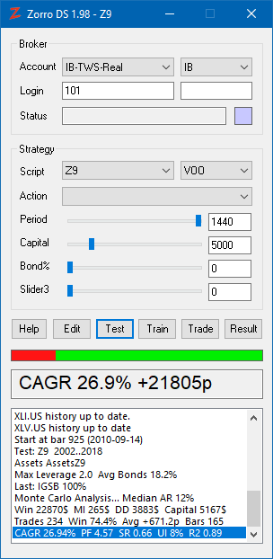

# Main Topics

# Welcome to Algorithmic Trading in C/C++! Getting Started

Zorro is an ecosystem for financial research and algorithmic trading. It is not a 'robot' and not a trading platform, but has some elements of both. While trading platforms are usually designed for manual trading, Zorro is specialized on research and algorithmic trading in automated or semi-automated modes. It can do a lot more than mere trading platforms. Technically it's a front end to a C and C++ compiler with a set of modules for time series analysis, machine learning, optimization, and online API connection. It allows with a few button clicks to edit algo trading strategies, train machine learning algorithms, optimize and backtest systems with multiple methods, and deploy them for live trading. This workflow is reflected in the six buttons of Zorro's control panel.

For any question like '_Does Zorro have X?_' (where X is a market scanner, a stock exchange crash predictor, an AI-controlled trading system, or whatever imaginable feature), the answer is most likely '_Yes. Just write a script for it_'. Everything you're doing with Zorro is based on a **script**, and all trading, analysis, and AI features are functions called in your script. There are many included scripts for all possible tasks, usually with a set of parameters that can be edited for adapting them to particular needs. In order to use Zorro effectively, you need to know how to edit and write scripts in the lite-C or C++ language. There are [books](247_Links_Books.md), [online courses](https://zorro-project.com/docs.php), and also a [short tutorial](tutorial_var.md) in this manual.

### Control panel

We admit: the user interface is more functional than pretty. But is has anything that you'll ever need for research and trading. For settings specific to your script, you can add [your own user interface](142_panel.md) with as many colorful fields and buttons as you want. The default control panel is designed for minimum space (~ 300x600 pixels), so several Zorro instances can run on a small notebook screen in the background. There is no menu. Entry fields and scroll boxes allow setting up the broker connection and selecting the script and assets to trade.

<table border="0"><tbody><tr><td></td><td valign="top"><table border="0" width="490" style="height: 620"><tbody><tr><td colspan="2">
<h3>Broker</h3>
</td></tr><tr><td class="tast">
Account
</td><td class="auto-style1">Primary account (<strong>Demo</strong>, <strong>Real</strong>, etc) and broker connection (<strong>FXCM</strong>, <strong>IB</strong>, <strong>MT4</strong>, etc) for live trading.</td></tr><tr><td class="tast" width="69">
Login
</td><td width="518">User ID, account number, password, API token, or other credentials for the selected account.</td></tr><tr><td class="tast">
Status
</td><td>Server time and market state in live trading mode. Green when connected, red when offline.</td></tr><tr><td colspan="2">
<h3>Strategy</h3>
</td></tr><tr><td class="tast">
Script
</td><td>Select a script from the <strong>Strategy </strong>folder. See <a href="scripts.htm">scripts</a> for included scripts and the <a href="tutorial_var.htm">tutorial</a> for writing your own scripts.</td></tr><tr><td class="tast">
Asset
</td><td>
Select the primary asset. You can add any asset - crypto, stocks, futures, options - to this scrollbox through <a href="account.htm">asset lists</a>.&nbsp;
</td></tr><tr><td class="tast">
Action
</td><td>
Run predefined Zorro tasks, programs, or script functions with a mouse click.
</td></tr><tr><td class="tast">
Period
</td><td>
<a href="bars.htm">Bar period</a> in minutes; normally set up by script.&nbsp;
</td></tr><tr><td class="tast">
Slider1..3
</td><td>User configurable, to modify script parameters.&nbsp;</td></tr><tr><td colspan="2">
<h3>Buttons</h3>
</td></tr><tr><td class="tast">
Help
</td><td>Open the help manual and script reference.</td></tr><tr><td class="tast">
Edit
</td><td>Open the selected script in the <a href="npp.htm">editor</a>, and reset all settings by the previous run.</td></tr><tr><td class="tast">
Test
</td><td><a href="testing.htm">Test</a> the script with historical price data in single-step, tick-based, or walk-forward mode.</td></tr><tr><td class="tast">Train</td><td><a href="training.htm">Train</a> the script by <a href="optimize.htm">optimizing</a> parameters, generating trade <a href="advisor.htm">rules</a>, or training neural networks.</td></tr><tr><td class="tast">
Trade
</td><td>
Run the script live with broker connection. <a href="trading.htm">Trade</a> assets and start earning (or losing) money.
</td></tr><tr><td class="tast">
Result
</td><td>Open the <a href="chart.htm">chart viewer</a> and the editor with the log and <a href="performance.htm">performance analysis</a>.</td></tr><tr><td colspan="2">
<h3>Output</h3>
</td></tr><tr><td class="tast">
Progress
</td><td>Trading or test status. Profits green, losses red.</td></tr><tr><td class="tast">Info</td><td>Numerical status display.&nbsp;</td></tr><tr><td class="tast">Messages</td><td>What Zorro has to tell. Double click to copy.</td></tr></tbody></table></td></tr></tbody></table>

### What you need

Some traders own a desk full of PCs and monitors with an impressive show of indicators and price curves. Good for boasting on trader forums, but useless for serious algo trading. You only need two machines:

*   For live trading, any decent Windows PC with Internet access will normally do. Either install Zorro on a reliable notebook with permanent Internet connection, or rent for a small fee a Windows Server VPS from Amazon, Google, Microsoft, or any other reliable provider. The smallest VPS is normally sufficient unless you want to use high-frequency trading or run multiple Zorro instances. For setting up a VPS, look under [Zorro in the Cloud](vps.md). If you run many Zorro instances on several VPS with different brokers and accounts, you can observe the statuses of all of them on your PC at home with the [ZStatus](trading.htm#zstatus) script.  
      You also need an account with an [online broker](214_Brokers_Data_Feeds.md) (or several accounts with several brokers) that offer the asset types - currencies, stocks, options, digital coins - that you want to trade.  
     
*   For algorithm development your PC can't be powerful enough, since a lot training and backtesting will be involved. Get a machine with a fast processor, such as Intel i9 or AMD Ryzen, with at least 16 GB RAM and 8 cores. For deep learning algorithms, we recommend a recent NVidia graphics card with CUDA support. If your computer at home won't do, the alternative is renting a powerful VPS in the cloud.  
      For algo development in C you need no further software. For developing in C++, get the latest [Visual Studio Community Edition](dlls.md) from Microsoft and install it with its C++ environment. For using deep learning libraries, install [R](rbridge.md) or [Python](026_Python_Bridge.md).

### Getting started

*   **Set up Zorro:** Download Zorro (it's free) from [https://zorro-project.com/download.php](https://zorro-project.com/download.php), and install it on your PC or on a trading server. For installing Zorro under Linux or in other special ways, see [Installation](vps.md).  
     
*   **Let Zorro do something:** Start Zorro (the normal version, not Zorro64). Select **Workshop4** under Script**,** select **EUR/USD** under Asset, then click \[Test\]. After clicking \[Result\] you can see the log and performance statistics in the editor. Try also other scripts. Some are unrelated to trading, some will require training, and some will need historical data, but they will give you an impression of what you can do with Zorro. Here's a [list of included scripts](020_Included_Scripts.md).  
     
*   **Learn trading strategy development:**  Work through the [quick tutorial](tutorial_var.md), or get the [Black Book](247_Links_Books.md) for a thorough intoduction to strategy programming in C. If you have a question or an issue with Zorro, ask on the [user forum](http://www.opserver.de/ubb7/ubbthreads.php?ubb=cfrm&c=1). For individual help, subscribe a support ticket on the [Zorro support page](http://zorro-project.com/docs.php). If you need help with developing a trading strategy, contact our [system development service](http://zorro-project.com/development.php).  
        
*   **Earn virtual money:** Open a demo trading account with a supported broker, such as FXCM or Oanda. Five minutes later you should have a $50,000 demo account and can log in and start trading. Start Zorro, select the broker, enter your login credentials, select a **[Z](zsystems.md)** [strategy](zsystems.md), and click \[Trade\]. Wait a couple of months and observe the money accumulate on your account...  
     
*   **Earn real money:** The free Zorro version is fully functional and can trade with real money. But before investing your hard earned money in one of the included strategies, please read the [Z systems](zsystems.htm#income) chapter from top to bottom. Open a real money account with the broker of your choice (for finding a broker, read the [Brokers](brokers.md) page). Some brokers offer a [free Zorro S subscription](restrictions.md) for opening new accounts. Once the account is established, transfer some money onto it. Start Zorro, select the strategy and click \[Trade\]. If you don't own Zorro S, withdraw your profits regularly from the broker account, as the free Zorro version stops trading when the account balance exceeds a certain limit (see [Zorro S](restrictions.md) for details).  
     .

### See also

[Zorro Home](https://zorro-project.com/), [Content](001_Content.md), [What's New](003_What_s_New.md), [Algo Trading Principles](031_Strategy_Coding_1_8.md), [Tutorial](tutorial_var.md), [Z Strategies](zsystems.md)

[► latest version online](javascript:window.location.href = 'https://zorro-project.com/manual/en' + window.location.href.slice\(window.location.href.lastIndexOf\('/'\)\))