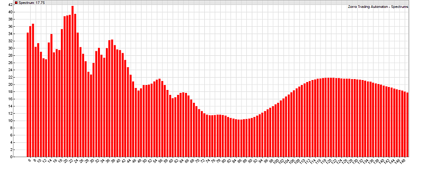
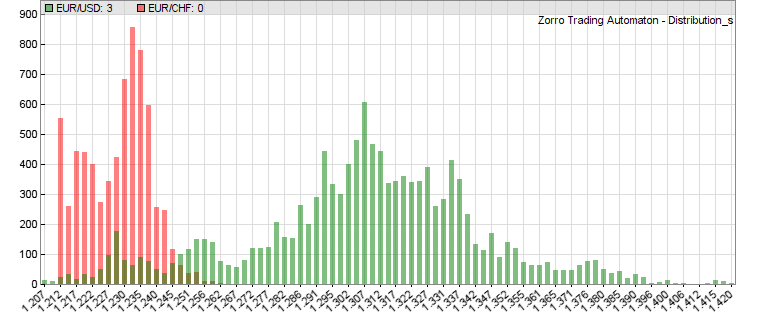

# Trading Strategies

# How - and why - does algorithmic trading work?

Model-based algorithmic trading strategies exploit market inefficiencies for predicting price trends of financial assets. Any market inefficiency establishes a price curve anomaly - a deviation of the price curve from pure randomness. Obviously, trading strategies can only work when those inefficiencies really exist. In a perfect, efficient market, prices would only be affected by real events, such as the invention of a new technology or the publication of company results. All traders are 'informed', decide rationally and act immediately. The price curves in such a hypothetical market would be pure **random-walk** curves that contain no information for predicting future prices.

Fortunately for algo trading strategies, real markets are far from this theoretical ideal. Market inefficiencies are everywhere. They are caused by slow reaction on news, incomplete information, rumors, patterns of repetitive behavior, and irrational trading (such as following advices by 'analysts'). Suche effects can be described by market models. They allow a strategy to predict a small part of the price curve with some degree of accuracy. The problem: those effects are small in relation to the ubiquitous 'noise', i.e. randomness in price curves. They are not visible to the human eye, nor can they be reliably detected by classical "technical indicators". Serious statistical methods or machine learning algorithms are normally required for exploiting market inefficiencies.

Example of a potential market inefficiency made visible by spectral analysis:

The histogram displays the amplitudes of regular cycles found in the S&P 500 price curve over a week. The x axis is the cycle duration in hours. As you can see, the highest peak is a cycle of about 24 hours, some minor peaks are at 36, 54, and 64 hours, and a broad peak at 120 hours, equivalent to a weekly cycle (a week is 5 days x 24 hours, as weekends are skipped in price curves). Cycles arise from synchronized trading behavior. Some of them remain stable for several days or weeks. They can be exploited for generating profit in automated strategies. You can find an example for cycle based trading in the [tutorial](tutorial_fisher.md). A similar trade method is used in Zorro's [Z2](zsystems.md) strategy.

Often, temporary price patterns establish and can be used by intelligent algorithms for predicting short-term trends. The following curve is produced by a 'deep learning' neural net structure:

The net was fed with EUR/USD price changes of the last 60-minutes bars, and predicted the price direction of the next hour. The blue curve shows the accumulated correct predictions minus the wrong predictions from a walk-forward analysis. The price direction was predicted with 57% accuracy. This is close to the maximum that can be achieved with machine learning; tales of 90% or 100% prediction accuracy belong to the fairy world (or rather, to backtest bias). The neural net was re-trained every 4 weeks, as the patterns began to lose their predictive power after that time. We can see that some short-term predictive patterns pop up almost all the time in the market. Such patterns are not found in random data.

Another interesting inefficiency can be seen in the following price distribution:

In the chart, the height of a bar is equivalent to how often a certain price appears in the price curve. The red bars are based on the EUR price in Swiss Francs (EUR/CHF) from October 2011 up to January 2015; the green bars are the EUR price in US Dollars (EUR/USD) in the same time period. You can generate such a chart with the **Distribution** script. We can see that the red EUR/CHF price distribution is quite narrow and ends abruptly on the left, as if cut with a knife. In contrast, the green EUR/USD price distribution is much wider with a broad peak in the middle. It resembles a bell curve (more or less), which indicates a random price distribution. The EUR/CHF distribution however is no bell curve. It reveals a market inefficiency that can generate profit in automated trading. In this case, the inefficiency is the result of the CHF price ceiling that was established by the Swiss National Bank from September 2011 until January 2015. It prevented the EUR from dropping below 1.20 CHF. This kind of market inefficiencies can be very successfully exploited by grid trading strategies.

### Developing algo trading strategies

There are plenty possibilities for algo trading strategies that really work. What you need to know:

*   Some basic information about the financial markets that you want to trade.
*   An idea or concept of exploiting a particular market inefficiency.
*   Evaluating data and doing basic research to establish a model of that inefficiency.
*   Read, write, and debug code: Learn [C](tutorial_var.md) and [R](Lecture%201.md).
*   Dealing with [statistical effects](007_Training.md) that cause different outcomes of test and live trading.

What never works is stacking indicators until the backtest turns positive. Indicators are possibly the result, but never the begin of strategy development. The general process is described here: [Build Better Strategies](http://www.financial-hacker.com/build-better-strategies-part-3-the-development-process/). For practical development, read the **Black Book** and /or take the **Algo Bootcamp** (see [links](links.md)). When you need help with strategy coding, contact our [development service](http://zorro-project.com/development.php).

When you develop an algorithmic trading strategy, you use historical price data for testing and optimizing. When you trade it, prices are live. There is no guarantee that the past is repeating. The market and its inefficiencies undergo changes of any kind all the time. Therefore, even when you're using proven systems such as the [Z strategies](zsystems.md), you always deal with an element of uncertainty. The future is unknown. For not relying only on your luck, learn as much as you can, and develop and deploy as many different strategies as possible.

### See also:

[Zorro Platform](started.md), [Strategy Workshops](tutorial_var.md), [Bars & Candles](005_Bars_and_Candles.md), [Tips&Tricks](246_Tips_Tricks.md), [Links](247_Links_Books.md)