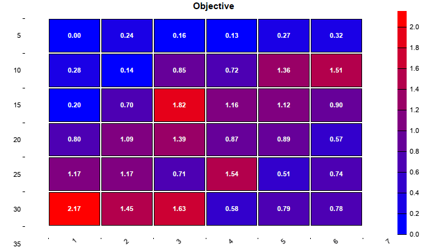
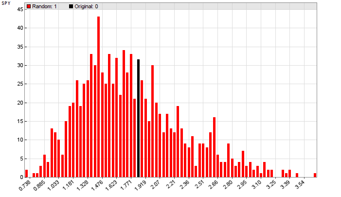
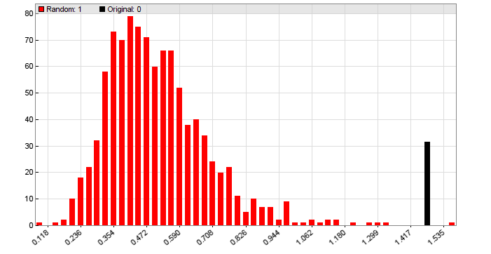
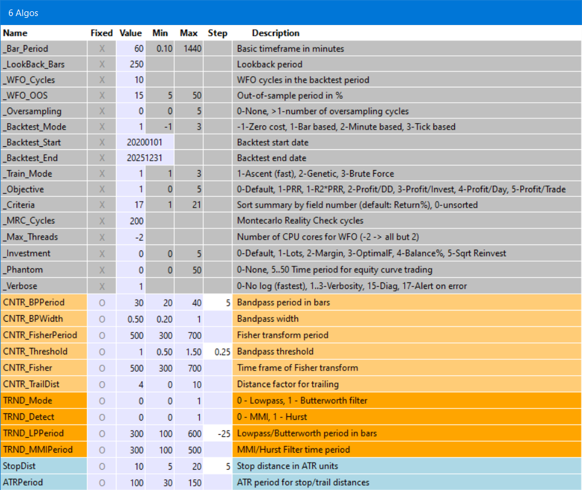

# Evaluation

# The Evaluation Shell (Zorro S)

The strategy evaluation shell is an addendum to the [Zorro project](https://zorro-project.com). Its purpose is determining the ideal parameters and functions for a given trading strategy, generating a portfolio of optimal asset, algo, and timeframe combinations, and predicting its live perfomance under different market situations. The Zorro evaluation shell can make the best of a strategy, especially of 'indicator soup' strategies that combine many different indicators and analysis functions.

A robust trading strategy has to meet several criteria:

*   It must exploit a real and significant market inefficiency. Random-walk markets cannot be algo traded.
*   It must work in all market situations. A trend follower must survive a mean reverting regime.
*   It must work under many different optimization settings and parameter ranges.
*   It must be unaffected by random events and price fluctuations.

The shell evaluates parameter combinations by these criteria. The robustness under different market situations is determined through the **R2 coefficient**, the parameter range robustness with a WFO profile (aka **Cluster Analysis**), the price fluctuation robustness with [oversampling](numsamplecycles.md). A **Montecarlo analysis** finds out whether the strategy is based on a real market inefficiency. More about WFO profiles and Montecarlo analysis can be found on [financial-hacker.com/why-90-of-backtests-fail](https://financial-hacker.com/why-90-of-backtests-fail), more about oversampling on [financial-hacker.com/better-tests-with-oversampling](https://financial-hacker.com/better-tests-with-oversampling).

Zorro already offers functions for all these tests, but they require a large part of code in the strategy, more than for the algorithm itself. The evaluation shell skips the coding part. It can be simpy attached to a strategy script. It makes all strategy variables accessible in a panel, adds optimization and money management as well as support for multiple assets and algos, runs automated analysis processes, and builds the optimal portfolio of strategy variants. It compiles unmodified under lite-C and under C++, and supports **.c** as well as **.cpp** scripts.

With almost 1500 lines, the shell is probably the largest Zorro script so far, and goes far beyond other strategy evaluation software on the market. It comes with source code, so it can be easily modified and adapted to special needs. It is restricted to **personal use**; any commercial use or redistribution, also partially, requires explicit permission by oP group Germany. Since it creates a panel and a menu, it needs a [Zorro S](restrictions.md) license to run. Theoretically you could remove the panel and menu functions and use the shell with the free Zorro version. This is allowed by the license, but would require clumsy workarounds, like calling functions by script and manually editing CSV files.

### Overview

Developing a successful strategy is a many-step process, described in the [Black Book](247_Links_Books.md) and briefly in an article series on [Financial Hacker](https://financial-hacker.com/build-better-strategies-part-3-the-development-process/). The evaluation shell cannot replace research and model selection. But it takes over when a first, raw version of the strategy is ready. At that stage you're usually experimenting with different functions for market detection and generating trading signals. It is difficult to find out which indicator or filter works best, since they are usually interdependent. Market detector A may work best with asset B and lowpass filter C on time frame D, but this may be the other way around with asset E. It is very time consuming to try out all combinations.

The evaluation shell solves that task with a semi-automated process.

<table align="center" border="0"><tbody><tr><td bgcolor="#0000FF" class="auto-style3" valign="middle"><div align="center" class="auto-style3"><strong><br><br>Creeate<br>&nbsp;Jobs</strong></div></td><td><strong><br><br></strong></td><td align="center" bgcolor="#0000FF" class="Stil2"><strong><br><br class="auto-style3">&nbsp;</strong><span class="auto-style3"><strong>Generate<br>&nbsp;Summary</strong></span><strong><br class="auto-style3"></strong></td><td class="Stil4"><strong><br class="auto-style3"><br class="auto-style3"><br><br></strong></td><td align="center" bgcolor="#0000FF" class="Stil4"><strong><br class="auto-style3"><br class="auto-style3"><span class="auto-style3">&nbsp;Cluster</span><br class="auto-style3"><span class="auto-style3">&nbsp;Analysis</span></strong></td><td class="Stil4"><strong><br class="auto-style3"><br class="auto-style3"><br><br></strong></td><td align="center" bgcolor="#0000FF" class="Stil4"><strong><br class="auto-style3"><span class="auto-style3"><br>&nbsp;Correlation</span><br class="auto-style3"><span class="auto-style3">&nbsp;Analysis</span></strong></td><td class="Stil4"><strong><br class="auto-style3"><br class="auto-style3"><br><br></strong></td><td align="center" bgcolor="#0000FF" class="Stil4"><strong><br class="auto-style3"><span class="auto-style3"><br>&nbsp;Montecarlo</span><br class="auto-style3"><span class="auto-style3">&nbsp;Analysis</span></strong></td><td class="Stil4"><strong><br class="auto-style3"><br class="auto-style3"><br><br></strong></td><td align="center" bgcolor="#0000FF" class="Stil4"><strong><br class="auto-style3"><span class="auto-style3"><br>&nbsp;Final</span><br class="auto-style3"><span class="auto-style3">&nbsp;Portfolio</span></strong></td></tr></tbody></table>

The first step is generating sets of parameter settings, named jobs. Any job is a variant of the strategy that you want to test and possibly include in the final portfolio. You can have parameters that select betwen different market detection algorithms, and others that select between different lowpass filters. The parameters are edited in the variables panel, then saved with a mouse click as a job. Instead of entering values in the panel, you can also edit the jobs directly with a spreadsheet program or a text editor.

The next step is an automated process that runs through all jobs, trains and tests any of them with different asset, algo, and time frame combinations, and stores their results in a summary. The summary is a CSV list with the main performance parameters of all jobs. It is sorted by performance: The best performing jobs are at the top. So you can see at a glance which parameter combinations work with which assets and time frames, and which are not worth to examine further. You can repeat this step with different global settings, such as bar period or optimization method, and generate multiple summaries in this way. 

The next step in the process is cluster analysis. Every job in a selected summary is optimized multiple times with different [WFO](numwfocycles.md) settings. These settings are taken from - you guessed it - a separate CSV file that may contain a regular WFO matrix, a list of irregular cycles/datasplit combinations, or both. For reducing the process time, only profitable jobs with rising equity curves - determined by a nonzero **R2 coefficent** - get a cluster analysis. You can also further exclude jobs by removing or outcommenting them in the summary.

After this process, you likely ended up with a couple survivors in the top of the summary. The surviving jobs have all a positive return, a steady rising equity curve, shallow drawdowns, and robust parameter ranges since they passed the cluster analysis. But not all of them are suited for the final portfolio. The purpose of a strategy portfolio is diversifiction, but this would not work with a set of variants that are all tightly correlated and have their drawdowns all at the same time. You want a balanced portfolio with uncorrelated algorithms. Automatically reducing the portfolio to the combinations with the smallest correlation is planned for a future shell version, but at the moment it involves a manual selection. Check the equity curves and keep only the best of all variants with similar curves or the same assets, algos, and time frames. They can now be combined with a mouse click to the final balanced portfolio.

But you're not finished yet. Any selection process generates selection bias. Your perfect portfolio will likely produce a great backtest, but will it perform equally well in live trading? To find out, run a Montecarlo analysis. This is the most important test of all, since it can determine whether your strategy exploits a real market inefficiency. If the Montecarlo analysis fails with the final portfolio, it will likely also fail with any other parameter combination, so you need to run it only at the end. If your system passes Montecarlo with a p-value below 5%, you can be relatively confident that the system will return good and steady profit in live trading. Otherwise, back to the drawing board.  
 

The following sections cover the various operating modes of the shell. For a quick example of an evaluation process, scroll down to the [tutorial](#tutorial).  

### Step 1: Attaching the shell

You can attach the shell to an existing script in several ways. For the full process it must take control over all variables and replace its asset/algo loops But for adding cluster analysis, Montecarlo analysis, oversampling, various walk-forward optimization methods, and different training objectives, you only need to insert two lines. Include **eval.h** at the begin of the script:

```c
#include "eval.h"
```

... and **eval.c** at the end:

```c
#include "eval.c"
```

You can find a script example with attached shell in **Workshop6a**. When you start it, the \[Result\] button will change to \[Start\], a new menu will be available under \[Action\], and a panel with many parameter settings will pop up:


The panel and menu are the reason why a Zorro S license is required, since panel functions are not supported by the free version. The variables in the panel are mostly self explaining:

<table><tbody><tr><td class="auto-style1" style="width: 136px"><strong>_Bar_Period</strong></td><td>The basic bar period from which the time frames are derived.</td></tr><tr><td class="auto-style1" style="width: 136px"><strong>_Lookback_Bars</strong></td><td>The lookback period in bar units.</td></tr><tr><td class="auto-style1" style="width: 136px"><strong>_WFO_Cycles</strong></td><td>Number of WFO cycles, not counting the last cycle for live trading.</td></tr><tr><td class="auto-style1" style="width: 136px"><strong>_WFO_OOS</strong></td><td>Out-of-Sample period in percent.</td></tr><tr><td class="auto-style1" style="width: 136px"><strong>_Oversampling</strong></td><td>Number of sample cycles for training and testing with slightly different price curves (see <a href="numsamplecycles.htm">oversampling</a>).</td></tr><tr><td class="auto-style1" style="width: 136px"><strong>_Backtest_Mode</strong></td><td><strong>-1</strong> for a 'naive' backtest with no trading costs, <strong>1</strong> for a realistic bar based backtest, <strong>2</strong> for a minute based backtest, <strong>3</strong> for backtest with tick-based history. Historical data in the required resolution must be available.</td></tr><tr><td class="auto-style1" style="width: 136px"><strong>_Backtest_Start</strong></td><td>Start year or date of the backtest. Use at least 5, better 10 years for the test period.</td></tr><tr><td class="auto-style1" style="width: 136px"><strong>_Backtest_End</strong></td><td>End year or date of the backtest.</td></tr><tr><td class="auto-style1" style="width: 136px; height: 42px;"><strong>_Train_Mode</strong></td><td style="height: 42px"><strong>0</strong> Script default<strong>, 1</strong> Ascent (fastest), <strong>2</strong> Genetic, <strong>3</strong> Brute Force (see <a href="opt.htm">TrainMode</a>). Results of genetic optimization can differ on any training due to random mutations.</td></tr><tr><td class="auto-style1" style="width: 136px"><strong>_Objective</strong></td><td>Training objective, aka 'fitness function'. <strong>0</strong> PRR (default), <strong>1</strong> R2*PRR, <strong>2</strong> Profit/DD, <strong>3</strong> Profit/Investment, <strong>4</strong> Profit/day, <strong>5</strong> Profit/trade.</td></tr><tr><td class="auto-style1" style="width: 136px"><strong>_Criteria</strong></td><td>The field number by which the summary is sorted and the profiles are generated. <strong>0</strong> no sorting, <strong>7</strong> Net Profit, <strong>13</strong> Win rate, <strong>14</strong> Objective, <strong>15</strong> Profit factor, <strong>16</strong> Profit per trade, <strong>17</strong> Annual return (default), <strong>18</strong> CAGR, <strong>19</strong> Calmar ratio, <strong>20</strong> Sharpe, <strong>21</strong> R2 coefficient. See <a href="performance.htm">performance</a> for details about the metrics.</td></tr><tr><td class="auto-style1" style="width: 136px"><strong>_MRC_Cycles</strong></td><td>Number of cycles for the Montecarlo Reality Check (default <strong>200</strong>). Results differ from run to run due to randomizing the price curve, therefore more cycles produce more precise results.</td></tr><tr><td class="auto-style1" style="width: 136px"><strong>_Max_Threads</strong></td><td>Number of CPU cores to use for WFO (<strong>0</strong> = single core), or number not to use when negative (f.i. <strong>-2</strong> = all cores but 2). <a href="restrictions.htm">Zorro S</a> required. Using multiple cores is recommended for faster training.</td></tr><tr><td class="auto-style1" style="width: 136px"><strong>_Investment</strong></td><td>Method for calculating the trade size. <strong>0</strong> Script default, <strong>1</strong> Lots slider, <strong>2</strong> Margin slider, <strong>3</strong> Margin * OptimalF, <strong>4</strong> Percent of account balance, <strong>5</strong> Percent * square root reinvestment. At <strong>3</strong> or above, <a href="optimalf.htm">OptimalF</a> factors are generated and affect the margin. <strong>4</strong> and above reinvest profits and should only be used in the last stages of development.</td></tr><tr><td class="auto-style1" style="width: 136px"><strong>_Verbose</strong></td><td>Set to <strong>0</strong> for no logs and reports, <strong>1..3</strong> for more verbose logs, <strong>17</strong> for halting on any error. The more verbose, the slower the test. Critical error messages are collected in <strong>Log\Errors.txt</strong>. Performance summary reports are always generated, regardless of this setting.</td></tr></tbody></table>

The settings have only effect when your script does not set those parameters itself. If it does, the script will override all settings in the panel, except for the **\_WFO\_Cycles** and **\_WFO\_OOS** values. They override the script, since they are used for the cluster analysis.

The **Min** and **Max** columns display the valid ranges of the variables, **Mode** lets you determine whether the variable is **global**, i.e. used for all jobs, or specific to a particular job. More about jobs below. Edited values in the panel will be remembered at the next start. Changes are indicated with a white background. Exceeding the valid range is allowed, but indicated with a red background.  
 

### Action menu

After starting the script in \[Train\] mode, a click on \[Action\] opens a dropdown menu. It contains only a few items at first:

<table><tbody><tr><td style="width: 146px" class="auto-style2"><span class="tast">Reset All</span></td><td>Reset all variables to their defaults, and removes all loaded jobs and algorithms.</td></tr><tr><td style="width: 146px" class="auto-style2"><span class="tast">Run Cluster Analysis</span></td><td>Select a WFO cluster analysis setup from a CSV file.&nbsp;There are several files with various combinations of WFO offsets and OOS periods included. For any WFO cycles / OOS period combination, the resulting performance metrics are stored in a <strong>Cluster summary</strong>. For files containing a regular NxM cluster matrix, the returns are displayed in a heatmap as shown below, otherwise in a WFO profile.</td></tr><tr><td style="width: 146px" class="auto-style2"><span class="tast">Run Montecarlo Analysis</span></td><td>Generate a Montecarlo reality check with the current parameters and shuffled price curves. A reality check tells whether the backtest performance is for real or just a random effect. The resulting performance metrics are stored in a <strong>MRC summary</strong>, and the returns are displayed in a chart for comparing with the original return with unmodified price curve. Depending on the resulting p-value, the backtest performance is qualified as significant, possibly significant, or insignificant.</td></tr><tr><td style="width: 146px" class="auto-style2"><span class="tast">Download History</span></td><td>Open the Zorro Download Page for downloading or purchasing historical data.</td></tr></tbody></table>

When nothing is selected, clicking on \[Start\] will just run a test or training with the current variable settings in the panel (if not overridden by the script). After a successful backtest, the [performance report](012_Performance_Report.md) will pop up with the price curve, the trades, and the equity curve.

When you select Cluster Analysis or Montecarlo analysis, a click on \[Start\] will run the whole process with the current settings. Dependent on the selected template, Cluster analysis will generate either a WFO profile or a heatmap like this:



The x axis is the number of WFO cycles, the y axis is the OOS period in percent. The numbers in the fields are the resulting strategy performance, selected by **\_Criteria**. You want as much red in the heatmap as possible. The above example, with the Pessimistic Return Ratio (PRR) as metric, has only 13 red fields out of 25. This job would not pass the CA analysis.

Montecarlo Analysis is normally only applied to the final strategy with all assets and algorithms. It generates a histogram from results with randomized price curves (red) and the original price curve (black). This one below indicates that you better don't trade that system live, since its great walk-forward performance is not to trust:



Another one from a stragegy that generated less performance in the walk-forward analysis, but can be traded since it exploits a real market inefficiency:



Train mode will always use walk forward optimization, even when none is defined in the script. Test mode will only run a backtest; so the strategy should have been trained before. After changing any variable, train again. If a variable range was exceeded or historical data was missing for the selected backtest period, you'll get an [error message](errors.md). Training errors will store the error message in **Log\\Errors.txt** and abort.  
 

### Step 2: Creating jobs

The next step of evalution is letting the shell control your script variables. This allows you to experiment with many different parameter settings and optimization ranges, and testing them all in an automated process. Any such variant is a 'job'. As a side benefit, putting script variables in a panel also allows you to observe their bar-to-bar behavior with the [Visual Debugger](011_Chart_Viewer_Debugger.md).

Instead of **eval.h**, now include **evars.h** at the begin of the script:

```c
#include "evars.h"
```

Below the **#include** statement, put all relevant script variables that you want to observe, optimize, or experiment with in a list. Add comments and put an **END\_OF\_VARS** statement at the end of the list. Example (from **Workshop6b**):

```c
var CNTR\_BPPeriod; _//= 30, 20..40, 5; Bandpass period in bars_
var CNTR\_BPWidth; _//= 0.5, 0.2..1; Bandpass width_
var CNTR\_FisherPeriod; _//=500, 300..700; Fisher transform period_
var CNTR\_Threshold; _//= 1,0.5..1.5,0.1; Bandpass threshold_
var CNTR\_Fisher; _//= 500,300..500; Time frame of Fisher transform_
var CNTR\_TrailDist; _//=4, 0..10; Distance factor for trailing_
var TRND\_Mode; _//= 0, 0..1; 0 - Lowpass, 1 - Butterworth filter_
var TRND\_Detect; _//= 0, 0..1; 0 - MMI, 1 - Hurst_
var TRND\_LPPeriod; _//= 300,100..700,50; Lowpass/Butterworth period in bars_
var TRND\_MMIPeriod; _//= 300,100..500; MMI/Hurst Filter time period_
var StopDist; _//= 10,5..30,5; Stop distance in ATR units_
var ATRPeriod; _//=100, 30..150; ATR period for stop/trail distances_
END\_OF\_VARS
```

This encapsulates the variables in a [C struct](047_Structs.md) named **V**. Thus, in the script the variables are accessed with a preceding **V.**, for instance **V.ATRPeriod**. They all must be of type **var**. It you need an integer variable, as in a switch/case statement, use an **(int)** typecast. Replace all your [optimize](107_optimize.md) calls with **\_optimize** and pass the variable as sole parameter. Example:

```c
Stop = \_optimize(V.StopDist) \* ATR(V.ATRPeriod);
```

The startup panel will now look like this (**Workshop6b**):


The added script variables appear at the end with a blue background. For illustrating the process, we have added two new variables to workshop 6 for selecting between two market regime detectors (**Hurst** and **MMI**) and two filters (**Lowpass** and **Butterworth**). The variable names and the comments matter. Observe the following rules:

*   If the variable belongs exclusively to a certain algo, let its name begin with the algo name (f.i. **TRND\_Mode**). Otherwise it is assumed that the variable is common for all algos.
*   The default value is given with **'= value'** in the comment. If omitted, the variable is set to **0**.
*   If the variable is to be limited by a range, enter it with **'min..max'** following a comma after the default value.
*   If the variable is to be optimized, enter the **step width** following a comma after the range. If the step width is **0**, the variable is not optimized, even if it appears in an **\_optimize** call in the script. In this way, different jobs can optimize different variables.
*   After the default value or range, enter a semicolon **';'** and then a short description of the variable.

The Action menu got some new items:

<table><tbody><tr><td style="width: 149px" class="auto-style2"><span class="tast">Save Job to CSV</span></td><td>Save the current panel state with all variables to a job file in CSV format, in a folder of your choice (<strong>Job</strong> by default). If the system has no own algos, the file name will be later used for the algo names, so don't use a complex or long name.</td></tr><tr><td style="width: 149px" class="auto-style2"><span class="tast">Load Single Job</span></td><td>Load a set of variables from a job file to the panell for training and analyzing them. If one or more jobs are loaded, backtests will store their 'papertrails' of charts, logs, and reports in a subfolder named after the job.</td></tr><tr><td style="width: 149px" class="auto-style2"><span class="tast">Load Multiple Jobs</span></td><td>Select a folder by clicking on a job file inside. All jobs in that folder are loaded. Training or cluster analysis will be applied to all jobs.</td></tr><tr><td style="width: 149px" class="auto-style2"><span class="tast">Load Jobs from Summary</span></td><td>Select a summary generated by a previoius run. All jobs from that summary with a positive R2 coefficient are loaded. Jobs can be excluded by adding a <strong>'#'</strong> in front of the name or by deleting them from the summary.</td></tr><tr><td style="width: 149px" class="auto-style2"><span class="tast">Browse Jobs</span></td><td>Select a job from a previously loaded set of jobs, and load its variables into the panel.&nbsp;</td></tr><tr><td style="width: 149px" class="auto-style2"><span class="tast">Rearrange Summary</span></td><td>Re-sort the entries in the summary if <strong>_Criteria</strong> has changed.</td></tr></tbody></table>

In the **Mode** colum the grey system variables can be switched with a mouse click between two modes. In the global setting they affect all jobs, in the job setting they are job specific and loaded from a job file. Normally you'll use the global setting for them. The blueish strategy variables are always job specific.

Experiment with different variable settings and save them to the **Jobs** folder (or any other folder). Load all of them with Load Multiple Jobs. Four example jobs from workshop 6 are included, but you normally have a lot more jobs for thorougly testing a strategy, When you click \[Start\] after loading one or multiple jobs, they are all trained. At the end of the process, a bell will ring, and the Summary will open in the editor. It is a list of all trained jobs with their performance parameters. Any job that you train adds to the summary. If a summary entry of that job already exists, it is updated with the new results. The jobs with the best performances are at the top of the summary. The metrics are explained below.

If you activated Cluster Analysis after loading jobs from the summary, WFO profile or matrices are generated for any profitable job, and the percentage of positive training runs with different WFO/OOS settings is stored in the summary under CA%. If an otherwise profitable job got a bad cluster analysis result, like less than 60%, remove it from the summary.

### The summary

Every job and every asset, algo, and timeframe variant of a job is listed as a line in the summary. The top jobs are at the begin. The summary is stored in CSV format, so it can be further evaluated in a spreadsheet program. The fields:

<table><tbody><tr><td class="auto-style4"><strong>Job</strong></td><td>Job name</td></tr><tr><td class="auto-style4"><strong>Asset</strong></td><td>The last asset selected by the job.</td></tr><tr><td class="auto-style4"><strong>Algo</strong></td><td>The last algo selected by the job (if any).</td></tr><tr><td class="auto-style4"><strong>TimeFrame</strong></td><td>Last time frame of the job, in minutes.</td></tr><tr><td class="auto-style4"><strong>Days</strong></td><td>Total days in the backtest, not counting lookback and training.</td></tr><tr><td class="auto-style4"><strong>WFO</strong></td><td>Number of WFO Cycles</td></tr><tr><td class="auto-style4"><strong>OOS%</strong></td><td>Out-of-sample period in percent</td></tr><tr><td class="auto-style4"><strong>Profit</strong></td><td>Sum of wins minus sum of losses minus trading and margin cost.</td></tr><tr><td class="auto-style4"><strong>Margin</strong></td><td>Amount required for covering the maximum open margin</td></tr><tr><td class="auto-style4"><strong>MaxDD</strong></td><td>Maximum equity drawdown from a preceding balance peak</td></tr><tr><td class="auto-style4"><strong>PeakDD%</strong></td><td>Max equity drawdown in percent ot the preceding peak</td></tr><tr><td class="auto-style4"><strong>TimeDD%</strong></td><td>Time spent in drawdown in percent of backtest time</td></tr><tr><td class="auto-style4"><strong>Trades</strong></td><td>Number of trades</td></tr><tr><td class="auto-style4"><strong>Win%</strong></td><td>Percent of won trades.</td></tr><tr><td class="auto-style4"><strong>Obj</strong></td><td>Backtest return of the objective function.</td></tr><tr><td class="auto-style4"><strong>P/L</strong></td><td>Profit factor, the sum of wins divided by sum of losses</td></tr><tr><td class="auto-style4"><strong>P/Trade</strong></td><td>Average profit per trade</td></tr><tr><td class="auto-style4"><strong>Return</strong></td><td>Annual net profit in percent of max margin plus max drawdown.</td></tr><tr><td class="auto-style4"><strong>CAGR%</strong></td><td>Annual growth of the investment in percent.</td></tr><tr><td class="auto-style4"><strong>Calmar%</strong></td><td>Annual net profit in percent of max drawdown.</td></tr><tr><td class="auto-style4"><strong>Sharpe</strong></td><td>Annualized mean return divided by standard deviation</td></tr><tr><td class="auto-style4"><strong>R2</strong></td><td>Equity curve straightness, 1 = perfect</td></tr><tr><td class="auto-style4"><strong>CA%</strong></td><td>Percentage of runs that passed the cluster analysis.</td></tr></tbody></table>

  

### Step 3: Creating multiple variants

For finding out which asset, algo, and time frame combinations work best with which job, you can test it with any combination. Since this interferes with your asset/algo loops (if any) in the script, it has to be modified further:

First, put all assets, algos, and timeframes you want to test in **#define** **\_ASSETS**, **\_ALGOS**, **\_TIMEFRAMES** statements:

```c
#define \_ASSETS "EUR/USD","USD/JPY"
#define \_ALGOS "TRND","CNTR"
#define \_TIMEFRAMES 60,240  _// in minutes_
```

The syntax is the same as in a [loop](109_loop.md) statement, so you can also use the **Assets** keyword to test all assets from the current asset list. Next, replace your main asset and algo loops with a single **assetLoop()** call. Assume your **run** function previously looked like this:

```c
function rum()
{
  BarPeriod = 60; 
  LookBack = 2000; 

  while(asset(loop("EUR/USD","USD/JPY")))
  while(algo(loop("TRND","CNTR")))
  {
    if(strstr(Algo,"TRND")) {
      TimeFrame = 1;
      tradeTrend();
    } else if(strstr(Algo,"CNTR")) {
      TimeFrame = 4;
      tradeCounterTrend();
    }
  }
}
```

It now becomes this (see **workshop6c.c**):

```c
#define \_ASSETS "EUR/USD","USD/JPY"
#define \_ALGOS "TRND","CNTR"
#define \_TIMEFRAMES 60,240  _// in minutes_

function run()
{
  BarPeriod = 60; 
  LookBack = 2000; 

  assetLoop();

  if(strstr(Algo,"TRND")) 
    tradeTrend();
  else if(strstr(Algo,"CNTR")) 
    tradeCounterTrend();
}
```

If your script has no asset/algo loops, replace your first **asset()** call with **assetLoop()**. Mind the **Algo** comparison with **strstr**. Using **strcmp** or **'='** for algo selection would not do anymore, since algo names will now get a number appended. If you start the system now, it assigns different colors to the variables since it recognizes from their name to which algo they belong.



The Action menu is now complete:

<table><tbody><tr><td style="width: 149px" class="auto-style2"><span class="tast">Create Algos from Summary</span></td><td>Select a summary generated by a previous run. All jobs from that summary with a CA result of 85% or better are selected for the final portfolio. Training and testing is now applied to the full porfolio.</td></tr></tbody></table>

  
The system will now not anymore run right away. First you need to create jobs, let the system train them in all asset/algo/timeframe variants, then pick the best from the summary and create algos. The algos will now be automatically loaded at start and used for all further training, testing, and trading. For getting rid of the algos, select Reset All.

### Results and reports

The test results for any job are automatically stored in subfolders of the job folder. In this way any job leaves a 'papertrail', consisting of text, CSV, image, or html files from its training runs. All reports can be opened with a plain text editor such as the included Notepad++. The .csv files can also be opened with Excel, and the charts with an image viewer like the included **ZView**.

Aside from the summary and the CA or MA charts, the following reports are produced when jobs are processed (for details see [exported files](export.md)):

\***.txt** - the last [performance report](012_Performance_Report.md).  
**\*history.csv** - the performance history of the job. Any test or training run adds a line to the history.  
**\*.png** - the chart with the equity curve, trades, and indicators.  
**\*.htm** - a page with [parameter charts](107_optimize.md) that visually display the effect of parameters on the performance.  
**\*.log** - the [event log](010_Log_Messages.md) of the backtest.  
**\*train.log** - the [training log](107_optimize.md) with the objective results for all tested parameter combinations.  
**\*pnl.csv** - the equity curve of the backtest, for further evaluation.  
**\*trd.csv** - the trade list of the backtest, for further evaluation.  
**\*par.csv** - the results of genetic or brute force training runs, for further evaluation.  
**Log\\Errors.txt** - the last errors encountered (if any) while training or testing.  
 

### Very concise tutorial

*   First, the summary of job performances. Select the **Workshop6c** script and click \[Train\].
*   From the \[Action\] scrollbox, select Load Multiple Jobs.
*   4 example jobs beginning with **"W6..."** are included in the **Job** folder. Double click one of them.
*   Click \[Start\]. All jobs with their asset, algo, timeframe variants are now trained.
*   At the end of the process, the performance summary will pop up in the editor.  
     
*   Next, cluster analysis. Click \[Train\] and select Load Jobs from Summary.
*   Double click on **Job\\Workshop6c\_Summary.csv** that was generated in the previous step.
*   From the \[Action\] scrollbox, select Run Cluster Analysis.
*   Now you have the choice between several predefined clusters. Select **WFO\_Cluster3x3**.
*   After a lengthy process, the summary appears with the **CA%** column of the best jobs populated,  
     
*   Next, portfolio creation. Click \[Train\] and select Create Algos from Summary.
*   Double click on **Job\\Workshop6c\_Summary.csv.** You'll see a list of algo variants from the top of the summary.
*   Click \[Start\] to train. The perfomance report will pop up at the end.  
     
*   Finally, the Montecarlo Reality Check. Click \[Train\]. The algos are automatically loaded,
*   From the \[Action\] scrollbox, select Run MonteCarlo Analysis.
*   At the end of the process you'll get the **p-value** and a histogram of the real vs. reandom results.

Narurally, training hundreds of jobs and variants will take its time. Get a cup of coffee inbetween.  
 

### Remarks

*   Compare algo names not with **'='**, but with **strstr()**, as in the above example. First, it is needed because the algos generated by the shell get a number appended. Second, it is needed when you want to run your strategy with VC++. VC++ will give no error message when comparing strings with **'='**, but will just skip the clause.
*   Make sure that **Lookback** is sufficient for running all loaded jobs. Some jobs need up to 800 bars for the lookback period. When extending or reducing the backtest years, adapt **WFO\_Cycles** accordingly.
*   Training can be greatly sped up by activating multiple threads. If a thread encounters an error, the optimization will stop. The error message can be found at the end of the file **Log\\Errors.txt**.
*   Training results are only kept for last training run or the final portfolio. When you switch jobs or change parameters, always train again.
*   Do **not open results in Excel** while the shell is running. Excel will block any access to its open files.

### See also:

**[Get Started with Zorro](started.md), [Portfolio Lists](013_Asset_Account_Lists.md), [Walk Forward Optimization](numwfocycles.md), [Performance Reports](012_Performance_Report.md)**

[► latest version online](javascript:window.location.href = 'https://zorro-project.com/manual/en' + window.location.href.slice\(window.location.href.lastIndexOf\('/'\)\))