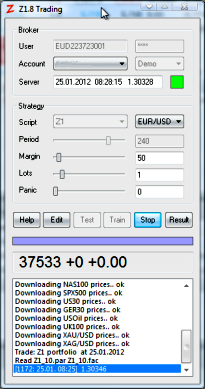
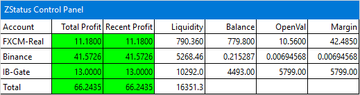

# Trading

# Trading a strategy

Click \[Trade\]. Zorro will connect to the broker and start spending your money. This happens in several steps:

*   Zorro will first log in to the broker or account selected with the scroll box. When logged in and data from the broker server is received, the colored square next to the Server window will change to green. If the broker server is offline or the login password is wrong, you'll get an error message and the session ends.  
       
    
*   Next, Zorro will subscribe the assets and download the initial price history for the [LookBack](181_LookBack_UnstablePeriod.md) period, from historical data and/or from the broker API, dependent on the [PRELOAD](018_TradeMode.md) flag. If supported by the broker API, the history is downloaded with slightly higher resolution so that several historical ticks fall into one candle. This slows down the start a bit, but can improve the initial indicator accuracy when the strategy uses bar offsets or performs intrabar computations. If the price history of some assets is not available or can not be downloaded, you'll see an error message directly at start and those assets are then excluded from trading. If the first asset is not available, the session will end at this point.   
      Ideally, the price history precedes the live prices seamlessly. If the price source does not return recent history, as on weekends or when the market it closed, there will be a gap between historical and live prices. Zorro will then print a "gap" message and fill the gap with the preceding prices.  
      If the strategy trades a large portfolio of assets, asset subscriptions can take time dependent on the broker API. In case of slow subscriptions Zorro will print dots, so you can see the progress.  When trading with a [MT4 broker](mt4plugin.md), downloading prices can also take time when they were not readily available on the MT4 server and have to be accessed from some MetaTrader backup source. In that case you might have to start the trading session several times until all price history loaded correctly. Some brokers apply a time limit to downloading price history. When you see a message like **"Pacing Violation"**, wait a couple minutes until you can start the session again. Permanent issues with history download from certain brokers can be overcome with [PRELOAD](018_TradeMode.md). This is especially recommended when your strategy has a long lookback period or requires tick-level (**.t1**) data, which is often not provided by brokers.  
       
    
*   Zorro will then check if there were any open trades from the previous session. The session status was stored in a **.trd** file in the **Data** folder. If the broker API keeps a list of open trades, Zorro will try to match its session status with that list. If a trade from the previous session is not found anymore in the broker's open trade list, or appears in the broker's list of closed trades, Zorro will print a "closed" or "not found" message and cancel the trade. If the trade was an [option](096_contract.md) that was meanwhile expired, Zorro will print an "expired" message and also cancel it. Otherwise the trade will be resumed.  
      
    
*   After that, Zorro will quickly [run](088_run.md) through the bars of the [LookBack](181_LookBack_UnstablePeriod.md) period. This period is required for setting up indicators or other functions that need a certain amount of price history. No trades will be entered and no prices will be read from the broker during this period. Lookback bars are not displayed in the message window, but they are recorded in the log. If [BR\_FLAT](200_BarMode.md) is set and there is a gap between the end of the history and the current time, Zorro will fill the gap with flat candles.  
       
    
*   Zorro will then wait until the first live bar is complete (unless **StartDate** is set to **NOW**), then execute the [run](088_run.md) function again. This will be repeated for every further bar until the \[Stop\] key was pressed or [quit()](172_quit.md) was called in the script. When trading was started in the middle of a bar, the first live bar will be accordingly extended so that it covers at least a full bar period. Thus, with 4-hour bars the first trade won't be entered before 4 hours have passed. Any bar or any special event is displayed in the message window and written to the log. The [tick](089_tick_tock.md) function and the [TMFs](018_TradeMode.md) run whenever a new price quote arrives from the broker. Dependent on the [BarMode](200_BarMode.md) variable, the weekend is an extra-long bar period from Friday evening until Sunday evening or Monday morning.



While trading, Zorro will detect when the **.par**, **.c**, **.fac** or **.ml** files that contain the parameters, rules, capital allocation factors, or machine learning models are updated by a re-training process. In that case they are automatically reloaded at the begin of the next bar period. It is recommended to retrain strategy parameters and rules regularly (see [WFO](numwfocycles.md)) for taking care of market changes. This is especially required for parameter-free strategies that have been walk-forward optimized.

The Status Window displays the broker server date and time shifted to UTC, and the current price of the asset selected with the \[Asset\] scrollbox if that asset is also used in the strategy (otherwise its price is not available). The tiny square at the right is green when connected to the server, and red when the connection was lost or no data was received within 100\*[TickTime](187_TickTime_MaxRequests.md). The update interval of the server window depends on [TickTime](187_TickTime_MaxRequests.md) and the server response time. Arriving price quotes are indicated with a blinking asterisk. If the price is unavailable - for instance because the selected Asset was not used in the strategy -  **"XXXXX"** is displayed instead. **"Closed"** indicates that trading is currently suspended due to the [BarMode](200_BarMode.md) and market time settings of your script and asset list, or because the broker server is currently in market close state. **"Out of sync"** indicates a discrepancy of server time and PC time. Check if the displayed time is the correct UTC time. The broker server and your PC need not be in the same time zone, but their clocks need to be correctly set up to their local time.

The left segment of the Progress Bar in live trading indicates the closed profit of the strategy since starting it, the right segment indicates the total profit or loss of all open trades (including phantom trades). When the right segment is green, your trades are in the profit zone; when the left segment is green, your account is in the profit zone. Otherwise the segment is red.

The Result Window below displays information about the account and profit situation, in the following form:

 4567  +1412  +50  !/\\\\' 

<table border="0"><tbody><tr bgcolor="lightgrey"><td><strong>4567</strong></td><td>Current equity, the sum of balance and value of all open trades of the account.</td></tr><tr bgcolor="white"><td><strong>+1412</strong></td><td>Money earned (or lost) by the strategy since the start, in account currency units.</td></tr><tr bgcolor="lightgrey"><td><strong>+50</strong></td><td>Current open trade value of the strategy, in account currency units.</td></tr><tr bgcolor="white"><td><strong>!/\\'</strong></td><td>Current trades. <strong>!</strong> is a trade with locked profit, <strong>/</strong> a winning, <strong>\</strong> a losing, and <strong>'</strong> a pending trade.</td></tr></tbody></table>

The Trade Status Page (see below) gives the most detailed view into the current account and trade situation. Note that Zorro displays prices as ask prices and profits/losses including commission, rollover, and spread, so the live values on the Zorro panel might look slightly different than the values in your trading platform for the same trades.

When something happens during a trading sessing, like the start of a new bar or opening a trade, Zorro prints a message in the message window and records it in the **.log** file that can be opened with any text editor. Details about Zorro's log files can be found in the [Log](010_Log_Messages.md) chapter. 

Some [trading restrictions](restrictions.md) apply to the free Zorro version. If you see in the Result Window that your equity has grown above the allowed limit, withdraw the excess profits from your account.

### Trade status, chart and trade log

While trading, a HTML page named after the script and asset (f.i. **MySystem\_EURUSD.htm**) in the **Log** folder displays a list with the live status of all open trades, a [chart](011_Chart_Viewer_Debugger.md) with the equity curve, and the current [performance statistics](012_Performance_Report.md). This document is generated when prices are available. Prices and trades automatically update once per minute, the chart once per hour. It can be displayed with any web browser. The HTML style can be changed by editing **Source\\status.htm** and **Source\\zorro.css**. When trading on a VPS, the HTML document can be stored in the server's public web folder (see [WebFolder](script.md)) for observing the current trade status via Internet on your PC or mobile phone. Special characters like '+' in the script name, which are not supported by some browsers, are then replaced with '\_'. Instructions for setting up your VPS to display your trade status on the Internet can be found under [Setup](vps.md).

The top of the trade status page contains information about the session start, the last update, the last drawdown depth and [CBI](ddscale.md), and the last [warning message](errors.md) that required a follow-up, such as suspicious asset parameters (054) or potentially orphaned trades (070).

The trade list can look like this:

<table border="0" class="hidden-xs"><tbody><tr><td><strong>Trade</strong></td><td><strong>ID</strong></td><td><strong>Lots</strong></td><td><strong>Entry Time</strong></td><td><strong>Entry</strong></td><td><strong>Price</strong></td><td><strong>Stop</strong></td><td><strong>Trail</strong></td><td><strong>Target</strong></td><td><strong>Risk</strong></td><td><strong>Profit</strong></td><td><strong>Pips</strong></td></tr><tr><td><b>[XAG/USD:LP:S0323]</b></td><td>1020323</td><td><div align="right">170</div></td><td>24.07. 07:51</td><td>20.85</td><td>19.786</td><td>- - - -</td><td>- - - -</td><td>- - - -</td><td><div align="right">- - - -</div></td><td><div align="right">135$</div></td><td><div align="right">102.4p</div></td></tr><tr><td style="height: 23px"><b>[US30:LP:L7369]</b></td><td style="height: 23px">1027369</td><td style="height: 23px"><div align="right">9</div></td><td style="height: 23px">10.08. 23:51</td><td style="height: 23px">16566</td><td style="height: 23px">17068</td><td style="height: 23px">- - - -</td><td style="height: 23px">- - - -</td><td style="height: 23px">- - - -</td><td style="height: 23px"><div align="right">- - - -</div></td><td style="height: 23px"><div align="right">345$</div></td><td style="height: 23px"><div align="right">495.4p</div></td></tr><tr><td><b>[USD/JPY:VO:L1488]</b></td><td>1031488</td><td><div align="right">17</div></td><td>19.08. 19:51</td><td>102.90</td><td>103.70</td><td>- - - -</td><td>- - - -</td><td>- - - -</td><td><div align="right">- - - -</div></td><td><div align="right">95$</div></td><td><div align="right">77.7p</div></td></tr><tr><td><b>[USD/JPY:VO:L1589]</b></td><td>1031589</td><td><div align="right">17</div></td><td>19.08. 23:51</td><td>102.96</td><td>103.70</td><td>102.45</td><td>103.72</td><td>- - - -</td><td><div align="right">-96$</div></td><td><div align="right">88$</div></td><td><div align="right">71.9p</div></td></tr><tr><td style="height: 20px"><b>[USD/CHF:HU:S4997]</b></td><td style="height: 20px">1034997</td><td style="height: 20px"><div align="right">10</div></td><td style="height: 20px">27.08. 15:51</td><td style="height: 20px">0.9147</td><td style="height: 20px">0.9152</td><td style="height: 20px">0.9168</td><td style="height: 20px">0.9126</td><td style="height: 20px">- - - -</td><td style="height: 20px"><div align="right">-19$</div></td><td style="height: 20px"><div align="right">-6$</div></td><td style="height: 20px"><div align="right">-7.0p</div></td></tr><tr><td><b>[EUR/USD:CT:S5098]</b></td><td>1035098</td><td><div align="right">1</div></td><td>27.08. 19:51</td><td>1.3197</td><td>1.3183</td><td>1.3351</td><td>- - - -</td><td>- - - -</td><td><div align="right">-12$</div></td><td><div align="right">1$</div></td><td><div align="right">12.3p</div></td></tr><tr><td><b>[USD/CHF:LP:S5399]</b></td><td>1035399</td><td><div align="right">14</div></td><td>28.08. 07:51</td><td>0.9137</td><td>0.9152</td><td>0.9178</td><td>0.9095</td><td>- - - -</td><td><div align="right">-51$</div></td><td><div align="right">-20$</div></td><td><div align="right">-17.1p</div></td></tr><tr><td><b>[USD/CHF:LS:S5300]</b></td><td>1035300</td><td><div align="right">20</div></td><td>28.08. 07:51</td><td>0.9137</td><td>0.9152</td><td>0.9178</td><td>- - - -</td><td>- - - -</td><td><div align="right">-72$</div></td><td><div align="right">-28$</div></td><td><div align="right">-17.1p</div></td></tr><tr><td><em><b>{USD/CAD:HU:s7873}</b></em></td><td><em>1027873</em></td><td><div align="right"><em>3</em></div></td><td><em>11.08. 19:51</em></td><td><em>1.0926</em></td><td><em>1.0850</em></td><td><em>1.1095</em></td><td><em>1.0757</em></td><td><em>- - - -</em></td><td><div align="right"><em>-36$</em></div></td><td><div align="right"><em>16$</em></div></td><td><div align="right"><em>75.9p</em></div></td></tr><tr><td><em><b>{XAG/USD:HP:l0586}</b></em></td><td><em>1030586</em></td><td><div align="right"><em>130</em></div></td><td><em>18.08. 07:51</em></td><td><em>19.591</em></td><td><em>19.786</em></td><td><em>19.244</em></td><td><em>- - - -</em></td><td><em>- - - -</em></td><td><div align="right">2<em>$</em></div></td><td><div align="right"><em>15$</em></div></td><td><div align="right"><em>14.7p</em></div></td></tr><tr><td><em><b>{XAG/USD:HP:l1791}</b></em></td><td><em>1031791</em></td><td><div align="right"><em>130</em></div></td><td><em>20.08. 07:51</em></td><td><em>19.449</em></td><td><em>19.786</em></td><td><em>19.027</em></td><td><em>- - - -</em></td><td><em>- - - -</em></td><td><div align="right"><em>11</em>$</div></td><td><div align="right"><em>29$</em></div></td><td><div align="right"><em>29.1p</em></div></td></tr><tr><td><b>(XAU/USD:LP:L)</b></td><td>- - - -</td><td><div align="right">5</div></td><td>- - - -</td><td>1293</td><td>1293</td><td>- - - -</td><td>- - - -</td><td>- - - -</td><td>- - - -</td><td>- - - -</td><td>- - - -</td></tr><tr><td><b>(XAU/USD:LS:L)</b></td><td>- - - -</td><td><div align="right">17</div></td><td>- - - -</td><td>1293</td><td>1293</td><td>- - - -</td><td>- - - -</td><td>- - - -</td><td>- - - -</td><td>- - - -</td><td>- - - -</td></tr><tr><td><b>(XAG/USD:VO:L)</b></td><td>- - - -</td><td><div align="right">20</div></td><td>- - - -</td><td>19.755</td><td>19.786</td><td>- - - -</td><td>- - - -</td><td>- - - -</td><td>- - - -</td><td>- - - -</td><td>- - - -</td></tr></tbody></table>

In the list, phantom trades in **{..}** winged brackets and pending trades in **(..)** parentheses. **ID** is the identifier assigned by the broker API. **Entry** is the fill price, **Price** is the current price. **Stop**, **Trail**, and **Target** are the 'real' stop / trail / takeprofit limits set by the script (the 'safety net' Stop Loss in the broker platform has normally a different value and is not used for the stopping the trade). Pool trades have no 'real' stops, therefore nothing is shown in that column.  **Risk** is the maximum possible loss when negative, and the minimum possible profit of the trade when positive. **Profit** is the current profit or loss, retrieved from the broker API for real trades, or calculated (including spread, rollover, and commission) for phantom trades. **Pips** is the volume-neutral profit or loss in pips. Due to slippage or lack of liquidity, trades can always close with a worse result than projected under **Risk** and **Profit**. Dependent on the broker plugin and on [SET\_PATCH](113_brokerCommand.md) parameters, the displayed entry or exit prices are not the open and close prices of the trade, but the market prices at trade entry or exit, which can slightly differ. While Zorro always records [ask prices](prince.md) in the log, the entry and exit prices in the spreadsheet follow the usual notation of ask or bid prices dependent on trade type.

The displayed phantom lots do not necessarily sum up to the pool lots. The list can also contain phantom trades for the purpose of equity curve trading that do not contribute to the pool trades.

Below the trade list, a [chart](011_Chart_Viewer_Debugger.md) with the current price and the equity or balance curve is displayed in the status page. The chart is updated on every bar or every hour, whichever is least frequent. The update interval and further properties of the chart, such as [indicator lines](146_plot_plotBar.md), [colors](206_Colors.md), [scale](204_PlotBars_PlotWidth.md) etc. can be set up in the script. If a different chart in \[Test\] mode is required, different chart properties can be set up with the conditions **if(Live)** or **if(Test)**.

When the \[Result\] button is clicked and no specific action was assigned to that button, a chart and a performance report is immediately created in the **Log** folder, and a [list](199_Verbose.md) of all open trades with entry, current, and stop prices and current profit/loss is also printed in the message window. The message window content is stored in the log file, so any event is recorded for later evaluation.

All closed trades are separately recorded in a CSV spreadsheet (see [Data Export](export.md)) for further evaluation or statistics. The spreadsheet can be read back by Zorro for simulating a test with real trades generated by another platform; the [Simulate](020_Included_Scripts.md) script can be used for that.  !!  Take care not to keep the trade spreadsheet open in Excel while Zorro is trading. Excel prevents any other program from accessing that file.

Normally, all trades statistics are reset at the begin of a session. They can be continued from the previous session when they were saved with **setf(SaveMode,[SV\_STATS](loadstatus.md))**.

### Manually closing trades

Normally you should refrain from tampering with the strategy, as it is (hopefully) already optimized and any manual intervention will most likely reduce the performance. Still, in some situations you might want to close individual trades, or lock an individual profit by placing a stop loss. You can do this directly in the broker platform. If supported by the broker API, Zorro will detect when a trade is manually closed, and also close it internally.

For closing all open trades in case of an emergency, click \[Stop\]. You'll then be asked first if you want to **close all trades** or not, and afterwards if you want to **stop trading** or not. Click first \[Yes\] for closing all trades, then \[No\] for continuing trading. All trades opened by this strategy will be closed; other open trades are not affected. If trades cannot be closed for any reason (the market is not open or there is no connection to the broker), they stay open, and must then be manually closed.

### NFA compliance

US based accounts are restricted by NFA Compliance Rule 2-43(b). The rule requires that trades are served in a first-in, first-out order. You can not hedge positions or have more than one position per asset, you can not place stop loss or profit targets, and you can not close trades. Instead of closing a position, a new position must be opened in opposite direction. You're also not allowed to open more than 4 trades per week, dependent on your account deposit. All those restrictions are well-meant and intended to prevent US citizens from losing their money and suing their brokers (of course they do nevertheless).

Zorro can step around NFA restrictions - except for low leverage, unsupported assets, and limited trades - when the [NFA](018_TradeMode.md) flag is set. It must normally be set for US based accounts, except when trading through [MT4](mt4plugin.md). It must not be set for all other accounts. If it is set wrongly, you'll get error messages like "**!Can't close trade**" on US accounts, and you'll get a massive number of open trades on non-US accounts as no trade is ever closed. So make sure that you know whether you live in the US or not.

### Stopping and resuming a live trading system

While trading, Zorro stores the currently open trades, the status of the sliders, and component specific variables ([AlgoVar](algovar.md)) in a **.trd** file in the **Data** folder. This way trading can be stopped and resumed without losing track of open trades. The name of the file is composed from the script name plus the selected asset plus a **"\_d"** in case of a demo account. If a trade can not be resumed - for instance when it was externally closed - an error message will be printed at restarting the trading session, and Zorro will resume the other trades. Because any new trade overwrites the **.trd** file, its previous content is stored in a **.bak** file at session start. Trades are not resumed when the session has no lookback period and opens trades already in the first run.

The content of any **.trd** file can be loaded with [loadStatus](loadstatus.md). For looking into its open trades, you can use a short script like this:

```c
function run()
{
  if(Bar >= 1) {
    setf(SaveMode,SV\_TRADES|SV\_HTML);
    loadStatus("Data\\\\Z12\_d.trd");
    quit();
  }
}
```

After a test run of this script, the open trades are printed in the HTML status page.

For migrating a live trading system to a different PC or VPS, stop trading without closing the open trades, then copy the whole Zorro folder over to the new PC. Open Zorro and start trading on the new PC. Slider settings and open trades will be resumed.

 !!  The **.trd** file can be simply copied over to the **Data** folder of a different Zorro installation for continuing the session from there. When stopping a trade session and starting a new session with the same script on a different broker or account, make sure to delete the **.trd** file so that open trades from the last session are not resumed with the new account or broker. This is especially important with an **NFA** account, since there is no way to automatically determine if trades were opened or closed on such an account.

### Updating to a new software version

If strategy and **.trd** file format are unchanged in the new version:

*   Stop trading (do not close the open trades).
*   Close all Zorro instances.
*   Install the new version into the same folder. Make sure before to save all system files that you may have changed.
*   Open Zorro and start trading again. The session will start at the point where it was stopped. Slider settings and open trades will be resumed.

If according to [What's New](003_What_s_New.md) the strategy or file format were changed:

*   Set the Capital or lot size of the old session to 0.
*   Wait until no more trades are open.
*   Install the new version into the same folder. Make sure before to save all system files that you may have changed.
*   Delete the old **.trd** files.
*   Open Zorro and start trading again.

If you want to run the old and new version a while in parallel:

*   Set the Capital or lot size of the old session to 0.
*   Install the new Zorro version into a different folder, or the new strategy script under a different name.
*   Open the new Zorro or new script and start trading. Set the capital to the same amount that the old session had before.
*   Wait until no more trades of the old session are open.
*   Close the old session and remove the old script or Zorro version.

Please read the [What's New](003_What_s_New.md) page for checking if the strategy or **.trd** format have changed, or if further actions are required for resuming sessions.

### Trading without a broker

It is sometimes desired to run a Zorro script in \[Trade\] mode with no broker connection, for instance when prices are received from online price sources and when trades are not directly sent. For this the **Offline** plugin can be used. Alternatively, a live broker connection can be simulated with the **Simulation** plugin that's available in the **Source** folder. 

### Re-training

While trading, Zorro S can re-train the system in regular intervals for adapting it to the current market situation. For comparing live with backtest results, it can also automatically run a backtest over the previous live trading period. For details see [Retraining and Retesting](009_Retraining.md).

### Multiple accounts, multiple instances

The free Zorro version can only trade with a single Zorro instance. [Zorro S](restrictions.md) is licensed to trade with multiple Zorro instances, brokers, and accounts simultaneously, either on the same PC or on several PCs or servers. Zorros trading on the same PC are automatically synchronized. That means that any instance waits until the other instance has finished its current task, such as sending an order or retrieving a price quote. This synchronization allows to trade even with a broker API that does not support many simultaneous connections, but it can also lead to long response times of the user interface, especially when lenghty operations - for instance, downloading large price histories - are performed on the same PC on which other Zorros are live trading. For preventing synchronization, set (on your own risk) the [NOLOCK](018_TradeMode.md) flag in the script.

When trading the same script on several Zorro instances, make sure to either copy the script to different names, or run it from different Zorro installations. Otherwise the Zorro instances would write into the same status, **.log**, or **.trd** files, which can cause undesired behavior such as garbled log files or 'deadlock' situations.

For trading with the same Zorro instance on multiple accounts of the same broker, make a copy of the broker plugin under a different name, and use it to define different assets for the different accounts. The procedure is described under [Broker Arbitrage](brokerarb.md).

If you have several accounts with different brokers, you can use the **ZStatus** script for displaying the status of all accounts on a single panel ([Zorro S](restrictions.md) required). Put your accounts in an [account list](013_Asset_Account_Lists.md), then enter the names as they appear in the scrollbox to the **BROKERS** definition at the begin of the script. Set **NUM\_BROKERS** to the number of accounts you want to observe. If the accounts are in different currencies, you can set up conversion factors in the **Convert** array. Start the script in \[Trade\] mode. It will connect to your accounts in 1-minute intervals and display the profit since start, the profit of the last 2 days, the account value, the balance, the open trade value, and the total margin on a panel. Profits are displayed in green when positive, red when negative.



Note that with some brokers, such as [IB](062_DefineApi_LoadLibrary.md), you'll need to add a dedicated user to your real money account for observing the account status, since you cannot run multiple sessions with the same user.

### Switching or updating strategies

Zorro updates come out every couple of months, normally with improved versions of the Z strategies. When developing your own strategies, you'll also often get new ideas and improve the script so that is generates a few pips more than the previous version. For the transition of a live trading system from the old version to a new Zorro and/or strategy version, you have several options:

*   If the new strategy is fully compatible to the old one - meaning that the parameters, the trade functions, and the components haven't changed - click \[Stop\], then click \[No\] for not closing open trades, and \[Yes\] to stop trading. Close all Zorro instances, and install the update (if any) in the same folder. Then restart trading with the new software and/or the new strategy. All open trades will be continued.  
     
*   If the new strategy version is not compatible to its predecessor and can't continue its trades, you can run both versions in parallel for some time ([Zorro S](restrictions.md) is required for this). Install the new Zorro version into a different folder; you can have any number of Zorro installations on the same PC. Then set the **Margin** or **Capital** slider of the old strategy to **0**. This way Zorro will continue to manage open trades, but will not open new trades. Start a new Zorro instance from the new folder and let it trade the new strategy in parallel. Close the old Zorro when all its trades are closed. This way you'll get a smooth transition from the old to the new version.  
     
*   If the new strategy is not compatible to the old one and you don't own Zorro S, set the **Margin** slider to **0** and wait a few days until all open trades are closed. Then install the update in the same folder and start trading the new strategy.  
     
*   If the new strategy has a different name - f.i. you previously traded strategy **A** and want to continue with strategy **B** while taking over the open trades - stop the old strategy. Do not close its trades when asked. Open the **Data** folder and locate the **.trd** file (in our example, **A.trd** for real trading, or **A\_d.trd** for demo trading). Rename it to **B.trd** or **B\_d.trd**. Then start the **B** strategy. The open trades from **A** will be continued with **B**.

### Errors and crash recovery

Zorro is designed to trade without human intervention. However, for keeping a program running for months and years, some special precautions are necessary. Obviously you should not switch off the active trading PC - not even in the interest of energy saving. Set the PC energy settings accordingly. Disable automatic Windows updates, as they normally reboot the PC. Look [here](vps.md) for how to automatically restart a session if a reboot still happens. Screen savers won't harm.

Zorro will display an error message when the broker can not open or close a certain trade. There can be many reasons for this, such as an interruption of the connection to the broker, a server failure, lack of liquidity, or a closed market. If a trade was not opened, it is up to the script to cancel the trade or retry. If a trade can not be closed, Zorro will automatically close it again in regular intervals until the market opens or liquidity is available. If the close command repeatedly fails because the trade is unknown to the broker, Zorro will assume that it was already closed, stop the close attempts, and remove it from its internal trade list.

If you trip over the power cable, or if the broker's server goes offline, Zorro gets temporarily disconnected from the trade session. This can regularly happen on Saturdays due to broker server maintenance. It is normally no reason to worry: the session will continue automatically when the connection is established again. While disconnected, no prices are received, no bars are created, and Zorro cannot react on the market. If the situation persists, the colored square next to the server window will change from green to red, and the time in the server window will switch from server time to PC time. Zorro will then start reconnection attempts in increasing intervals, until the connection is established again. Any reconnection attempt prints a dot to the message window. Since there is no price data during the interruption, prices can suddenly jump to their current value at reconnecting. This might affect indicators. Trade strategies should consider disconnections when they are programmed to react on price jumps.

If the connection to the broker server cannot automatically be reestablished for some reason, click \[Stop\], then click \[No\] for not closing open trades and \[No\] for continuing trading. Zorro will then log out, close and re-open the broker API library, then log in again. This solves problems with a 'hung' broker interface or API.

If Zorro terminates due to a PC breakdown or software crash, start it again and click \[Trade\]. Zorro will then read its last trade state from the **.trd** file (see above) and continue trading at the point where it was shut down. The continued trades are displayed in the message window (USD:CY:S4400\] continuing...**\]. If you see an error message instead, a particular trade could not be continued. It might have hit a stop loss and been closed by the broker inbetween. For checking, open the broker's trade platform and compare the ID numbers of the open trades to the trades continued by Zorro.

If the PC is malfunctioning and you have to continue trading on a different PC, install Zorro there and then copy the **\*.trd** file from the old to the new Zorro installation. Zorro will then resume the open trades on the new PC.

If a connected broker API or program, such as MT4, crashed due to a serious software or PC fault, it can become unresponsive and Zorro can appear 'frozen'. The safest way to resolve that is closing MT4, closing Zorro, rebooting the PC, then starting MT4 and Zorro again. If possible, find out the reason of the crash and fix it,

### See also:

[Bars](bars.md), [mode](018_TradeMode.md), [log](010_Log_Messages.md), [testing](006_Testing.md), t[raining](007_Training.md), [TradeMode](018_TradeMode.md) [► latest version online](javascript:window.location.href = 'https://zorro-project.com/manual/en' + window.location.href.slice\(window.location.href.lastIndexOf\('/'\)\))