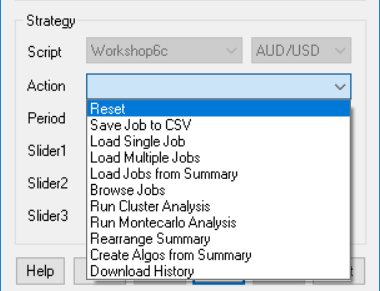
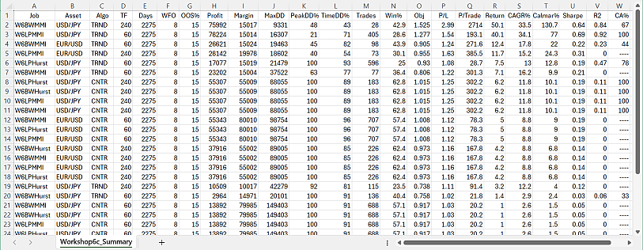

# Evaluation Shell

# The Evaluation Shell (Zorro S)

The strategy evaluation shell is an addendum to the [Zorro project](https://zorro-project.com). Its purpose is determining the ideal parameters and functions for a given trading strategy, generating a portfolio of asset, algo, and timeframe combinations, and predicting its live perfomance under different market situations. The Zorro evaluation shell can make the best of a strategy, especially of 'indicator soup' type strategies that combine many different indicators and analysis functions.

A robust trading strategy has to meet several criteria:

*   It must exploit a real and significant market inefficiency. Random-walk markets cannot be algo traded.
*   It must work in all market situations. A trend follower must survive a mean reverting regime.
*   It must work under many different optimization settings and parameter ranges.
*   It must be unaffected by random events and price fluctuations.

The shell evaluates parameter combinations by these criteria. The robustness under different market situations is determined through the **R2 coefficient**, the parameter range robustness with a WFO profile (aka **Cluster Analysis**), the price fluctuation robustness with [oversampling](numsamplecycles.md). A **Montecarlo analysis** finds out whether the strategy is based on a real market inefficiency.

Zorro already offers functions for all these tests, but they require a large part of code in the strategy, more than for the algorithm itself. The evaluation shell skips the coding part. It can be simply attached to a strategy script. It makes all strategy variables accessible in a panel, adds optimization and money management as well as support for multiple assets and algos, runs automated analysis processes, and builds the optimal portfolio of strategy variants. It compiles unmodified under lite-C and under C++, and supports **.c** as well as **.cpp** scripts.

With almost 1500 lines, the shell is probably the largest Zorro script so far, and goes far beyond other strategy evaluation software on the market. It comes with source code, so it can be easily modified and adapted to special needs. It is restricted to **personal use**; any commercial use or redistribution, also partially, requires explicit permission by oP group Germany. Since it creates a panel and a menu, it needs a [Zorro S](restrictions.md) license to run. Theoretically you could remove the panel and menu functions and use the shell with the free Zorro version. This is allowed by the license, but would require clumsy workarounds, like calling functions by script and manually editing CSV files.

### Overview

Developing a successful strategy is a many-step process, described in the [Black Book](247_Links_Books.md) and briefly in an article series on [Financial Hacker](https://financial-hacker.com/build-better-strategies-part-3-the-development-process/). The evaluation shell cannot replace research and model selection. But it takes over when a first, raw version of the strategy is ready. At that stage you're usually experimenting with different functions for market detection and generating trading signals. It is difficult to find out which indicator or filter works best, since they are usually interdependent. Market detector A may work best with asset B and lowpass filter C on time frame D, but this may be the other way around with asset E. It is very time consuming to try out all combinations.

The evaluation shell solves that task with a semi-automated process.

<table align="center" border="0"><tbody><tr><td bgcolor="#0000FF" class="auto-style3" valign="middle"><div align="center" class="auto-style3"><strong><br><br>Creeate<br>&nbsp;Jobs</strong></div></td><td><strong><br><br></strong></td><td align="center" bgcolor="#0000FF" class="Stil2"><strong><br><br class="auto-style3">&nbsp;</strong><span class="auto-style3"><strong>Generate<br>&nbsp;Summary</strong></span><strong><br class="auto-style3"></strong></td><td class="Stil4"><strong><br class="auto-style3"><br class="auto-style3"><br><br></strong></td><td align="center" bgcolor="#0000FF" class="Stil4"><strong><br class="auto-style3"><br class="auto-style3"><span class="auto-style3">&nbsp;Cluster</span><br class="auto-style3"><span class="auto-style3">&nbsp;Analysis</span></strong></td><td class="Stil4"><strong><br class="auto-style3"><br class="auto-style3"><br><br></strong></td><td align="center" bgcolor="#0000FF" class="Stil4"><strong><br class="auto-style3"><span class="auto-style3"><br>&nbsp;Correlation</span><br class="auto-style3"><span class="auto-style3">&nbsp;Analysis</span></strong></td><td class="Stil4"><strong><br class="auto-style3"><br class="auto-style3"><br><br></strong></td><td align="center" bgcolor="#0000FF" class="Stil4"><strong><br class="auto-style3"><span class="auto-style3"><br>&nbsp;Montecarlo</span><br class="auto-style3"><span class="auto-style3">&nbsp;Analysis</span></strong></td><td class="Stil4"><strong><br class="auto-style3"><br class="auto-style3"><br><br></strong></td><td align="center" bgcolor="#0000FF" class="Stil4"><strong><br class="auto-style3"><span class="auto-style3"><br>&nbsp;Final</span><br class="auto-style3"><span class="auto-style3">&nbsp;Portfolio</span></strong></td></tr></tbody></table>

The first step is generating sets of parameter settings, named jobs. Any job is a variant of the strategy that you want to test and possibly include in the final portfolio. You can have parameters that select betwen different market detection algorithms, and others that select between different lowpass filters. The parameters are edited in the variables panel, then saved with a mouse click as a job. Instead of entering values in the panel, you can also edit the jobs directly with a spreadsheet program or a text editor.

The next step is an automated process that runs through all jobs, trains and tests any of them with different asset, algo, and time frame combinations, and stores their results in a summary. The summary is a CSV list with the main performance parameters of all jobs. It is sorted by performance: The best performing jobs are at the top. So you can see at a glance which parameter combinations work with which assets and time frames, and which are not worth to examine further. You can repeat this step with different global settings, such as bar period or optimization method, and generate multiple summaries in this way. 

The next step in the process is cluster analysis. Every job in a selected summary is optimized multiple times with different [WFO](numwfocycles.md) settings. These settings are taken from - you guessed it - a separate CSV file that may contain a regular WFO matrix, a list of irregular cycles/datasplit combinations, or both. For reducing the process time, only profitable jobs with rising equity curves - determined by a nonzero **R2 coefficent** - get a cluster analysis. You can also further exclude jobs by removing or outcommenting them in the summary.

After this process, you likely ended up with a couple survivors in the top of the summary. The surviving jobs have all a positive return, a steady rising equity curve, shallow drawdowns, and robust parameter ranges since they passed the cluster analysis. But not all of them are suited for the final portfolio. The purpose of a strategy portfolio is diversifiction, but this would not work with a set of variants that are all tightly correlated and have their drawdowns all at the same time. You want a balanced portfolio with uncorrelated algorithms. Automatically reducing the portfolio to the combinations with the smallest correlation is planned for a future shell version, but at the moment it involves a manual selection. Check the equity curves and keep only the best of all variants with similar curves or the same assets, algos, and time frames. They can now be combined with a mouse click to the final balanced portfolio.

But you're not finished yet. Any selection process generates selection bias. Your perfect portfolio will likely produce a great backtest, but will it perform equally well in live trading? To find out, run a Montecarlo analysis. This is the most important test of all, since it can determine whether your strategy exploits a real market inefficiency. If the Montecarlo analysis fails with the final portfolio, it will likely also fail with any other parameter combination, so you need to run it only at the end. If your system passes Montecarlo with a p-value below 5%, you can be relatively confident that the system will return good and steady profit in live trading. Otherwise, back to the drawing board.  

This manual is split in two parts. The following sections deal with the user interface of the shell. For a quick usage example, scroll down to the [tutorial](#tutorial). Attaching the shell to an existing strategy is described in the [second part](shell2.md).  

### Variables panel

When you start a strategy with attached shell, the \[Result\] button will change to \[Start\], a new menu will be available under \[Action\], and a panel with the current parameter and variables of the strategy will pop up:


The panel and menu are the reason why a Zorro S license is required, since panel functions are not supported by the free version. The variables in the panel are divided in three sections.The general system settings, common for all strategies, are in the grey area. The strategy variables specific to a certain algorithm are in the area with red or yellow colors, where any algorithm has its individual color. The strategy variables common to all algorithms are in the blue area.

Every variable is represented by a row in the panel. The first field is thje variable name. The **Fixed** field can be active (**x**) or disabled (**o**). It can be switched between the states with a mouse click. If a variable value is fixed, it overrides the value from a saved job or from optimization. By default, the system variables are fixed, the strategy specific variables are not.

The **Value**, **Min**, and **Max** fields contain the default value and range (if any) of the variable. You can edit any field and change its value. Edited values in the panel are remembered at the next start. Changes are indicated with a white background. Exceeding the valid range is allowed, but indicated with a red background.

The **Step** field is for variables that can be [optimized](107_optimize.md). A negative step width establishes a percent increase, as recommended with large optimization ranges. If the step width is set to **0**, the variable is not optimized, and gets its default value instead..

The system settings in the grey area are mostly self explaining:

<table><tbody><tr><td class="auto-style1" style="width: 136px"><strong>_Bar_Period</strong></td><td>The basic <a href="barperiod.htm">bar period</a> from which the time frames are derived.</td></tr><tr><td class="auto-style1" style="width: 136px"><strong>_Lookback_Bars</strong></td><td>The <a href="lookback.htm">lookback</a> period in bar units.</td></tr><tr><td class="auto-style1" style="width: 136px"><strong>_WFO_Cycles</strong></td><td>Number of <a href="numwfocycles.htm">WFO cycles</a> in the backtest, not counting the last cycle for live trading. Rule of thumb: Use 1-2 cycles per backtest year.</td></tr><tr><td class="auto-style1" style="width: 136px"><strong>_WFO_OOS</strong></td><td><a href="dataslope.htm">Out-of-Sample period</a> for WFO, in percent.</td></tr><tr><td class="auto-style1" style="width: 136px"><strong>_Oversampling</strong></td><td>Number of <a href="numsamplecycles.htm">oversampling</a> cycles with differently sampled price curves in the backtest.</td></tr><tr><td class="auto-style1" style="width: 136px"><strong>_Backtest_Mode</strong></td><td><strong>-1</strong> for a 'naive' backtest with no trading costs, <strong>1</strong> for a realistic bar based backtest, <strong>2</strong> for a minute based backtest, <strong>3</strong> for backtest with tick-based history. Historical data in the required resolution must be available.</td></tr><tr><td class="auto-style1" style="width: 136px"><strong>_Backtest_Start</strong></td><td>Start year or date of the backtest. Use at least 5, better 10 years for the test period.</td></tr><tr><td class="auto-style1" style="width: 136px"><strong>_Backtest_End</strong></td><td>End year or date of the backtest.</td></tr><tr><td class="auto-style1" style="width: 136px; height: 42px;"><strong>_Train_Mode</strong></td><td style="height: 42px"><strong>0</strong> Script default<strong>, 1</strong> Ascent (fastest), <strong>2</strong> Genetic, <strong>3</strong> Brute Force (see <a href="opt.htm">TrainMode</a>). Results of genetic optimization can differ on any training due to random mutations.</td></tr><tr><td class="auto-style1" style="width: 136px"><strong>_Objective</strong></td><td>Training objective, aka 'fitness function'. <strong>0</strong> PRR (default), <strong>1</strong> R2*PRR, <strong>2</strong> Profit/DD, <strong>3</strong> Profit/Investment, <strong>4</strong> Profit/day, <strong>5</strong> Profit/trade. For the metrics, see <a href="performance.htm">performance</a>.</td></tr><tr><td class="auto-style1" style="width: 136px"><strong>_Criteria</strong></td><td>The field number by which the summary is sorted and the profiles are generated. <strong>0</strong> no sorting, <strong>7</strong> Net Profit, <strong>13</strong> Win rate, <strong>14</strong> Objective, <strong>15</strong> Profit factor, <strong>16</strong> Profit per trade, <strong>17</strong> Annual return (default), <strong>18</strong> CAGR, <strong>19</strong> Calmar ratio, <strong>20</strong> Sharpe, <strong>21</strong> R2 coefficient. See <a href="performance.htm">performance</a> for details about the metrics.</td></tr><tr><td class="auto-style1" style="width: 136px"><strong>_MRC_Cycles</strong></td><td>Number of cycles for the Montecarlo 'Reality Check' analysis (default <strong>200</strong>). Results differ from run to run due to randomizing the price curve, therefore more cycles produce more precise results.</td></tr><tr><td class="auto-style1" style="width: 136px"><strong>_Max_Threads</strong></td><td>Number of CPU cores to use for WFO (<strong>0</strong> = single core), or number not to use when negative (f.i. <strong>-2</strong> = all cores but 2). <a href="restrictions.htm">Zorro S</a> required. Using multiple cores is recommended for faster training.</td></tr><tr><td class="auto-style1" style="width: 136px"><strong>_Investment</strong></td><td>Method for calculating the trade size. <strong>0</strong> Script default, <strong>1</strong> Lots slider, <strong>2</strong> Margin slider, <strong>3</strong> Margin * OptimalF, <strong>4</strong> Percent of account balance, <strong>5</strong> Percent * square root reinvestment. At <strong>3</strong> or above, <a href="optimalf.htm">OptimalF</a> factors are generated and affect the margin. <strong>4</strong> and above reinvest profits and should only be used in the last stages of development.</td></tr><tr><td class="auto-style1" style="width: 136px"><strong>_Phantom</strong></td><td>Activate <a href="trademode.htm">equity curve trading</a> by setting the time period between 10..50. A falling equity curve is detected and trading is suspended until the market turns profitable again.</td></tr><tr><td class="auto-style1" style="width: 136px"><strong>_Verbose</strong></td><td>Set to <strong>0</strong> for no logs and reports, <strong>1..3</strong> for more verbose logs, <strong>17</strong> for halting on any error. The more verbose, the slower the test. Critical error messages are collected in <strong>Log\Errors.txt</strong>. Performance summary reports are always generated, regardless of this setting.</td></tr></tbody></table>

  

### Action menu

After starting the script in \[Train\] mode, a click on \[Action\] opens a dropdown menu.



<table><tbody><tr><td style="width: 146px" class="auto-style2"><span class="tast">Reset</span></td><td>Reset all variables to their defaults, and remove all loaded jobs and algos.</td></tr><tr><td style="width: 149px" class="auto-style2"><span class="tast">Save Job to CSV</span></td><td>Save the current panel state with all variables to a job file in CSV format, in a folder of your choice (<strong>Job</strong> by default). If the system has no own algos, the file name will be later used for the algo names, so don't use a complex or long name.</td></tr><tr><td style="width: 149px" class="auto-style2"><span class="tast">Load Single Job</span></td><td>Load a set of variables from a job file to the panell for training and analyzing them. If one or more jobs are loaded, backtests will store their 'papertrails' of charts, logs, and reports in a subfolder named after the job.</td></tr><tr><td style="width: 149px" class="auto-style2"><span class="tast">Load Multiple Jobs</span></td><td>Select a folder by clicking on a job file inside. All jobs in that folder are loaded, together with all their asset, algo, and timeframe variants. A click on [<span class="tast">Start</span>] will train all jobs and store their results in the <strong>Summary</strong> and in their 'papertrail' folders.</td></tr><tr><td style="width: 149px" class="auto-style2"><span class="tast">Load Jobs from Summary</span></td><td>Select a summary generated by previous training. All profitable jobs listed in that summary with a positive R2 coefficient are loaded. Jobs can be excluded by adding a <strong>'#'</strong> in front of the name or by deleting them from the summary.</td></tr><tr><td style="width: 149px" class="auto-style2"><span class="tast">Browse Jobs</span></td><td>Select a job from a previously loaded set of jobs, and load its variables into the panel.&nbsp;</td></tr><tr><td style="width: 146px" class="auto-style2"><span class="tast">Run Cluster Analysis</span></td><td>Run a WFO cluster analysis, with WFO offsets and OOS periods defined in a CSV file.&nbsp;Several files with various combinations of offsets and periods are included. For any WFO cycles / OOS period combination, the resulting performance metrics are stored in a <strong>Cluster summary</strong>. For files containing a regular NxM cluster matrix, the returns are displayed in a heatmap as shown below, otherwise in a WFO profile.</td></tr><tr><td style="width: 146px" class="auto-style2"><span class="tast">Run Montecarlo Analysis</span></td><td>Run a Montecarlo 'Reality Check' with the current parameters and shuffled price curves. A reality check can tell whether the WFO performance was just luck, or was caused by a real market inefficiency. The resulting performance metrics are stored in a <strong>MRC summary</strong>, and the results are displayed in a histogram together with the original result with unmodified price curve. Depending on the resulting <strong>p-value</strong>, the backtest performance is qualified as significant, possibly significant, or insignificant.</td></tr><tr><td style="width: 149px" class="auto-style2"><span class="tast">Rearrange Summary</span></td><td>Re-sort the entries in the summary if <strong>_Criteria</strong> has changed.</td></tr><tr><td style="width: 146px" class="auto-style2"><strong>Create Algos from Summary</strong></td><td>Select a summary generated by previous training. All profitable and robust jobs from that summary with a CA result of 75% or better are automatically selected for the final portfolio. Their variables, assets, algos, and time frames are stored in <strong>Data\*_algo.bin</strong>. This file is automatically loaded at start. Training, testing, and trading will now use the full porfolio. To discard it, use <span class="tast">Reset</span>.</td></tr><tr><td style="width: 146px" class="auto-style2"><span class="tast">Download History</span></td><td>Open the Zorro Download Page for getting historical data.</td></tr></tbody></table>

When no job was loaded, clicking on \[Start\] will just start a test or training run with the current variable settings in the panel. After a successful backtest, the [performance report](012_Performance_Report.md) will open in the editor, and the chart viewer will display the price curve, the trades, and the equity curve. Train mode will always use walk forward optimization, even when none is defined in the script. Test mode will only run a backtest; so the strategy should have been trained before. After changing any variable, train again. If a variable range was exceeded or historical data was missing for the selected backtest period, you'll get an [error message](errors.md). Training errors will store the error message in **Log\\Errors.txt** and abort.

When one or more jobs are loaded, a click on \[Start\] will train and test all of them in all their asset, algo, and timeframe variants. Their logs, performance reports, and charts will be stored in a subfolders named after the job. In this way training and testing jobs leaves a 'perpertrail' that allows evaluating individual results. Instead of the performace report, a **summary** report will open in the editor.

### Results: Summary

The summary report appears when multiple jobs are trained or tested. Any job in any asset, algo, and timeframe variant generates a record in the summary. The summary is sorted, with the best jobs, selected by the **\_Criteria** variable, at the top. It is stored in CSV format, so it can be further evaluated in a spreadsheet program.



The fields:

<table><tbody><tr><td class="auto-style4"><strong>Job</strong></td><td>Job name</td></tr><tr><td class="auto-style4"><strong>Asset</strong></td><td>Asset used by the job.</td></tr><tr><td class="auto-style4"><strong>Algo</strong></td><td>Algo used by the job (if any).</td></tr><tr><td class="auto-style4"><strong>TimeFrame</strong></td><td>Time frame of the job, in minutes.</td></tr><tr><td class="auto-style4"><strong>Days</strong></td><td>Total days of the backtest, not counting lookback and training.</td></tr><tr><td class="auto-style4"><strong>WFO</strong></td><td>Number of WFO Cycles</td></tr><tr><td class="auto-style4"><strong>OOS%</strong></td><td>Out-of-sample period in percent</td></tr><tr><td class="auto-style4"><strong>Profit</strong></td><td>Sum of wins minus sum of losses minus trading and margin cost.</td></tr><tr><td class="auto-style4"><strong>Margin</strong></td><td>Amount required for covering the maximum open margin</td></tr><tr><td class="auto-style4"><strong>MaxDD</strong></td><td>Maximum equity drawdown from a preceding balance peak</td></tr><tr><td class="auto-style4"><strong>PeakDD%</strong></td><td>Max equity drawdown in percent ot the preceding peak</td></tr><tr><td class="auto-style4"><strong>TimeDD%</strong></td><td>Time spent in drawdown in percent of backtest time</td></tr><tr><td class="auto-style4"><strong>Trades</strong></td><td>Number of trades</td></tr><tr><td class="auto-style4"><strong>Win%</strong></td><td>Percent of won trades.</td></tr><tr><td class="auto-style4"><strong>Obj</strong></td><td>Backtest return of the objective function.</td></tr><tr><td class="auto-style4"><strong>P/L</strong></td><td>Profit factor, the sum of wins divided by sum of losses</td></tr><tr><td class="auto-style4"><strong>P/Trade</strong></td><td>Average profit per trade</td></tr><tr><td class="auto-style4"><strong>Return</strong></td><td>Annual net profit in percent of max margin plus max drawdown.</td></tr><tr><td class="auto-style4"><strong>CAGR%</strong></td><td>Annual growth of the investment in percent.</td></tr><tr><td class="auto-style4"><strong>Calmar%</strong></td><td>Annual net profit in percent of max drawdown.</td></tr><tr><td class="auto-style4"><strong>Sharpe</strong></td><td>Annualized mean return divided by standard deviation</td></tr><tr><td class="auto-style4"><strong>R2</strong></td><td>Equity curve straightness, 1 = perfect</td></tr><tr><td class="auto-style4"><strong>CA%</strong></td><td>Percentage of runs that passed the cluster analysis.</td></tr></tbody></table>

If a job uses multiple assets, algos, or timeframes, the last one is recorded in the summary. The meaning of the performance metrics can be read up under [performance report](012_Performance_Report.md).

### Results: Paper trail

The test results for any job are automatically stored in subfolders of the folder that contained the job file. The subfolders are named after the job, its asset, its algo, and its timeframe. In this way any job leaves a 'papertrail' of of text, CSV, image, and html files from its training and test runs. All reports can be opened with a plain text editor such as the included Notepad++. The .csv files can also be opened with Excel, and the chart images with an image viewer like the included **ZView**.

Aside from the summary and the CA or MA charts, the following reports are produced when jobs are processed (for details see [exported files](export.md)):

\***.txt** - the last [performance report](012_Performance_Report.md).  
**\*history.csv** - the performance history of the job. Any test or training run adds a line to the history.  
**\*.png** - the chart with the equity curve, trades, and indicators.  
**\*.htm** - a page with [parameter charts](107_optimize.md) that visually display the effect of parameters on the performance.  
**\*.log** - the [event log](010_Log_Messages.md) of the backtest.  
**\*train.log** - the [training log](107_optimize.md) with the objective results for all tested parameter combinations.  
**\*pnl.csv** - the equity curve of the backtest, for further evaluation.  
**\*trd.csv** - the trade list of the backtest, for further evaluation.  
**\*par.csv** - the results of genetic or brute force training runs, for further evaluation.  
**Log\\Errors.txt** - the last errors encountered (if any) while training or testing.

### Results: Cluster analysis

Cluster analysis (CA) can be performed either with the current settings and algos, or with multiple jobs. In the latter case its results are stored in the **CA%** field of the summary report. For reducing process time, only jobs with a positive **R2** value are cluster analyzed. And only jobs with more than 75% positive CA runs will be taken over to the next step, the algorithm selection.

Dependent on the selected cluster template, Cluster analysis will generate either a WFO profile or a heatmap: The cluster template is a CSV file with an arbitrary number of WFO cycle / OOS period combinations, like this:

```c
WFO,OOS%
\-4, 25
\-3, 22
\-2, 20
\-1, 18
0, 15
1, 12
2, 9
3, 7
4, 5
```
The first column are offsets to the value of the **\_WFO\_Cycles** variable, the second column are the OOS periods in percent. Any offset/period combination generates a performance values that is determined by **\_Criteria** and displayed in a profile diagram, which pops up in the chart viewer: 

  
WFO profile, from a non-matrix cluster analysis. Y axis: **\_Criteria**, X axis: line number in the template.

Usually, the cluster template will be a regular matrix, like this (for a 5x5 matrix):

```c
WFO,OOS%
-2, 5
-2, 10
-2, 15
-2, 20
-2, 25
-1, 5
-1, 10
-1, 15
-1, 20
-1, 25
0, 5
0, 10
0, 15
0, 20
0, 25
1, 5
1, 10
1, 15
1, 20
1, 25
2, 5
2, 10
2, 15
2, 20
2, 25
```
This will produce a heatmap as below. The X axis is the number of WFO cycles, the y axis is the OOS period in percent. The numbers in the fields are the resulting strategy performance by **\_Criteria**.


WFO heatmap, from cluster analysis with a regular matrix

The color of the fields represents the performance. You want as much red fields in the heatmap as possible. The example above, with the Pessimistic Return Ratio (PRR) as metric, has only 13 red fields out of 25. This job would not pass the 75% CA threshold.  
 

### Results: Montecarlo analysis

Montecarlo Analysis, aka 'Reality Check', is normally only applied to the final strategy after algos have been generated. It produces a histogram of results from randomized price curves (red) and from the original price curve (black). This one below (from the 'placebo system' in the Financial Hacker article) indicates that you better don't trade that system live, even though it produced a great walk-forward analyis.


Another one from a real stragegy that generated less performance in the walk-forward analysis, but exploits a real market inefficiency:


More about cluster analysis and Montecarlo analysis can be found on [financial-hacker.com/why-90-of-backtests-fail](https://financial-hacker.com/why-90-of-backtests-fail).  
   

### Very concise tutorial

The following tutorial uses [workshop 6](tutorial_kelly.md) as an example. You can find prepared template and job files in the **Job** folder.

*   First, create the performance summary. For this select **Workshop6c** and click \[Train\].
*   From the \[Action\] scrollbox, select Load Multiple Jobs.
*   4 example jobs beginning with **"W6..."** are in the **Job** folder. Double click one of them.
*   Click \[Start\]. All jobs with their asset, algo, timeframe variants are now trained.
*   At the end of the process, the Summary will pop up in the editor.  
     
*   Next, cluster analysis. Click \[Train\] and select Load Jobs from Summary.
*   Double click on **Job\\Workshop6c\_Summary.csv** that was generated in the previous step.
*   From the \[Action\] scrollbox, select Run Cluster Analysis.
*   Now you have the choice between several predefined clusters. Select **WFO\_Cluster3x3**.
*   After a lengthy process, the summary appears with the **CA%** column of the best jobs populated,  
     
*   Next, portfolio creation. Click \[Train\] and select Create Algos from Summary.
*   Double click on **Job\\Workshop6c\_Summary.csv.** You'll see a list of algo variants from the top of the summary.
*   Click \[Start\] to train. The perfomance report will pop up at the end.  
     
*   Finally, the Montecarlo Reality Check. Click \[Train\]. The algos are automatically loaded,
*   From the \[Action\] scrollbox, select Run MonteCarlo Analysis.
*   At the end of the process you'll get the **p-value** and a histogram of the system.  
     
*   If according to the p-value the system is not worth trading, come up with a better system.
*   Otherwise click \[Train\]. It must be trained again after the montecarlo process.
*   After training, select your broker and account, click \[Trade\], and get rich.

Naturally, training hundreds of jobs and variants will take its time. For highest speed, activate multiple threads, code in C++, and use the 64 bit Zorro version.  
 

### Remarks

*   After changing variable values or ranges in the script, click Reset on the next start, otherwise the variables keep their last stored values and ranges.
*   If the strategy was changed after creating algos, the whole proces needs not be repeated unless the change is very substantial. Otherwise it is sufficient to create algos with the current summary and train them again.
*   Make sure that **\_Lookback\_Bars** is sufficient for running all loaded jobs with the largest time frame. When extending or reducing the backtest years, adapt **\_WFO\_Cycles** accordingly.
*   For highest speed, activate multiple threads, code in C++, and use the 64 bit Zorro version.
*   If a thread encounters an error, the optimization will stop and the error message can be found in the file **Log\\Errors.txt**.
*   Training results are only kept for last training run or for the final portfolio. When you switch jobs or change parameters, always train again.
*   Do not open results in Excel while a shell process is running. Excel will block any access to its open files.

### See also:

**[Get Started with Zorro](started.md), [Portfolio Lists](013_Asset_Account_Lists.md), [Walk Forward Optimization](numwfocycles.md), [Performance Reports](012_Performance_Report.md), [Adapting the Shell](shell2.md)**

[► latest version online](javascript:window.location.href = 'https://zorro-project.com/manual/en' + window.location.href.slice\(window.location.href.lastIndexOf\('/'\)\))