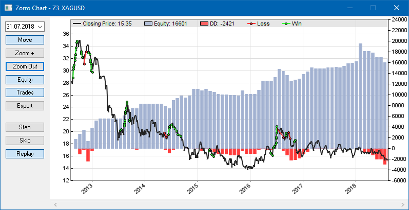
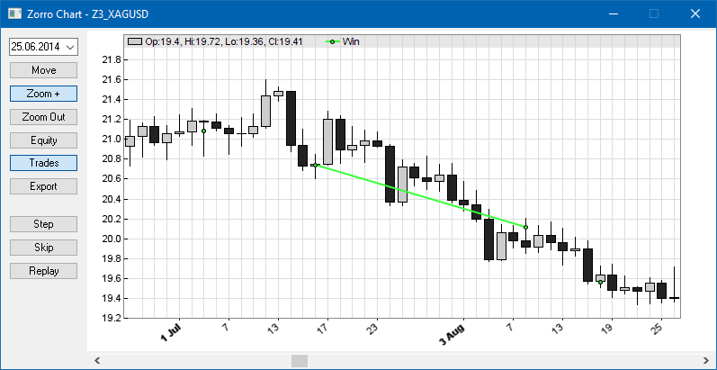
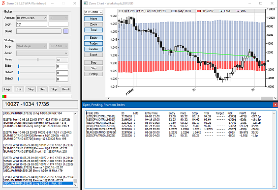

# Chart Viewer / Debugger

# Chart Viewer and Visual Debugger

A click on the \[Result\] button after a test run opens the chart viewer and debugger. It allows to zoom and scroll from an overview of the whole simulation down to a single day or hour, and can replay or single step through the strategy for debugging purposes. Charts can be exported and stored as images, or already generated as images..

The chart runs from the begin of the first test cycle (not identical to the [StartDate](date.md)) to the end of the last test cycle. By default it displays equity and drawdown profiles (blue and red), the price curve (black), and the trades of the asset selected with the \[Asset\] scrollbox. For displaying a different asset, select it with the scrollbox and click \[Result\] again.

The chart uses the same [time zone](assetzone.md) as the historical data, normally UTC. The left axis is the asset price, the right axis is the profit or loss in account currency units. Any axis runs from the minimum to the maximum value within the chart. Trade entry and exit points are connected with green or red lines for winning or losing trades. A falling green line or a rising red line indicates a short position. For option trades the lines connect the strike prices with underlying exit prices.

Equity and drawdown profiles are summed up from the whole portfolio and averaged over all [oversampling](numsamplecycles) cycles. If [Capital](190_Margin_Risk_Lots.md) is invested, it adds to the equity curve dependent on [PlotMode](203_PlotMode.md) settings. In [BALANCE](018_TradeMode.md) mode the blue profile displays the balance rather than the equity, in [PIPRETURN](018_TradeMode.md) mode it's the volume-independent profit in pips. The red "underwater profile" is normally the [drawdown](012_Performance_Report.md), the equity distance from a preceding balance peak. In [MAECAPITAL](018_TradeMode.md) mode it's the adverse excursion from a preceding equity peak and thus 'mirrors' the top of the equity curve. In [PL\_BENCHMARK](203_PlotMode.md) mode the equity curve is plotted as a blue line rather than bars, for comparison with buy-and-hold or market profit lines. Additional curves appear either on or below the main chart, depending on [plot](146_plot_plotBar.md) settings.

Candles are displayed when zooming in; otherwise the price curve is a black line. In the chart below, a short trade was opened on 16 at market open and closed intraday on Aug 8, probably by a trailing stop. A close at bar end by an exit command would have placed the end dot next to the close of the candle.

Chart elements can be switched off either with the buttons on the left side, or by setting their [Color](206_Colors.md) to 0.  
 

<table border="0"><tbody><tr><td valign="top"><table border="0"><tbody><tr><td colspan="2">
<h3 class="auto-style1">Chart Buttons</h3>
</td></tr><tr><td class="tast">
Date
</td><td>Jump to a particular date in the chart</td></tr><tr><td class="tast">
Move
</td><td>Move mode. Drag the chart with the mouse.</td></tr><tr><td class="tast">
Zoom
</td><td>Zoom mode. Click on a position in the chart for zooming in.</td></tr><tr><td class="tast">Total</td><td>Zoom out to the total view.</td></tr><tr><td class="tast" style="height: 12px">
Equity
</td><td style="height: 12px">
Toggle the equity and underwater curves.
</td></tr><tr><td class="tast" style="height: 12px">
Trades
</td><td style="height: 12px">
Toggle the trades.
</td></tr><tr><td class="tast" style="height: 12px">
Candles
</td><td style="height: 12px">
Toggle the price curve.
</td></tr><tr><td class="tast">
Export
</td><td>Export the current chart to a <strong>.png</strong> image.</td></tr><tr><td colspan="2">
<h3 class="auto-style1">Debugger Buttons</h3>
</td></tr><tr><td class="tast">
Step
</td><td>Restart the script in single step mode. Step forward 1 bar.</td></tr><tr><td class="tast">Skip</td><td>Restart the script in single step mode. Jump to the begin of the next trade.</td></tr><tr><td class="tast">Replay</td><td>Replay the script, one bar per second. Gives some sort of live trading experience in fast-forward mode.</td></tr></tbody></table></td></tr></tbody></table>

The price curve with the displayed trades can be selected with the \[Assets\] scrollbox; afterwards click \[Result\] again for refreshing the chart. The equity or balance curve results from the sum of all trades of the portfolio. The underlying datasets of a chart can be [exported](209_Export.md) and further evaluated with third party charting software, f.i. an [R data analysis](rbridge.md) package.

In [PL\_FILE](203_PlotMode.md) mode, the chart is initally generated as a **.png** image in the **Log** folder and displayed with the **ZView** image viewer. Elements can be removed from the chart image by setting their corresponding [Color](206_Colors.md) parameters to **0.** The size, scale, and resolution of the chart image can be set up with [plot parameters](204_PlotBars_PlotWidth.md). The number of bars per chart can be limited with the [PlotBars](204_PlotBars_PlotWidth.md) variable.

### Remarks

*   In \[Trade\] mode a chart image is part of the **.htm** status page. It can be displayed in a web browser and is updated after every [PlotPeriod](204_PlotBars_PlotWidth.md) (default: 1 hour). It is not a live chart, but a snaphot of the last update point.
*   In \[Train\] mode parameter charts are exported to image files and displayed on the training result page.
*   The start point of a trade triggered at the end of a bar is displayed in the chart on the next bar, regardless of the selected [Fill](198_Fill_modes.md) mode.
*   For bar charts the last position and zoom factor are preserved until the \[Edit\] button is clicked or a different script is selected.
*   On zooming horizontally, the vertical zoom is automatically adjusted so that it covers all plot elements inside the range. This can cause 'flat' candles when plot elements, f.i. by [plotGraph](146_plot_plotBar.md), are far away from the price line.
*   Charts with many sub-charts (more than 15) can be difficult to view even with a large window size. If required, generate them as images with **setf(PlotMode,PL\_FILE);** and display them in the **ZView** image viewer that is included in the Zorro distribution.
*   The text in the caption bar of the current chart can be changed with [print(TO\_CHART,...)](143_printf_print_msg.md).
*   For comparing charts or histograms of different strategy variants, export them as images and open them with **ZView** in horizontal split mode.  
     

# Debugging a strategy

You can replay or single step through a strategy for examining the trade behavior in detail. Use the \[Asset\] scrollbox to select the asset to be observed, then click \[Step\] or \[Replay\] for stepping through the backtest or replaying it in reduced speed. \[Step\] moves one bar forward, \[Skip\] moves to the next bar at which a trade opens or closes. The two buttons also appear on the Zorro main window.

Debugging opens the chart window at the current position, and another window with a list of open trades:

The trade list has the same format as on the [live status page](004_Trading_Strategies.md).

The stepwise change of variables and indicators can be visualized either with a [watch](166_watch.md) statement, or by [plotting](146_plot_plotBar.md) them in the chart. For debugging single loops or function calls, place **watch ("!...", ...)** statements inside. \[Step\] will then not proceed to the next bar, but to the next **watch** statement. Stepwise debugging normally begins at the end of the [LookBack](181_LookBack_UnstablePeriod.md) period. For beginning at a certain date or bar number, call [watch](143_printf_print_msg.md) dependent on a condition, f.i. **if(date() >= 20150401) watch("!...", ...);**. Set the [STEPWISE](018_TradeMode.md) flag for starting the backtest already in debugging mode.

*   For suggestions about writing clean code and dealing with bugs and errors in your script, read [troubleshooting](210_Troubleshooting.md).
*   For testing the behavior of a strategy under simulated market conditions, such as extreme drops, use an artificial price curve (see [SHAPE)](197_Detrend_shuffling.md).
*   For quickly testing the robustness of your strategy, run it with a detrended or inverted price curve (see [Detrend](detrend.md)).
*   For testing the live trading behavior at a certain date or in 'fast forward' mode, use [DayOffset](100_tradeUpdate.md).

### See also:

[Testing](006_Testing.md), [Colors](206_Colors.md), [plot](146_plot_plotBar.md), [watch](166_watch.md), [Troubleshooting](210_Troubleshooting.md), [Performance Report](012_Performance_Report.md)

[► latest version online](javascript:window.location.href = 'https://zorro-project.com/manual/en' + window.location.href.slice\(window.location.href.lastIndexOf\('/'\)\))