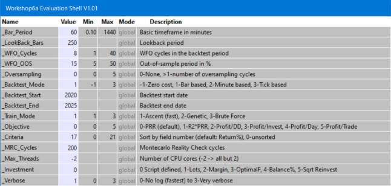
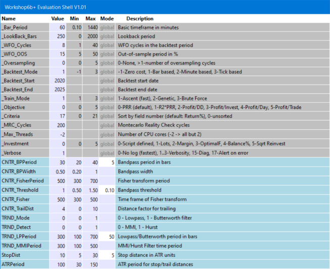

# Shell Integration

# Evaluation Shell: Adapting a Strategy

This section deals with the modifications of a strategy for integrating the [evaluatien shell](010_Evaluation_Shell.md). Depending on what you want to do and which tests you want to apply, there are several steps of integration. We'll use [workshop6](tutorial_kelly.md) as an example.

### Step 1: Attaching the shell

For adding cluster analysis, Montecarlo analysis, oversampling, various walk-forward optimization methods, and different training objectives, you only need to insert two lines to an existing stragey. Include **eval.h** at the begin of the script:

```c
#include <eval.h>
```

... and **eval.c** at the end:

```c
#include <eval.c>
```

You can find a script with attached shell in **Workshop6a**. When you start it, the \[Result\] button will change to \[Start\], a new menu will be available under \[Action\], and the [variables panel](010_Evaluation_Shell.md) with the system section will pop up:



The settings have only effect when your script does not set those parameters itself. If it does, the script will override all settings in the panel, except for the **\_WFO\_Cycles** and **\_WFO\_OOS** values. They override the script, since they are used for the cluster analysis.

The default values of some variables can be set up in the strategy script by **#define** statements. Example:

```c
#define \_BAR\_PERIOD     240
#define \_LOOKBACK\_BARS  4000
#define \_WFO\_CYCLES     16
#define \_BACKTEST\_START 201501011
#define \_BACKTEST\_END   20251231
```

The Action menu contains only a subset of the shell functions. You can Reset the variables, run Cluster Analysis and Montecarlo analysis, and open the download page to Download History.  
 

### Step 2: Creating jobs

The next step of evalution is letting the shell control your script variables. This allows you to experiment with many different parameter settings and optimization ranges, and testing them all in an automated process. Any such variant is a 'job'. As a side benefit, putting script variables in a panel also allows you to observe their bar-to-bar behavior with the [Visual Debugger](011_Chart_Viewer_Debugger.md).

Instead of **eval.h**, now include **evars.h** at the begin of the script:

```c
#include <evars.h>
```

Below the **#include** statement, put all relevant script variables that you want to observe, optimize, or experiment with in a list. Add comments and put an **END\_OF\_VARS** statement at the end of the list. Example (from **Workshop6b**):

```c
var CNTR\_BPPeriod; _//= 30, 20..40, 5; Bandpass period in bars_
var CNTR\_BPWidth; _//= 0.5, 0.2..1; Bandpass width_
var CNTR\_FisherPeriod; _//=500, 300..700; Fisher transform period_
var CNTR\_Threshold; _//= 1,0.5..1.5,0.1; Bandpass threshold_
var CNTR\_Fisher; _//= 500,300..500; Time frame of Fisher transform_
var CNTR\_TrailDist; _//=4, 0..10; Distance factor for trailing_
var TRND\_Mode; _//= 0, 0..1; 0 - Lowpass, 1 - Butterworth filter_
var TRND\_Detect; _//= 0, 0..1; 0 - MMI, 1 - Hurst_
var TRND\_LPPeriod; _//= 300,100..700,50; Lowpass/Butterworth period in bars_
var TRND\_MMIPeriod; _//= 300,100..500; MMI/Hurst Filter time period_
var StopDist; _//= 10,5..30,5; Stop distance in ATR units_
var ATRPeriod; _//=100, 30..150; ATR period for stop/trail distances_
END\_OF\_VARS
```

This encapsulates the variables in a [C struct](047_Structs.md) named **V**. Thus, in the script the variables are accessed with a preceding **V.**, for instance **V.ATRPeriod**. They all must be of type **var**. It you need an integer variable, as in a switch/case statement, use an **(int)** typecast. Replace all your [optimize](107_optimize.md) calls with **\_optimize** and pass the variable as sole parameter. Example:

```c
Stop = \_optimize(V.StopDist) \* ATR(V.ATRPeriod);
```

The added script variables appear at the end with a blue background. For illustrating the process, we have added two new variables to workshop 6 for selecting between two market regime detectors (**Hurst** and **MMI**) and two filters (**Lowpass** and **Butterworth**). The variable names and the comments matter. Observe the following rules:

*   If the variable belongs exclusively to a certain algo, let its name begin with the algo name (f.i. **TRND\_Mode**). Otherwise it is assumed that the variable is common for all algos.
*   The default value is given with **'= value'** in the comment. If omitted, the variable is set to **0**.
*   If the variable is to be limited by a range, enter it with **'min..max'** following a comma after the default value.
*   If the variable is to be optimized, enter the **step width** following a comma after the range. If the step width is **0**, the variable is not optimized, even if it appears in an **\_optimize** call in the script. In this way, different jobs can optimize different variables.
*   After the default value or range, enter a semicolon **';'** and then a short description of the variable.

The startup panel will now look like this (**Workshop6b**):



The Action menu allows now to save and load jobs, browse among jobs, and rearrange the [summary report](010_Evaluation_Shell.md). Experiment with different variable settings and save them to the **Jobs** folder (or any other folder). Load all of them with Load Multiple Jobs. Four example jobs from workshop 6 are included, but you normally have a lot more jobs for thorougly testing a strategy,

When you click \[Start\] after loading one or multiple jobs, they are all trained. At the end of the process, a bell will ring, and the summary report will open in the editor. If an entry of a particular job already existed in the summary, it is updated with the new results. The jobs with the best performances are sorted at the top of the summary.  
 

### Step 3: Creating multiple variants

For finding out which asset, algo, and time frame combinations work best with which job, test it with any combination. Since this interferes with your asset/algo loops (if any) in the script, it has to be modified further:

First, put all assets, algos, and timeframes you want to test in **#define** **\_ASSETS**, **\_ALGOS**, **\_TIMEFRAMES** statements:

```c
#define \_ASSETS "EUR/USD","USD/JPY"
#define \_ALGOS "TRND","CNTR"
#define \_TIMEFRAMES 60,240  _// in minutes_
```

The syntax is the same as in a [loop](109_loop.md) statement, so you can also use the **Assets** keyword to include all assets from the current asset list. Next, replace your main asset and algo loops with a single **assetLoop()** call. Assume your **run** function previously looked like this:

```c
function rum()
{
  BarPeriod = 60; 
  LookBack = 2000; 

  while(asset(loop("EUR/USD","USD/JPY")))
  while(algo(loop("TRND","CNTR")))
  {
    if(strstr(Algo,"TRND")) {
      TimeFrame = 1;
      tradeTrend();
    } else if(strstr(Algo,"CNTR")) {
      TimeFrame = 4;
      tradeCounterTrend();
    }
  }
}
```

It now becomes this (see **workshop6c.c**):

```c
#define \_ASSETS "EUR/USD","USD/JPY"
#define \_ALGOS "TRND","CNTR"
#define \_TIMEFRAMES 60,240

function run()
{
  BarPeriod = 60; 
  LookBack = 2000; 

  assetLoop();

  if(strstr(Algo,"TRND")) 
    tradeTrend();
  else if(strstr(Algo,"CNTR")) 
    tradeCounterTrend();
}
```

If your script has no asset/algo loops, replace your first **asset()** call with **assetLoop()**. Mind the **Algo** comparison with **strstr**. Using **strcmp** or **'='** for algo selection would not work anymore, since algo names now get a number appended. If you start the system now, it assigns different colors to the variables since it recognizes from their name to which algo they belong.

If you now run the system without loading a job, or if you select only a single job , it will use the first asset, algo, and time frame from the definitions. If multiple jobs are loaded, they will be trained and tested with all their asset, algo, and time frame combinations.

 The Action menu now got the final item to Create Algos from Summary. All profitable and robust jobs from that summary with a CA result of 75% or better are selected for the final portfolio. They are automatically loaded at start.  
 

### Remarks

*   Compare algo names not with **'='**, but with **strstr()**, as in the above example. First, it is needed because the algos generated by the shell get a number appended. Second, it is needed when you want to run your strategy with VC++. VC++ will give no error message when comparing strings with **'='**, but will just skip the clause.
*   In a multi-algo portfolio, your run function is called multiple times at any bar. If you want something to be only executed once, like a start message, put it in a **main** function.

### See also:

**[Get Started with Zorro](started.md), [Portfolio Lists](013_Asset_Account_Lists.md), [Walk Forward Optimization](numwfocycles.md), [Performance Reports](012_Performance_Report.md)**

[► latest version online](javascript:window.location.href = 'https://zorro-project.com/manual/en' + window.location.href.slice\(window.location.href.lastIndexOf\('/'\)\))