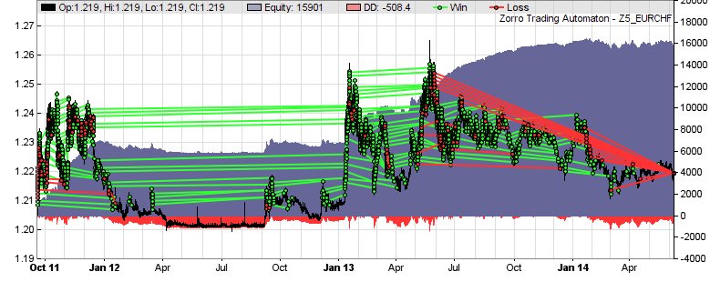
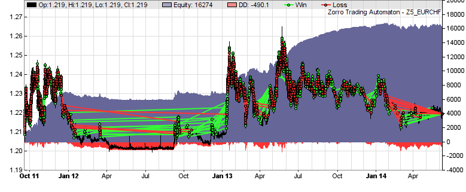

# Hedge modes

# Hedging, Virtual Hedging, FIFO Compliance

Many strategies, such as grid traders or systems with multiple algorithms, often hold opposite positions of the same asset. This would normally violate the NFA and FIFO compliance required by international brokers and cause rejection of orders. Even if orders are accepted, holding long and short positions simultaneously increases risk, margin, and trading costs. It is always preferable to close an open position, rather than opening a new position in opposite direction.  
   
Therefore scripts must take care of NFA and FIFO compliant trading, i.e. close first opened positions first, and avoid concurrent long and short positions. This can require lengthy and awkward coding when several algorithms trade with the same assets. The virtual hedging mechanism of Zorro S guarantees FIFO compliant closing of trades and prevents positions in opposite directions, even with complex portfolio systems. This happens in a completely transparent way; the script needs no special code and can arbitrarily open and close positions.  
  
The virtual hedging mechanism uses two layers of trades, **phantom trades** and **pool trades**. The pool trades hold the net amount of the phantom trades. The strategy script only handles the phantom trades, while the broker only receives orders for the pool trades. Pool trades are opened or closed when phantom trades open or close, but not necessarily in that order. Phantom trades can be open in both directions at the same time, but the resulting pool trades are only open in one direction per asset, either short or long.  
 

<table align="center" border="0"><tbody><tr valign="middle"><td bgcolor="#0000FF" class="Stil2" valign="middle"><p><br>Strategy<br>Script</p></td><td>&nbsp;<br><br>&nbsp;</td><td bgcolor="#0000FF" class="auto-style3"><br>Phantom<br>Trades</td><td class="Stil4"><br><br>&nbsp;</td><td bgcolor="#0000FF" class="auto-style3"><br>Pool<br>Trades</td><td class="Stil4"><br><br>&nbsp;</td><td bgcolor="#0000FF" class="auto-style3"><br>Market<br>Orders</td><td class="Stil4"><br><br>&nbsp;</td><td bgcolor="#0000FF" class="auto-style2"><strong><br>Broker<br>API</strong></td></tr></tbody></table>

Systems with virtual hedging are almost always\* superior to 'real hedging' systems that hold opposite positions. Aside from NFA and FIFO compliance, virtual hedging systems achieve higher profit due to reduced transaction costs, need less capital due to lower margin requirements, and have lower risk because trades are closed earlier and less exposed to the market. Some brokers, such as [Oanda](237_Oanda.md), apply virtual hedging automatically to all trades. For brokers that don't, Zorro can activate virtual hedging with the **Hedge** variable (see below). All trades are then entered in phantom mode. When the net amount - the difference of long and short open lots - changes, Zorro automatically opens or closes pool trades in a way that FIFO order is observed and market exposure is minimized.

Example: several long positions are open with a total amount of 100 lots. Now a short trade of 40 lots is entered. The net amount is now 60 lots (100 long lots minus 40 short lots). Zorro closes the oldest long pool trades fully or partially until the sum of open positions is at 60 lots. If partial closing is not supported, the oldest long pool trades are fully closed until the remaining position is at or below 60 lots. If it's less than 60 lots, a new long pool trade is opened at the difference. In both cases the net amount ends up at exactly 60 lots.

Virtual hedging affects [performance parameters](012_Performance_Report.md). The equity curves of a system with or without virtual hedging are rather similar, but the number of trades, the profit factor, the win rate, and the average trade duration can be very different. Here's an example of the same grid trading system without and with virtual hedging:

  
EUR/CHF grid trader, real hedging, **402** trades, avg duration **14 weeks**, win rate **95%**, profit factor **10**, total profit **$15900**

  
EUR/CHF grid trader, virtual hedging, **261** trades, avg duration **2 weeks**, win rate **65%**, profit factor **3**, total profit **$16300**

\* Exception: Systems that exploit rollover / swap arbitrage or use special order types cannot use virtual hedging.

* * *

## Hedge

Hedging behavior; determines how simultaneous long and short positions with the same asset are handled.

### Range:

<table style="width: 100%"><tbody><tr><td><strong>0&nbsp;</strong></td><td>No hedging; automatically closes opposite positions with the same <a href="asset.htm">asset</a> when a new position is opened (NFA compliant; default for NFA accounts).</td></tr><tr><td><strong>1</strong></td><td>Hedging across algos; automatically closes opposite positions with the same <a href="algo.htm">algo</a> when a new position is opened (not NFA compliant; default for non-NFA accounts).</td></tr><tr><td><strong>2</strong></td><td>Full hedging; long and short positions even with the same <a href="algo.htm">algo</a> can be open at the same time (not NFA compliant). Entering a trade will not automatically close opposite positions.</td></tr><tr><td><strong>4</strong></td><td>Virtual hedging without partial closing (NFA compliant). Long and short positions can be open simultaneously, but only the net position is open in the broker account. Phantom trades immediately trigger the opening or closing of corresponding pool positions.</td></tr><tr><td><strong>5</strong></td><td>Virtual hedging with partial closing and pooling (NFA and FIFO compliant). Phantom trades in the <a href="run.htem">run</a> function are collected and result in a single pool trade. Intrabar phantom trades trigger pool trades immediately. Open pool positions are partially closed to match the net amount.</td></tr><tr><td><strong>6</strong></td><td>Script-synchronized virtual hedging with partial closing and pooling (NFA and FIFO compliant). Like Hedge mode <strong>5</strong>, but pool trades are not automatically snychronized at any bar, but only when the <a href="tradeupdate.htm">tradeUpdate</a> function is called.</td></tr></tbody></table>

### Type:

**int**

### Remarks:

*   Virtual hedging requires [Zorro S](restrictions.md). The [performance report](012_Performance_Report.md) and the [Total](winloss.md) statistics reflect the pool trades, the [Long/Short](winloss.md) statistics reflect the virtual and phantom trades. Only exception is **NumPendingTotal**, which is always the number of pending virtual and phantom trades since pool trades are never pending. 'Real' phantom trades for the purpose of [equity curve trading](018_TradeMode.md) also contribute to the Long/Short statistics, but won't trigger pool trades. Virtual hedging is not used for optimization or training.
*   **Hedge = 5** is preferable to **Hedge = 4** since it opens fewer trades and causes less transaction costs. **Hedge = 4**  is required when partial closing is not supported by the broker or account. This is often not documented, but you can find out with the **[TradeTest](020_Included_Scripts.md)** script. Start a session, set Lots to 10, open a position, then set Lots to 5 and close the position. If this fails, your account does not support partial closing.
*   **Hedge >= 2** enables full hedging and won't automatically close opposite positions. If this is required, do it by script.
*   The number of open net lots of pool and phantom trades can be evaluated with the [LotsPool](winloss.md) and [LotsPhantom](winloss.md) variables. They can temporarily be out of sync when pool trades are externally or manually closed. They will then automatically get in sync again at the next virtual trade with the same asset.
*   Opening pool trades can be prevented by setting [Lots](190_Margin_Risk_Lots.md) = **0**. As long as no phantom trades are opened or closed, pool trades won't then be opened even when [LotsPool](winloss.md) and [LotsPhantom](winloss.md) are different.
*   Pool trades have no profit target and no [TMF](018_TradeMode.md), but - for protection against large price shocks - a very far stop loss at 25% distance to the current price. They are normally only controlled by opening and closing phantom trades.
*   Pool trades appear in [trade enumeration loops](fortrades.md) and can be identified by **[TradeIsPool](018_TradeMode.md)**. When enumerating trades, make sure to separate them from virtual trades (**if(!TradeIsPool)...** )**.**
*   Pool trades that were rejected by the broker will be re-entered at every bar until [LotsPool](winloss.md) and [LotsPhantom](winloss.md) are in sync again. Synchronizing can be enforced with [tradeUpdate](100_tradeUpdate.md).
*   Dependent on open trades, closing a phantom trade can cause closing of several pool trades and/or opening of a new pool trade, especially in **Hedge = 4** mode. A phantom trade can close with a loss and the subsequent pool trade with a win, or vice versa. This is a perfectly normal consequence of virtual hedging and not a bug.
*   In virtual hedging mode, the [result window](004_Trading_Strategies.md) displays only open pool trades and pending phantom trades. When [algo identifiers](095_algo.md) are used, pool trades are displayed either with the identifier of the triggering trade, or with a **"NET"** identifier.
*   Hedging is prohibited for US based accounts due to NFA Compliance Rule 2-43(b). Such accounts normally require the **[NFA](mode.htm#nfa)** flag and either virtual or no hedging. The **NFA** flag does not affect phantom trades, which can be simultaneously open in both directions.

### Example:

```c
if(Live)
  Hedge = 5;  _// virtual hedging in trade mode_
else
  Hedge = 2;  _// full hedging in test mode_
```

### See also:

[NFA](018_TradeMode.md), [enterLong/Short](buylong.md), [LotsPool](winloss.md), [Phantom trades](018_TradeMode.md), [tradeUpdate](100_tradeUpdate.md)

[► latest version online](javascript:window.location.href = 'https://zorro-project.com/manual/en' + window.location.href.slice\(window.location.href.lastIndexOf\('/'\)\))