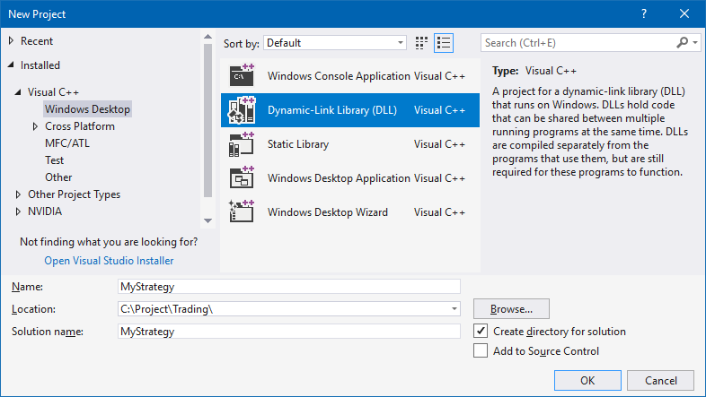
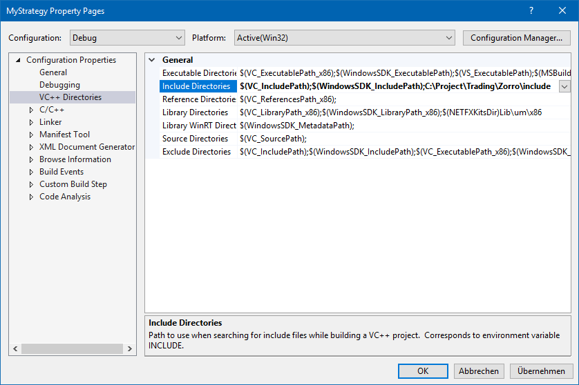
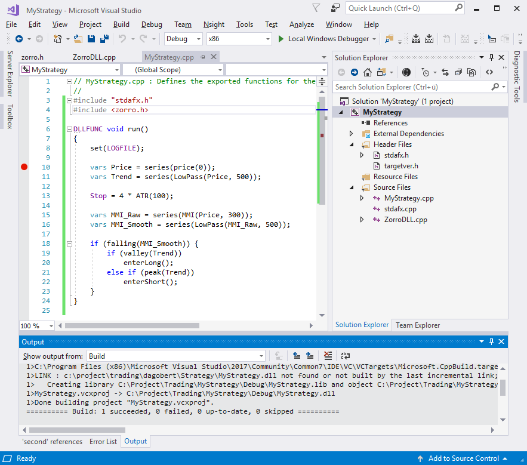

# Visual Studio

# **Developing Algo Trading Systems in C++**

The Zorro platform accepts 4 types of algo trading scripts in the **Strategy** folder: lite-C code (**.c**), C++ code (**.cpp**), lite-C executables (**.x**), and DLLs (**.dll**). The 64-bit version **Zorro64** has no lite-C compiler and thus accepts only **.cpp** and **.dll** scripts. Scripts of supported types appear in the \[Script\] scrollbox and run automatically when the \[Test\], \[Train\], or \[Trade\] button is clicked.

 [Zorro S](restrictions.md) can compile **.x** and **.dll** files from **c.** and **.cpp** sources automatically. For compiling **.cpp** scripts it utilizes the **Visual Studio™** **VC++** compiler. Theoretically other languages can also be implemented, such as C#, Java, Pascal, Delphi, or Basic, as long as they are able to generate a 32- or 64-bit Windows DLL. The included batch and header files in **Source\\VC++** can serve as templates for integrating other languages.

When should you use lite-C and when C++? Most scripts and strategies have a simple structure, and lite-C is absolutely sufficient. But as soon as a script becomes more complex end exceeds 100 lines of code, you might want to switch it to C++. Using C++ as script language has many advantages. Additional development tools, such as the Visual Studio debugger and profiler, are available. External libraries, such as **Boost**, can be integrated without a wrapper. The 64-bit mode has access to the whole PC memory for backtests. All lite-C functions and all system variables can still be used, but additionally you have C++ classes and templates at your disposal. Error handling is more strict and you'll get warnings about bad code style. The VC++ compiler is a bit slower than the lite-C on-the-fly compiler, but is only invoked when the script was changed. The resulting code runs equally fast or - in 64 bit mode - even faster. The only disadvantage is that you have to install the free **Microsoft Visual Studio™** **2022** or above.

The **Visual Studio Debugger** can display local and global variables, can profile code execution, and can step into code without the need of [watch](166_watch.md) statements. Use if when you It is better suited than lite-C for finding hidden bugs or crashes in the code. However for finding bugs or flaws in the trading logic, the [Zorro visual debugger](011_Chart_Viewer_Debugger.md) is still the best way, and works with C and C++ projects as well.

### Getting started with C++

You can get the free **Visual Studio Community Edition** from [https://visualstudio.microsoft.com/de/downloads](https://visualstudio.microsoft.com/de/downloads/). Install it with its C++ desktop applications enviroment. Locate its build path - that's the folder containing the file **vcvars32.bat**, normally **"[C:\\Program Files\\Microsoft Visual Studio\\2022\\Community\\VC\\Auxiliary\\Build](file:///C:/Program%20Files/Microsoft%20Visual%20Studio/2022/Community/VC/Auxiliary/Build)"** - and enter it in [ZorroFix.ini](007_Training.md). This enables Zorro S to directly compile and start C++ scripts, and automatically generate a VC++ project from a script.

You can use C++ also with the free Zorro version. It's a bit more complicated though. For any script you need to set up a DLL project as described below, and use the Visual Studio IDE to compile your .cpp script to a DLL in the Strategy folder. DLLs are supported by the free version. Only for debugging it with Visual Studio, you'll really need Zorro S.  

The VC++ compiler and linker options can be found in **Source\\VC++\\compile.bat** and **compile64.bat**. They are set up for Visual Studio 2022, but should also work for 2017 and 2019. When you know what you're doing, you can edit the batch files and modify the compiler or linker options for enabling special code optimizations or linking additional libraries. If you are unfamiliar with the VC++ command line options, leave the files untouched.

The 32-bit Zorro version compiles 32-bit DLLs, Zorro64 (see [Setup](vps.md)) compiles 64-bit DLLs. When you switch between 32 and 64 bit versions, delete the old **.dll** file and compile it again. Or use different names for 32 bit and 64 bit .cpp scripts. A 64 bit program cannot load a 32 bit DLL, and vice versa.

DLLs can be used not only for developing strategies, but also for extending the lite-C language with external packages (see [using DLLs](litec_api.md)). The code syntax for strategies in C++ is similar to lite-C; the example file **MyStrategy+.cpp** contains C++ versions of some of the included scripts.  

# C++ vs. lite-C: Code differences

Lite-C contains 'abbreviations' to make code shorter and less complex. Most of them work also with 'real' C++. Therefore a **.c** script looks normally almost the same as its **.cpp** equivalent. But the emphasis is on 'almost'. When converting to C++, please mind the differences in the list below. For conversion the other way, see [lite-C for C/C++ programmers](litec_c.md).

<table style="width: 100%"><tbody><tr><td><pre><em>// lite-C strategy (e.g. "test.c")</em>


function run()
{
  vars Prices = series(price());
  vars SMA100 = series(SMA(Prices,100));
  vars SMA30 = series(SMA(Prices,30));

  if(crossOver(SMA30,SMA100))
    enterLong();
  if(<span>crossUnder(SMA30,SMA100)</span>)
    enterShort();
}</pre></td><td><pre><em>// C++ strategy (e.g. "test+.cpp")</em>
#include &lt;zorro.h&gt;

DLLFUNC void run()
{
  vars Prices = series(price(0));
  vars SMA100 = series(SMA(Prices,100));
  vars SMA30 = series(SMA(Prices,30));

  if(crossOver(SMA30,SMA100))
    enterLong();
  if(<span>crossUnder(SMA30,SMA100)</span>)
    enterShort();
}</pre></td></tr></tbody></table>

### Include <zorro.h>

If lite-C scripts have no header, the **<default.c>** header is automatically included. C++ scripts always need the header **<zorro.h>**:
```c
#include <zorro.h> _// C++ header_
...
```

### Exported and void functions

If a function does not return something, it must be defined with the **void** type. This is optional in lite-C, but mandatory in C++. If functions are exported by the DLL - such as **run**, **main**, **objective**, etc - define them with the **DLLFUNC** macro. The **function** keyword is defined as **DLLFUNC void** in C++.
```c
function click() { ... } _// lite-C_
DLLFUNC void click() { ... } _// C++_
```

### No variable initialization

The lite-C compiler initializes all global and local variables and arrays to **0**; a normal C++ compiler does not. This means they have random content at start. So take care to properly initialize all variables when necessary (normally also recommended in lite-C code!):
```c
var MyArray\[10\];  _// lite-C; automatically initialized to zero_
var MyArray\[10\] = { 0,0,0,0,0,0,0,0,0,0 }; _// C++_
```

### Less parameter omitting

Some functions, for instance the date/time and price functions, can be called without parameter in lite-C. The lite-C compiler replaces the missing parameter with 0. Not so in C++. Pass the required parameters.
```c
int CurrentMonth = month();  _// lite-C; missing parameter is assumed zero_
int CurrentMonth = month(0); _// C++_
var Close = priceC();  _// _lite-C__
var Close = priceC(0); _// C++_
```

### Less automatic type conversion

In lite-C, 32-bit integer types or pointers like **char\***, **void\***, **int**, **long**, **DWORD** etc are converted into each other without explicit typecasting. Not so in C++. Use typecast operators, either in C style or (preferably) in C++ style. The **intptr\_t** type converts to a 32-bit word or a 64-bit word depending on the platform:
```c
int Pos = brokerCommand(GET\_POSITION,Asset);  _// lite-C_
int Pos = brokerCommand(GET\_POSITION,(intptr\_t)Asset);  _// C++, C style_
int Pos = brokerCommand(GET\_POSITION,static\_cast<intptr\_t>(Asset))_;  // C++ style_
```

### Early comparison abort

In lite-C, the order of expressions in a comparison does not matter. In C/C++, comparisons with **&&** or **||** are order sensitive. The comparison is aborted when a **&&** is encountered and the expression so far evaluated to **false**, or when a **||** is encountered and the expression evaluated to **true**. This can cause a different behavior when the comparison contains function calls:
```c
if(test(x) && test(y)) .. _// lite-C always calls test(x) and test(y)_
if(test(x) && test(y)) .. _// C++ calls test(y) only when test(x) returns nonzero_
```

### String vs. char\* vs. const char\*

In lite-C, there's no difference between strings, char pointers, and constant char pointers. In C++, **string** is defined as **char\***, and is different to the type **const char\***.
```c
string Name = "Sherlock"; _// lite-C_  
const char\* Name = "Sherlock"; _//_ _C++_
```
If a function expects **const char\*** and you want to pass  a string, use the **(const char\*)** typecast. Vice versa, if you have defined a string constant like **"ABCDEF"** and you want to pass it to a function that expexts a string, use the **(string)** or **(char\*)** typecast.

### Different string comparing

In lite-C, strings can be compared with string constants using the normal comparison operators, such as **\==**, **!=**, or **switch...case**. In the C++ DLL headers, a **string** is typedef'd as a **char\*** pointer, and comparison with a constant would always result in **false**. Either use C++ types like **CString** or **basic\_string** for string handling (but make sure to call lite-C functions always with C-style, null-terminated strings), or use the **str...** functions from the C library.
```c
if(Algo == "TRND") ... _// lite-C_  
if(0 == strcmp(Algo,"TRND")) ... _//_ _C++_
```

### Different bool size

In lite-C, **bool** has a size of 4 bytes, in C++ it's 1 byte. The lite-C **bool** type is equivalent to the C++ **BOOL** type. For avoiding confusion, you might prefer to use **int** instead of **bool / BOOL**.

### Different pointer size

In lite-C a pointer has always a size of 4 bytes. In C++ it can have 4 or 8 bytes, depending on whether you compile with **Zorro** or **Zorro64**. Consider this when coding pointer arithmetics. The predefined variable types **size\_t** and **intptr\_t** also change between 4 and 8 bytes. Make sure to recomplie DLL-based strategies when using a newer or different Zorro version, since the size of global structs may be different. 

### No watch()ed variables

Zorro's single-step debugger can still be used with a DLL, and the [watch](166_watch.md) statement can still set breakpoints or [identify script crashes](210_Troubleshooting.md), but its variables are ignored. Use **printf()** or **print(TO\_WINDOW,...)** instead for printing variables.
```c
watch("My Variable: ",MyVar) _// lite-C_
print(TO\_WINDOW,"\\nMy Variable: %.2f",MyVar) _//_ _C++_
```

### Colliding definitions

Many lite-C variables and flags are pre-defined in **variables.h** and **trading.h**. If you're using a C++ library with a function, variable, or flag that has the same name, undefine the lite-C keyword with an **#undef** statement after including **zorro.h** and before including the headers of your library. Otherwise you'll get compiler errors. 

### Calling external DLL functions

In lite-C, the **API** macro imports functions from a DLL library. In C/C++, use the **LoadLibrary** and **GetProcAddress** standard functions for that:
```c
int \_\_stdcall MyDLLFunction(double a,double b);
API(MyDLL,MyDLLFunction) _// lite-C_
```
```c
int (\_\_stdcall \*MyDLLFunction)(double a,double b);
HMODULE DllHandle = LoadLibrary("MyDLL");  _// C/C++_
if(DllHandle) {
   \*(FARPROC\*)&MyDLLFunction = GetProcAddress(DllHandle,"MyDLLFunction");
   ...
}
...
if(DllHandle) FreeLibrary(DllHandle);
```

### Lite-C libraries

Some lite-C libraries such as **profile.c** or **r.h** contain function bodies, so they can be included in the main strategy code only, but not in multiple source modules.

### Click and evaluate

In lite-C, [click](142_panel.md) and [evaluate](137_evaluate.md) functions could be triggered by button clicks even after the script run, as long as no other script was selected. DLL functions can only be triggered while the script is running.  
 

### Using other languages

You can write strategy DLLs in any language that supports 32-bit or 64-bit dynamic link libraries. In that case you must write new headers and a **ZorroDLL.cpp** version in the new language. Aside from the DLL entry point that is unused, it contains a **zorro()** function that is called upon strategy start, and receives a pointer to the **GLOBALS** struct. The **GLOBALS** struct is defined in **trading.h**. It is a singleton with all predefined variables and functions. Its **Functions** pointer leads to a list of addresses of all Zorro functions in the same order as listed in **functions.h**. The functions must be called with **\_\_cdecl** calling convention.

When importing the **GLOBALS** struct, set up the compiler so that it does not pad the struct with dummy elements for aligning the struct members. If available, use a #pragma or similar statement to set the struct alignment to 4 bytes or below for all structs in the **trading.h** header. This is needed to ensure that the structs have identical size in your DLL and in Zorro. 

# VC++ setup for a DLL project (free Zorro version)

If you own Zorro S, you need not read this chapter, since Zorro S automatically generates a VC++ project file (**\*.vcxproj**) when compilig a C++ script in the Strategy folder. You only need to click on it for invoiking the Visual Studio environment. However with the free version, you need to set up a VC++ project for any C++ script. The dialogs shown below are for Visual C++ 2017, but for later versions like VC++ 2019 and 2022 they are very similar:

*   If you haven't already, download and install Visual Studio with the C++ desktop applications environment. Make yourself familiar with its editor and tools - there are tons of books and courses for Visual Studio.  
      
    
*   Create a new project (**File > New > Project**). Select Visual C++, Windows Desktop, Dynamic-Link Library. In the lines at the bottom of the form, enter the project name and a project folder location, then click Ok..



*    VC++ will now create a folder with a new empty DLL project and several .cpp and .h files. You need none of them. Check the Source Files list in the Solution Explorer and remove all .cpp files, like **dllmain.cpp** and **stdafx.cpp**, from the project (right click > Remove).  
      
    
*   Add two source files: your **.cpp** strategy from  the **Zorro\\Strategy** folder,  and **ZorroDLL.cpp** from **Zorro\\Source\\VC++**  (Source Files > right click > Add> Existing Item). **ZorroDLL.cpp** imports Zorro's function library and variables to the DLL.

*   Now set up the project properties. Right click on the project name in the Solution Explorer and select Properties. First choose the Platform: Win32 or x86 for the normal 32-bit Zorro version, x64 for the 64-bit Zorro. Then set the following properties for all configurations:  
       
    
*   General / Advanced > Character Set. Select Multi-Byte Character Set. This causes Windows functions to expect text strings in 8-bit ANSI, not in 16-bit Unicode.


*   General > Target Name. Enter here the name of the **.cpp** script without extension. For a 64 bit target (compiled with the **x64** option) add '**64**' to the name.  
     
*   General > Output Directory. Enter here your Zorro **Strategy** folder path where the compiled file is supposed to end up.  
     
*   General > VC++ Directories. Add your Zorro **include** folder path to the VC++ Include Directories. It contains **zorro.h** and other headers that your code needs to compile. Make sure to add the folder at the end of the path list - not at the beginning! You don't want to override the standard windows headers with the lite-C headers in that folder.



*   C/C++ > Code Generation. If you want to distribute your strategy DLL to other people, change the Runtime Library of the **Release** configuration from **Multi-threaded DLL (/MD)** to **Multi-threaded (/MT)**. Otherwise people had to install the VC++ Runtime Redistributable for using your strategy.  
     
*    C/C++ >  Floating Point Model. Set it to Strict for catching floating point errors.  
    
*   C/C++ > Precompiled Headers. Trading scripts won't need them, so turn them off.  
     
*   For debugging your script with Visual C++, either run Zorro with the compiled debug version of the DLL and select Attach To Process. Or set up Command, Command Arguments, and Working Directory under Debugging as shown below, then start the debugger directly from Visual Studio. For a 64-bit project, give the path to **Zorro64.exe** under Command. The Working Directory is always the Zorro folder.


*   Now you're all set to debug your strategy with Visual Studio. Always include **<zorro.h>** and put the strategy code in a **DLLFUNC void run()**. The **zorro.h** header has all needed variables and function definitions. Functions to be exported by the DLL, especially user provided functions such as **run**, **tick**, **evaluate** etc, must be preceded with the **DLLFUNC** macro. The calling convention is **\_\_cdecl**. For debugging a system variable, look into the header **variables.h** that contains all system variable definitions and their equivalents in the **g** singleton struct.  
    



*   For writing another strategy DLL, you need not necessarily repeat the whole setup procedure. It's normally more convenient to just duplicate the project folder, and rename the source file and the project name in the **.vcxproj** file, which is a simple text file.  
      
    
*   Mistakes - for instance, a wrong compiler setup - will cause [Error 062](errors.md) when starting the DLL. In that case check your project for a correct setup.  
      
*   If a strategy DLL works on your PC, but produces [Error 062](errors.md) on another PC, the reason is most likely a missing module. Use a tool such as [Dependency Walker](http://www.dependencywalker.com/) for finding out which module is missing on that particular PC. If the DLL needs VC++ runtime libraries, install **vc\_redist.x86.exe** or **vc\_redist.x64.exe**.

If you have a mix of lite-C and C++ scripts, we recommend to add a '+' to a **.cpp** script name for marking it in the scrollbox. Since **.c** overrides **.cpp**, don't use the same name for both variants. The example file **MyStrategy+.cpp** contains C++ versions of workshops and example scripts. Which one to compile can be selected with a #define at the begin. Check it out for learning the differences of writing a strategy in VC++ instead of lite-C. All known code differences are listed below. If you encounter any other incompatility with a function or variable, please report on the user forum or to Zorro support.

A template for a VC++ zorro project by a user is available on [https://github.com/szabonorbert/zorro-project-template](https://github.com/szabonorbert/zorro-project-template).

### See also:

[API access](litec_api.md), [lite-C vs C++](litec_c.md), [migration](021_Conversion_from_other_platforms.md), [engine API](engine.md)

[► latest version online](javascript:window.location.href = 'https://zorro-project.com/manual/en' + window.location.href.slice\(window.location.href.lastIndexOf\('/'\)\))