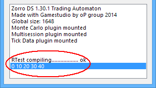

# R Bridge

# R Bridge

The R bridge connects Zorro scripts and algorithmic trading systems to the **R** environment. It allows R computations and access to R packages in your C or C++ based script.

R is an interactive script language for data analysis and charting, developed in 1996 by Ross Ihaka and Robert Gentleman of Oakland University as successor to the S language. The latter was developed by John M. Chambers and his colleagues in the Bell Labs company in 1976. Today, R is still being improved by the R Development Core Team including John Chambers. Although R is an interpreted language and thus slow compared to 'real' programming languages such as C, it has many advantages:

*   It is the global standard for statistical research, data analysis, and machine learning algorithms.
*   It is interactive and easy to use once you're familiar with its command syntax. R functions are short and effective.
*   It is 'Zorro-like' - it has a minimalistic user interface and can be easily automatized for experiments and research tasks.
*   It has ready-to-use extensions - "packages" - for all imaginable mathematical and statistical tasks, including support vector machines, genetic optimization, several kinds of neural networks, and deep learning algorithms. Meanwhile there are more than 4000 R packages.
*   It is continuously developed and supported by the global scientific community. The time between a research publication and its implementation in a R package is usually very short. In average, 15 new R packages come out every day.
*   It is free. As Linus Torvalds said: "Software is like sex - it's better when it's free".

For any imaginable algorithm there's normally already one or several R packages available. This makes R an excellent tool for financial research or analyzing financial time series, using the newest published methods. However, R is not a 'clean' programming language such as C - it is full of traps to the beginner, so using it effectively needs some experience. It's also not suited for trading (although some packages provide rudimentary backtest, optimization, and even broker connection functions!). The solution to this is the **R bridge** that allows including R computations in a Zorro strategy and using their results for trade signals. The lite-C script can start R sessions, send price data or indicator values to it, and call training and predicting functions from R machine learning packages. The bridge uses the **R.dll** by Bernd Kreuss. Its original distribution with source code is contained in the **Zorro\\Source** folder. The code that accesses the DLL is located in the **r.h** header file.

Many problems can be solved in lite-C as well as in R, but R often has already a dedicated command implemented for that. For instance, downloading and converting historical price data from an online source requires about 10 code lines in lite-C ([here](http.md)), but often only a single line in R (**read.csv("http://ichart.finance.yahoo.com/table.csv?...")**).

### Installation and test

*   Install R from [http://cran.r-project.org](http://cran.r-project.org/).  
     
*   Open **[ZorroFix.ini](007_Training.md)** and make sure that the entry **RTermPath** contains the correct path to the R terminal **RTerm.exe**.  
     
*   Start Zorro and select the script **RTest**. Click \[Test\] for running **RTest**. If everything went well, you should see a result in your Zorro window, like this:  
      
             
     
*   For using the R bridge in your scripts, include the **r.h** header at the begin of the **.c** or **.cpp** script. You need the 32 bit Zorro for running it - Zorro64 has no R bridge (yet).

A thorough intro to using R with Zorro can be found on [RobotWealth](https://robotwealth.com/integrating-r-with-the-zorro-backtesting-and-execution-platform/).

# R bridge functions

The **r.h** header defines several functions to directly assign and read data types without the need for manually formatting and executing snippets of R code for these purposes. Not all possible data types are directly supported, the main emphasis is on vectors and matrices containing floating point values. Once you have transferred the bulk of your data as vectors or matrices into the R session, you can execute snippets of R code to combine them or convert them into something more complex if needed.

Normally you want to get huge amounts of numeric data into the R session quickly, but not the other way. The assumption is that you want to feed it with price data on order to crunch numbers, and only need to get back a single value or a vector as a result.

All vector functions have a parameter for the number of elements. Be careful that the array you supply has the correct size, or it will crash the R console. Expressions or code snippets have a maximum size of 1000 characters per command; larger pieces of code must be sent with several commands or - much better - be called as a function in the R environment. See **RTest.c** for example usage.

## Rstart(string Filename, int debuglevel): int

Start a new R session, and load R functions and variables from the file **Filename** in the **Strategy** folder. This must be called in the [INITRUN](013_Asset_Account_Lists.md) before any R computations can be done. Returns **0** when the R session could not be started, otherwise nonzero. The R session will stay alive until the end of the simulation or Zorro session. 

### Parameters:

<table border="0"><tbody><tr><td><strong>Filename</strong></td><td><p>Name of a <strong>.r</strong> file in the <strong>Strategy</strong> folder containing all needed R functions and variables (f.i. <strong>"MySource.r"</strong>), or <strong>""</strong> (default) for not sourcing a file.</p></td></tr><tr><td><strong>debuglevel</strong></td><td><p><strong>0</strong> - only output fatal errors (default)<br><strong>1</strong> - output warnings and notes<br><strong>2</strong> - output every R message<br>The R output goes to the system debug monitor. Use the free <strong>DebugView</strong> tool from Microsoft, or call <strong>Rx(..., 3)</strong> to view R output).</p></td></tr></tbody></table>

## Rrun(): int

Return **1** if the R session is ready for input, **2** if the session is busy with a computation, and **0** if the session is terminated. R will terminate on any fatal error in the code. You should check this regularly. The last command prior to the termination will be found in the debug output. If R is not running anymore, the R bridge won't emit any more messages and will silently ignore all commands.  

## Rx(string code, _int mode_): int

Execute a line of R code. Similar to the **Ri** / **Rd** / **Rv** functions below, as evaluating an expression is also just executing code; the difference is that **Rx()** can send commands asynchronously, allows R and Zorro to do computations in parallel, and prints R output to the Zorro window.  

### Parameters:

<table border="0"><tbody><tr><td><strong>code</strong></td><td>R code line to be executed (1000 characters max).</td></tr><tr><td><strong>mode</strong></td><td><p><strong>0</strong> - synchronous. Wait until the computation was finished (default).<br><strong>1</strong> - asynchronous. Return immediately. <strong>Rrun()</strong> can be used to check when the next R command can be sent.<br><strong>2</strong> - synchronous, using a <a href="sleep.htm">wait</a> loop to react on events during computation. Return <strong>1</strong> when finished, or <a href="quit.htm">quit</a> with returning <strong>0</strong> when the session was aborted due hitting [<span class="tast">Stop</span>] or due to a fatal R error.<br><strong>3</strong> - synchronous using with a <a href="sleep.htm">wait</a> loop as above, but direct R <strong>print</strong> output to the Zorro window. The <strong>debuglevel</strong> must be set accordingly.</p></td></tr></tbody></table>

## Rset(string name, int n)

## Rset(string name, var d)

## Rset(string name, var \*v, int elements)

## Rset(string name, var \*m, int rows, int cols)

## Rset(string name, string s)

Store an int, var, series, matrix, or string in the R variable **name**. Since the target type depends on whether the variable is **int**, **var**, or a pointer, make sure to use the correct type especially when storing constants, and typecast it with **(int)** or **(var)** if in doubt. 

### Parameters:

<table border="0"><tbody><tr><td><strong>name</strong></td><td>Name of the R variable.</td></tr><tr><td><strong>i</strong></td><td><strong>int</strong> value to be assigned to a R integer variable.</td></tr><tr><td><strong>d</strong></td><td><strong>var</strong> value to be assigned to a R floating point variable.</td></tr><tr><td><strong>v</strong></td><td>Pointer of the <strong>var</strong> array or series to be assigned to a R vector.</td></tr><tr><td><strong>m</strong></td><td>Pointer of the <strong>var</strong> array to be assigned to a R matrix, by row order.</td></tr><tr><td><strong>elements</strong></td><td>Length of the vector or series. Make sure to give the exact number of elements.</td></tr><tr><td><strong>rows, cols</strong></td><td>Number of rows and columns of the matrix.</td></tr></tbody></table>

�

## Ri(string expression): int

## Rd(string expression): var

## Rv(string expression, var \*v, int elements)

Evaluate the given R expression, and return the result as an int, double, or vector. The expression can be a single variable, a R function, or any R code that will evaluate to the required variable type.

### Parameters:

<table border="0"><tbody><tr><td><strong>expression</strong></td><td>R expression to be evaluated (1000 characters max).</td></tr><tr><td><strong>v</strong></td><td>Pointer of the <strong>var</strong> array to be filled with the R vector.</td></tr><tr><td><strong>elements</strong></td><td>Number of elements of the vector; must be identical in the R code and in the lite-C script.</td></tr></tbody></table>

### Remarks:

*   Test your R commands and functions carefully on the R console before executing them in a lite-C script. A command error - wrong syntax, a wrong path, a missing R package, or a bad parameter for a R function - will cause the session to abort and all subsequent R commands to fail. You'll normally see the error reason printed in the Zorro window. Use the **Rrun()** function at the end of every bar of a strategy to determine if the session is still running. When live trading, stop the strategy and raise the alarm when **Rrun()** fails.
*   When passing file names to R, use forward slashes for directories, f.i. **"C:/Zorro/Data/Data.csv"**. You can use the **slash** helper function in **r.h** for converting backslashes to forward slashes (f.i. **slash(ZorroFolder)**).
*   For checking the R console output while under lite-C control, print it to a file, f.i. with the **sink** function that prints all subsequent R output to the given file. Example:  
    **Rx("sink(\\"C:/Zorro/Log/RTest.txt\\")");**
*   While the R bridge is busy, Zorro can't react on user actions such as clicking the \[Stop\] button. For avoiding this on long R computations, use **Rx()** with **mode=2**. Alternatively, call **Rx()** with **mode=1** and check **Rrun()** in a [wait()](sleep.md) loop (f.i. **while(Rrun() == 2) wait(100)** ).
*   Make sure to send complete commands. If a R command is incomplete f.i. due to a missing bracket at the end, the R session will freeze and consequently Zorro will also freeze.
*   If you have the choice, perform script-based computations on the lite-C side, as lite-C is up to 200 times faster than R. Loops in R are awfully slow. However R is preferable for vector and matrix operations.
*   R functions usually expect time series in straight order with newest elements last. Use the [rev](127_rev.md) function for reversing the order of a [series](091_series.md).
*   Use \[Train\] mode and [WFO](numwfocycles.md) for training machine learning algorithms, f.i. a SVM or neural network. Send training data to R at the end of every WFO cycle, and store the trained models in files for later use in the \[Test\] or \[Trade\] session. The [advise(NEURAL)](advisor.md) function contains a framework for that.
*   Install all needed R packages before starting the script. Often-used packages for financial computations are caret, zoo, xts, ttr, quantmod, rminer. There are also several popular packages for machine learning. The **e1071** package contains a support vector machine, and the **deepnet** package contains several deep learning network algorithms, such as sparse autoencoders and Boltzman machines. If the package of a called R function is not installed, the R session will abort with an error message.
*   For conveniently working with R, we recommend the free programming environment **RStudio** ([http://www.rstudio.org](http://www.rstudio.org)) that contains a simple debugger.
*   The [R lectures](Lecture%201.md) by Harry Georgakopoulos have been included in this manual. There are also several e-books about R (f.i. [R in a nutshell](http://web.udl.es/Biomath/Bioestadistica/R/Manuals/r_in_a_nutshell.pdf)). Scanning through a R book or tutorial is highly recommended, as it takes a while to get used to the R language. Variables are generated by assignment, and need not be declared. The most common variables are a **numeric** (= var, int, bool), a **vector** (= series, array), a **matrix** (= two-dimensional array), a **data frame** (= array of structs), and a **list** (= arbitrary collection of data). A series element can be accessed by appending **\[n\]** just as in lite-C, but in R the index begins with **1**, not with **0**. List elements are indexed with double brackets **\[\[n\]\]**. Although R also recognizes the '=' assignment operator, R assignments are usually made with '<-' or '->' depending on the assignment direction. Functions can write into global variables with '<<-'. Boolean operators are similar to C, but mind the difference between '&' and '&&': the former operates on all vector elements, the latter only on the first - a common trap for C programmers who write their first R code.
*   An introduction to exchanging data between Zorro and R can be found on [https://robotwealth.com/integrating-r-with-the-zorro-backtesting-and-execution-platform/](https://robotwealth.com/integrating-r-with-the-zorro-backtesting-and-execution-platform/).

### Examples (see also [advise](advisor.md)):

```c
_// do some R calculations_
#include <default.c>  
#include <r.h>

function main()
{
  Rstart("",2); _// enable output_ 
  
  var vecIn\[5\],vecOut\[5\];
  int i;
  for(i=0; i<5; i++) 
    vecIn\[i\] = i;
  
  Rset("rin",vecIn,5); _// set up a vector_
  Rx("rout <- rin \* 10"); _// perform some arithmetics_
  Rx("print(rout)",3); _// print rout to the Zorro window_ 
  Rv("rout",vecOut,5); _// read it back_
   
   if(!Rrun()) 
     printf("Error - R session aborted!");
   else 
    for(i=0; i<5; i++) 
      printf("%.0f ",vecOut\[i\]);
}
```
```c
_// Run a statistics test (ADF)_
function run()
{
  set(PLOTNOW);
  BarPeriod = 1440;
  LookBack = 100;
  if(Init) {
    if(!Rstart())
      return quit("Error - R won't start!");
    Rx("rm(list = ls());"); _// clear the workspace_
    Rx("library(tseries)"); _// load time series library_
  }
  if(is(LOOKBACK)) return;
	
  Rset("Data",rev(seriesC()),LookBack); _// send Close series to R
_  Rx("ADF = adf.test(Data)"); _// Augmented Dickey-Fuller test_
  plot("ADF p-value",Rd("ADF$p.value"),NEW,RED); _//display p-value_
}
```
```c
_// template for computing trade signals in R_
#include <r.h>

int Size = 200; _// number of candles needed by the R algorithm _ 

bool Rcheck()
{
   if(!Rrun())
     return quit("R session aborted!");
   return true;
}

function run()
{
  BarPeriod = 60;
  LookBack = Size;
  asset("EUR/USD");  
  
  if(Init)) {
    Rstart("MySignals.r",1);
_// load all required R objects from a file in the Zorro Data folder_ 
    Rx(strf("load('%sData/MyObjects.bin')",slash(ZorroFolder)));
_// make sure everything loaded ok_
    if(!Rcheck()) return;
  }

_// generate reverse price series (latest price comes last)_
  vars O = rev(seriesO())),
    H = rev(seriesH())),
    L = rev(seriesL())),
    C = rev(seriesC()));
    
  if(!is(LOOKBACK)) {
_// send the last 200 candles to R
_    Rset("Open",O,Size);
    Rset("High",H,Size);
    Rset("Low",L,Size);
    Rset("Close",C,Size);
_// let R compute the signal_    var Signal = Rd("Compute(Open,High,Low,Close)");
    if(!Rcheck()) return; _// Compute() error_
    
    if(Signal > 0 && !NumOpenLong)
      enterLong();
    if(Signal < 0 && !NumOpenShort)
      enterShort();
  }
}
```
```c
_// export historical price data to R_
string name = "Data\\\\Export.csv";

function run()
{
  BarPeriod = 60;
  StartDate = 20140101;

  if(Init) _// write the header_
    file\_write(name,"Date, Open, High, Low, Close",0);
  else
    file\_append(name,strf(
      "\\n%04i-%02i-%02i %02i:%02i, %.5f, %.5f, %.5f, %.5f",
      year(),month(),day(),hour(),minute(),
      priceOpen(),priceHigh(),priceLow(),priceClose()));
}

_/\* in R:
> Data <- read.csv('C:/Projects/Zorro/Data/export.csv') # mind the forward slashes
> plot(Data$Close)
> ...
\*/_
```

### See also:

[Code conversion](021_Conversion_from_other_platforms.md), [DLL interface](litec_api.md), [advise](advisor.md), [R course](Lecture%201.md)

[► latest version online](javascript:window.location.href = 'https://zorro-project.com/manual/en' + window.location.href.slice\(window.location.href.lastIndexOf\('/'\)\))