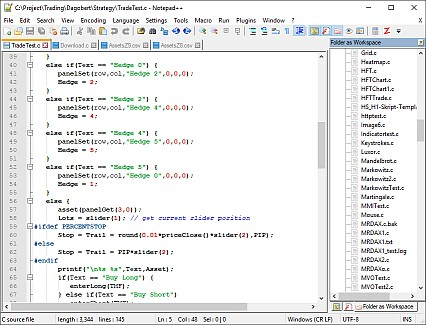

# Script Editor

### Notepad++ script editor

Notepad++ (official website: [https://notepad-plus-plus.org](https://notepad-plus-plus.org)) is an open source text editor by Don Ho, included in the Zorro distribution under the GNU General Public License (Notepad++\\license.txt) as a replacement of the previous SED editor.The source code of Notepad++ is available under the URLs in Notepad++\\readme.txt. The editor configuration and language highlighting have been adapted to Zorro's C functions and keywords. You can change the default editor in [Zorro.ini](007_Training.md).  
  
  
  
  
\- For running the current script with Zorro, hit **F5**, or click the 'Z' icon in the toolbar.  
\- For opening the Zorro manual at the keyword under the cursor, hit **F1**, or right click and select **Help**.  
\- Installing updates from the N++ website will overwrite the editor and language configurations. For restoring them, preserve the following Zorro-specific files and copy them back after the update: **langs.xml; shortcuts.xml; autoCompletion\\c.xml; plugins\\config.\\\*.\***.  
\- For adding Zorro functions and shortcuts to another Npp instance, copy the above files to the Npp folders. The **LanguageHelp** and **CustomizeToolbar** plugins must be installed.  
  
The command reference below was compiled by Andres Gomez Casanova for a prior Notepad++ version; the commands added or modified for Zorro have been marked with \*.  

# File menu

<table width="500" border="1" cellpadding="0" cellspacing="0" class="MsoTableLightShadingAccent1" style="border-collapse:collapse;border:none"><tbody><tr><td width="160" valign="top" style="border-top:solid #4F81BD 1.0pt;
  border-left:none;border-bottom:solid #4F81BD 1.0pt;border-right:none;
  padding:0cm 5.4pt 0cm 5.4pt">
<b>Shortcut�� ↓</b>
</td><td valign="top" style="border-top:solid #4F81BD 1.0pt;
  border-left:none;border-bottom:solid #4F81BD 1.0pt;border-right:none;
  padding:0cm 5.4pt 0cm 5.4pt">
<b>�Action�� ↓</b>
</td></tr><tr><td width="160" valign="top" style="border:none;background:#D3DFEE;
  padding:0cm 5.4pt 0cm 5.4pt">
<b>Ctrl-O</b>
</td><td valign="top" style="border:none;background:#D3DFEE;
  padding:0cm 5.4pt 0cm 5.4pt">
�Open File
</td></tr><tr><td width="160" valign="top" style="border:none;padding:0cm 5.4pt 0cm 5.4pt">
<b>Ctrl-N</b>
</td><td valign="top" style="border:none;padding:0cm 5.4pt 0cm 5.4pt">
�New File
</td></tr><tr><td width="160" valign="top" style="border:none;background:#D3DFEE;
  padding:0cm 5.4pt 0cm 5.4pt">
<b>Ctrl-S</b>
</td><td valign="top" style="border:none;background:#D3DFEE;
  padding:0cm 5.4pt 0cm 5.4pt">
�Save File
</td></tr><tr><td width="160" valign="top" style="border:none;padding:0cm 5.4pt 0cm 5.4pt">
<b>Ctrl-Alt-S</b>
</td><td valign="top" style="border:none;padding:0cm 5.4pt 0cm 5.4pt">
�Save As
</td></tr><tr><td width="160" valign="top" style="border:none;background:#D3DFEE;
  padding:0cm 5.4pt 0cm 5.4pt">
<b>Ctrl-Shift-S</b>
</td><td valign="top" style="border:none;background:#D3DFEE;
  padding:0cm 5.4pt 0cm 5.4pt">
�Save All
</td></tr><tr><td width="160" valign="top" style="border:none;padding:0cm 5.4pt 0cm 5.4pt">
<b>Ctrl-P</b>
</td><td valign="top" style="border:none;padding:0cm 5.4pt 0cm 5.4pt">
�Print
</td></tr><tr><td width="160" valign="top" style="border:none;background:#D3DFEE;
  padding:0cm 5.4pt 0cm 5.4pt">
<b>Alt-F4</b>
</td><td valign="top" style="border:none;background:#D3DFEE;
  padding:0cm 5.4pt 0cm 5.4pt">
�Exit
</td></tr><tr><td width="160" valign="top" style="border:none;padding:0cm 5.4pt 0cm 5.4pt">
<b>Ctrl-Tab</b>
</td><td valign="top" style="border:none;padding:0cm 5.4pt 0cm 5.4pt">
�Next Document (also shows list of open files). Can be disabled - see Settings/Preferences/Global.
</td></tr><tr><td width="160" valign="top" style="border:none;background:#D3DFEE;
  padding:0cm 5.4pt 0cm 5.4pt">
<b>Ctrl-Shift-Tab</b>
</td><td valign="top" style="border:none;background:#D3DFEE;
  padding:0cm 5.4pt 0cm 5.4pt">
�Previous Document (also shows list of open files). Can be disabled - see above.
</td></tr><tr><td width="160" valign="top" style="border:none;padding:0cm 5.4pt 0cm 5.4pt">
<b>Ctrl-Numpadn</b>
</td><td valign="top" style="border:none;padding:0cm 5.4pt 0cm 5.4pt">
�Go to the n-th document on tab bar, n between 1 and 9.
</td></tr><tr><td width="160" valign="top" style="border:none;background:#D3DFEE;
  padding:0cm 5.4pt 0cm 5.4pt">
<b>Ctrl-PgUp</b>
</td><td valign="top" style="border:none;background:#D3DFEE;
  padding:0cm 5.4pt 0cm 5.4pt">
�Next document
</td></tr><tr><td width="160" valign="top" style="border:none;padding:0cm 5.4pt 0cm 5.4pt">
<b>Ctrl-PgDn</b>
</td><td valign="top" style="border:none;padding:0cm 5.4pt 0cm 5.4pt">
�Previous document
</td></tr><tr><td width="160" valign="top" style="border:none;border-bottom:
  solid #4F81BD 1.0pt;background:#D3DFEE;padding:0cm 5.4pt 0cm 5.4pt">
<b>Ctrl-W</b>
</td><td valign="top" style="border:none;border-bottom:
  solid #4F81BD 1.0pt;background:#D3DFEE;padding:0cm 5.4pt 0cm 5.4pt">
�Close Current Document
</td></tr></tbody></table>

# Edit menu

<table width="500" border="1" cellpadding="0" cellspacing="0" class="MsoTableLightShadingAccent2" style="border-collapse:collapse;border:none"><tbody><tr><td width="160" valign="top" style="border-top:solid #C0504D 1.0pt;
  border-left:none;border-bottom:solid #C0504D 1.0pt;border-right:none;
  padding:0cm 5.4pt 0cm 5.4pt">
<b>Shortcut�� ↓</b>
</td><td valign="top" style="border-top:solid #C0504D 1.0pt;
  border-left:none;border-bottom:solid #C0504D 1.0pt;border-right:none;
  padding:0cm 5.4pt 0cm 5.4pt">
<b>�Action�� ↓</b>
</td></tr><tr><td width="160" valign="top" style="border:none;background:#EFD3D2;
  padding:0cm 5.4pt 0cm 5.4pt">
<b>Ctrl-C</b>
</td><td valign="top" style="border:none;background:#EFD3D2;
  padding:0cm 5.4pt 0cm 5.4pt">
�Copy selection, copy current line*
</td></tr><tr><td width="160" valign="top" style="border:none;padding:0cm 5.4pt 0cm 5.4pt">
<b>Ctrl-Insert</b>
</td><td valign="top" style="border:none;padding:0cm 5.4pt 0cm 5.4pt">
�Copy
</td></tr><tr><td width="160" valign="top" style="border:none;background:#EFD3D2;
  padding:0cm 5.4pt 0cm 5.4pt">
<b>Ctrl-Shift-T</b>
</td><td valign="top" style="border:none;background:#EFD3D2;
  padding:0cm 5.4pt 0cm 5.4pt">
�Copy current line
</td></tr><tr><td width="160" valign="top" style="border:none;padding:0cm 5.4pt 0cm 5.4pt">
<b>Ctrl-X</b>
</td><td valign="top" style="border:none;padding:0cm 5.4pt 0cm 5.4pt">
�Cut selection, cut current line*
</td></tr><tr><td width="160" valign="top" style="border:none;background:#EFD3D2;
  padding:0cm 5.4pt 0cm 5.4pt">
<b>Shift-Delete</b>
</td><td valign="top" style="border:none;background:#EFD3D2;
  padding:0cm 5.4pt 0cm 5.4pt">
�Cut
</td></tr><tr><td width="160" valign="top" style="border:none;padding:0cm 5.4pt 0cm 5.4pt">
<b>Ctrl-V</b>
</td><td valign="top" style="border:none;padding:0cm 5.4pt 0cm 5.4pt">
�Paste
</td></tr><tr><td width="160" valign="top" style="border:none;background:#EFD3D2;
  padding:0cm 5.4pt 0cm 5.4pt">
<b>Shift-Insert</b>
</td><td valign="top" style="border:none;background:#EFD3D2;
  padding:0cm 5.4pt 0cm 5.4pt">
�Paste
</td></tr><tr><td width="160" valign="top" style="border:none;padding:0cm 5.4pt 0cm 5.4pt">
<b>Ctrl-Z</b>
</td><td valign="top" style="border:none;padding:0cm 5.4pt 0cm 5.4pt">
�Undo
</td></tr><tr><td width="160" valign="top" style="border:none;background:#EFD3D2;
  padding:0cm 5.4pt 0cm 5.4pt">
<b>Alt-Backspace</b>
</td><td valign="top" style="border:none;background:#EFD3D2;
  padding:0cm 5.4pt 0cm 5.4pt">
�Undo
</td></tr><tr><td width="160" valign="top" style="border:none;padding:0cm 5.4pt 0cm 5.4pt">
<b>Ctrl-Y</b>
</td><td valign="top" style="border:none;padding:0cm 5.4pt 0cm 5.4pt">
�Redo
</td></tr><tr><td width="160" valign="top" style="border:none;background:#EFD3D2;
  padding:0cm 5.4pt 0cm 5.4pt">
<b>Ctrl-A</b>
</td><td valign="top" style="border:none;background:#EFD3D2;
  padding:0cm 5.4pt 0cm 5.4pt">
�Select All
</td></tr><tr><td width="160" valign="top" style="border:none;padding:0cm 5.4pt 0cm 5.4pt">
<b>Alt-Shift-Arrow keys, or Alt + Left mouse click</b>
</td><td valign="top" style="border:none;padding:0cm 5.4pt 0cm 5.4pt">
�Column Mode Select
</td></tr><tr><td width="160" valign="top" style="border:none;background:#EFD3D2;
  padding:0cm 5.4pt 0cm 5.4pt">
<b>Ctrl + Left mouse click</b>
</td><td valign="top" style="border:none;background:#EFD3D2;
  padding:0cm 5.4pt 0cm 5.4pt">
�Start new selected area. Only multiple stream areas ca be selected this way.
</td></tr><tr><td width="160" valign="top" style="border:none;padding:0cm 5.4pt 0cm 5.4pt">
<b>ALT-C</b>
</td><td valign="top" style="border:none;padding:0cm 5.4pt 0cm 5.4pt">
�Column Editor
</td></tr><tr><td width="160" valign="top" style="border:none;background:#EFD3D2;
  padding:0cm 5.4pt 0cm 5.4pt">
<b>Ctrl-D</b>
</td><td valign="top" style="border:none;background:#EFD3D2;
  padding:0cm 5.4pt 0cm 5.4pt">
�Duplicate Current Line
</td></tr><tr><td width="160" valign="top" style="border:none;padding:0cm 5.4pt 0cm 5.4pt">
<b>Ctrl-T</b>
</td><td valign="top" style="border:none;padding:0cm 5.4pt 0cm 5.4pt">
�Switch the current line position with the previous line position
</td></tr><tr><td width="160" valign="top" style="border:none;background:#EFD3D2;
  padding:0cm 5.4pt 0cm 5.4pt">
<b>Ctrl-Shift-Up</b>
</td><td valign="top" style="border:none;background:#EFD3D2;
  padding:0cm 5.4pt 0cm 5.4pt">
�Move Current Line, or current selection if a single stream, Up
</td></tr><tr><td width="160" valign="top" style="border:none;padding:0cm 5.4pt 0cm 5.4pt">
<b>Ctrl-Shift-Down</b>
</td><td valign="top" style="border:none;padding:0cm 5.4pt 0cm 5.4pt">
�Move Current Line, or current selection if a single stream, Down
</td></tr><tr><td width="160" valign="top" style="border:none;background:#EFD3D2;
  padding:0cm 5.4pt 0cm 5.4pt">
<b>Ctrl-L</b>
</td><td valign="top" style="border:none;background:#EFD3D2;
  padding:0cm 5.4pt 0cm 5.4pt">
�Delete Current Line*
</td></tr><tr><td width="160" valign="top" style="border:none;padding:0cm 5.4pt 0cm 5.4pt">
<b>Ctrl-I</b>
</td><td valign="top" style="border:none;padding:0cm 5.4pt 0cm 5.4pt">
�Split Lines
</td></tr><tr><td width="160" valign="top" style="border:none;background:#EFD3D2;
  padding:0cm 5.4pt 0cm 5.4pt">
<b>Ctrl-J</b>
</td><td valign="top" style="border:none;background:#EFD3D2;
  padding:0cm 5.4pt 0cm 5.4pt">
�Join Lines
</td></tr><tr><td width="160" valign="top" style="border:none;padding:0cm 5.4pt 0cm 5.4pt">
<b>Ctrl-G</b>
</td><td valign="top" style="border:none;padding:0cm 5.4pt 0cm 5.4pt">
�Launch GoToLine Dialog
</td></tr><tr><td width="160" valign="top" style="border:none;background:#EFD3D2;
  padding:0cm 5.4pt 0cm 5.4pt">
<b>Ctrl-Q</b>
</td><td valign="top" style="border:none;background:#EFD3D2;
  padding:0cm 5.4pt 0cm 5.4pt">
�Toggle single line comment
</td></tr><tr><td width="160" valign="top" style="border:none;padding:0cm 5.4pt 0cm 5.4pt">
<b>Ctrl-Shift-K</b>
</td><td valign="top" style="border:none;padding:0cm 5.4pt 0cm 5.4pt">
�Single line uncomment
</td></tr><tr><td width="160" valign="top" style="border:none;background:#EFD3D2;
  padding:0cm 5.4pt 0cm 5.4pt">
<b>Ctrl-K</b>
</td><td valign="top" style="border:none;background:#EFD3D2;
  padding:0cm 5.4pt 0cm 5.4pt">
�Single line comment
</td></tr><tr><td width="160" valign="top" style="border:none;padding:0cm 5.4pt 0cm 5.4pt">
<b>Ctrl-Shift-Q</b>
</td><td valign="top" style="border:none;padding:0cm 5.4pt 0cm 5.4pt">
�Block comment
</td></tr><tr><td width="160" valign="top" style="border:none;background:#EFD3D2;
  padding:0cm 5.4pt 0cm 5.4pt">
<b>Tab (selection of one or more full lines)</b>
</td><td valign="top" style="border:none;background:#EFD3D2;
  padding:0cm 5.4pt 0cm 5.4pt">
�Insert Tabulation or Space (Indent)
</td></tr><tr><td width="160" valign="top" style="border:none;padding:0cm 5.4pt 0cm 5.4pt">
<b>Shift-Tab (selection of one or more full lines)</b>
</td><td valign="top" style="border:none;padding:0cm 5.4pt 0cm 5.4pt">
�Remove Tabulation or Space (outdent)
</td></tr><tr><td width="160" valign="top" style="border:none;background:#EFD3D2;
  padding:0cm 5.4pt 0cm 5.4pt">
<b>Ctrl-BackSpace</b>
</td><td valign="top" style="border:none;background:#EFD3D2;
  padding:0cm 5.4pt 0cm 5.4pt">
�Delete to start of word
</td></tr><tr><td width="160" valign="top" style="border:none;padding:0cm 5.4pt 0cm 5.4pt">
<b>Ctrl-Delete</b>
</td><td valign="top" style="border:none;padding:0cm 5.4pt 0cm 5.4pt">
�Delete to end of word
</td></tr><tr><td width="160" valign="top" style="border:none;background:#EFD3D2;
  padding:0cm 5.4pt 0cm 5.4pt">
<b>Ctrl-Shift-BackSpace</b>
</td><td valign="top" style="border:none;background:#EFD3D2;
  padding:0cm 5.4pt 0cm 5.4pt">
�Delete to start of line
</td></tr><tr><td width="160" valign="top" style="border:none;padding:0cm 5.4pt 0cm 5.4pt">
<b>Ctrl-Shift-Delete</b>
</td><td valign="top" style="border:none;padding:0cm 5.4pt 0cm 5.4pt">
�Delete to end of line
</td></tr><tr><td width="160" valign="top" style="border:none;background:#EFD3D2;
  padding:0cm 5.4pt 0cm 5.4pt">
<b>Ctrl-U</b>
</td><td valign="top" style="border:none;background:#EFD3D2;
  padding:0cm 5.4pt 0cm 5.4pt">
�Convert to lower case
</td></tr><tr><td width="160" valign="top" style="border:none;padding:0cm 5.4pt 0cm 5.4pt">
<b>Ctrl-Shift-U</b>
</td><td valign="top" style="border:none;padding:0cm 5.4pt 0cm 5.4pt">
�Convert to UPPER CASE
</td></tr><tr><td width="160" valign="top" style="border:none;background:#EFD3D2;
  padding:0cm 5.4pt 0cm 5.4pt">
<b>Ctrl-B</b>
</td><td valign="top" style="border:none;background:#EFD3D2;
  padding:0cm 5.4pt 0cm 5.4pt">
�Go to matching brace
</td></tr><tr><td width="160" valign="top" style="border:none;padding:0cm 5.4pt 0cm 5.4pt">
<b>Ctrl-Space</b>
</td><td valign="top" style="border:none;padding:0cm 5.4pt 0cm 5.4pt">
�Launch CallTip ListBox
</td></tr><tr><td width="160" valign="top" style="border:none;background:#EFD3D2;
  padding:0cm 5.4pt 0cm 5.4pt">
<b>Ctrl-Shift-Space</b>
</td><td valign="top" style="border:none;background:#EFD3D2;
  padding:0cm 5.4pt 0cm 5.4pt">
�Launch Function Completion ListBox
</td></tr><tr><td width="160" valign="top" style="border:none;padding:0cm 5.4pt 0cm 5.4pt">
<b>Ctrl-Alt-Space</b>
</td><td valign="top" style="border:none;padding:0cm 5.4pt 0cm 5.4pt">
�Launch Path Completion ListBox
</td></tr><tr><td width="160" valign="top" style="border:none;background:#EFD3D2;
  padding:0cm 5.4pt 0cm 5.4pt">
<b>Ctrl-Enter</b>
</td><td valign="top" style="border:none;background:#EFD3D2;
  padding:0cm 5.4pt 0cm 5.4pt">
�Launch Word Completion ListBox
</td></tr><tr><td width="160" valign="top" style="border:none;padding:0cm 5.4pt 0cm 5.4pt">
<b>Ctrl-Alt-R</b>
</td><td valign="top" style="border:none;padding:0cm 5.4pt 0cm 5.4pt">
�Text Direction RTL
</td></tr><tr><td width="160" valign="top" style="border:none;background:#EFD3D2;
  padding:0cm 5.4pt 0cm 5.4pt">
<b>Ctrl-Alt-L</b>
</td><td valign="top" style="border:none;background:#EFD3D2;
  padding:0cm 5.4pt 0cm 5.4pt">
�Text Direction LTR
</td></tr><tr><td width="160" valign="top" style="border:none;padding:0cm 5.4pt 0cm 5.4pt">
<b>Enter</b>
</td><td valign="top" style="border:none;padding:0cm 5.4pt 0cm 5.4pt">
�Split line downwards, or create new line
</td></tr><tr><td width="160" valign="top" style="border:none;background:#EFD3D2;
  padding:0cm 5.4pt 0cm 5.4pt">
<b>Shift-Enter</b>
</td><td valign="top" style="border:none;background:#EFD3D2;
  padding:0cm 5.4pt 0cm 5.4pt">
�Split line downwards, or create new line
</td></tr><tr><td width="160" valign="top" style="border:none;padding:0cm 5.4pt 0cm 5.4pt">
<b>Ctrl-Alt-Enter</b>
</td><td valign="top" style="border:none;padding:0cm 5.4pt 0cm 5.4pt">
�SInsert new unindented line above current
</td></tr><tr><td width="160" valign="top" style="border:none;border-bottom:solid #C0504D 1.0pt;
  background:#EFD3D2;padding:0cm 5.4pt 0cm 5.4pt">
<b>Ctrl-Alt-Shift-Enter</b>
</td><td valign="top" style="border:none;border-bottom:solid #C0504D 1.0pt;
  background:#EFD3D2;padding:0cm 5.4pt 0cm 5.4pt">
�SInsert new unindented line below current
</td></tr></tbody></table>

# Search menu

<table width="500" border="1" cellpadding="0" cellspacing="0" class="MsoTableLightShadingAccent3" style="border-collapse:collapse;border:none"><tbody><tr><td width="160" valign="top" style="border-top:solid #9BBB59 1.0pt;
  border-left:none;border-bottom:solid #9BBB59 1.0pt;border-right:none;
  padding:0cm 5.4pt 0cm 5.4pt">
<b>Shortcut�� ↓</b>
</td><td valign="top" style="border-top:solid #9BBB59 1.0pt;
  border-left:none;border-bottom:solid #9BBB59 1.0pt;border-right:none;
  padding:0cm 5.4pt 0cm 5.4pt">
<b>�Action�� ↓</b>
</td></tr><tr><td width="160" valign="top" style="border:none;background:#E6EED5;
  padding:0cm 5.4pt 0cm 5.4pt">
<b>Ctrl-F</b>
</td><td valign="top" style="border:none;background:#E6EED5;
  padding:0cm 5.4pt 0cm 5.4pt">
�Launch Find Dialog
</td></tr><tr><td width="160" valign="top" style="border:none;padding:0cm 5.4pt 0cm 5.4pt">
<b>Ctrl-H</b>
</td><td valign="top" style="border:none;padding:0cm 5.4pt 0cm 5.4pt">
�Launch Find / Replace Dialog
</td></tr><tr><td width="160" valign="top" style="border:none;background:#E6EED5;
  padding:0cm 5.4pt 0cm 5.4pt">
<b>F3</b>
</td><td valign="top" style="border:none;background:#E6EED5;
  padding:0cm 5.4pt 0cm 5.4pt">
�Find Next
</td></tr><tr><td width="160" valign="top" style="border:none;padding:0cm 5.4pt 0cm 5.4pt">
<b>Shift-F3</b>
</td><td valign="top" style="border:none;padding:0cm 5.4pt 0cm 5.4pt">
�Find Previous
</td></tr><tr><td width="160" valign="top" style="border:none;background:#E6EED5;
  padding:0cm 5.4pt 0cm 5.4pt">
<b>Ctrl-Shift-F</b>
</td><td valign="top" style="border:none;background:#E6EED5;
  padding:0cm 5.4pt 0cm 5.4pt">
�Find in Files
</td></tr><tr><td width="160" valign="top" style="border:none;padding:0cm 5.4pt 0cm 5.4pt">
<b>F7</b>
</td><td valign="top" style="border:none;padding:0cm 5.4pt 0cm 5.4pt">
�Switch to Search results window (was Activate sub view before v5.2)
</td></tr><tr><td width="160" valign="top" style="border:none;background:#E6EED5;
  padding:0cm 5.4pt 0cm 5.4pt">
<b>Ctrl-Alt-F3</b>
</td><td valign="top" style="border:none;background:#E6EED5;
  padding:0cm 5.4pt 0cm 5.4pt">
�Find (volatile) Next
</td></tr><tr><td width="160" valign="top" style="border:none;padding:0cm 5.4pt 0cm 5.4pt">
<b>Ctrl-Alt-Shift-F3</b>
</td><td valign="top" style="border:none;padding:0cm 5.4pt 0cm 5.4pt">
�Find (volatile) Previous
</td></tr><tr><td width="160" valign="top" style="border:none;background:#E6EED5;
  padding:0cm 5.4pt 0cm 5.4pt">
<b>Ctrl-F3</b>
</td><td valign="top" style="border:none;background:#E6EED5;
  padding:0cm 5.4pt 0cm 5.4pt">
�Select and Find Next (was Find (Volatile) Next prior to v5.6.5)
</td></tr><tr><td width="160" valign="top" style="border:none;padding:0cm 5.4pt 0cm 5.4pt">
<b>Ctrl-Shift-F3</b>
</td><td valign="top" style="border:none;padding:0cm 5.4pt 0cm 5.4pt">
�Select and Find Previous (was Find (Volatile) Previous prior to v5.6.5)
</td></tr><tr><td width="160" valign="top" style="border:none;background:#E6EED5;
  padding:0cm 5.4pt 0cm 5.4pt">
<b>F4</b>
</td><td valign="top" style="border:none;background:#E6EED5;
  padding:0cm 5.4pt 0cm 5.4pt">
�Go to next found
</td></tr><tr><td width="160" valign="top" style="border:none;padding:0cm 5.4pt 0cm 5.4pt">
<b>Shift-F4</b>
</td><td valign="top" style="border:none;padding:0cm 5.4pt 0cm 5.4pt">
�Go to previous found
</td></tr><tr><td width="160" valign="top" style="border:none;background:#E6EED5;
  padding:0cm 5.4pt 0cm 5.4pt">
<b>Ctrl-Shift-I</b>
</td><td valign="top" style="border:none;background:#E6EED5;
  padding:0cm 5.4pt 0cm 5.4pt">
�Incremental Search
</td></tr><tr><td width="160" valign="top" style="border:none;padding:0cm 5.4pt 0cm 5.4pt">
<b>Ctrl-n</b>
</td><td valign="top" style="border:none;padding:0cm 5.4pt 0cm 5.4pt">
�Jump Down (to next text marked using n-th stye. n is 1 to 5, or 0 for default Found style.
</td></tr><tr><td width="160" valign="top" style="border:none;background:#E6EED5;
  padding:0cm 5.4pt 0cm 5.4pt">
<b>Ctrl-Shift-n</b>
</td><td valign="top" style="border:none;background:#E6EED5;
  padding:0cm 5.4pt 0cm 5.4pt">
�Jump Up (to next text marked using n-th stye. n is 1 to 5, or 0 for default Found style.
</td></tr><tr><td width="160" valign="top" style="border:none;padding:0cm 5.4pt 0cm 5.4pt">
<b>Ctrl-F2</b>
</td><td valign="top" style="border:none;padding:0cm 5.4pt 0cm 5.4pt">
�Toggle Bookmark
</td></tr><tr><td width="160" valign="top" style="border:none;background:#E6EED5;
  padding:0cm 5.4pt 0cm 5.4pt">
<b>F2</b>
</td><td valign="top" style="border:none;background:#E6EED5;
  padding:0cm 5.4pt 0cm 5.4pt">
�Go To Next Bookmark
</td></tr><tr><td width="160" valign="top" style="border:none;padding:0cm 5.4pt 0cm 5.4pt">
<b>Shift-F2</b>
</td><td valign="top" style="border:none;padding:0cm 5.4pt 0cm 5.4pt">
�Go To Previous Bookmark
</td></tr><tr><td width="160" valign="top" style="border:none;background:#E6EED5;
  padding:0cm 5.4pt 0cm 5.4pt">
<b>Ctrl-B</b>
</td><td valign="top" style="border:none;background:#E6EED5;
  padding:0cm 5.4pt 0cm 5.4pt">
�Go to Matching Brace (caret must be on a brace)
</td></tr><tr><td width="160" valign="top" style="border:none;border-bottom:solid #9BBB59 1.0pt;
  padding:0cm 5.4pt 0cm 5.4pt">
<b>Ctrl-Alt-B</b>
</td><td valign="top" style="border:none;border-bottom:solid #9BBB59 1.0pt;
  padding:0cm 5.4pt 0cm 5.4pt">
�Select All between Matching Braces (caret must be on a brace)
</td></tr></tbody></table>

# View menu

<table width="500" border="1" cellpadding="0" cellspacing="0" class="MsoTableLightShadingAccent4" style="border-collapse:collapse;border:none"><tbody><tr><td width="160" valign="top" style="border-top:solid #8064A2 1.0pt;
  border-left:none;border-bottom:solid #8064A2 1.0pt;border-right:none;
  padding:0cm 5.4pt 0cm 5.4pt">
<b>Shortcut�� ↓</b>
</td><td valign="top" style="border-top:solid #8064A2 1.0pt;
  border-left:none;border-bottom:solid #8064A2 1.0pt;border-right:none;
  padding:0cm 5.4pt 0cm 5.4pt">
<b>�Action�� ↓</b>
</td></tr><tr><td width="160" valign="top" style="border:none;background:#DFD8E8;
  padding:0cm 5.4pt 0cm 5.4pt">
<b>Ctrl-(Keypad-/Keypad+)</b>
</td><td valign="top" style="border:none;background:#DFD8E8;
  padding:0cm 5.4pt 0cm 5.4pt">
�or Ctrl + mouse wheel button (if any) Zoom in (+ or up) and Zoom out (- or down)
</td></tr><tr><td width="160" valign="top" style="border:none;padding:0cm 5.4pt 0cm 5.4pt">
<b>Ctrl-Keypad/</b>
</td><td valign="top" style="border:none;padding:0cm 5.4pt 0cm 5.4pt">
�Restore the original size from zoom
</td></tr><tr><td width="160" valign="top" style="border:none;background:#DFD8E8;
  padding:0cm 5.4pt 0cm 5.4pt">
<b>F11</b>
</td><td valign="top" style="border:none;background:#DFD8E8;
  padding:0cm 5.4pt 0cm 5.4pt">
�Toggle Full Screen Mode
</td></tr><tr><td width="160" valign="top" style="border:none;padding:0cm 5.4pt 0cm 5.4pt">
<b>F12</b>
</td><td valign="top" style="border:none;padding:0cm 5.4pt 0cm 5.4pt">
�Toggle Post-It Mode
</td></tr><tr><td width="160" valign="top" style="border:none;background:#DFD8E8;
  padding:0cm 5.4pt 0cm 5.4pt">
<b>Ctrl-Alt-F</b>
</td><td valign="top" style="border:none;background:#DFD8E8;
  padding:0cm 5.4pt 0cm 5.4pt">
�Collapse the Current Level
</td></tr><tr><td width="160" valign="top" style="border:none;padding:0cm 5.4pt 0cm 5.4pt">
<b>Ctrl-Alt-Shift-F</b>
</td><td valign="top" style="border:none;padding:0cm 5.4pt 0cm 5.4pt">
�Uncollapse the Current Level
</td></tr><tr><td width="160" valign="top" style="border:none;background:#DFD8E8;
  padding:0cm 5.4pt 0cm 5.4pt">
<b>Alt-0</b>
</td><td valign="top" style="border:none;background:#DFD8E8;
  padding:0cm 5.4pt 0cm 5.4pt">
�Fold All
</td></tr><tr><td width="160" valign="top" style="border:none;padding:0cm 5.4pt 0cm 5.4pt">
<b>Alt-(1~8)</b>
</td><td valign="top" style="border:none;padding:0cm 5.4pt 0cm 5.4pt">
�Collapse the Level (1~8)
</td></tr><tr><td width="160" valign="top" style="border:none;background:#DFD8E8;
  padding:0cm 5.4pt 0cm 5.4pt">
<b>Alt-Shift-0</b>
</td><td valign="top" style="border:none;background:#DFD8E8;
  padding:0cm 5.4pt 0cm 5.4pt">
�Unfold All
</td></tr><tr><td width="160" valign="top" style="border:none;border-bottom:solid #8064A2 1.0pt;
  padding:0cm 5.4pt 0cm 5.4pt">
<b>Alt-Shift-(1~8)</b>
</td><td valign="top" style="border:none;border-bottom:solid #8064A2 1.0pt;
  padding:0cm 5.4pt 0cm 5.4pt">
�Uncollapse the Level (1~8)
</td></tr></tbody></table>

# Macro menu

<table width="500" border="1" cellpadding="0" cellspacing="0" class="MsoTableLightShadingAccent5" style="border-collapse:collapse;border:none"><tbody><tr><td width="160" valign="top" style="border-top:solid #4BACC6 1.0pt;
  border-left:none;border-bottom:solid #4BACC6 1.0pt;border-right:none;
  padding:0cm 5.4pt 0cm 5.4pt">
<b>Shortcut�� ↓</b>
</td><td valign="top" style="border-top:solid #4BACC6 1.0pt;
  border-left:none;border-bottom:solid #4BACC6 1.0pt;border-right:none;
  padding:0cm 5.4pt 0cm 5.4pt">
<b>�Action�� ↓</b>
</td></tr><tr><td width="160" valign="top" style="border:none;background:#D2EAF1;
  padding:0cm 5.4pt 0cm 5.4pt">
<b>Ctrl-Shift-R</b>
</td><td valign="top" style="border:none;background:#D2EAF1;
  padding:0cm 5.4pt 0cm 5.4pt">
�Start to record /Stop recording the macro
</td></tr><tr><td width="160" valign="top" style="border:none;padding:0cm 5.4pt 0cm 5.4pt">
<b>Ctrl-Shift-P</b>
</td><td valign="top" style="border:none;padding:0cm 5.4pt 0cm 5.4pt">
�Play recorded macro
</td></tr><tr><td width="160" valign="top" style="border:none;border-bottom:solid #4BACC6 1.0pt;
  background:#D2EAF1;padding:0cm 5.4pt 0cm 5.4pt">
<b>Alt-Shift-S</b>
</td><td valign="top" style="border:none;border-bottom:solid #4BACC6 1.0pt;
  background:#D2EAF1;padding:0cm 5.4pt 0cm 5.4pt">
�Trim Trailing and Save
</td></tr></tbody></table>

# Run menu

<table width="500" border="1" cellpadding="0" cellspacing="0" class="MsoTableLightShadingAccent6" style="border-collapse:collapse;border:none"><tbody><tr><td width="160" valign="top" style="border-top:solid #F79646 1.0pt;
  border-left:none;border-bottom:solid #F79646 1.0pt;border-right:none;
  padding:0cm 5.4pt 0cm 5.4pt">
<b>Shortcut�� ↓</b>
</td><td valign="top" style="border-top:solid #F79646 1.0pt;
  border-left:none;border-bottom:solid #F79646 1.0pt;border-right:none;
  padding:0cm 5.4pt 0cm 5.4pt">
<b>�Action�� ↓</b>
</td></tr><tr><td width="160" valign="top" style="border:none;background:#FDE4D0;
  padding:0cm 5.4pt 0cm 5.4pt">
<b>F5</b>
</td><td valign="top" style="border:none;background:#FDE4D0;
  padding:0cm 5.4pt 0cm 5.4pt">
�Run Script with Zorro*
</td></tr><tr><td width="160" valign="top" style="border:none;padding:0cm 5.4pt 0cm 5.4pt">
<b>Shift-F1</b>
</td><td valign="top" style="border:none;padding:0cm 5.4pt 0cm 5.4pt">
�Open Zorro Help*
</td></tr><tr><td width="160" valign="top" style="border-style: none; border-color: inherit; border-width: medium; background: #FDE4D0; padding: 0cm 5.4pt; height: 19px;">
<b>Alt-F3</b>
</td><td valign="top" style="border-style: none; border-color: inherit; border-width: medium; background: #FDE4D0; padding: 0cm 5.4pt; height: 19px;">
�Wikipedia search
</td></tr><tr><td width="160" valign="top" style="border:none;border-bottom:solid #F79646 1.0pt;padding:0cm 5.4pt 0cm 5.4pt">
<b>Alt-F6</b>
</td><td valign="top" style="border:none;border-bottom:solid #F79646 1.0pt;padding:0cm 5.4pt 0cm 5.4pt">
�Open file in another instance
</td></tr></tbody></table>

# ? menu

<table width="500" border="1" cellpadding="0" cellspacing="0" class="MsoTableLightShadingAccent1" style="border-collapse:collapse;border:none"><tbody><tr><td width="160" valign="top" style="border-top:solid #4F81BD 1.0pt;
  border-left:none;border-bottom:solid #4F81BD 1.0pt;border-right:none;
  padding:0cm 5.4pt 0cm 5.4pt">
<b>Shortcut�� ↓</b>
</td><td valign="top" style="border-top:solid #4F81BD 1.0pt;
  border-left:none;border-bottom:solid #4F81BD 1.0pt;border-right:none;
  padding:0cm 5.4pt 0cm 5.4pt">
<b>�Action�� ↓</b>
</td></tr><tr><td width="160" valign="top" style="border:none;background:#D3DFEE;
  padding:0cm 5.4pt 0cm 5.4pt">
<b>Ctrl-F1</b>
</td><td valign="top" style="border:none;background:#D3DFEE;
  padding:0cm 5.4pt 0cm 5.4pt">
�About
</td></tr><tr><td width="160" valign="top" style="border:none;
  padding:0cm 5.4pt 0cm 5.4pt">
<b>Shift+F1</b>
</td><td valign="top" style="border:none;  padding:0cm 5.4pt 0cm 5.4pt">
�Open Zorro Help*
</td></tr><tr><td width="160" valign="top" style="border:none;border-bottom:solid #4F81BD 1.0pt;background:#D3DFEE;
  padding:0cm 5.4pt 0cm 5.4pt">
<b>F1</b>
</td><td valign="top" style="border:none;border-bottom:solid #4F81BD 1.0pt;background:#D3DFEE;
  padding:0cm 5.4pt 0cm 5.4pt">
�Open Zorro Help at Keyword under Cursor*
</td></tr></tbody></table>

# Incremental search widget

<table width="500" border="1" cellpadding="0" cellspacing="0" class="MsoTableLightShadingAccent2" style="border-collapse:collapse;border:none"><tbody><tr><td width="160" valign="top" style="border-top:solid #C0504D 1.0pt;
  border-left:none;border-bottom:solid #C0504D 1.0pt;border-right:none;
  padding:0cm 5.4pt 0cm 5.4pt">
<b>Shortcut�� ↓</b>
</td><td valign="top" style="border-top:solid #C0504D 1.0pt;
  border-left:none;border-bottom:solid #C0504D 1.0pt;border-right:none;
  padding:0cm 5.4pt 0cm 5.4pt">
<b>�Action�� ↓</b>
</td></tr><tr><td width="160" valign="top" style="border:none;background:#EFD3D2;
  padding:0cm 5.4pt 0cm 5.4pt">
<b>Enter</b>
</td><td valign="top" style="border:none;background:#EFD3D2;
  padding:0cm 5.4pt 0cm 5.4pt">
�Next match (same as &gt; button)
</td></tr><tr><td width="160" valign="top" style="border:none;border-bottom:solid #C0504D 1.0pt;
  padding:0cm 5.4pt 0cm 5.4pt">
<b>Shift+Enter</b>
</td><td valign="top" style="border:none;border-bottom:solid #C0504D 1.0pt;
  padding:0cm 5.4pt 0cm 5.4pt">
�Previous match (same as &lt; button)
</td></tr></tbody></table>

# Mouse gestures

<table width="500" border="1" cellpadding="0" cellspacing="0" class="MsoTableLightShadingAccent3" style="border-collapse:collapse;border:none"><tbody><tr><td width="160" valign="top" style="border-top:solid #9BBB59 1.0pt;
  border-left:none;border-bottom:solid #9BBB59 1.0pt;border-right:none;
  padding:0cm 5.4pt 0cm 5.4pt">
<b>Shortcut�� ↓</b>
</td><td valign="top" style="border-top:solid #9BBB59 1.0pt;
  border-left:none;border-bottom:solid #9BBB59 1.0pt;border-right:none;
  padding:0cm 5.4pt 0cm 5.4pt">
<b>�Action�� ↓</b>
</td></tr><tr><td width="160" valign="top" style="border:none;background:#E6EED5;
  padding:0cm 5.4pt 0cm 5.4pt">
<b>Single left click</b>
</td><td valign="top" style="border:none;background:#E6EED5;
  padding:0cm 5.4pt 0cm 5.4pt">
�Set current line
</td></tr><tr><td width="160" valign="top" style="border:none;padding:0cm 5.4pt 0cm 5.4pt">
<b>Single left click on rightmost status bar pane</b>
</td><td valign="top" style="border:none;padding:0cm 5.4pt 0cm 5.4pt">
�Toggle typing mode between Insert and Overtype
</td></tr><tr><td width="160" valign="top" style="border:none;background:#E6EED5;
  padding:0cm 5.4pt 0cm 5.4pt">
<b>Single left click on bookmark margin</b>
</td><td valign="top" style="border:none;background:#E6EED5;
  padding:0cm 5.4pt 0cm 5.4pt">
�Toggle bookmark
</td></tr><tr><td width="160" valign="top" style="border:none;padding:0cm 5.4pt 0cm 5.4pt">
<b>Shift+left click on fold point</b>
</td><td valign="top" style="border:none;padding:0cm 5.4pt 0cm 5.4pt">
�Uncollapse this fold and all those below
</td></tr><tr><td width="160" valign="top" style="border:none;background:#E6EED5;
  padding:0cm 5.4pt 0cm 5.4pt">
<b>Ctrl+left click on fold point</b>
</td><td valign="top" style="border:none;background:#E6EED5;
  padding:0cm 5.4pt 0cm 5.4pt">
�Toggle collapsed state of this fold, and propagate below
</td></tr><tr><td width="160" valign="top" style="border:none;padding:0cm 5.4pt 0cm 5.4pt">
<b>Right click</b>
</td><td valign="top" style="border:none;padding:0cm 5.4pt 0cm 5.4pt">
�Pop up context menu
</td></tr><tr><td width="160" valign="top" style="border:none;background:#E6EED5;
  padding:0cm 5.4pt 0cm 5.4pt">
<b>Double left click</b>
</td><td valign="top" style="border:none;background:#E6EED5;
  padding:0cm 5.4pt 0cm 5.4pt">
�Select word
</td></tr><tr><td width="160" valign="top" style="border:none;padding:0cm 5.4pt 0cm 5.4pt">
<b>Double left click on location pane (status bar)</b>
</td><td valign="top" style="border:none;padding:0cm 5.4pt 0cm 5.4pt">
�Go to line
</td></tr><tr><td width="160" valign="top" style="border:none;border-bottom:solid #9BBB59 1.0pt;
  background:#E6EED5;padding:0cm 5.4pt 0cm 5.4pt">
<b>Triple left click</b>
</td><td valign="top" style="border:none;border-bottom:solid #9BBB59 1.0pt;
  background:#E6EED5;padding:0cm 5.4pt 0cm 5.4pt">
�Select line
</td></tr></tbody></table>