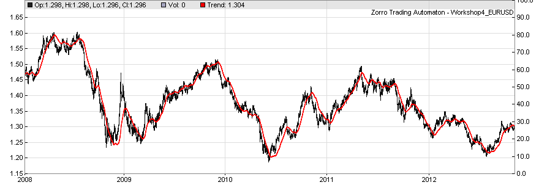
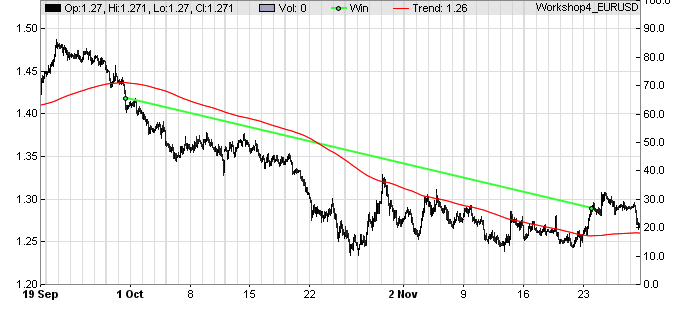
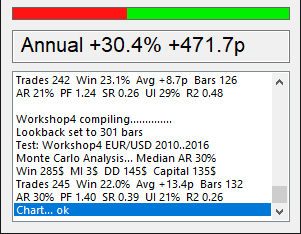
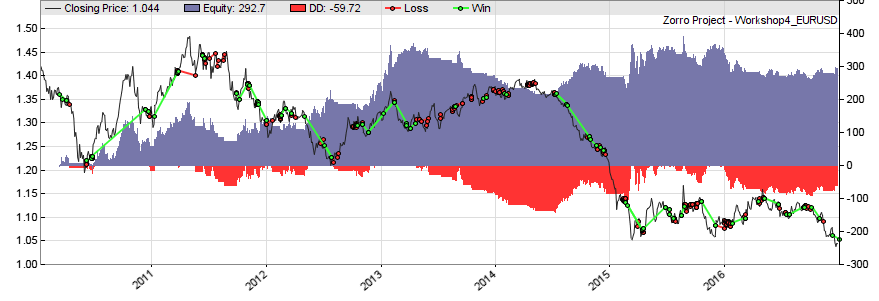
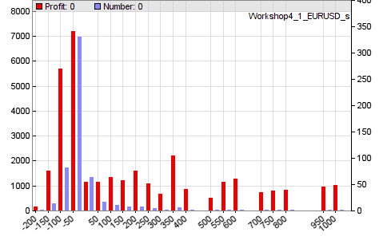

# W4 - Trend Trading

[Previous: Script basics](tutorial_var.md)

# Algo Trading Workshop 4: Trend Trading, Time Series.

Prediction is difficult. Especially about the future.  
\- Niels Bohr

The point of trading is knowing the moment when it's good to buy, good to sell, or good to do nothing. A [trading strategy](031_Strategy_Coding_1_8.md) uses market inefficiencies - deviations of the price curves from random data - for predicting future prices and finding the right buying and selling points. That will be the topic of the next workshops.

► All strategies presented here are meant for educational purposes. They all are designed for simplicity, not for maximum profit or robustness. For really trading such a strategy, you would normally use more entry filter rules, a more complex trade exit method than a simple stop, and a way to allocate capital. But we'll keep it easy in the workshops.

► The backtest results included here can be different to the results you'll get when testing the scripts yourself. That's because you're likely using a more recent simulation time period, and different spread, commission, and rollover parameters which are updated when connecting to a broker. If not otherwise mentioned, the included scripts are set to a simulation period from **2010-2017**; for a different time period modify the **StartDate** and **EndDate** lines in the script.

► A much more comprehensive trading course, with different strategies, can be found in the [Black Book](links.htm#black).

### Trend following

The most obvious way to make profits is going with the trend. An example (**Workshop4**):

```c
function run()
{
  set(LOGFILE,PLOTNOW); // log all trades
  StartDate = 2012; // fixed simulation period
  EndDate = 2017; // tailored for this strategy
  LookBack = 300; // needed for MMI
  
  vars Prices = series(price(0));
  vars Trends = series(LowPass(Prices,500));
 
  Stop = 4\*ATR(100);

  vars MMI\_Raws = series(MMI(Prices,300));
  vars MMI\_Smooths = series(LowPass(MMI\_Raws,300));
  
  if(falling(MMI\_Smooths)) {
    if(valley(Trends))
      enterLong();
    else if(peak(Trends))
      enterShort();
  }
}
```

(If you're not yet familiar with scripts, start with [Workshop 1](tutorial_var.md).) We can see that the function is now named "**run**" and not "**main"**. While a **main** function runs only once, a **[run](088_run.md)** function is called after every [bar](005_Bars_and_Candles.md) with the period selected with the scrollbars. By default, the bar period is 60 minutes. So this function runs once per hour when Zorro is trading.

The **vars** definition creates a **[series](091_series.md)** - a **var** 'with a history'. We define a price series and a trend series with the return value from the **[LowPass](filters.md)** function, a second order lowpass filter. We will implement this filter as an exercise of indicator development in the next workshop. But for the moment you need only to keep in mind that this lowpass filter attenuates all the wiggles and jaggies of the **Price** series that are shorter than 4 weeks, but it does not affect the trend or long term cycles. You can see the frequency characteristic of the **LowPass** filter in the image on the [Filter](filter.htm#image) page.

Use a **series** (of type **vars**) when you also need the history of the variable, such as the value from 3 bars before. Know when you need a series and when a variable will do - confusing series and variables is one of the most frequent mistake in beginner's scripts.

In the image below, the black line is the original EUR/USD price and the red line is the result from the **LowPass** function:



A lowpass filter has a similar smoothing effect as a Moving Average function (see [Indicators](ta.md)), but produces a better reproduction of the price curve and has less lag. This means the return value of a lowpass filter function isn't as delayed as the return values of Simple Moving Average or EMA functions that are normally used for trend trading. The script can react faster on price changes, and thus generate better profit.

We're setting a dynamic stop loss (**Stop**) that adapts to the market situation, and a filter for detecting if the market is trending or not. The Market Meanness Index (**MMI**) evaluates the self-correlation of the data and indicates its 'trendiness'. Its algorithm and usage can be found in the Black Book. The code calculates the MMI for the last 300 bars and smoothes it again with the **LowPass** filter.

Trades are entered at a trend **peak** or **valley** when the smoothed MMI is **falling**, indicating the begin of a trend. If a trade was already open in the opposite direction, it is automatically closed. 

An example trade triggered by this strategy:



The red line in the chart above is the **Trends** series. You can see that it has a peak at the end of September, so the **peak(Trends)** function returned **true** and **enterShort** was called. The tiny green dot is the moment where the short trade was entered. The **Trends** series continues down all the way until November 23, when a valley was reached. A long trade (not shown in this chart) was then entered and the short trade was automatically closed. The green line connects the entry and exit points of the trade. It was open almost 2 months, and made a profit of ~ 13 cents per unit, or 1300 pips.

### Backtesting

Now let's just test how buying and selling works in that strategy. Start up Zorro, select the \[Workshop4\] script and the \[EUR/USD\] asset, leave the \[Period\] slider at **60** minutes, then click \[Test\]:



You'll likely get a different result when testing this strategy in a different time period or when your simulated account has different spread, rollover costs, commission, or slippage. By default, the simulation runs from 2012 until 2017. The strategy achieved an annual profit of ~400 pips, equivalent to about 30% annual return on capital. The average monthly income is 3 $ - quite modest, but Zorro simulated a microlot account and needed only ~100 $ capital for running the strategy. So you have about 3% return on capital per month. By the way, the '$' sign in Zorro's messages does not necessarily mean US-Dollars, it represents the account currency.

The equity curve can be seen by clicking \[Result\]:

  
In the image that pops up in the chart viewer, you can see a black curve and some green lines and red dots attached to the curve. In the background there's a jaggy blue area and a red area below. The black curve is the price of the selected asset - the **EUR/USD**. The price scale is on the left side of the chart. The green and red dots are winning and losing trades. The green lines connect the entry and exit point of a winning trade. You can see that there are far more red than green dots - about 80% of the trades are lost. However, the long-term trades all have green lines. So we have a lot of small losses, but several large wins. This is typical of a trend following strategy.

The most interesting part of the chart is the blue area that represents the equity curve. We can see that it's slightly below zero in the first years, then rises to about 300 $ in 2016. The red area below is it's evil counterpart, the "underwater equity" or drawdown curve that indicates losses on our account. The more blue and the less red, the better is the strategy. This one gives a mixed result. There are a few winning years, in the other years we had a loss or a tie. This shaky behavior is reflected in the low Sharpe Ratio and the high Ulcer Index (**UI**) of the strategy.

### Analyzing the trades

Since we want to check the single trades of this strategy in detail, we have set the **LOGFILE** **flag**. Such flags are turned on with the **set()** function. If the flag is activated, \[Test\] stores a log of all events in the **Log** subfolder. The log is also opened with the script editor on clicking \[Result\]. It begins with a list similar to this one:

```c
BackTest: Workshop4 EUR/USD 2008..2013
 
\[139: Thu 10.01. 07:00\]  1.46810
\[140: Thu 10.01. 08:00\]  1.46852
\[141: Thu 10.01. 09:00\]  1.46736
\[142: Thu 10.01. 10:00\]  1.46721
\[EUR/USD::S4300\] Short 1@1.4676 Risk 6 at 10:00
 
\[143: Thu 10.01. 11:00\]  0p 0/1
\[EUR/USD::S4300\] Reverse 1@1.4694: -1.52 at 11:00
\[EUR/USD::L4400\] Long 1@1.4694 Risk 6 at 11:00
 
\[144: Thu 10.01. 12:00\]  -20p 0/2
\[145: Thu 10.01. 13:00\]  -20p 0/2
\[146: Thu 10.01. 14:00\]  -20p 0/2
\[EUR/USD::L4400\] Reverse 1@1.4649: -3.54 at 14:00
\[EUR/USD::S4700\] Short 1@1.4649 Risk 6 at 14:00
 
\[147: Thu 10.01. 15:00\]  -67p 0/3
\[EUR/USD::S4700\] Stop 1@1.4729: -6.22 at 15:00
 
\[148: Thu 10.01. 16:00\]  -148p 0/3
\[EUR/USD::L4900\] Long 1@1.4744 Risk 6 at 16:00
```

The meaning of the cryptic messages is explained in the [Log](010_Log_Messages.md) chapter. Checking the log is the first (or maybe, second) thing to do when testing a strategy, for determining if it trades correctly. You can see in the log that most trades are lost. Zorro seems to deliberately enter trades in the wrong direction; trading at random would only lose a little more than 50%, not 80%. But there's a method behind this madness. The algorithm wants to be in a favorable position when a long-term trend begins, and then keeps the position for a long time. That's why it wins in the long run despite losing most trades.

Aside from the log, \[Result\] also opens the performance report. The displayed parameters are described on the [Performance](012_Performance_Report.md) page.

### The trade distribution

For some more insight into the distribution of trades, we're plottoing the trade distribution. For this add the following line to the very begin of the script (before the **run** function):

**#include <profile.c>**

This is a command to the compiler to insert another script file from the **include** folder. **profile.c** is a script that contains functions for plotting price and trade statistics and seasonal analysis charts. For the trade distribution, call the following function from inside the **run** function:

**plotTradeProfile(-50);**

This generates a trade distribution chart in steps of 50 pips at the end of the test run. The generated chart looks similar to this one:



For generating the chart, all trades are sorted into buckets, depending on their profit. Every bucket is represented by a red and a blue bar. Trades with a loss between -200..-100 pips go into the first bucket at the left side, marked **\-200** at the x axis. The next buckets are for trades with loss or profit from -200..-150 pips, -150..-100 pips, -100..-50 pips, and so on. The height of the blue bar is the number of trades ending up in that bucket (right y axis), the height of the red bar is the sum of all profits in the bucket (left y axis). We can see that most trades end with a loss between 0 and -50 pips. The total profit of the system comes from relatively few profitable trades, some even with about 1000 pips profit.

Aside from a lowpass filter, several other filter algorithms are often used for detecting trend changes. You can find a comparison of trend filters in the [Trend Indicators](http://www.financial-hacker.com/trend-delusion-or-reality/) article series on **Financial Hacker**.

### What have we learned in this workshop?

*   A strategy script contains a **run** function that is called once per bar.
*   A **series** is a variable with a history.
*   A **lowpass filter** removes the jaggies from a price curve without much lag penalty. It is superior to traditional moving averages.
*   A **stop loss** limits the trade risk.
*   **Filtering** trades improves the strategy performance.
*   The **valley** and **peak** functions can be used to buy or sell at the turning points of a curve.
*   Use the **LOGFILE** switch for checking the strategy behavior in detail.
*   The **#include** statement includes another script.
*   The **plotTradeProfile** function gives insight into the trade profit distribution.

[Next: Lowpass filter implementation](tutorial_lowpass.md)

* * *

### Further reading: ► [series](091_series.md), [price](022_Price_History.md), [filters](129_filter_renorm.md), [stop](188_Stop_Profit_Trail_Entry.md), [buy](buylong.md), [sell](selllong.md), [plot](146_plot_plotBar.md), [performance](012_Performance_Report.md), [LOGFILE](018_TradeMode.md), [#include](020_Included_Scripts.md), [profile](147_plotProfile.md)

### Trading essentials: ► [Bars](005_Bars_and_Candles.md), [Strategies](031_Strategy_Coding_1_8.md)