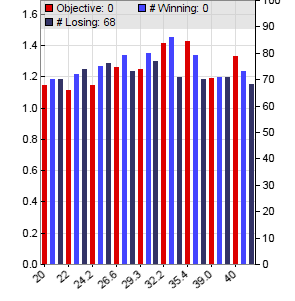
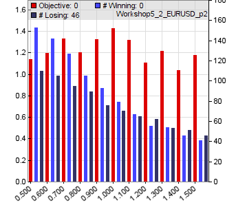
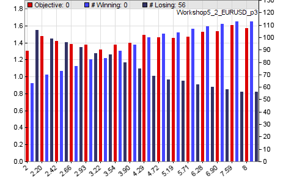
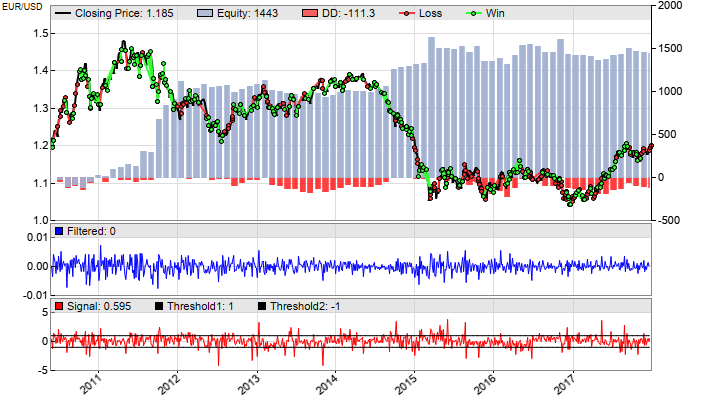

# W5 - Optimizing, WFO

[Previous: Trend Trading](tutorial_trade.md)

# Workshop 5: Counter-Trend Trading, Walk Forward Optimization.

This is an example of a counter trend trading script (**Workshop5**):

```c
function run()
{
  BarPeriod = 240;  _// 4 hour bars_
  StartDate = 2007;
  EndDate = 2017;   _// fixed simulation period
_  LookBack = 500;   _// maximum indicator time period_
  set(PARAMETERS);  _// generate and use optimized parameters_
  NumWFOCycles = 15;
  if(ReTrain) {
    UpdateDays = -1; 
    SelectWFO = -1; 
  }
 
_// calculate the buy/sell signal with optimized parameters_
  vars Prices = series(price(0));
  vars Filtereds = series(BandPass(Prices,optimize(30,20,40),0.5));
  vars Signals = series(FisherN(Filtereds,500));
  var Threshold = optimize(1,0.5,1.5,0.1);
 
_// buy and sell_
  Stop = optimize(4,2,10) \* ATR(100);
  Trail = 4\*ATR(100);
 
  if(crossUnder(Signals,-Threshold))
    enterLong(); 
  else if(crossOver(Signals,Threshold))
    enterShort();
 
_// plot signals and thresholds_
  plot("Filtered",Filtereds,NEW,BLUE);
  plot("Signal",Signals,NEW,RED);
  plot("Threshold1",Threshold,0,BLACK);
  plot("Threshold2",-Threshold,0,BLACK);
  PlotWidth = 600;
  PlotHeight1 = 300;
}
```

In this strategy, a bandpass filter with an optimized center period is fed with the price curve. The result is a clean curve that consists mostly of the medium-period peaks and valleys. It is normalized and Fisher transformed, and the resulting **Signals** series is finally compared with an upper and lower **Threshold** for generating trade signals. This trading method with frequency filters and transformations is superior to conventional indicators. It is explained in detail in the **Black Book**, and in even greater detail in the books by **John Ehlers** from the [book list](247_Links_Books.md).

The threshold is optimized between **0.5** and **1.5** in steps of **0.1**. Any **Signal** value that exceeds the threshold range triggers a trade. Before that, a stop loss is placed at an adaptive distance from the price, and a trail limit 4 average candles away from the current price. If the trade now goes in favorable direction by more than 4 average candles, the stop loss will follow the price at a distance of 8 candles. This ensures that all trades that reach an 8 candle profit are guaranteed to end with a win, regardless how the price further behaves. 

When the **Signals** curve crosses the negative threshold from above, the script assumes that the price is close to a bottom, and buys long. Short buying works the other way around. 

### Training with Walk Forward Optimization

Training serves two purposes. At first, it improves the 'robustness' of a strategy. During the training run, strategy parameters are optimized and adapted to the market until the strategy returns stable profits with minimum deviation. The second purpose is finding out how sensitive the system is to small parameter changes. The more sensitive, the less likely is it that backtest results are reproduced in live trading.

Walk-Forward Optimization ([WFO](numwfocycles.md)) is not merely an optimization, but an analysis method that tests the strategy together with its parameter ranges and optimization method. If a strategy fails in a walk forward analysis, it will also fail in real trading, even if it collected huge profits in backtests. For this reason, walk forward optimization is the most important process when developing a strategy.

WFO is activated by setting **NumWFOCycles**. It uses a data frame that is shifted in 10 cycles over the simulation period. The frame consists of a training period and a subsequent test as in the figure [here](numwfocycles.md). The lookback periods at the begin are needed to collect initial data for the functions. The training periods generate the parameters that are then tested in the subsequent test periods. This ensures that every test uses "unseen" price data that were not used for optimizing its parameters - just as in real trading. The data frame is then shifted over the simulation period for verifiying how the strategy would fare when started at different times. Because the test period is now much smaller than the whole simulation period, a far back**StartDate = 2005** is used. This way enough data can be collected for getting a test period from 2010 to 2015.

For training the strategy, click \[Train\] and observe what the **optimize** calls do. It now takes a few minutes because the simulation period is about 10 years, and a full optimization is performed for any of the 10 cycles. The optimized parameters are stored in a separate parameter file for every WFO cycle. After the training phase, which can take about one minute depending on the PC speed, you'll see charts pop up in your Internet browser, like this:

<table border="0"><tbody><tr><td></td></tr><tr><td><div align="center">Parameter 1 (bandpass time period)<br>&nbsp;</div></td></tr><tr><td></td></tr><tr><td><div align="center">Parameter 2 (Threshold)<br>&nbsp;</div></td></tr><tr><td></td></tr><tr><td><div align="center">Parameter 3 (Stop factor)</div></td></tr></tbody></table>

The parameter charts show how the parameter values affect the performance of the strategy. The red bars are the **return ratio** of the training period - that's basically the total win divided by the total loss, multiplied by a penalty factor for less trades. The dark blue bars are the number of losing trades and the light blue bars are the number of winning trades. We can see that the time period produces slightly increasing returns up to about **35**, then the returns go down. **Threshold** has the best performance at about **1.0**. The stop factor - the third parameter - slightly goes up and has a maximum at about 7. We can also see here that a distant stop, although it increases the risk and eventually reduces the profit, achieves a higher number of profitable trades and thus a better 'accuracy' of the strategy.

All red bars ending above **1.0** indicate a profitable parameter combination. In this case they stay above 1.0 over the whole range, which means that the strategy performance is quite robust and not very sensitive to parameter changes. The optimized parameters are stored in the file **Data/Workshop5\_EURUSD.par** (the file name would be different for other assets).

After training, click \[Test\]. The data from the training is now used for a walk forward analysis. This is the equity curve:



We can see that the strategy still stays profitable with walk forward analysis, but the equity curve does not look smooth and the return in some years was negative. In the next workshop we'll learn how to make strategy returns more steady and reliable so that one can really derive a regular income from them.

### Real time optimizing a WFO strategy

When trading a walk forward optimized strategy, it should be regularly re-trained and adapted to the current market situation, just as in the WFO process. For this, the **ReTrain** clause was added to the script. **[ReTrain](013_Asset_Account_Lists.md)** is nonzero when the \[Train\] button is clicked during live trading. **UpdateDays** is the time period for automatically downloading new price data for the current asset from the broker's server, which is then used for the subsequent training cycle. If set to **\-1**, the price data is updated to the current date. **[SelectWFO](numwfocycles.md)** tells Zorro not to optimize the whole simulation period, but only a certain WFO cycle; in this case, the last cycle (**\-1**) that is used for live trading.

Clicking \[Train\] every couple of months (as indicated by "**WFO test cycles**" in the performance report) will continue the WFO process during trading, and make the strategy independent of external parameter settings. This way we have essentially a 'parameter-free' strategy.

### Plotting signals

Since the trade rules are somewhat more complicated than the simple lowpass function of the previous lesson, let's see how the various series look like, for checking if everything works as supposed. This happens in the last lines at the end of the script.

**plot("Filtered",Filtereds,NEW,BLUE);**

This line generates a [plot](146_plot_plotBar.md) of the **Filtereds** series. It's plotted in a **NEW** chart window with color **BLUE**. We can use the **plot** function to plot anything into the chart, either in the main chart with the price and equity curve, or below the main chart in a new window. The **Signal** curve and the upper and lower **Threshold** are plotted in another new chart window below the above chart.

The blue curve in the middle window is the plot of the **Filtered** series. It shows the price fluctuation in the range of about +/-0.005, equivalent to about 50 pips. The bottom window displays the **Signals** series. The black lines are the thresholds that trigger buy and sell signals when **Signals** crosses over or under them. Plotting variables and series in the chart greatly helps to understand and improve the trade rules. For examining a part of the chart in details, the [PlotDate](204_PlotBars_PlotWidth.md) and [PlotBars](204_PlotBars_PlotWidth.md) variables can be used to 'zoom into' a part of the chart.

### What have we learned in this workshop?

*   A **[BandPass](129_filter_renorm.md)** filter emphasizes a cycle and removes trend and noise from a price curve.
*   The **[Fisher](033_W4a_Indicator_implementation.md)** [transform](033_W4a_Indicator_implementation.md) compresses a curve to a Gaussian distributed range.
*   You can use the output of any filter or indicator function as input to another function.
*   The **[crossOver](121_crossOver_crossUnder.md)** and **[crossUnder](121_crossOver_crossUnder.md)** functions detect the crossing of a curve with a threshold or with another curve.
*   **[Optimize](107_optimize.md)** parameters for making a strategy more robust.
*   **[Walk Forward Optimization](training.htm#wfo)** simulates trading under realistic conditions.
*   WFO trained strategies should be **[re-trained](009_Retraining.md)** in regular intervals.
*   The **[plot](146_plot_plotBar.md)** function displays the curves of signals and indicators.

[Next: Portfolio Trading](tutorial_kelly.md)

* * *

### Further reading: ► [Training](007_Training.md), [plot](146_plot_plotBar.md), [signal processing](129_filter_renorm.md), [optimize](107_optimize.md), [NumWFOCycles](numwfocycles.md)