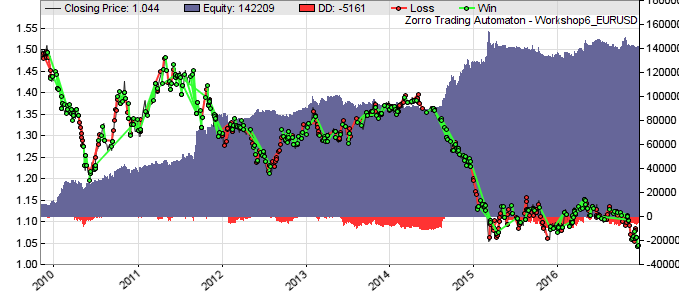

# W6 - Portfolios, Money Management

[Previous: Optimizing](tutorial_fisher.md)  

# Workshop 6: Portfolio strategies. Money management.

**Diversification** is an important factor for getting a regular income with algorithmic trading. Therefore, many successful trading strategies trade not only with a portfolio of assets, but also with a portfolio of strategies. Of course, any components of the portfolio - any assets and any algorithm - must be separately optimized. Here's a script that does that automatically. It trades with several assets on several time frames simultaneously, and uses both trend and counter-trend strategy algorithms (**Workshop6.c**):

```c
_// Counter trend trading function from Workshop 5_
function tradeCounterTrend()
{
  TimeFrame = 4;	_// 4 hour time frame_
  vars Prices = series(price(0));
  vars Filtereds = series(BandPass(Prices,optimize(30,25,35),0.5));  
  vars Signals = series(FisherN(Filtereds,500));  
  var Threshold = optimize(1,0.5,2,0.1);

  Stop = optimize(4,2,10) \* ATR(100);  
  Trail = 4\*ATR(100);
  
  if(crossUnder(Signals,-Threshold))
    enterLong();
  else if(crossOver(Signals,Threshold))
    enterShort();
}

_// Trend trading function from Workshop 4_
function tradeTrend()
{
  TimeFrame = 1; _// 1 hour time frame_
  vars Prices = series(price(0));
  vars Trend = series(LowPass(Prices,optimize(500,300,700)));  
  
  Stop = optimize(4,2,10) \* ATR(100);  
  Trail = 0;  
  vars MMI\_Raw = series(MMI(Prices,300));
  vars MMI\_Smooth = series(LowPass(MMI\_Raw,500));
  
  if(falling(MMI\_Smooth)) {
    if(valley(Trend))
      enterLong();
    else if(peak(Trend))
      enterShort();
  }
}

function run()
{
  set(PARAMETERS,FACTORS,LOGFILE);
  BarPeriod = 60;   LookBack = 2000;
  StartDate = 2007;
  EndDate = 2017;
  NumWFOCycles = 10; 
  Capital = 10000;	  
  if(ReTrain) {
    UpdateDays = -1;  
    SelectWFO = -1;	
    reset(FACTORS); 
  }
 
_// double portfolio loop_
  while(asset(loop("EUR/USD","USD/JPY")))
  while(algo(loop("TRND","CNTR")))
  {
    Margin = 0.5 \* OptimalF \* Capital;
    if(Algo == "TRND") 
      tradeTrend();
    else if(Algo == "CNTR") 
      tradeCounterTrend();
  }
}
```

For testing a portfolio strategy, you'll first need historical data for more assets, since the Zorro installation has only EUR/USD included. Go to the [Zorro download page](http://zorro-project.com/download.php), and download the M1 price histories from 2002 on (that's normally 3 large files). Unzip the content in your **History** folder. You now have the recent history of the major index and Forex pairs. For this strategy we'll need the USD/JPY history from 2007 on.

The strategy is divided into 3 different [functions](tutorial_var.md): **tradeTrend** for trend trading, **tradeCounterTrend** for counter trend trading, and the **run** function that sets up the parameters, selects the assets, sets up the trade volume, and calls the two trade functions. The [loop](109_loop.md) function lets the code walk through the various assets and trade functions.

The trade volume is controlled by this line:

**Margin = 0.5 \* OptimalF \* Capital;**

We're using a money management method developed by **Ralph Vince**. He published a computer algorithm that evaluates every component's balance curve for calculating the optimal percentage of the gained capital to be reinvested. This percentage is called the **[OptimalF](016_OptimalF_money_management.md)** factor (you can see it also in the **OptF** column in the performance report). Multiply **OptimalF** with the capital, and you'll get the maximum margin to be allocated to a certain trade. Normally, people try to stay well below this maximum margin. **OptimalF** is specific to the strategy component and calculated from historical performance, meaning there's no guarantee that this performance will continue in the future. Exceeding the maximum margin is worse than staying below it, therefore it's recommended to only invest about 50% of **OptimalF**.

[Margin](190_Margin_Risk_Lots.md) is one of the methods for determining the amount invested per trade. Other methods were giving the number of lots or the money at risk. **Margin** is only a fixed percentage of the real trade volume - for instance 1% at 1:100 leverage - that the broker keeps as a deposit. If **Margin** is left at its default value, Zorro always buys 1 lot, the minimum allowed trade size. The higher the margin, the higher the number of lots and the higher the profit or loss. **Capital** is a variable set to our initial investment ($10,000) for determining its annual growth (CAGR). For determining the optimal margin for the strategy component, this **Capital** is multiplied with the 50% of the **OptimalF** factor.

Now it's time to \[Train\] the strategy. Because we have now 4 portfolio components, 4x more bars, and twice as many cycles, the training process will take much longer than in the last workshop. As soon as it's finished, click \[Test\], then click \[Result\] (again, your equity curve can look different when testing a different time period).



You can see in the chart below that now two different algorithms trade simulaneously. The long green lines are from trend trading where positions are hold a relatively long time, the shorter lines are from counter-trend trading. The combined strategy does both at the same time. It generated about 40% annual CAGR in the walk forward test.

What happens when we reinvest our profits? Modify this line (changes in red):

**Margin = 0.5 \* OptimalF \* Capital \* sqrt(1 + ProfitClosed/Capital);**

[ProfitClosed](winloss.md) is the sum of the profits of all closed trades of the portfolio component. **1 + ProfitClosed/Capital** is our capital growth factor. Let's examine the strange formula with an example. Assume we started with $10000 capital and the component made $20000 profit. The inner term inside the parentheses is then **1 + $20000/$10000 = 3**. This is the growth of the capital: we started with $10000 and have now $3000 on our account, so it grew by factor 3. The square root of 3 is ~1.7, and this is the factor used for reinvesting our profits.

Why the square root? Here's the background in short. In short term trading with high leverage, the required capital is mainly determined by the expected maximum drawdown. The maximum drawdown of any trade system increases over time. A system tested over 10 years has worse drawdowns than the same system tested over only 5 years. When modeling drawdown depth mathematically with a diffusion model, the maximum drawdown is proportional to the square root of the trading time. But the maximum drawdown is also proportional to the invested amount: When investing twice the volume you'll get twice the drawdown. Thus, if you would reinvest a fixed percentage of your balance, as suggested in most trading books, the maximum drawdown would grow by both effects proportionally to time to the power of **1.5**. It will thus grow faster than your account balance. This means that at some point, a drawdown will inevitably exceed the balance, causing a margin call. There are several methods to overcome this problem, and one of them is to reinvest only an amount proportional to the square root of the capital growth. Thus when your capital doubles, increase the trade volume only by a factor of about **1.4** (the square root of **2**), i.e. **40%**. That's the famous **square root rule** that applies to all high leverage strategies. If you're interested, you can find the formula explained in detail in the [Black Book](links.htm#black), and also a comparison of several other reinvestment methods. For calculating the investment with the square root rule, use the **InvestCalculator** script.

Since only the investment method has changed in the script above, the system needs not be retrained. Clicking \[Test\] is enough. Reinvesting the capital by the square root rule increases the CAGR to about 50%.  

### The evaluation shell

In the strategy above we have some parameters that are optimized, and some are not, like the ATR period, the MMI period, or the number of WFO cycles. Hoiw do we know which parameters are to be optimized and which are not? And how do we know that the functions we used, **LowPass**, **BandPass**, and **FisherN**, are the best for our purpose? Finding out normally requres lengthy experimenting. The evaluation shell (available in Zorro Z version 3 and above) can takle over most of the work and automatically generate the best function and parameter combinations for such a strategy. You can find details, and a variant of this workshop with the shell and a short tutorial, in the [Evaluation Shell](010_Evaluation_Shell.md) chapter.

### What have we learned in this workshop?

*   The [TimeFrame](177_BarPeriod_TimeFrame.md) variable allows different time frames for algorithms or indicators within the same strategy.
*   The **[loop](109_loop.md)** function can be used to go through a list of assets or algorithms.
*   The **[asset](013_Asset_Account_Lists.md)** and **[algo](095_algo.md)** functions select a certain asset and set up an algorithm identifier.
*   The **[OptimalF](016_OptimalF_money_management.md)** factors give the maximum capital allocation to a certain strategy component.
*   Reinvest only the square root of your profit.

[Next: Machine Learning](tutorial_pre.md)

* * *

### Further reading: ► [while](053_while_do.md), [asset](013_Asset_Account_Lists.md), [algo](095_algo.md), [loop](109_loop.md), [string](aarray.md), [strstr](str_.md)