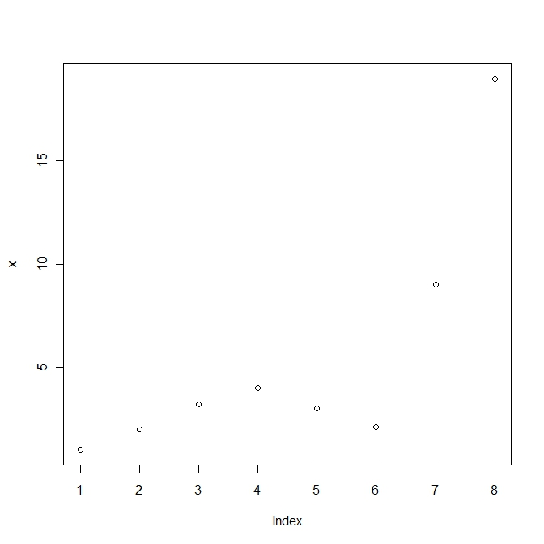
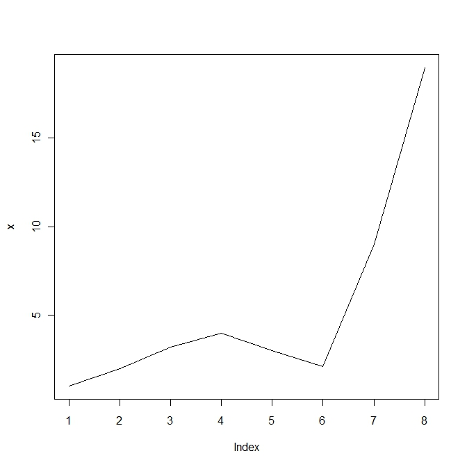
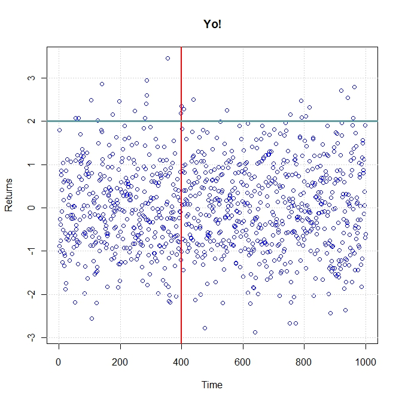
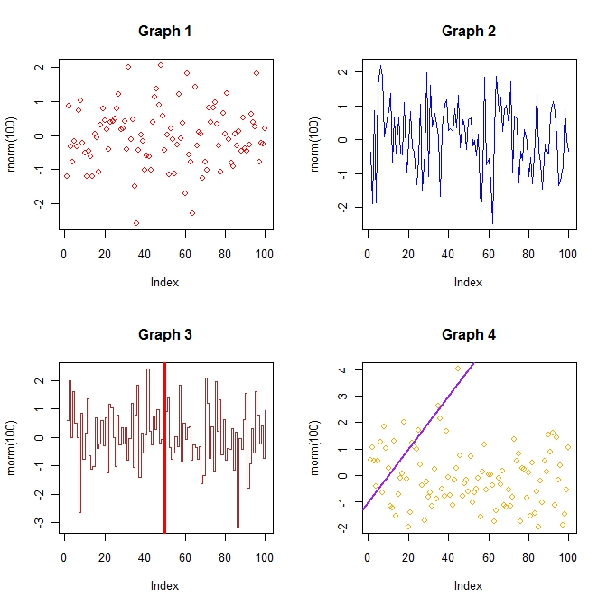

# R Lectures, 1-7

# Lecture 1 – An introduction to R

The R lectures are part of the FINC 621 (Financial Mathematics and Modeling) graduate level class at Loyola University in Chicago. The lectures give an introduction into R for the non-programmer, with a focus on quantitative finance and statistics. If you've done the [C Tutorial](tutorial_var.md), you should have no problem to follow the lectures and become familiar with R.

**Harry Georgakopoulos**, who teaches the FINC 621 class, graciously gave permission to include his lectures in the Zorro tutorial. Harry Georgakopoulos is a quantitative trader for a proprietary trading firm in Chicago. He holds a master’s degree in Electrical Engineering and a master’s degree in Financial Mathematics from the University of Chicago. He is also the author of [Quantitative Trading with R](http://amzn.to/1JZ5d4j).

Any errors and omissions in the following lectures are not the responsibility of the author. The lectures should only be used for educational purposes and not for live trading.

Let's get started!

#### What is R?

R is the main language and environment for statistical computing and machine learning, used by scientists all over the world. It includes an effective data handling and storage facility that provides a suite of operators for calculations on arrays, matrices, data-frames and lists. The base installation of R comes with a large collection of tools for data analysis and data visualization. The language itself supports conditional statements, loops, functions, classes and most of the other constructs that VBA and C++ users are familiar with. R supports the object-oriented, imperative and functional programming styles. The plethora of contributed packages, a solid user-base and a strong open-source community are some of the other key strengths of the R framework.

The R system is divided into 2 parts:

1.  The base package which is downloadable from CRAN.
2.  Everything else.

The base R package contains, among other things, the necessary code which is required to run R. Many useful functions and libraries are also part of this base installation. Some of these include: utils, stats, datasets, graphics, grDevices and methods. What this means for you, is that you can get a lot done with the plain vanilla R installation!

#### History of R

The S language (R is a dialect of the S-language) was developed by John Chambers and others at Bell Labs in 1976. It started off as a collection of Fortran libraries and was used for internal Bell Lab statistical analysis. The early versions of the language did not contain functions for statistical modeling. In 1988 the system was rewritten in C (version 3 of the language). In 1998, version 4 of the language was released. In 1993 Bell Labs gave StatSci (now Insightful Corp.) an exclusive license to develop and sell the S language. The S language itself has not changed dramatically since 1998. In 1991 Ross Ihaka and Robert Gentleman developed the R language. The first announcement of R to the public occurred in 1993. In 1995, Martin Machler convinced Ross and Robert to use the GNU General Public License to make R free software. In 1996 public mailing lists were created (R-help and R-devel). In 1997 the R Core Group was formed (containing some people associated with the S-PLUS framework). The core group currently controls the source code for R. The first version R 1.0.0 was released in 2000.

#### Installing R

The installation of the R environment on a Windows, Linux or Mac machine is fairly simple. Here are the steps to follow for the Windows version:

1.  Navigate to [http://cran.r-project.org/](http://cran.r-project.org/)
2.  Click on the appropriate link for your system.
3.  For a Windows machine, select and download the _base_ installation.
4.  Select all the default options.
5.  A desktop icon will appear once the installation is successful.

The following display appears when you click on the R icon.  

R Console

#### Interacting with the Console

There are at least three ways to enter commands in R. The code can either be typed directly into the console, sourced from a .R file or pasted verbatim from a text file.

#### Customization

There are a number of customizations that can be performed on the R console itself. For font, color and other cosmetic changes, navigate to the GUI Preferences menu:  
_Edit -> GUI Preferences_

Another useful modification is to enable the sdi option for child windows. Whenever you create a plot or bring up another window within the existing R console, the child-window is confined within the main-window. In order to disable this behavior, do the following:

1.  Right-click on the R shortcut icon on the desk- top and select _Properties_
2.  Change the Target directory text from _“…\\R-2.15.1\\bin\\Rgui.exe” to “…\\R-2.15.1\\bin\\Rgui.exe” –sdi_

#### The Basics

One can think of R as a glorified calculator. All the usual mathematical operations can be directly entered into the console. Operations such as addition, subtraction, multiplication, division and exponentiation are referenced by the usual symbols _+, -, /, \*_ and _^_. More advanced mathematical operations can be performed by invoking specific functions within R.

#### Basic Math

<table><tbody><tr id="p1491"><td class="code" id="p149code1"><pre class="rsplus" style="font-family:monospace;"> 1+1
sqrt(2)
20 + (26.8 * 23.4)/2 + exp(1.34) * cos(1)
sin(1)
5^4
sqrt(-1 + 0i)</pre></td></tr></tbody></table>

#### Advanced Math

<table><tbody><tr id="p1492" class="alt-table-row"><td class="code" id="p149code2"><pre class="rsplus" style="font-family:monospace;"> integrand &lt;- function(x) 1 / ((x+1) * sqrt(x))
integrate(integrand, lower = 0, upper = Inf)</pre></td></tr></tbody></table>

#### Variable Assignment

The assignment of a value to a variable in R is accomplished via the _<-_ symbol

<table><tbody><tr id="p1493"><td class="code" id="p149code3"><pre class="rsplus" style="font-family:monospace;"> x &lt;- 3
x &lt;- x + 1
z &lt;- x ^ 2
z &lt;- "hello XR"
y &lt;- "a"
Z &lt;- sqrt(2)</pre></td></tr></tbody></table>

A few things to notice from the previous example:

*   Variables in R are case-sensitive. z is not the same thing as Z. Spaces or special characters are not allowed within variable names. The dot is an exception. Variable names cannot start with a numeric character.
*   Variables in R do not have to be declared as int, double or string as in other languages. R dynamically figures out what the type of the variable is.
*   Variables in R can be modified and copied into other variables.
*   The third example from above does not actually modify the value of x. Rather, x is squared and the result is assigned to the new variable z.
*   Other languages use the _\=_ operator in place of the _<-_ operator to denote assignment. R is capable of supporting both conventions. Stick with _<-_ in order to minimize confusion.

#### Containers and Operations on Containers

In order to properly work with any raw data, we need to first place that data into a suitable container.  
The 4 important data containers in R are:

*   **vector** (C equivalent: [array](aarray.md) or [series](091_series.md))
*   **matrix** (C equivalent: [matrix](matrix.md))
*   **data frame** (C equivalent: [dataset](data.md))
*   **list** (C equivalent: [struct](structs.md))

Once we have successfully placed our data into suitable data structures, we can proceed to manipulate the data in various ways.

#### Vector

A vector is equivalent to an [array](aarray.md) in C. Vectors hold data of similar type. Only numbers, or only characters can be placed inside a vector. The following example creates three vectors of type numeric and character.

<table><tbody><tr id="p1494" class="alt-table-row"><td class="code" id="p149code4"><pre class="rsplus" style="font-family:monospace;"> firstVector  &lt;- c(1,2,3,4,5,6)
secondVector &lt;- c("a", "b", "hello")
thirdVector  &lt;- c("a", 2, 23)</pre></td></tr></tbody></table>

The concatenation operator c() is used to create a vector of numbers or strings. The third example mixes numbers with characters. R will convert the type of any numeric values into string characters. Typing the variable name into the R console reveals the contents of our newly created vectors.

<table><tbody><tr id="p1495"><td class="code" id="p149code5"><pre class="rsplus" style="font-family:monospace;"> firstVector
thirdVector</pre></td></tr></tbody></table>

The concatenation operator c() can also be used on existing vectors.

<table><tbody><tr id="p1496" class="alt-table-row"><td class="code" id="p149code6"><pre class="rsplus" style="font-family:monospace;"> newVector &lt;- c(firstVector, 7, 8, 9)</pre></td></tr></tbody></table>

The extraction of elements from within a vector can be accomplished through a call to the \[\] operator.

#### Operations on Vectors

The following examples illustrate various operations that can be performed on vectors.  
The first example specifies a single index to use for extracting the data. The second example specifies two indexes. Notice how the c() operator is used to create a vector of indexes. These indexes are subsequently used to extract the elements from the initial vector. This method of “extracting” data elements from containers is very important and will be used over and over again.

<table><tbody><tr id="p1497"><td class="code" id="p149code7"><pre class="rsplus" style="font-family:monospace;"> #extract the 4th element of a vector
example1 &lt;- newVector[4]
#extract the 5th and the 8th elements
example2 &lt;- newVector[ c(5, 8)]</pre></td></tr></tbody></table>

The next few examples illustrate mathematical operations that can be performed on vectors.

<table><tbody><tr id="p1498" class="alt-table-row"><td class="code" id="p149code8"><pre class="rsplus" style="font-family:monospace;"> x  &lt;- c(1, 5, 10, 15, 20)
x2 &lt;- 2 * x
x3 &lt;- x ^ 2
x4 &lt;- x / x2
x5 &lt;- round(x * (x / x2) ^ 3.5 + sqrt(x4), 3)
x6 &lt;- round(c(c(x2[2:4], x3[1:2]), x5[4]), 2)</pre></td></tr></tbody></table>

Here are a few conclusions we can draw from these examples:

*   Operations can be vectorized. In other words, we do not have to loop through all the elements of the vector in order to perform an operation on each data element. Rather, the operation of interest is performed on all the elements at once.
*   If we only wanted to perform an operation on the 4th and 6th elements of our vector, we would have to “index” into the vector and extract the elements of interest.
    
    <table><tbody><tr id="p1499"><td class="code" id="p149code9"><pre class="rsplus" style="font-family:monospace;"> y &lt;- x[4] + x[6]</pre></td></tr></tbody></table>
    
    The last example, x6 combines some of the operations discussed earlier in this tutorial. We are extracting specific elements from vectors x2, x3 and x5 and then concatenating them into a single vector. The result of the operation is then truncated to 2 decimal places.
    

#### Matrix

A [matrix](086_vector_matrix.md) can be thought of as a 2-dimensional vector. Matrices also hold data of similar type. The following code defines a matrix with 2-rows and 3-columns. In R, matrices are stored in columnar format.

<table><tbody><tr id="p14910" class="alt-table-row"><td class="code" id="p149code10"><pre class="rsplus" style="font-family:monospace;"> myMatrix &lt;- matrix(c(1, 2, 3, 4, 5, 6), nrow = 2, ncol = 3)</pre></td></tr></tbody></table>

The default matrix() command assumes that the input data will be arranged in columnar format. In order to arrange the data in row format, we need to modify our previous example slightly:

<table><tbody><tr id="p14911"><td class="code" id="p149code11"><pre class="rsplus" style="font-family:monospace;"> myMatrix &lt;- matrix(c(1, 2, 3, 4, 5, 6), nrow = 2, ncol = 3, byrow = TRUE)</pre></td></tr></tbody></table>

In subsequent sections we will cover _attributes_ of containers and other R-objects. In a nutshell, an attribute is an extra layer of information that we can assign to our objects. For matrices, a useful attribute might be a list of names for the rows and columns. If we do not specify the names, R will assign default row and column numbers.

#### Operations on Matrices

The extraction of elements from a matrix can be accomplished via the use of the \[,\] operator. In order to extract the element located in row 1 and column 3 of a matrix, we need to issue the following command:

<table><tbody><tr id="p14912" class="alt-table-row"><td class="code" id="p149code12"><pre class="rsplus" style="font-family:monospace;"> ans &lt;- myMatrix[1, 3]</pre></td></tr></tbody></table>

Operations of matrices can also be vectorized

<table><tbody><tr id="p14913"><td class="code" id="p149code13"><pre class="rsplus" style="font-family:monospace;"> newMatrix1 &lt;- myMatrix * myMatrix
newMatrix2 &lt;- sqrt(myMatrix)</pre></td></tr></tbody></table>

Here are some examples that utilize vectorization and single-element operations.

<table><tbody><tr id="p14914" class="alt-table-row"><td class="code" id="p149code14"><pre class="rsplus" style="font-family:monospace;"> mat1 &lt;- matrix(rnorm(1000), nrow = 100)
mat2 &lt;- mat1[1:25, ] ^ 2
round(mat1[1:5, 2:6], 3)
head(round(mat2,0), 9)[, 1:7]</pre></td></tr></tbody></table>

#### Data Frame

Think of a data frame object as a single spreadsheet. A data frame is a hybrid 2-dimensional container that can include both numeric, character and factor types. Whenever data is read into R from an external environment, it is likely that the resulting object in R will be a data frame. The following code creates a data frame.

<table><tbody><tr id="p14915"><td class="code" id="p149code15"><pre class="rsplus" style="font-family:monospace;"> df &lt;- data.frame(price  = c(89.2, 23.2, 21.2), symbol = c("MOT", "AAPL", "IBM"), action = c("Buy", "Sell", "Buy"))</pre></td></tr></tbody></table>

A data frame accepts columns of data as input. Notice that these can be either numeric or of type character. Also notice that a name can be assigned to each column of data. In a data frame, as in a matrix, it is important to ensure that the number of rows is the same for all columns. The data need to be in “rectangular” format. If this is not the case, R will issue an error message.

<table><tbody><tr id="p14916" class="alt-table-row"><td class="code" id="p149code16"><pre class="rsplus" style="font-family:monospace;"> df2 &lt;- data.frame(col1 = c(1, 2, 3), col2 = c(1, 2, 3, 4))</pre></td></tr></tbody></table>

_  
Error in data.frame(col1 = c(1, 2, 3), col2 = c(1, 2, 3, 4)) : arguments imply differing number of rows: 3, 4  
_

#### Operations on data frames

Data frames can also be indexed via the \[,\] operator.

<table><tbody><tr id="p14917"><td class="code" id="p149code17"><pre class="rsplus" style="font-family:monospace;"> price1 &lt;- df[1, 1]</pre></td></tr></tbody></table>

The $ operator can be used to extract data columns by “name”.

<table><tbody><tr id="p14918" class="alt-table-row"><td class="code" id="p149code18"><pre class="rsplus" style="font-family:monospace;"> symbols &lt;- df$symbol
class(symbols)</pre></td></tr></tbody></table>

The “Levels” descriptor for the symbols variable signifies that the type of the variable is a factor. We can find out what type any object in R is by using the _class_ keyword.

Factors are a convenient data-type that can assist in the categorization and analysis of data. We will not cover factors in this class. In order to disable the conversion of any character vector into a factor, simply use the stringsAsFactors = FALSE argument in the data.frame() call.

<table><tbody><tr id="p14919"><td class="code" id="p149code19"><pre class="rsplus" style="font-family:monospace;"> df3 &lt;-data.frame(price  = c(89.2, 23.2, 21.2), symbol = c("MOT", "AAPL", "IBM"), action = c("Buy", "Sell", "Buy"), stringsAsFactors = FALSE)
class(df3$symbol)</pre></td></tr></tbody></table>

Some things to take away from the previous examples:

*   Functions can take multiple input arguments. In order to figure out exactly what extra arguments are available for any predefined R function, use the ? operator in front of the function name. i.e. ?data.frame
*   Objects can be passed directly into other functions. Functions are objects. In fact, everything is an object in R.

#### List

A list structure is probably the most general container. It can be used to store objects of different types and size. The following code creates a list object and populates it with three separate objects of varying size.

<table><tbody><tr id="p14920" class="alt-table-row"><td class="code" id="p149code20"><pre class="rsplus" style="font-family:monospace;"> myList &lt;- list(a = c(1, 2, 3, 4, 5), b = matrix(1:10, nrow = 2, ncol = 5), c = data.frame(price = c(89.3, 98.2, 21.2), stock = c("MOT", "IBM", "CSCO")))
myList</pre></td></tr></tbody></table>

The first component of the list is named “a” and it holds a numeric vector of length 5. The second component is a matrix and the third one, a data frame. Many functions in R use this list structure as a general container to hold the results of computations.

#### Operations on lists

Lists can be indexed either numerically or by the component name through the double bracket operator \[\[\]\].

<table><tbody><tr id="p14921"><td class="code" id="p149code21"><pre class="rsplus" style="font-family:monospace;"> firstComp &lt;- myList[[1]]
class(firstComp)</pre></td></tr></tbody></table>

An alternate extraction method is the following:

<table><tbody><tr id="p14922" class="alt-table-row"><td class="code" id="p149code22"><pre class="rsplus" style="font-family:monospace;"> secondComp &lt;- myList[["b"]]
class(secondComp)</pre></td></tr></tbody></table>

By using the \[\[\]\] operator, we extract the object that is located within the list at the appropriate location. By using the single bracket operator \[\] we extract part of the list.

<table><tbody><tr id="p14923"><td class="code" id="p149code23"><pre class="rsplus" style="font-family:monospace;"> partOfList &lt;- myList[ c(1, 3)]
class(partOfList)</pre></td></tr></tbody></table>

The size of the list can be determined with the _length()_ keyword.

<table><tbody><tr id="p14924" class="alt-table-row"><td class="code" id="p149code24"><pre class="rsplus" style="font-family:monospace;"> sizeOfList &lt;- length(myList)</pre></td></tr></tbody></table>

#### Useful Functions

The base package of R includes all sorts of useful functions. Novice R users are sometimes faced with the problem of not knowing what functions are available for performing a specific task. The following examples contain a few functions that are worth memorizing.

#### Simple Operations

<table><tbody><tr id="p14925"><td class="code" id="p149code25"><pre class="rsplus" style="font-family:monospace;"> #1.  Greate 1000 normally distributed random numbers of mean 0 and stdev 1
      x     &lt;- rnorm(1000, mean = 0, sd = 1)
&nbsp;
#2.  Find the length of the vector x.
     xL    &lt;- length(x)

#3.  Compute the mean and standard deviation of those numbers
     xM    &lt;- mean(x)
     xS    &lt;- sd(x)
&nbsp;
#4.  Find the sum of all the numbers in x vector x.
     xSum  &lt;- sum(x)
&nbsp;
#5.  Do a cumulative sum of the values in x
     xCSum &lt;- cumsum(x)
&nbsp;
#6.  Look at the first 3 elements a vector
     head(xCSum, 3)
&nbsp;
#7.  Look at the last 3 elements of a vector
     tail(xCSum, 3)
&nbsp;
#8.  Look at summary statistics
     summary(x)
&nbsp;
#9.  Sort x from smallest to largest and from largest to smallest.
     xSIn  &lt;- sort(x)
     xSDec &lt;- sort(x, decreasing = TRUE)
&nbsp;
#10. Compute the median value of the vector
     xMed  &lt;- median(x)
&nbsp;
#11. Compute the range of a variable
     xR  &lt;- range(x)
&nbsp;
#12. Compute the difference between elements
     y  &lt;- c(100.1, 100.2, 100, 99, 99.9)
     yDiff &lt;- diff(y)
&nbsp;
#13. Create a sequence from 1 to 10
     s  &lt;- 1:10
&nbsp;
#14. A sequence from 1 to 10 in steps of 0.1
     z  &lt;- seq(1, 10, 0.1)</pre></td></tr></tbody></table>

#### Simple Graphing

R has the ability to produce some intricate graphics. Most of the advanced graphing functionality is exposed in other add-on libraries such as lattice, ggplot2, rgl, and quantmod. For the time being, the plot() command is adequate to address our graphing needs. This is what the default output for plot() looks like.

<table><tbody><tr id="p14926" class="alt-table-row"><td class="code" id="p149code26"><pre class="rsplus" style="font-family:monospace;"> #Create a vector of numbers x and plot it
 x &lt;- c(1, 2, 3.2, 4, 3, 2.1, 9, 19)
 plot(x)</pre></td></tr></tbody></table>

Simple plot in R

  
  
The following code converts the dot plot into a line plot.

<table><tbody><tr id="p14927"><td class="code" id="p149code27"><pre class="rsplus" style="font-family:monospace;"> plot(x, type = "l")</pre></td></tr></tbody></table>

Line plot in R

  
  
One can think of a plot as a canvas. We first create the canvas (by calling the first plot() command) and then proceed to paste other lines, points and graphs on top of the existing canvas. The following example will demo the creation of a simple plot with a main title, axis labels, a basic grid and an appropriate color scheme. We will then superimpose a few vertical and horizontal lines onto the first plot.

<table><tbody><tr id="p14928" class="alt-table-row"><td class="code" id="p149code28"><pre class="rsplus" style="font-family:monospace;"> plot(rnorm(1000), col = "blue", main = "Yo!", xlab = "Time", ylab = "Returns")
 grid()
 abline(v = 400, lwd = 2, col = "red")
 abline(h = 2, lwd = 3, col = "cadetblue")</pre></td></tr></tbody></table>

Scatter plot in R

  
  
Another useful command is the par() function. This command can be used to query or set global graphical parameters. The following code-snippet splits the viewing window into a rectangular format with 2 rows and 2 columns. A plot() command can be issued for each one of the child-windows. We can superimpose multiple line plots, other graphs and text on each unique plot.

<table><tbody><tr id="p14929"><td class="code" id="p149code29"><pre class="rsplus" style="font-family:monospace;"> #Create a 2-row/2-column format
 par(mfrow = c(2, 2))
 plot(rnorm(100), col = "red", main = "Graph 1")
 plot(rnorm(100), col = "blue", main = "Graph 2", type = "l")
 plot(rnorm(100), col = "brown", main = "Graph 3", type = "s")
 abline(v = 50, col = "red", lwd = 4)
 plot(rnorm(100) , col = "orange", main = "Graph 4")
 abline(a = -1, b = 0.1, lwd = 2, col = "purple")
&nbsp;
 #Reset the plotting window
 par(mfrow = c(1, 1)</pre></td></tr></tbody></table>

Multiple R plots

  

[Next: R Lecture 2](039_Lecture_2.md)

#### References

*   Venables and Smith. An Introduction to R.
*   Roger D. Peng. Overview and History of R.