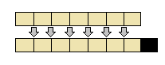

# Lecture 2

# Lecture 2 – Functions in R

The first class served as an introduction to the R environment. The fundamental data containers **c()**, **matrix()**, **data.frame()**, **list()** were introduced and some useful functions were presented. This second class is going to cover user-defined functions. When dealing with any sort of data analysis project, it is important to be able to create simple functions that perform specific tasks. Functions are programming constructs that accept zero or more inputs and produce zero or more outputs. Before we jump into functions, we need to address the concepts of: conditional statements, loops and extraction of elements from containers via boolean operators.

#### Conditional Statements and Boolean Expressions

A conditional statement can be thought of as a feature of a programming language which performs different computations or actions depending on whether a programmer-specified boolean condition evaluates to true or false. We will be using conditional statements quite a bit in most of our functions in order to create logic that switches between blocks of code.

##### If-Else Statement

The if-else conditional construct is found in R just as in most of the other popular programming languages (VBA, C++, C#, etc).

<table><tbody><tr id="p2091"><td class="code" id="p209code1"><pre class="rsplus" style="font-family:monospace;"> value &lt;- 0
 if(value == 0) {
    value &lt;- 4 
 }</pre></td></tr></tbody></table>

The statement within the parenthesis after the if keyword is a boolean expression. It can either be TRUE or FALSE. If the value is TRUE, the code within the curly braces will be evaluated. If the statemenent is FALSE, the code within the curly braces will not be evaluated. If we want to provide an alternate evaluation branch, we can use the else keyword.

<table><tbody><tr id="p2092" class="alt-table-row"><td class="code" id="p209code2"><pre class="rsplus" style="font-family:monospace;"> value &lt;- 0
 if(value == 0) {
    value &lt;- 4
 } else {
    value &lt;- 9999
 }</pre></td></tr></tbody></table>

If the boolean expression within the **if()** is FALSE, then the code after the else will be evaluated. We can combine multiple if-else statements in order to create arbitrarily complex branching mechanisms.

<table><tbody><tr id="p2093"><td class="code" id="p209code3"><pre class="rsplus" style="font-family:monospace;"> myIQ &lt;- 86
 if(myIQ &lt;= 10) {
    cat("Wow! Need improvement!")
 } else if(myIQ &gt; 10 &amp;&amp; myIQ &lt;= 85) {
    cat("Now we're talking!") 
 } else {
    cat("You're hired!") 
 }</pre></td></tr></tbody></table>

A couple of points to take away from the previous example:

*   The **cat()** command simply prints everything passed to it to the screen.
*   The operator **&&** is the boolean AND and the operator **||** is the boolean OR. Do not confuse these with the **&** and **|**operators. These are called the bitwise boolean operators.
*   An arbitrarily complex boolean expression can be passed to the **if()** statement.

##### Booleans

Let’s take a look at some boolean expressions:

<table><tbody><tr id="p2094" class="alt-table-row"><td class="code" id="p209code4"><pre class="rsplus" style="font-family:monospace;"> x &lt;-5 
 y &lt;-6
 bool1 &lt;- x == y
 bool2 &lt;- x != y
 bool3 &lt;- x &lt; y
 bool4 &lt;- x &gt; y
 bool5 &lt;- ((x + y) &gt; (y - x)) || (x &lt; y) 
 bool6 &lt;- (bool5 &amp;&amp; bool2) || (x/y != 3)</pre></td></tr></tbody></table>

Statements such as **if()** take booleans as input. If the boolean expression is a simple one, it is a good idea to place it within the parentesis of the **if()** or **while()** directly. If the boolean expression is more involved, it is probably a good idea to pre-compute the expression, assign it to a variable, and then pass the variable to the appropriate statement.

<table><tbody><tr id="p2095"><td class="code" id="p209code5"><pre class="rsplus" style="font-family:monospace;"> #simple case x &lt;-5
 y &lt;-4 
 if(x &gt; y) {
    cat("Success")
 }
&nbsp;
 #complicated case
 x &lt;-5
 y &lt;-4
 boolN &lt;- ((x &gt; y) &amp;&amp; (sqrt(y) &lt; x)) ||
          ((x + y == 9) &amp;&amp; (sqrt(y) &lt; x))
 if(boolN) {
    cat("Good times...")
 } else {
    cat("Bad times...")
 }</pre></td></tr></tbody></table>

Let’s take a look at a vectorized boolean comparison.

<table><tbody><tr id="p2096" class="alt-table-row"><td class="code" id="p209code6"><pre class="rsplus" style="font-family:monospace;"> x &lt;-5
 w &lt;- c(1, 2, 3, 4, 5, 6) 
 z &lt;- c(1, 3, 3, 3, 5, 3) 
 boolV &lt;- w == z
 boolV &lt;- x &gt; w</pre></td></tr></tbody></table>

In order to evaluate a boolean expression between 2 variables or expressions, we should use the **&&** and **||** operators. If we want to evaluate a collection of variables against a collection of a different set of variables, we should use the **&** and **|** operators. Here is a simple example:

<table><tbody><tr id="p2097"><td class="code" id="p209code7"><pre class="rsplus" style="font-family:monospace;"> #using &amp;&amp; and ||
 w &lt;-1
 z &lt;-2
 boolS &lt;- (w &lt; z) &amp;&amp; ( z &lt; 5)
&nbsp;
 #using &amp; and |
 x &lt;-3
 w &lt;- c(1, 2, 3, 4, 5, 6)
 z &lt;- c(1, 2, 3, 7, 8, 2)
 boolV &lt;- (w &gt; x) &amp; (x &lt; z) 
 boolV &lt;- (w &gt; x) | (x &lt; z)</pre></td></tr></tbody></table>

#### Loops

The **for()** and **while()** structures are typically utilized when the user wants to perform a specific operation many times.

##### for()

Here’s how to fill a numeric vector with integers from 1 to 20 using a **for()** loop.

<table><tbody><tr id="p2098" class="alt-table-row"><td class="code" id="p209code8"><pre class="rsplus" style="font-family:monospace;"> myNumbers &lt;- c()
 for(i in 1:20) {
     myNumbers[i] &lt;- i
 }</pre></td></tr></tbody></table>

In the previous example the iterator i took values between 1 and 20. Any variable name can be used as an iterator. This way of populating a vector is certainly possible in R. However, it is not the recommended method for populating a container with data. The following vectorized example accomplishes the same task and avoids the **for()** loop altogether. Having said this, keep in mind that _vectorization_ might be difficult to implement for certain types of problems. For most of the examples we are going to encounter in this class vectorization works just fine.

<table><tbody><tr id="p2099"><td class="code" id="p209code9"><pre class="rsplus" style="font-family:monospace;"> myNumbers &lt;- 1:20</pre></td></tr></tbody></table>

The iterator within the **for()** loop does not have to be sequential. A vector of possible iterators can be passed directly to the loop.

<table><tbody><tr id="p20910" class="alt-table-row"><td class="code" id="p209code10"><pre class="rsplus" style="font-family:monospace;"> seqIter &lt;- c(2,4,6)
 myArray &lt;- 1:10
 for(j in seqIter) {
     myArray[j] &lt;- 999
 }</pre></td></tr></tbody></table>

#### while()

Another popular looping structure is the **while()** loop. The loop will perform a certain calculation until the boolean expression provided to it returns a FALSE value.

<table><tbody><tr id="p20911"><td class="code" id="p209code11"><pre class="rsplus" style="font-family:monospace;"> x &lt;- 5
 while(x &lt; 5) {
   x &lt;- x + 1 
 }</pre></td></tr></tbody></table>

There is no need to keep track of a counter within a while loop.

#### Memory Pre-Allocation

It is advisable to pre-allocate a data container before filling it up with values within any loop. The following example fills up a numeric vector with numbers between 1 to 100,000 without pre-allocating the size. The **system.time()** function is used to measure the elapsed time.

<table><tbody><tr id="p20912" class="alt-table-row"><td class="code" id="p209code12"><pre class="rsplus" style="font-family:monospace;"> emptyArray &lt;- c()
 system.time(
   for(i in 1:100000) {
       emptyArray[i] &lt;- i
   })
&nbsp;
 #Output
 user  system elapsed
 10.36    0.00   10.47</pre></td></tr></tbody></table>

It takes roughly 10 seconds for this operation to complete!  
The next example pre-allocates the container up to the maximum-size prior to populating the array.

<table><tbody><tr id="p20913"><td class="code" id="p209code13"><pre class="rsplus" style="font-family:monospace;"> fullArray         &lt;- c(NA)
 length(fullArray) &lt;- 100000
 system.time(
     for(i in 1:100000) {
         fullArray[i] &lt;- i
     })
&nbsp;
 #Output
 user  system elapsed
 0.25    0.00    0.25</pre></td></tr></tbody></table>

The reason for the time discrepancy is due to the copying of the vector elements into a new vector that is large enough to hold the next entry in the **for()** loop. If the vector is pre-allocated, no copying of elements needs to occur and the time for vector insertions decreases substantially.  

Memory allocation in R

#### Indexing with Booleans

In the previous class we saw how to extract elements of a data-container by passing in the numeric index of interest. Another way of accomplishing the same task is to pass in a boolean vector as the index. A TRUE value will return the contents at that particular location, whereas a FALSE value will not return the contents at that index.

<table><tbody><tr id="p20914" class="alt-table-row"><td class="code" id="p209code14"><pre class="rsplus" style="font-family:monospace;"> v1    &lt;- c(1,2,3,4,5,6,7,8)
 boolI &lt;- c(TRUE, TRUE, FALSE, FALSE, FALSE, TRUE, TRUE, FALSE)
 v2    &lt;- v1[boolI]</pre></td></tr></tbody></table>

If the length of the boolean index is smaller than the array being indexed, the boolean index will be internally replicated as many times as necessary in order to match the array length.

<table><tbody><tr id="p20915"><td class="code" id="p209code15"><pre class="rsplus" style="font-family:monospace;"> v1    &lt;- c(1,2,3,4,5,6,7,8)
 boolI &lt;- c(TRUE,FALSE)
 v2    &lt;- v1[boolI]</pre></td></tr></tbody></table>

#### Writing Functions

There exist hundreds of functions in the base-installation of R. Thousands more exist within 3rd party packages/libraries. In many cases, it is convenient to create our own custom functions to perform certain tasks.  
Here is an example of a simple function that accepts one input and produces one output:

<table><tbody><tr id="p20916" class="alt-table-row"><td class="code" id="p209code16"><pre class="rsplus" style="font-family:monospace;">  MyFirstFunction &lt;- function(a) {
   return(a)
  }</pre></td></tr></tbody></table>

In this simplistic example, the variable a is simply returned by the function. In order to create a function, we need to use the **function()** keyword. The values within the parenthesis are called the _arguments_ of the function. Everything within the curly braces { } is the fuction _body_. All variables that are declared within the body of the function are only known to the function. The only exception occurs if the variables are declared as _global_. It is good practice to avoid the use of global variables. The  
return() keyword returns the computed result to the user.  
The next few examples explore functions in more depth.

##### Example 1

<table><tbody><tr id="p20917"><td class="code" id="p209code17"><pre class="rsplus" style="font-family:monospace;"> SumF  &lt;- function(a, b) {
   return(a+b)
 }
&nbsp;
 #Usage
 ans   &lt;- SumF(1,3)</pre></td></tr></tbody></table>

##### Example 2

<table><tbody><tr id="p20918" class="alt-table-row"><td class="code" id="p209code18"><pre class="rsplus" style="font-family:monospace;"> SqCol &lt;- function(d) {
   return(sum(d[,2]^2))
 }
&nbsp;
 #Usage 
 dF &lt;- data.frame(a = c(1, 3, 3, 2), 
                  b = c(1, 3, 5, 6),
                  c = c(1, 2, 3, 4))
 ans &lt;- SqCol(dF)</pre></td></tr></tbody></table>

##### Example 3

<table><tbody><tr id="p20919"><td class="code" id="p209code19"><pre class="rsplus" style="font-family:monospace;"> MatF  &lt;- function(mat) {
  outList &lt;- list()
  sizeMat &lt;- dim(mat)
  for(i in 1:sizeMat[2]) {
      ind &lt;- which(mat[,i] &lt; 15)
      if(length(ind) &gt; 0) {
         outList[[i]] &lt;- mat[ind,i]
      } else {
         outList[[i]] &lt;- "Empty"
      }
  }
  return(outList)
 }
&nbsp;
 #Usage
 m1  &lt;- matrix(sample(1:100, replace = TRUE),
               nrow = 10, ncol = 10)
 ans &lt;- MatF(m1)</pre></td></tr></tbody></table>

Example 3 needs some clarification. The input to the function is a matrix called mat. Within the function, we first create a list container to hold our final answers. The **dim()** function figures out what the size of mat is. The output of **dim()** is itself a 2-dimensional vector. We just need the number of columns. That is what the \[2\] argument in the for loop accomplishes. The iterator variable i loops through all the columns of mat and the **which()** function checks to see which row in the matrix satisfies a given condition. In this case **mat\[, i\] < 15**. The ind variable creates a vector of booleans that is subsequently passed back to mat in order to extract only those elements. The final results are stored in the outList variable.

[Next: R Lecture 3](040_Lecture_3.md)

#### References

*   Wikipedia, Subroutine, http://en.wikipedia.org/wiki/Subroutine
*   Wikipedia, Conditional(programming), http://en.wikipedia.org/wiki/Conditional\_(programming)