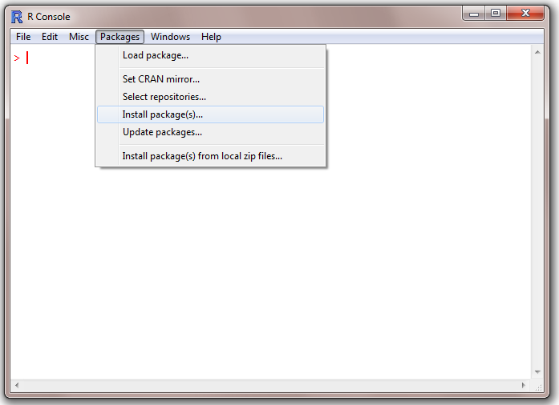

# Lecture 3

# Lecture 3 – Matrices and Libraries

#### Matrices in R

A matrix is a very useful mathematical construct. Matrices provide a mechanism for easily manipulating large collections of data. Matrix Mathematics is a vast topic and there exist numerous papers and publications that talk about all the possible uses of matrices. Suffice it to say that this class is only going to use a small subset of these theorems. In R, a matrix can be created in the following manner:

<table><tbody><tr id="p2141"><td class="code" id="p214code1"><pre class="rsplus" style="font-family:monospace;"> #specify an empty marix with 3 rows and 3 columns
 emptyMat &lt;- matrix(nrow = 3, ncol = 3)</pre></td></tr></tbody></table>

Matrices are created column first. If you want to create the rows first, make sure to use the **byrow = TRUE** attribute.

<table><tbody><tr id="p2142" class="alt-table-row"><td class="code" id="p214code2"><pre class="rsplus" style="font-family:monospace;"> mat1 &lt;- matrix(c(1,2,3,4,5,6), nrow = 2, ncol = 3, byrow = TRUE)</pre></td></tr></tbody></table>

as opposed to:

<table><tbody><tr id="p2143"><td class="code" id="p214code3"><pre class="rsplus" style="font-family:monospace;"> mat2 &lt;- matrix(c(1,2,3,4,5,6), nrow = 2, ncol = 3)</pre></td></tr></tbody></table>

##### Naming Convention for Matrices

Since a matrix is an object within R, one can change the name attribute of the matrix. Names are assigned to the rows and to the columns of a matrix. The following three snippets of code accomplish this.

<table><tbody><tr id="p2144" class="alt-table-row"><td class="code" id="p214code4"><pre class="rsplus" style="font-family:monospace;"> #Method 1
 mat3 &lt;- matrix(rnorm(16,0,1), nrow = 4, ncol = 4)
 dimnames(mat3) &lt;- list(c("Row1", "Row2", "Row3", "Row4"),
                        c("Col1", "Col2", "Col3", "Col4"))
 #Method 2
 mat4 &lt;- matrix(rnorm(16,0,1), nrow = 4, ncol = 4, dimnames =
                list(c("Row1", "Row2", "Row3", "Row4"),
                     c("Col1", "Col2", "Col3", "Col4")))
 #Method 3
 myRowNames  &lt;- c("r1", "r2", "r3", "r4")
 myColNames  &lt;- c("c1", "c2", "c3", "c4")
 matrixNames &lt;- list(myRowNames, myColNames)
 mat5        &lt;- matrix(rnorm(16,0,1),nrow = 4, ncol = 4, dimnames = matrixNames)</pre></td></tr></tbody></table>

#### Fun with Matrices

The following basic operations can be performed on matrices:

##### Addition

Provided that the number of rows and columns are the same for the matrices being added, once can do the following:

<table><tbody><tr id="p2145"><td class="code" id="p214code5"><pre class="rsplus" style="font-family:monospace;"> m1 &lt;- matrix(c(1,2,3,4), nrow = 2, ncol = 2)
 m2 &lt;- matrix(c(5,4,3,2), nrow = 2, ncol = 2)
 m3 &lt;- m1 + m2</pre></td></tr></tbody></table>

##### Subtraction

<table><tbody><tr id="p2146" class="alt-table-row"><td class="code" id="p214code6"><pre class="rsplus" style="font-family:monospace;"> m1 &lt;- matrix(c(7.8,2.4,3.3,4.0), nrow = 2, ncol = 2)
 m2 &lt;- matrix(c(5,4,3,2), nrow = 2, ncol = 2)
 m3 &lt;- m1 - m2</pre></td></tr></tbody></table>

##### Multiplication

When multiplying together two matrices, make sure that the inner dimensions match. For example, it is fine to multiply a 2×3 with a 3×4 matrix. It is not ok to multiply together a 2×3 with a 4×4 matrix.

<table><tbody><tr id="p2147"><td class="code" id="p214code7"><pre class="rsplus" style="font-family:monospace;"> m1 &lt;- matrix(c(7.8,2.4,3.3,4.0), nrow = 2, ncol = 2)
 m2 &lt;- matrix(c(5,4,3,2), nrow = 2, ncol = 2)
 m3 &lt;- m1 %*% m2</pre></td></tr></tbody></table>

##### Other

Matrix division is not defined. Rather, one can think of matrix division as multiplication by a matrix times the inverse of the second matrix. Remember also that, AB is not equal to BA in matrix land. Another operation that can be defined with matrices is that of exponentiation. This is a more involved topic and will not be covered in this class.

#### Determinant and Inverse

The determinant of a matrix A can be written as **det(A)** or |A|. The inverse of a matrix A can be written as inv(A) or A^-1.  
The determinant and the inverse of a matrix in R can be computed with the following functions: **det()** and **solve()**.

#### Sourcing Files

R code can be composed entirely within a simple text file. For more advanced editing capability, check out the following links:

*   [Tinn-R](http://www.sciviews.org/Tinn-R/)
*   [Notepad++](http://notepad-plus-plus.org/)
*   [Sublime 2](http://www.sublimetext.com/2)
*   [RStudio](http://www.rstudio.org/)

As mentioned in Class 1, there are 3 ways to get code into R.  
1\. Write code directly into the R console  
2\. Write code into a text file and copy/paste it into the R console  
3\. Write code into a text file, save the text file as a .R file and then invoke the **source()** command to load the contents of that file into memory.

<table><tbody><tr id="p2148" class="alt-table-row"><td class="code" id="p214code8"><pre class="rsplus" style="font-family:monospace;"> #specify the path of the .R file
 fileName &lt;- "c:/myCode.R"
 #load the code into memory
 source(fileName)</pre></td></tr></tbody></table>

#### Finding Packages

One of the benefits of the R environment is the abundance of open-source code in the form of external libraries/packages. The vast majority of these add-ons can be found here:  
[http://cran.r-project.org](http://cran.r-project.org/). Libraries are typically organized by subject matter. For a useful breakdown, click on _Packages -> CRAN Task Views_.

#### Installing Packages

There are two ways to install packages in R. The first way is via the GUI, and the second way is by issuing the appropriate command in the console.

##### Installing via the GUI

Package Loading in R

1.  Click on Packages -> Install package(s)
2.  Select a CRAN mirror site from the drop-down window.
3.  Select the appropriate package from the drop-down window and click OK.
4.  A diagnostic message will appear on the screen and the package will be loaded into the appropriate library folder.

There is a difference between installing a package and loading a package. The installation procedure will expose the new library/package to the R environment. This task only needs to occur once. In order to use the functions and classes within the newly installed package, the **library()** or **require()** commands need to be specified. This needs to occur every time the R workspace is re-loaded. The following command loads the newly installed package into memory.

<table><tbody><tr id="p2149"><td class="code" id="p214code9"><pre class="rsplus" style="font-family:monospace;"> library(xts)</pre></td></tr></tbody></table>

Here, we have made the assumption that the xts package was installed. If all goes well, nothing will appear on the screen. If the package has not been previously installed, R will issue an error message.

##### Installing via the Command Prompt

To install a package from the command prompt, simply issue the following command.

<table><tbody><tr id="p21410" class="alt-table-row"><td class="code" id="p214code10"><pre class="rsplus" style="font-family:monospace;"> install.packages("xts")</pre></td></tr></tbody></table>

Like most functions, the **install.packages()** function takes multiple arguments. Various repositories and alternate file locations can be specified.

#### Useful Financial Packages

This class will briefly cover 2 packages. These are xts and quantmod. The xts package is a timeseries package and comes in very handy when dealing with ordered observations. The quantmod package allows for some extended graphing functionality and works well with xts.

##### xts()

Over the years, various practitioners and academics have written functions in R that deal with financial timeseries data. Given that the bulk of xts is written in C, it is ideal for fast lookups and indexing.  
An xts timeseries obect is composed of an index and coredata. The index contains the time information and the coredata contains the raw data. The following examples illustrate the creation and manipulation of xts objects. The first example is taken directly from the ?xts help file.

<table><tbody><tr id="p21411"><td class="code" id="p214code11"><pre class="rsplus" style="font-family:monospace;"> data(sample_matrix)
 myXts &lt;- as.xts(sample_matrix, descr='my new xts object') 
 class(myXts)
 str(myXts)
&nbsp;
 #attribute 'descr' hidden from view 
 head(myXts)
 attr(myXts,'descr')
&nbsp;
 #sub-setting all of 2007
 myXts['2007']
&nbsp;
 #March 2007 to the end of the data set
 myXts['2007-03::']
&nbsp;
 #March 2007 to the end of 2007
 myXts['2007-03::2007'] #the whole data set
 myXts['::']
&nbsp;
 #the beginning of the data through 2007
 myXts['::2007']
&nbsp;
 #just the 3rd of January 2007
 myXts['2007-01-03']</pre></td></tr></tbody></table>

The first line of the previous example invokes the **data()** command. Typically, external packages include both functions and supporting data. The included data is meant to assist the user in understanding the functionality of the package. The **as.xts()** command casts the matrix into an xts object. In this example, the row-names of the matrix are converted into an index object and the rest of the data into the coredata. The **::** operator is used to extract specific data from the xts object.  
The next example extracts the index and the coredata from myXts.

<table><tbody><tr id="p21412" class="alt-table-row"><td class="code" id="p214code12"><pre class="rsplus" style="font-family:monospace;"> timeInfo &lt;- index(myXts)
 dataInfo &lt;- coredata(myXts)</pre></td></tr></tbody></table>

The timeInfo object should now only contain the time-information. The command **class(timeInfo)** reveals that we are dealing with a POSIXct object. It is good practice to convert any timestamps into POSIXct from now on.  
Before we move on to more intricate timeseries examples, we need to address the conversion of strings into POSIXct objects. Typically, timestamps are formatted as strings initially when read in from Excel or other databases. Before we can convert the strings into POSIXct, we need to let R know what format we are dealing with. The next example illustrates this.

<table><tbody><tr id="p21413"><td class="code" id="p214code13"><pre class="rsplus" style="font-family:monospace;"> #read in file from C: drive
 x &lt;- read.csv("C:/Users/yourname/Desktop/pricesFile.txt", stringsAsFactors = FALSE)
 head(x)
&nbsp;
 #convert the first column from a character into a POSIXct object so that we can use it
 #to create an xts object.
&nbsp;
 timeI &lt;- x$Date
 class(timeI)
 xtsIndex  &lt;- as.POSIXct(timeI, format = "%m/%d/%Y")
 xtsPrices &lt;- xts(x[,-1], xtsIndex)</pre></td></tr></tbody></table>

After converting a regular timeseries into an xts object, it becomes fairly easy to perform sub-setting, indexing and merging operations.

<table><tbody><tr id="p21414" class="alt-table-row"><td class="code" id="p214code14"><pre class="rsplus" style="font-family:monospace;"> #indexing 
 xtsPrices['2006-07-11::2007-05-10']
&nbsp;
 #create a dummy xts series
 xtsDummy &lt;- 1.2 * xtsPrices[1:10,1] - xtsPrices[1:10,3]
&nbsp;
 #merging
 xtsMerged &lt;- merge(xtsPrices[,1], xtsPrices[,2])</pre></td></tr></tbody></table>

##### quantmod()

After installing and loading quantmod, we can use the following functions to visualize financial timeseries data. The following link provides some useful information about quantmod. [http://www.quantmod.com](http://www.quantmod.com/). The examples that follow are taken directly from the quantmod website.

<table><tbody><tr id="p21415"><td class="code" id="p214code15"><pre class="rsplus" style="font-family:monospace;"> #install package
 install.packages("quantmod")
&nbsp;
 #load package
 library(quantmod)
&nbsp;
 #Goldman OHLC from yahoo 
 getSymbols("GS") 
 chartSeries(GS) 
 barChart(GS,theme='white.mono', bar.type='hlc')
&nbsp;
 #how about some candles, this time with color
 candleChart(GS,multi.col=TRUE,theme='white')
&nbsp;
 #and a line, with the default color scheme
 lineChart(GS,line.type='h',TA=NULL) 
&nbsp;
 #(December '07 to last observation in '08)
 candleChart(GS,subset='2007-12::2008')
&nbsp;
 #slightly different syntax - after the fact. 
 #also changing the x-axis labeling 
 candleChart(GS,theme='white',type='candles') 
 reChart(major.ticks='months',subset='first 16 weeks')
&nbsp;
 #The TA argument is one way to specify the
 #indicators to be applied to the chart. NULL means don't draw any. 
 chartSeries(GS, TA=NULL)
&nbsp;
 #Now with some indicators applied
 chartSeries(GS, theme="white", TA="addVo(); addBBands(); addCCI()")
&nbsp;
 #The same result could be accomplished a bit more interactively:
 chartSeries(GS, theme="white")
 addVo()      #add volume
 addBBands()  #add Bollinger Bands
 addCCI()     #add Commodity Channel Index
&nbsp;
 #Yahoo! OHLC from yahoo
 getSymbols("YHOO")
 chartSeries(YHOO, TA=NULL)
 addTA(OpCl(YHOO),col='blue', type='h')
&nbsp;
 #With newTA it is possible to create a #generic TA function. Let's call it addOpCl 
 addOpCl &lt;- newTA(OpCl,col='green',type='h') 
 addOpCl()</pre></td></tr></tbody></table>

[Next: R Lecture 4](041_Lecture_4.md)

#### References

*   CRAN, CRAN Packages, http://cran.r-project.org
*   Rmetrics, Rmetrics, http://www.rmetrics.org
*   Quantmod, Package by Jeff Ryan, URL http://www.quantmod.com
*   [Sample stock prices](http://www.rfortraders.com/wp-content/uploads/2012/11/stockPrices.txt)