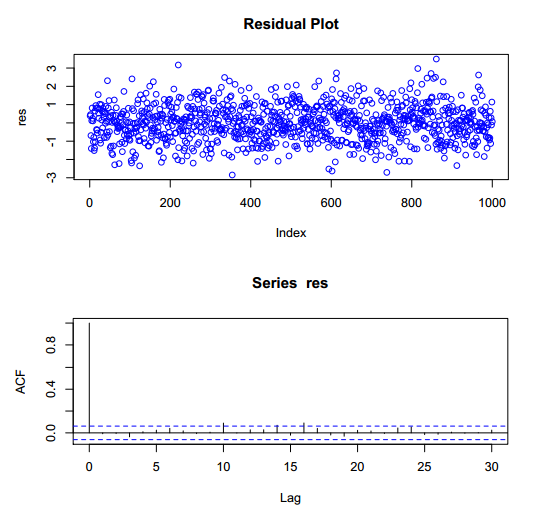

# Lecture 4

# Lecture 4 – Regression and Pairs Trading

In [Beginner R Tutorial](http://www.rfortraders.com/code/beginner-r-tutorial/), [FINC 621](http://www.rfortraders.com/code/finc-621/), [R Programming](http://www.rfortraders.com/code/r-programming/)

#### Regression Analysis

Regression is a very important topic. It is a widely used statistical tool in economics, finance and trading. R provides pre-written functions that perform linear regressions in a very straightforward manner. There exist multiple add-on packages that allow for more advanced functionality. In this class, we will only utilize the **lm()** function which is available in the base installation of R. The following example demonstrates the use of this function:

<table><tbody><tr id="p2541"><td class="code" id="p254code1"><pre class="rsplus" style="font-family:monospace;"> x    &lt;- rnorm(1000)
 y    &lt;- (x - 2) + rnorm(1000)
 outR &lt;- lm(y ~ x)
 summary(outR)</pre></td></tr></tbody></table>

What we did above was creat an independent variable x and a dependent variable y. The call to the function **lm()** performed an OLS (Ordinary Least Square’s) fit to the function: y = b0 + b1x + e, where e was distributed as N(mu, sigma^2)

The **~** is used to separate the independent from the dependent variables. The expression **y ~ x** is a formula that specifies the linear model with one independent variable and an intercept. If we wanted to fit the same model, but without the intercept, we would specify the formula as **y ~ x – 1**. This tells R to omit the intercept (force it to zero). The following graph illustrates the best fit lines for a model with and without an intercept. If you know that your model should contain an intercept term, then include it. Otherwise, do not include the intercept. For the subsequent pairs trading example, we are going to assume that the intercept term is equal to 0.

Whenever a regression is performed, it is very important to analyze the residuals (e) of the fitted model. If everything goes according to plan, the residuals will be normally distributed with no visible pattern in the data, no auto-correlation and no heteroskedasticity. The residuals can be extracted from the regression object by using the **residuals** keyword.

<table><tbody><tr id="p2542" class="alt-table-row"><td class="code" id="p254code2"><pre class="rsplus" style="font-family:monospace;"> res &lt;- outR$residuals
 par(mfrow = c(2,1))
 plot(res, col = "blue", main = "Residual Plot")
 acf(res)</pre></td></tr></tbody></table>

Here is a graph of both the residuals themselves and their auto-correlation.  

The **summary** keyword can be used to obtain the results of the linear regression model fit.

<table><tbody><tr id="p2543"><td class="code" id="p254code3"><pre class="rsplus" style="font-family:monospace;"> summary(outR)</pre></td></tr></tbody></table>

The p-values and t-statistics can be used to evaluate the statistical significance of the coefficients. The smaller the p-value, the more certain we are that the coefficient estimate is close to the actual population coefficient. Notice how both the intercept and the independent variable coefficient is significant in this example. The extraction of the coefficients can be accomplished via  
the **coefficients** keyword.

<table><tbody><tr id="p2544" class="alt-table-row"><td class="code" id="p254code4"><pre class="rsplus" style="font-family:monospace;"> outR$coefficients</pre></td></tr></tbody></table>

#### Pairs Trading

What follows is a really simple version of a pairs trade between two equities. The main motivation for the following example is to expose you to obtaining data via the quantmod package and in using the **lm()** function that we covered above.

We will explore a simple two-legged spread between AAPL and QQQ. Once we download and transform the timeseries for both stocks, we will define a simple trading rule and explore the trades that our signal generates. Various trade statistics and graphs will be presented.

##### Step 1: Obtain data via quantmod

<table><tbody><tr id="p2545"><td class="code" id="p254code5"><pre class="rsplus" style="font-family:monospace;"> #Utilize quantmod to load the security symbols
 require(quantmod)
 symbols &lt;- c("AAPL", "QQQ")
 getSymbols(symbols)</pre></td></tr></tbody></table>

Now that our data frames for AAPL and QQQ are loaded into memory, let’s extract some prices.

##### Step 2: Extract prices and time ranges

<table><tbody><tr id="p2546" class="alt-table-row"><td class="code" id="p254code6"><pre class="rsplus" style="font-family:monospace;"> #define training set
 startT  &lt;- "2007-01-01"
 endT    &lt;- "2009-01-01"
 rangeT  &lt;- paste(startT,"::",endT,sep ="")
 tAAPL   &lt;- AAPL[,6][rangeT]
 tQQQ   &lt;- QQQ[,6][rangeT]
&nbsp;
 #define out of sample set
 startO  &lt;- "2009-02-01"
 endO    &lt;- "2010-12-01"
 rangeO  &lt;- paste(startO,"::",endO,sep ="")
 oAAPL   &lt;- AAPL[,6][rangeO]
 oQQQ   &lt;- QQQ[,6][rangeO]</pre></td></tr></tbody></table>

Notice how we defined and in-sample and out-of-sample range. We will use the in-sample data to compute a simple hedge ratio and then we will apply this hedge ratio to the out of sample data.

##### Step 3: Compute returns and find hedge ratio

<table><tbody><tr id="p2547"><td class="code" id="p254code7"><pre class="rsplus" style="font-family:monospace;"> #compute price differences on in-sample data
 pdtAAPL &lt;- diff(tAAPL)[-1]
 pdtQQQ &lt;- diff(tQQQ)[-1]
&nbsp;
 #build the model
 model  &lt;- lm(pdtAAPL ~ pdtQQQ - 1)
&nbsp;
 #extract the hedge ratio
 hr     &lt;- as.numeric(model$coefficients[1])</pre></td></tr></tbody></table>

##### Step 4: Construct the spread

<table><tbody><tr id="p2548" class="alt-table-row"><td class="code" id="p254code8"><pre class="rsplus" style="font-family:monospace;"> #spread price (in-sample)
 spreadT &lt;- tAAPL - hr * tQQQ
&nbsp;
 #compute statistics of the spread
 meanT    &lt;- as.numeric(mean(spreadT,na.rm=TRUE))
 sdT      &lt;- as.numeric(sd(spreadT,na.rm=TRUE))
 upperThr &lt;- meanT + 1 * sdT
 lowerThr &lt;- meanT - 1 * sdT
&nbsp;
 #visualize the in-sample spread + stats
 plot(spreadT, main = "AAPL vs. QQQ spread (in-sample period)")
 abline(h = meanT, col = "red", lwd =2)
 abline(h = meanT + 1 * sdT, col = "blue", lwd=2)
 abline(h = meanT - 1 * sdT, col = "blue", lwd=2)</pre></td></tr></tbody></table>

Let’s look at the distribution of the spread.

<table><tbody><tr id="p2549"><td class="code" id="p254code9"><pre class="rsplus" style="font-family:monospace;"> hist(spreadT, col = "blue", breaks = 100, main = "Spread Histogram (AAPL vs. QQQ)")
 abline(v = meanT, col = "red", lwd = 2)</pre></td></tr></tbody></table>

##### Step 5: Define the trading rule

Once the spread exceeds our upper threshold, we sell AAPL and buy QQQ. Once the spread drops below our lower threshold, we buy AAPL and sell QQQ.

<table><tbody><tr id="p25410" class="alt-table-row"><td class="code" id="p254code10"><pre class="rsplus" style="font-family:monospace;"> indSell &lt;- which(spreadT &gt;= meanT + sdT)
 indBuy  &lt;- which(spreadT &lt;= meanT - sdT)</pre></td></tr></tbody></table>

##### Step 6: Figure out the trades

<table><tbody><tr id="p25411"><td class="code" id="p254code11"><pre class="rsplus" style="font-family:monospace;"> spreadL  &lt;- length(spreadT)
 pricesB  &lt;- c(rep(NA,spreadL))
 pricesS  &lt;- c(rep(NA,spreadL))
 sp       &lt;- as.numeric(spreadT)
 tradeQty &lt;- 100
 totalP   &lt;- 0
&nbsp;
 for(i in 1:spreadL) {
     spTemp &lt;- sp[i]
     if(spTemp &lt; lowerThr) {
        if(totalP &lt;= 0){
           totalP     &lt;- totalP + tradeQty
           pricesB[i] &lt;- spTemp
        }
     } else if(spTemp &gt; upperThr) {
       if(totalP &gt;= 0){
          totalP &lt;- totalP - tradeQty
          pricesS[i] &lt;- spTemp
       }
    }
 }</pre></td></tr></tbody></table>

##### Step 7: Visualize trades

<table><tbody><tr id="p25412" class="alt-table-row"><td class="code" id="p254code12"><pre class="rsplus" style="font-family:monospace;"> plot(spreadT, main = "AAPL vs. QQQ spread (in-sample period)")
 abline(h = meanT, col = "red", lwd =2)
 abline(h = meanT + 1 * sdT, col = "blue", lwd = 2)
 abline(h = meanT - 1 * sdT, col = "blue", lwd = 2)
 points(xts(pricesB,index(spreadT)), col="green", cex=1.9, pch=19)
 points(xts(pricesS,index(spreadT)), col="red", cex=1.9, pch=19)</pre></td></tr></tbody></table>

[Next: R Lecture 5](042_Lecture_5.md)