# Lecture 6

# Lecture 6 – Stochastic Processes and Monte Carlo

In [Beginner R Tutorial](http://www.rfortraders.com/code/beginner-r-tutorial/), [FINC 621](http://www.rfortraders.com/code/finc-621/), [R Programming](http://www.rfortraders.com/code/r-programming/)

The use of probability and statistics is ubiquitous in quantitative finance. All of the observable prices, volumes, order arrival rates, etc, are due to supply and demand imbalances. However, keeping track of all the supply and demand imbalances becomes cumbersome as the number of variables increases. Statistical tools are vital in explaining and modeling these effects. Stochastic processes and Monte Carlo analysis are some of the tools that are used in the fields of finance, economics and marketing.

#### Random Variables

The term random variable is somewhat of a misnomer. A random variable, in effect, is neither random nor a variable. It is a function that maps a particular sample space **Ω** onto the real number line **R**. We can express the above statement in mathematical notation as follows: **X : S → R**. For every event in S, X is a function that maps s to a real number.

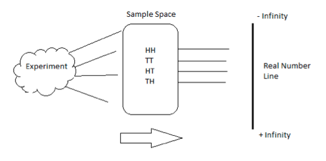

The following examples will help illustrate the difference between the a) experiment, b) sample space and c) mapping to the real line.

##### Flipping 2 coins

Consider flipping a fair coin 2 times. In this case, the **experiment** is the act of tossing the fair coin 2 times. The **sample space** is all the possible outcomes of the experiment. In this simple example, the sample space consists of {Head, Head}, {Head, Tail}, {Tail, Head} and {Tail, Tail}. Each **{}** item is an event in the sample space S. A random variable X is simply the function that takes each **{}** and maps it into a number.

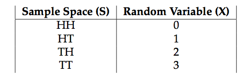

##### Tossing 1 die

In this experiment, you toss 1 fair die and count the number of dots that appear face up. The sample space is S = {1,2,3,4,5,6}. We can define a random variable X that assigns the number of dots to the real numbers {1,2,3,4,5,6}

#### Stochastic Process

Another name for _Stochastic Process_ is _Random Process_. Roughly speaking, one can think of such a process as a set of random variables indexed by time. Consider the case of a repeated coin toss. This process is called a _Bernoulli Process_. In effect, we have a sequence of random variables that can take on either the values 0 or 1. In this case, we are implicitly defining a random variable that maps the outcome of a head to 0 and the outcome of a tail to 1. More formally: A Bernoulli Process is a finite or infinite sequence of independent random variables X1, X2, X3, X4, … , such that:

1.  For each i,the value of Xi is either 0 or 1.
2.  For all values of i, the probability that Xi = 1 is the same number p.

#### Brownian Motion

Our end goal will be to write down a stochastic process for a particular stock or equity index. In order to do so, we need to explore the notion of a _Wiener Process_; otherwise known as Brownian Motion. This process forms the basic building block of more advanced models. The three properties of Brownian Motion are:

1.  W0 = 0.
2.  Wt is almost surely continuous.
3.  Wt has independent increments with Wt−Ws = N(0, t−s) for 0 < s < t.

##### Brownian Motion Example

Let’s take a look at an example of Brownian Motion.

<table><tbody><tr id="p3151"><td class="code" id="p315code1"><pre class="rsplus" style="font-family:monospace;"> bm &lt;- cumsum(rnorm(1000,0,1))
bm &lt;- bm - bm[1]
plot(bm, main = "Brownian Motion", col = "blue", type = "l")</pre></td></tr></tbody></table>

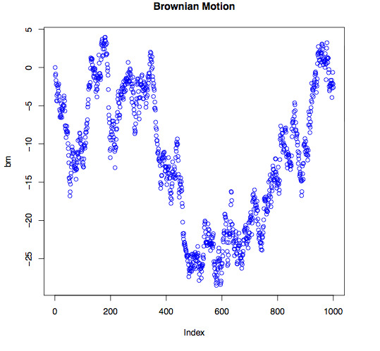

Next, let’s take a look whether any dependence exists between consecutive observations.

<table><tbody><tr id="p3152" class="alt-table-row"><td class="code" id="p315code2"><pre class="rsplus" style="font-family:monospace;"> acf(diff(bm), main = "Autocorrelation of Wt")</pre></td></tr></tbody></table>

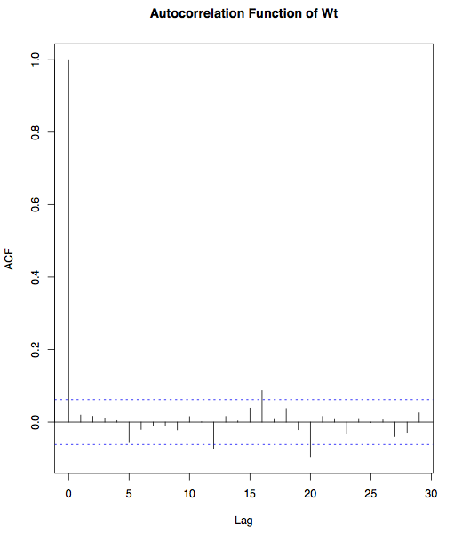

We can even investigate whether the differences are normally distributed.

<table><tbody><tr id="p3153"><td class="code" id="p315code3"><pre class="rsplus" style="font-family:monospace;"> par(mfrow = c(2,1))
 hist(diff(bm), col = "orange", breaks = 100, main = "Wt-s Distribution")
 qqnorm(diff(bm))
 qqline(diff(bm))</pre></td></tr></tbody></table>

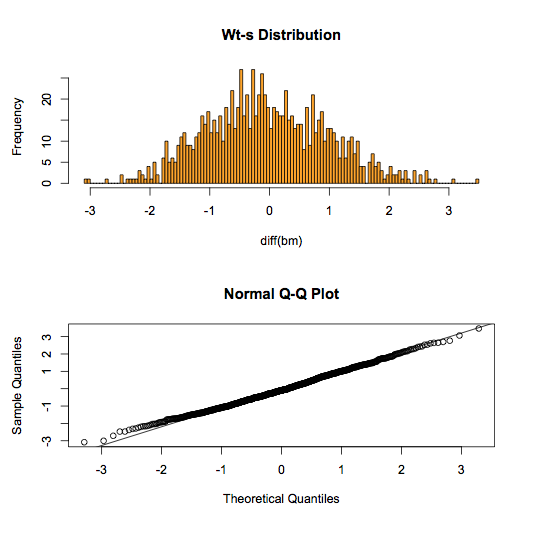

#### Monte Carlo Analysis

Monte Carlo analysis is a practical technique that has a long history and a ton of theory behind it. Fermi, Ulam and Von Neumann used statistical sampling ideas back in the 1930’s and 1940’s. The origins of statistical sampling date back to Laplace in the early 1800’s. The name Monte Carlo Analysis was suggested by Metropolis in 1946. Monte Carlo was used on the ENIAC computer to do neutron transport calculations in th mid 1940’s. Today, Monte Carlo analysis is utilized in all fields of research. The main assumption of this approach is that a randomly chosen sample tends to exhibit the same properties as the population from which it as drawn. Before we apply this technique to modeling stock prices, let’s take a look at a simple example.

##### How many runs of 4 do we expect in a sequence of 1000 coin tosses?

In other words, we toss a coin 1000 times. How many times should we expect to see 4 heads or 4 tails in a row? This is a problem that can easily be solved by repeated sampling from a known distribution.

<table><tbody><tr id="p3154" class="alt-table-row"><td class="code" id="p315code4"><pre class="rsplus" style="font-family:monospace;"> run4 &lt;- numeric(10000)
for(i in 1:10000) {
   run4[i] &lt;- sum(rle(sample(c(-1, 1), 1000, TRUE))$lengths == 4)
}
hist(run4)
mean(run4)</pre></td></tr></tbody></table>

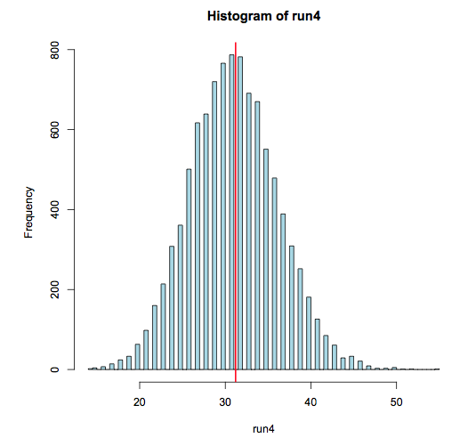

Armed with our basic building block (Brownian Motion, we can go on to construct a plausible model for the behavior of actual stock prices. Before we proceed with constructing a model, let’s take a look at some of the stylized facts of actual stock prices.

##### Prices and Returns

<table><tbody><tr id="p3155"><td class="code" id="p315code5"><pre class="rsplus" style="font-family:monospace;"> #load quantmod
library(quantmod)
getSymbols("AAPL")
price_AAPL &lt;- AAPL[,6]
plot(price_AAPL, main = "The price of AAPL")</pre></td></tr></tbody></table>

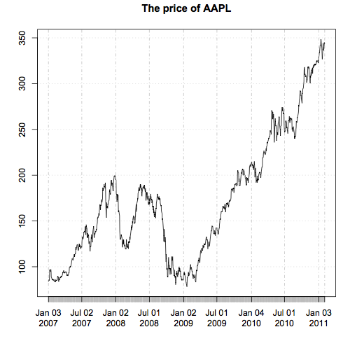

The first thing we notice is that this price series doesn’t appear to be stationary. In other words, there is no obvious mean price and it doesn’t make sense to talk about the standard deviation of the price. Working with such non-stationary timeseries is a hassle. If prices are not convenient to work with, then what should we use instead? Let’s take a look at the percentage returns of this stock.

<table><tbody><tr id="p3156" class="alt-table-row"><td class="code" id="p315code6"><pre class="rsplus" style="font-family:monospace;"> returns_AAPL &lt;- diff(log(price_AAPL))
plot(returns_AAPL, main = "AAPL % returns", col = "navyblue")
hist(returns_AAPL, breaks = 100, col="brown")</pre></td></tr></tbody></table>

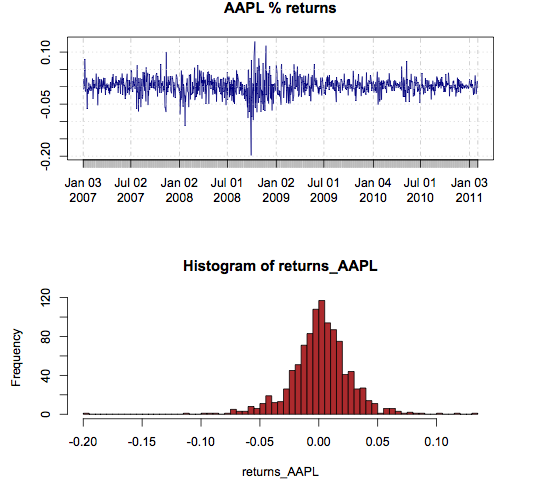

Apart from some clustering in the returns plot, it appears that the returns are distributed somewhat like a normal (Gaussian) distribution. This is an exciting fact since we already know how to work with normal distributions! How about independence? Are these returns independent of each other in time? Here’s a quick way to partially answer that question:

<table><tbody><tr id="p3157"><td class="code" id="p315code7"><pre class="rsplus" style="font-family:monospace;"> acf(returns_AAPL[-1], main = "Autocorrelation plot of returns")</pre></td></tr></tbody></table>

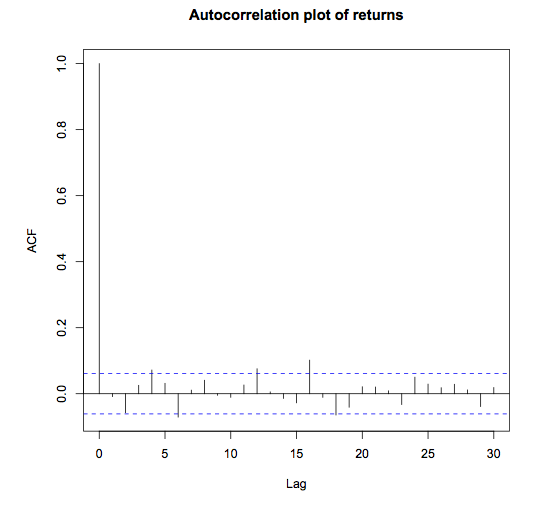  
Notice that there doesn’t seem to be any autocorrelation between consecutive returns. What are the mean and standard deviation of these returns?

<table><tbody><tr id="p3158" class="alt-table-row"><td class="code" id="p315code8"><pre class="rsplus" style="font-family:monospace;"> mR  &lt;- mean(returns_AAPL[-1])
sdR &lt;- sd(returns_AAPL[-1])
&gt; mR
 [1] 0.001369495
&gt; sdR
 [1] 0.02572958</pre></td></tr></tbody></table>

##### Leap of Faith

So, the typical argument goes as follows:

*   We want to deal with stationary timeseries since we have a ton of statistical tools available at our disposal that deal with such timeseries.
*   Prices are surely non-stationary. Is there any other transformation of prices that, at least, looks like it might be stationary?
*   It seems like percentage returns fit the bill.
*   It also looks like percentage returns have a stable mean and standard deviation.
*   So we can make the claim that percentage returns are normally distributed with mean μ and standard deviation σ.

Now, remember what our end goal is. We want a way to simulate stock prices. In order to do so, we need to come up with a model of how the prices behave (are distributed.) If returns are normally distributed, then how are prices distributed? The answer to this question is straightforward. A little math shows us the answer: Rt = log(Pt/Pt−1). The logarithm of the price is normally distributed. This means that price has a lognormal distribution. A straightforward method to simulate a stock price is to draw a random normal number with a certain mean and standard deviation value, and then exponentiate this number. Based on the formula from above: Pt = Pt−1\*e^Rt. To summarize:

1.  Draw a random number from N(μ, σ).
2.  Exponentiate that number and mulitply it by Pt−1.
3.  Repeat for t = 1…N.

<table><tbody><tr id="p3159"><td class="code" id="p315code9"><pre class="rsplus" style="font-family:monospace;"> N     &lt;- 1000
mu    &lt;- 0.0010
sigma &lt;- 0.025
p  &lt;- c(100, rep(NA, N-1))
for(i in 2:N)
   p[i] &lt;- p[i-1] * exp(rnorm(1, mu, sigma))
plot(p, type = "l", col = "brown", main = "Simulated Stock Price")</pre></td></tr></tbody></table>

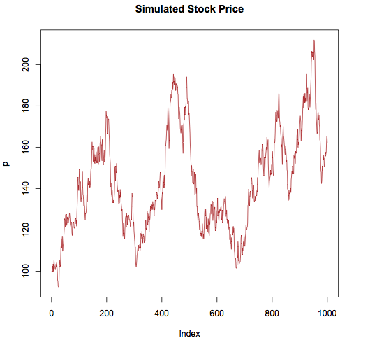

##### Portfolio Simulation

Next, we will take a look at a simple portfolio simulation example.

<table><tbody><tr id="p31510" class="alt-table-row"><td class="code" id="p315code10"><pre class="rsplus" style="font-family:monospace;"> require(MASS)
require(quantmod)
&nbsp;
#load a few symbols into memory
getSymbols(c("AAPL", "QQQQ", "SPY", "GOOG", "CVX"))
&nbsp;
#plot the prices of these stocks 
par(mfrow = c(3,2))
plot(AAPL[,6], main = "AAPL")
plot(QQQQ[,6], main = "QQQQ")
plot(SPY[,6], main = "SPY")
plot(GOOG[,6], main = "GOOG")
plot(CVX[,6], main = "CVX")
par(mfrow = c(1,1))
&nbsp;
#compute price matrix
pM &lt;- cbind(AAPL[,6], QQQQ[,6], SPY[,6], GOOG[,6], CVX[,6])
&nbsp;
#compute returns matrix
rM &lt;-  apply(pM,2,function(x) diff(log(x)))
&nbsp;
#look at pairwise charts
pairs(coredata(rM))
&nbsp;
#compute the covariance matrix
covR &lt;- cov(rM)
&nbsp;
#use this covariance matrix to simulate 
# normal random numbers that share a 
# similar correlation structure with actual data
meanV &lt;- apply(rM, 2, mean)
rV    &lt;- mvrnorm(n = nrow(rM), mu = meanV, Sigma = covR)
&nbsp;
#simulate prices based on these correlated random variables
&nbsp;
#calculate mean price
p0 &lt;- apply(pM,2,mean)
sPL &lt;- list()
for(i in 1:ncol(rM)){
   sPL[[i]] &lt;-round(p0[i]*exp(cumsum(rV[,i])),2)
}
&nbsp;
#plot simulated prices
par(mfrow = c(3,2)) 
plot(sPL[[1]],main="AAPLsim",type="l")
plot(sPL[[2]], main = "QQQQ sim",type = "l")
plot(sPL[[3]], main = "SPY sim", type = "l") 
plot(sPL[[4]], main = "GOOG sim",type = "l") 
plot(sPL[[5]], main = "CVX sim", type = "l")</pre></td></tr></tbody></table>

In the prior example, we gather daily data for 5 stocks and we compute the covariance matrix of the returns, along with an average price for each security. Since the purpose of this exercise is to generate a realistic simulation of the portfolio, we use the function mvrnorm() to create a matrix of random normal variables that are correlated in a similar manner as the original data. The following graphs display the original stock prices, the pairwise plot of their returns and the simulated stock prices. One can also look at the correlation matrix of the actual returns and the simulated returns and verify that they are similar.

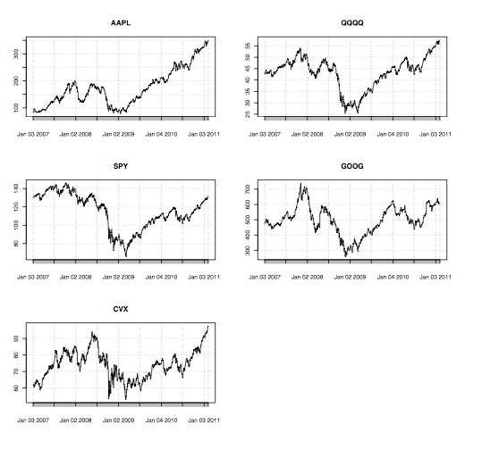

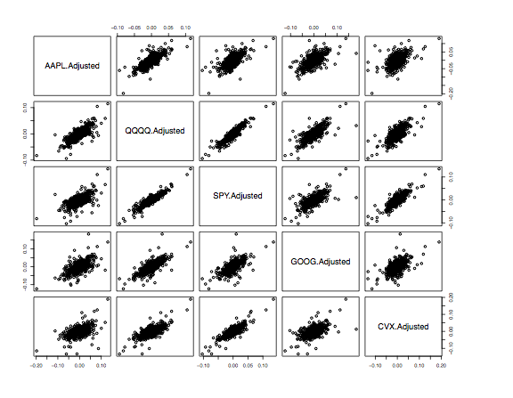

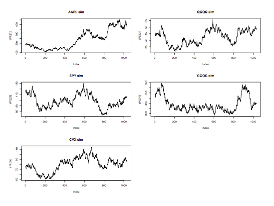

[Next: R Lecture 7](044_Lecture_7.md)

#### References

1.  [Stochastic Process](http://en.wikipedia.org/wiki/Stochastic_process)
2.  [Random Variable and Process](http://www.iitg.ernet.in/scifac/qip/public_html/cd_cell/chapters/Statistical%20Signal%20Processing.pdf)
3.  [Bernoulli Process](http://en.wikipedia.org/wiki/Bernoulli_process)
4.  [Wiener Process](http://en.wikipedia.org/wiki/Wiener_process)