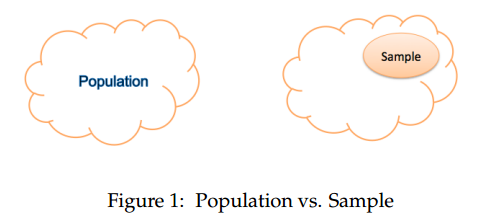
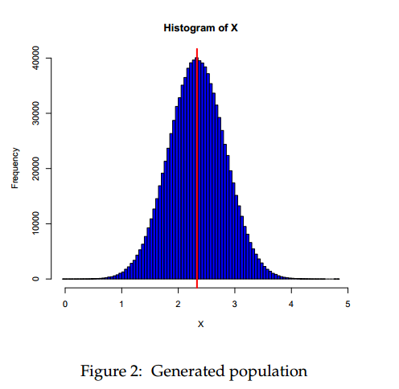
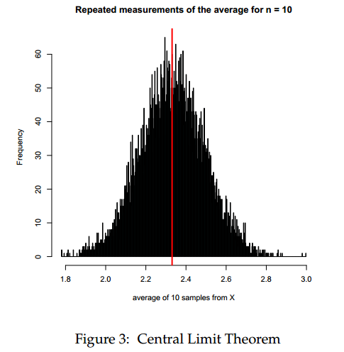
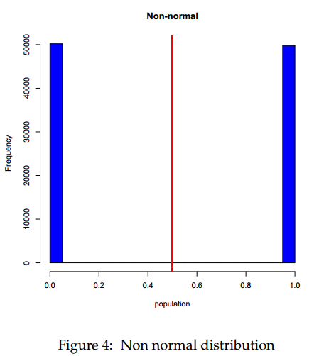
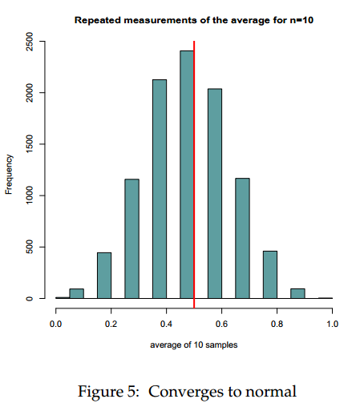
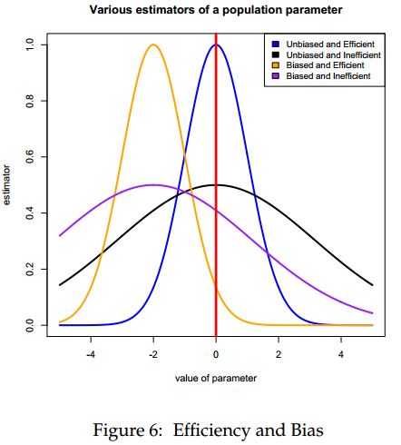
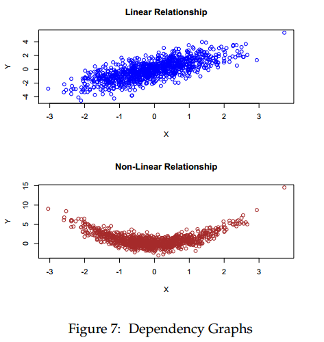

# Lecture 5

# Lecture 5 – Applied Statistical Concepts

In [Beginner R Tutorial](http://www.rfortraders.com/code/beginner-r-tutorial/), [FINC 621](http://www.rfortraders.com/code/finc-621/), [R Programming](http://www.rfortraders.com/code/r-programming/)

In this lecture we will discuss statistical estimators, investigate the law of large numbers, the central limit theorem and look at implementing all these concepts within R.

#### Population vs. Sample Statistics

Consider the set of numbers: 102, 103.2, 102, 101.2, 499, 103.2 101.23, 99.2.  
Here are some questions we might want to ask about these numbers:

1.  Where do these numbers come from?
2.  Are these all the numbers, or should I expect more to arrive?
3.  Is there a sequence (pattern) present or are these random?

We notice something right off the bat. We need to make assumptions. If these are the only numbers in our set, then we call this set a **population**. If the numbers are a sample from a larger set, then we call this a **sample.**  

##### Motivation

We want to write down the height of every Loyola student and we want to ask the following questions:

1.  What is the average height of all the Loyola students?
2.  What is the variance from that average height?

What is the sample and what is the population in this example?

#### Law of Large Numbers

Use R to generate 100000 random numbers. This is our population. Compute the mean and the standard deviation of these numbers.

<table><tbody><tr id="p2791"><td class="code" id="p279code1"><pre class="rsplus" style="font-family:monospace;"> set.seed(100)
 X &lt;- rnorm(1000000, 2.33, 0.5)
 mu &lt;- mean(X)
 sd &lt;- sd(X)
 hist(X, col = "blue", breaks = 100)
 abline(v = mu, col = "red", lwd = 3)</pre></td></tr></tbody></table>

Next, let’s take samples from this population and compute the average of these samples for different sample sizes.

<table><tbody><tr id="p2792" class="alt-table-row"><td class="code" id="p279code2"><pre class="rsplus" style="font-family:monospace;"> sample5 &lt;- sample(X, 5, replace = TRUE)
 sample10 &lt;- sample(X, 10, replace = TRUE)
 sample50 &lt;- sample(X, 50, replace = TRUE)
&nbsp;
 mean(sample5)
 mean(sample10)
 mean(sample50)
 mean(sample(X,1000,replace=TRUE))
 mean(sample(X,10000,replace=TRUE))</pre></td></tr></tbody></table>

Notice how the mean of the samples converges to the population mean as the number of samples increases. This is referred to as the **Law of Large Numbers.**

#### Central Limit Theorem

This example will build on the previous example. This time, we will take repeated measurements from X, but we will keep the sample size the same.

<table><tbody><tr id="p2793"><td class="code" id="p279code3"><pre class="rsplus" style="font-family:monospace;"> meanList &lt;- list()
 for(i in 1:10000) {
   meanList[[i]] &lt;- mean(sample(X, 10, replace=TRUE))
 }
 hist(unlist(meanList), breaks = 500, main = "Repeated measurements of the
      average for n = 10", col = "cadetblue", xlab = "average of 10 samples from X")
 abline(v=mu,col="red",lwd=3)</pre></td></tr></tbody></table>

The distribution of the sample average converges to a normal looking distribution! This property is referred to as the **Central Limit Theorem.**  

To see how powerful the Central Limit Theorem is, consider a population that is highly non-normal. We only draw a zero or a one repeatedly and look at the  
distribution.

<table><tbody><tr id="p2794" class="alt-table-row"><td class="code" id="p279code4"><pre class="rsplus" style="font-family:monospace;"> population &lt;- sample(c(0,1), 100000, replace=TRUE)
 hist(population, col="blue", main="Non-normal")
 abline(v=mean(population), lwd=3, col="red")</pre></td></tr></tbody></table>

By taking repeated samples of size 10 from this highly non-normal distribution, we still obtain a normal looking distribution for the sample mean!

<table><tbody><tr id="p2795"><td class="code" id="p279code5"><pre class="rsplus" style="font-family:monospace;"> meanList &lt;- list()
 for(i in 1:10000) {
   meanList[[i]] &lt;- mean(sample(population, 10, replace = TRUE))
 }
 hist(unlist(meanList), main = "Repeated measurements of the average for n=10",
      col = "cadetblue", xlab = "average of 10 samples")
 abline(v = 0.5, col = "red", lwd = 3)</pre></td></tr></tbody></table>

#### Unbiasedness and Efficiency

In a nutshell, unbiasedness means that the expected value of the estimator equals the true value of the parameter. Efficiency means that the variance of the estimator is as small as possible.  

#### Covariance Matrix

Before we can start talking about what a covariance matrix is, we need to address the concepts of volatility and portfolio risk. This discussion will only focus on equities. Similar arguments can be applied to other instrument classes (bonds, options, futures, etc).

##### Volatility

Volatility is a proxy for risk. The Greek letter sigma **σ** is used to denote volatility. Inherently, when a stock has more risk, we can say that the **σ** of the stock is higher. Volatility is closely related to the second moment of the return distribution of a particular stock. Volatility is also the square root of the variance.

##### Mathematical Properties of Volatility

The following mathematical operations apply to the variances of random variables **X** and **Y**

*    = a^2Var(X)")
*   .latex "Var(aX + bY) = a^2 Var(X) + b^2 Var(Y) + 2abCov(X,Y)")
*   .latex "Cov(X,Y) = \rho \sigma_X\sigma_Y")

The **ρ** variable is the correlation between instruments X and Y. Think of X as the percentage returns of a particular stock named X. Similarly, think of Y as the percentage returns of stock Y. The correlation between X and Y signifies the strength of linear relationship between the two return series. The following graphic depicts the relationship between the two random variables X and Y. The first one is a linear relationship, whereas the second one is a non-linear relationship. Even though there exists a strong dependence between the random variables in the second graph, the correlation is very low.  

#### Portfolio Risk

The idea of portfolio diversification has been known for quite some time. Diversification implies that one can create a portfolio of risky instruments where the aggregate risk is smaller than the sum of the individual risks. We can use formula 2 from above to understand this idea. The diversification (risk reduction) actually comes from the covariance term of equation 2. As the number of instruments in a particular portfolio increases, so does the benefit of diversification via the mutual covariance. Formula 2 becomes cumbersome to write as the number of instruments increases. The formula below represents the variance of a portfolio of 3 instruments.

.latex "Var(aX + bY + cZ) = a^ 2 Var(X) + b^ 2 Var(Y) + c^ 2 Var(Z) + 2abCov(X,Y) + 2acCov(X,Z) + 2bcCov(Y,Z)")

The risk of the portfolio **σ** is the square root of this formula. For many assets, writing down such a formula becomes a nightmare. Luckily, there is an easier way to express the portfolio risk.

#### Matrix Notation

The portfolio variance for three assets can be written in a quadratic form as follows:

1.  .latex "Var(\Pi) = w\Sigma w^ t")
2.  .latex "\Sigma = \begin{pmatrix} Var(X)&Cov(X,Y) &Cov(X,Z) \\ Cov(Y,X)&Var(Y) &Cov(Y,Z) \\ Cov(Z,X)&Cov(Z,Y) &Var(Z) \end{pmatrix}")
3.  .latex "w = (w_X,w_Y ,w_Z) ")

The covariance matrix **Σ** plays a pivotal role in modern portfolio theory. All the important volatility and correlation information between instruments can be encapsulated within this matrix. One of the important properties of a covariance matrix is the notion of positive definiteness. Intuitively, we would  
never expect the risk of a portfolio to be a negative number. Positive definiteness is exactly the property of the matrix that guarantees this fact. A covariance matrix is positive definite if the following holds:

1.  wΣw^t > 0

A covariance matrix can be produced within R by using the **cov()** command.

[Next: R Lecture 6](043_Lecture_6.md)