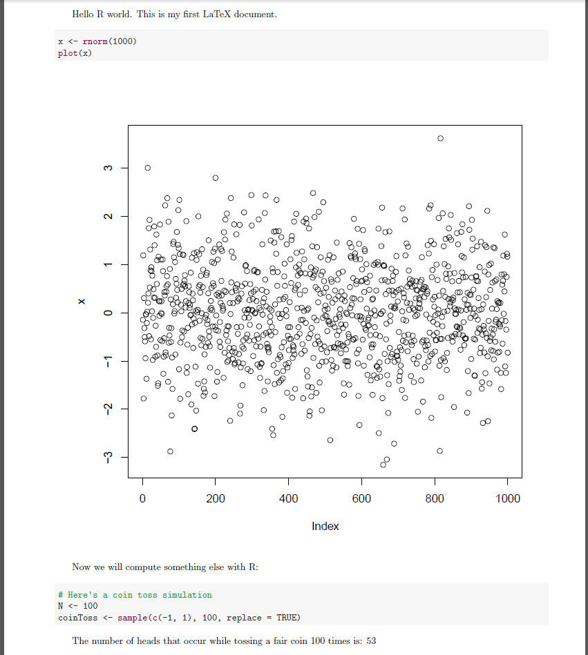

# Lecture 7

# Lecture 7 – Visualization and Reporting with R

In [Advanced R Tutorial](http://www.rfortraders.com/code/advanced-r-tutorial/), [FINC 621](http://www.rfortraders.com/code/finc-621/), [R Programming](http://www.rfortraders.com/code/r-programming/)

By now you should be familiar with most of the core functionality of the R programming language. We can perform simulations, graph results, create summary statistics, export our results to files and accomplish almost any programming feat by simply using the base installation of R. In this lecture I want to introduce a few tools (libraries) that extend R’s reach. Especially, in terms of producing robust and elegant visualizations and drafting reproducible reports.

#### Graphing

All of our graphing needs up to this point have been met by the **plot()**, **lines()** and **abline()** functions. We can do better than this.

[Hadley Wickham](http://had.co.nz/) has created a great library that takes graphing/plotting in R to a whole new level. The library is called **ggplot2** and much more information about it can be found here: [ggplot2 examples.](http://ggplot2.org/)

According to the ggplot2 website: _“ggplot2 is a plotting system for R, based on the grammar of graphics, which tries to take the good parts of base and lattice graphics and none of the bad parts. It takes care of many of the fiddly details that make plotting a hassle (like drawing legends) as well as providing a powerful model of graphics that makes it easy to produce complex multi-layered graphics.”_

Let’s take a look at a few examples. (I will closely follow the examples presented [here.](http://docs.ggplot2.org/current/qplot.html))

##### qplot()

We will be utilizing the _mtcars_ data frame that is already accessible through R. Here’s what it looks like:

The **qplot()** function is similar to the **plot()** function in many respects.

<table><tbody><tr id="p3351"><td class="code" id="p335code1"><pre class="rsplus" style="font-family:monospace;"> require(ggplot2)
 qplot(mpg, wt, data = mtcars)</pre></td></tr></tbody></table>

<table><tbody><tr id="p3352" class="alt-table-row"><td class="code" id="p335code2"><pre class="rsplus" style="font-family:monospace;"> # Add different colors based on the cylinder type 
 qplot(mpg, wt, data = mtcars, colour = cyl)</pre></td></tr></tbody></table>

<table><tbody><tr id="p3353"><td class="code" id="p335code3"><pre class="rsplus" style="font-family:monospace;"> # Different styling based on the cylinder type
 qplot(mpg, wt, data = mtcars, size = cyl)</pre></td></tr></tbody></table>

<table><tbody><tr id="p3354" class="alt-table-row"><td class="code" id="p335code4"><pre class="rsplus" style="font-family:monospace;"> # One or two sided faceting formula
 qplot(mpg, wt, data = mtcars, facets = vs ~ am)</pre></td></tr></tbody></table>

##### Graphics grammar syntax

Let’s take a look at a more interesting example that leverages the graphics grammar paradigm. More information on what a graphics grammar is can be found [here.](http://vita.had.co.nz/papers/layered-grammar.pdf)

<table><tbody><tr id="p3355"><td class="code" id="p335code5"><pre class="rsplus" style="font-family:monospace;"> stocks &lt;- data.frame(signal = sample(c("Buy", "Sell"), 100, replace = TRUE), returns = rnorm(100, 0, 0.6))
&nbsp;
obj &lt;- ggplot(stocks, aes(x=returns))
obj &lt;- obj + geom_histogram(aes(y=..density..), binwidth=.8, colour="red", fill="grey") 
obj &lt;- obj + geom_density(alpha=.2, fill="purple")
obj</pre></td></tr></tbody></table>

#### Reporting

No matter how sophisticated or elegant your statistical analysis happens to be, if you can’t report your results in a meaningful and reproducible way to your management or end-users of your research, your conclusions will be lost. The following steps outline one easy way for weaving together your analytics with your reporting and presenting the end result in a clean and comprehensive manner.

##### Rstudio

Rstudio is currently one of the best IDE’s (Integrated Development Environment) available for the R language. It is 100% free, is cross-platform (meaning that it works on windows, linux and mac machines) and enables R programmers to become more productive by providing them with all the functionality they could possibly need within the IDE.

Rstudio can be downloaded from [Rstudio.com](http://www.rstudio.com/). Rstudio bundles various third party libraries that we will be utilizing in this lecture. One of them is **knitr**. This library was created by [Yihui Xie](http://yihui.name/knitr/) and allows one to create PDF reports that include embedded R code along with LaTeX formatting. To find more about what LaTeX is and how it can help you write better documents, click here: [LaTeX details.](http://en.wikipedia.org/wiki/LaTeX)

In order to use the **knitr** library, LaTeX needs to be installed on your computer. If you are using a windows machine, you can obtain LaTeX from here: [LaTeX for Windows.](http://miktex.org/download) If you are using a mac, you can get LaTeX from here: [LaTeX for Mac.](http://pages.uoregon.edu/koch/texshop/) Once you have downloaded and installed Rstudio, there is no need to install **knitr**. It is already part of the Rstudio installation.

##### How to create a simple .pdf report with Rstudio

Here are some basics:

1.  Open Rstudio, click on File -> New -> R Sweave
    
    
    
2.  Let’s start off with a simple example that doesn’t include any R code yet. Type the following between the begin{document} and end{document} tags. _Hello R world. This is my first LaTeX document._
3.  Now click on the _Compile PDF_ button above and save the file to an appropriate location.
4.  This is what you will see. A complete .pdf document.

Let’s take this a step further and add some R code and some formatting into the mix. Here’s what the complete document contents should look like:

<table><tbody><tr id="p3356" class="alt-table-row"><td class="code" id="p335code6"><pre class="rsplus" style="font-family:monospace;"> \documentclass{article}
&nbsp;
 \begin{document}
&nbsp;
   Hello R world. This is my first LaTeX document. 
&nbsp;
   &lt;&lt;echo = TRUE, message = FALSE&gt;&gt;=
&nbsp;
    x &lt;- rnorm(1000)
    plot(x)
&nbsp;
   @
&nbsp;
 \end{document}</pre></td></tr></tbody></table>

The _echo = TRUE_ command tells knitr to output the code to the pdf file. Not only is the code echoed to the user, it is also executed and the result prints to the pdf document.

Here’s a slightly more complicated example that passes a variable calculated from R back to the LaTeX text. I have also added some formatting to the pdf document itself for adjusting the margins slightly. Notice the use of the **Sexpr** command in the example below:

<table><tbody><tr id="p3357"><td class="code" id="p335code7"><pre class="rsplus" style="font-family:monospace;"> \documentclass{article}
&nbsp;
  \usepackage[
   top    = 1.00cm,
   bottom = 1.00cm,
   left   = 2.00cm,
   right  = 1.50cm]{geometry}
&nbsp;
 \begin{document}
&nbsp;
   Hello R world. This is my first LaTeX document. 
&nbsp;
   &lt;&lt;echo = TRUE, message = FALSE&gt;&gt;=
&nbsp;
    x &lt;- rnorm(1000)
    plot(x)
   @
&nbsp;
   Now we will compute something else with R:
&nbsp;
   &lt;&lt;echo = TRUE, message = FALSE&gt;&gt;=
&nbsp;
   # Here's a coin toss simulation
   N        &lt;- 100
   coinToss &lt;- sample(c(-1, 1), 100, replace = TRUE)
&nbsp;
   @
&nbsp;
  The number of heads that occur while tossing 
  a fair coin \Sexpr{N} times is: \Sexpr{length(which(coinToss == 1))}
&nbsp;
 \end{document}</pre></td></tr></tbody></table>

Formatting a LaTeX document is something that we have not covered in this class. [Here’s a](http://www.stdout.org/~winston/latex/latexsheet.pdf) cheat sheet that might come in handy when working with LaTeX syntax.

