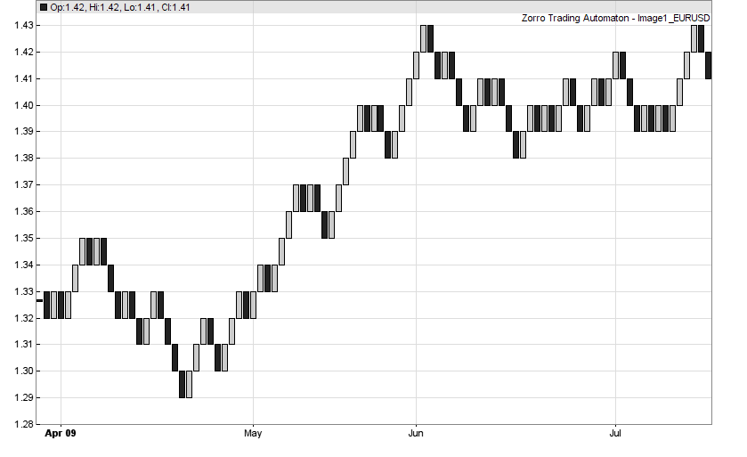

# bar

# User-defined bars

Instead of fixed bar periods, bars can also cover fixed price ranges or can be defined by other criteria. Some traders believe that those special bars help their trading, because they make the chart look simpler. Zorro supports a user-defined **bar** function for special bars of any kind. Predefined functions for Range, Renko, Haiken Ashi, or Point-and-Figure bars are included. The **bar** function can be used for single-asset or multiple-asset strategies, or for strategies that use multiple bar types simultaneously. In the case of single-asset strategies the individual bars are also plotted in the chart.

  
Range bars (see code)

  
 

## bar(vars Open, vars High, vars Low, vars Close, _vars Price, DATE Start, DATE Time_): int

User-supplied function for defining a [bar](005_Bars_and_Candles.md). Used to create special bar types or to replace the mean price by a different algorithm. The **bar** function is automatically called whenever a new price quote arrives or a price tick is read from a historical file. It can modify the candle and determine when the bar ends.  

### Parameters:

<table border="0"><tbody><tr><td width="94"><strong>Open, High,<br>Low, Close,<br>Price</strong></td><td width="659"><p>Series with two elements of the corresponding price; f.i. <strong>Close[1]</strong> is the close price of the previous bar, and <strong>Close[0]</strong> is the most recent price. The prices of the current bar can be modified by the <strong>bar</strong> function. <strong>Price</strong> is the mean price and can be omitted when not used in the function.</p></td></tr><tr><td><strong>Start</strong></td><td>Optional start time of the bar in the OLE DATE format. Can be omitted when not used in the function.</td></tr><tr><td><strong>Time</strong></td><td>Optional time of the most recent tick or price quote. Can be omitted when not used in the function.</td></tr></tbody></table>

### Returns:

**0** - close the bar at the normal end of the [BarPeriod](177_BarPeriod_TimeFrame.md).**1** \- close the bar now, and call the **bar** function again at the next price tick.  
**4** - keep the bar open, and call the **bar** function again at the next price tick.  
**8** - call the **bar** function only at the end of every bar.

### Remarks:

*   The **bar** function in a single asset strategy is automatically called during the history building process and has access to the current and previous candle. Indicators, series, price, or trade functions cannot be called from inside a **bar** function. If needed for a very special bar, calculate the candle in the **run** function and pass it to the **bar** function through global variables.
*   If prices are not otherwise modified by the **bar** function, they are set up as for a normal candle, i.e. **Open\[0\]** is the first price of the bar, **High\[0\]** is the highest price so far, **Low\[0\]** the lowest price and **Price\[0\]** the current mean price of the bar.
*   Modified prices also determine the corresponding price functions ([priceO](price.md), [priceH](022_Price_History.md), [priceL](022_Price_History.md), [priceC](022_Price_History.md), [price](022_Price_History.md)) and all price-dependent indicators. This can cause **data-snooping** and therefore unrealistic backtests when the bar open price is affected by its close price or by the high or low. Backtest with the [TICKS](018_TradeMode.md) flag for making sure that the trades open and close at the recent tick instead of the back candle,thus eliminating snooping bias.
*   Set [Slippage = 0](191_Spread_Commission.md) for backtests with user defined bars. Slippage simulation works only with normal bars.
*   The price history should have sufficient resolution so that any special bar covers at least one price quote. Special bars cannot have higher resolution than the price history.
*   Most special bars, such as Haiken Ashi or Range/Renko bars, are **affected by any preceding bar** and thus depend on the time stamp or price at the very first bar. Their candles therefore depends on start date, lookback period, bar period, bar offset, time zone, or any other settings that affect the first bar.
*   [BarPeriod](177_BarPeriod_TimeFrame.md) has no effect on range dependent bars except for the above mentioned start time and the pre-allocation of bar memory. For allocating enough bars without wasting memory, set [BarPeriod](177_BarPeriod_TimeFrame.md) to the approximate average bar duration that is displayed in the [performance report](012_Performance_Report.md). If you don't know it, set **BarPeriod = 1**. Bar zones and bar offsets should not be set when using special bar types.
*   In **multi-asset strategies**, or in strategies with multiple bar types, the bar defining function must be called in the script individually per asset or algo, and thus needs a different name than **bar** for not being called automatically. Since any asset has different bars, [series](091_series.md) must be static and shifted by script. An example for a multiple asset strategy with Renko bars can be found in the **[SpecialBars](020_Included_Scripts.md)** script.
*   **Renko bars** are described slightly differently on different websites. The examples below contain 3 known variants.
*   Traditional price-distance bars, such as Renko, Range, or Point-and-Figure bars, are not really recommended for serious trading systems, since they ignore the time component and have normally a negative effect on the performance. This may be different for special bars sampled by other criteria such as trade volume or tick rate. Experiment with your own bar types!

### Examples (see also SpecialBars.c):

```c
var BarRange = 0.0030; _// 0.3 cents bar range

// Range Bars, standard (high-low)_
int bar(vars Open,vars High,vars Low,vars Close)
{
  if(Open\[0\] != Close\[1\]) {
    High\[0\] = max(Open\[0\],Close\[1\]);
    Low\[0\] = min(Open\[0\],Close\[1\]);
    Open\[0\] = Close\[1\];
  }
  if(High\[0\]-Low\[0\] >= BarRange)
    return 1;
  return 4;
}

_// Renko Bars, standard_
int bar(vars Open,vars High,vars Low,vars Close)
{
  Open\[0\] = roundto(Close\[1\],BarRange);
  if(Close\[0\]-Open\[0\] >= BarRange) {
    Close\[0\] = Open\[0\]+BarRange;
    High\[0\] = Close\[0\];
    Low\[0\] = Open\[0\];
    return 1;
  }
  if(Open\[0\]-Close\[0\] >= BarRange) {
    Close\[0\] = Open\[0\]-BarRange;
    High\[0\] = Open\[0\];
    Low\[0\] = Close\[0\];
    return 1;
  }
  return 4;
}

_// Renko Bars with wicks_
int bar(vars Open,vars High,vars Low,vars Close)
{
  Open\[0\] = roundto(Close\[1\],BarRange);
  if(Close\[0\]-Open\[0\] >= BarRange) { 
    Close\[0\] = Open\[0\]+BarRange;
    return 1;
  }
  if(Close\[0\]-Open\[0\] <= -BarRange) { 
    Close\[0\] = Open\[0\]-BarRange;
    return 1;
  }
  return 4;
}

_// Renko Bars, variant_
int bar(vars Open, vars High, vars Low, vars Close)
{
  var OpenDiff = abs(Close\[0\]-Open\[1\]);
  var CloseDiff = abs(Close\[0\]-Close\[1\]);
  if(OpenDiff < CloseDiff) _// we have a valley or peak_
     Open\[0\] = Open\[1\];
  else  _// we are moving with the trend_
     Open\[0\] = roundto(Close\[1\],BarRange);
  if(Close\[0\]-Open\[0\] >= BarRange) {  _// going up_
    Close\[0\] = Open\[0\]+BarRange;
    High\[0\] = Close\[0\];
    Low\[0\] = Open\[0\];
    return 1;
  }
  if(Open\[0\]-Close\[0\] >= BarRange) { _// going down_
    Close\[0\] = Open\[0\]-BarRange;
    High\[0\] = Open\[0\];
    Low\[0\] = Close\[0\];
    return 1;
  }
  return 4;
}

_// Mean Renko Bars_
int bar(vars Open, vars High, vars Low, vars Close)  
{  
  Open\[0\] = 0.5\*(Close\[1\]+Open\[1\]);  
  if(Close\[0\] <= Open\[0\] - BarRange) {  
    Close\[0\] = Open\[0\] - BarRange;  
    return 1;  
  } else if(Close\[0\] >= Open\[0\] + BarRange) {  
    Close\[0\] = Open\[0\] + BarRange;  
    return 1;  
  }  
  return 4;  
}  
_// Haiken Ashi Bars_
int bar(vars Open,vars High,vars Low,vars Close)
{
  Close\[0\] = (Open\[0\]+High\[0\]+Low\[0\]+Close\[0\])/4;
  Open\[0\] = (Open\[1\]+Close\[1\])/2;
  High\[0\] = max(High\[0\],max(Open\[0\],Close\[0\]));
  Low\[0\] = min(Low\[0\],min(Open\[0\],Close\[0\]));
  return 8;
}

_// Point-and-Figure Bars_
int bar(vars Open,vars High,vars Low,vars Close)
{
  static int direction = 0;
  if(direction == 1 && High\[0\]-Close\[0\] >= BarRange) {
    Open\[0\] = round(Low\[0\],BarRange);
    Close\[0\] = round(High\[0\],BarRange);
    Low\[0\] = Open\[0\];
    High\[0\] = Close\[0\];
    direction = 0;
    return 1;
  }
  if(direction == 0 && Close\[0\]-Low\[0\] >= BarRange) {
    Open\[0\] = round(High\[0\],BarRange);
    Close\[0\] = round(Low\[0\],BarRange);
    High\[0\] = Open\[0\];
    Low\[0\] = Close\[0\];
    direction = 1;
    return 1;
  }
  return 4;
}
```

### See also:

[Bars and Candles](005_Bars_and_Candles.md), [Bar](180_Bar_NumBars.md), [BarPeriod](177_BarPeriod_TimeFrame.md), [tick](089_tick_tock.md), [TMF](018_TradeMode.md), [user supplied functions](funclist.md)

[► latest version online](javascript:window.location.href = 'https://zorro-project.com/manual/en' + window.location.href.slice\(window.location.href.lastIndexOf\('/'\)\))