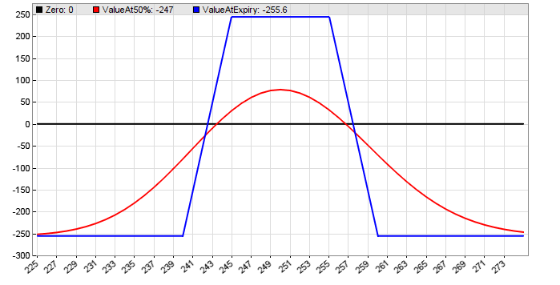

# combo, ...

# Option Combos

The functions below can be used for handling combinations of [options](096_contract.md), such as Spreads, Straddles, Strangles, Condors, Butterflies, etc. Option combos are mainly used for limiting risk. For an introduction to options trading, see [Financial Hacker](http://www.financial-hacker.com/algorithmic-options-trading/). The image below shows the profit or loss of an Iron Condor combo dependent of the underlying price, at expiration (blue) and halfway to expiration (red). 

  
Iron Condor payoff diagram (**Payoff.c**)

 

## combo (CONTRACT\* C1, int N1, CONTRACT\* C2, int N2, CONTRACT\* C3, int N3, CONTRACT\* C4, int N4): int

Combines 2, 3, or 4 option contracts **C1..C4** to a combo. The number and trade direction of contracts are given by **N1..N4**; use negative numbers for selling and positive numbers for buying, f.i. **\-2** for short selling two contracts. **C3**/**N3** and **C4**/**N4** can be **0** for combos with only 2 or 3 legs. Returns the number of combo legs, i.e. the number of different contracts of the combo. If all numbers **N** are **0**, or if any **CONTRACT\*** pointer is zero while its associated number **N** is nonzero, the combo is disabled and the function returns **0**. Source code in **contract.c**.

## comboAdd (CONTRACT\* C, int N): int

Adds a copy of the option contract **C** to the current combo. Amount and trade direction of the contract is given by **N**; use a negative number for selling and a positive number for buying. Returns the number of the current combo leg. If **C** is 0, the function deletes all contracts from the combo and returns 0.

## comboLegs (): int

Returns the number of legs of the current combo that was defined before with **combo()** or **comboAdd()** calls.

## comboContract (int Leg): CONTRACT\*

Pointer to the **CONTRACT** struct of the combo leg with the given number (1..4). Macro defined in **contract.c**.  

## comboLeg (int Leg): int

Selects the contract of the combo leg with the given number (1..4), and returns the number assigned to that contract as defined in the **combo()** function. The number is negative for selling and positive for buying, so it can be directly used for the **Lots** parameter passed to [enterLong](buylong.md). 

## comboStrike (int Leg): var

Returns the strike value of the given combo **Leg** (1..4). Source code in **contract.c**.

## comboProfit (var Price, int Sign): var

Returns the profit or loss of the current bought (**Sign == 1**) or sold (**Sign == -1**) combo when expiring at the given **Price**. **Type**, **fAsk**, and **fBid** of all contracts of the combo must be set, so [contractPrice](096_contract.md) should have been called before; the other contract parameters don't matter. Multiplier and transaction costs are not included. Source code in **contract.c**.

## comboRisk (int Sign): var

Returns the maximum possible loss of the current bought (**Sign == 1**) or sold (**Sign == -1**) combo. For combos with unlimited loss, returns the loss when the price drops to zero or ends up at twice the strike, whichever is worse. **Type**, **fAsk**, **fBid**, and **fStrike** of all contracts of the combo must be set, so [contractPrice](096_contract.md) must have been called before; the other contract parameters don't matter. Multiplier and transaction costs are not included. Source code in **contract.c**.

## comboPremium (int Sign): var

Returns the premium of the current bought (**Sign == 1**) or sold (**Sign == -1**) combo, also referred to as the combo's ask and bid price. Positive premium is earned, negative premium is paid. If the combo consists of long and short positions, its ask price can be lower than its bid price. **fAsk** and **fBid** of all contracts of the combo must be set, so [contractPrice](096_contract.md) should have been called before; the other contract parameters don't matter. Multiplier and Transaction costs are not included. Source code in **contract.c**.

## comboType (): int

Returns the combo type: **1** for a single put, **2** for a single call, **6** for a call spread, **7** for a strangle (call and put), **8** for a put spread, **13** for a call butterfly (3 calls), **14** for a put butterfly (3 puts), and **20** for a 4-contract combo such as a condor (2 calls and 2 puts). Source code in **contract.c**.

## comboMargin (int Sign, int AssetType): var

Calculates the margin cost of the current bought (**Sign == 1**) or sold (**Sign == -1**) combo with the given **AssetType**. Uses the margin formula on the Interactive Broker's [US Options Margin Requirements](https://www.interactivebrokers.com/en/index.php?f=26660&hm=us&ex=us&rgt=1&rsk=0&pm=1&rst=101004100808) page. Supports single calls and puts, call spread, put spread, strangle (call and put), Butterfly with 3 calls, Butterfly with 3 puts, and Condor (2 calls and 2 puts). Source code in **contract.c**.  
  

### Parameters:

<table border="0"><tbody><tr><td><strong>C1..C4</strong></td><td><strong>CONTRACT*</strong> pointer for leg 1..4, or <strong>0</strong> when the leg is not used in the combo.</td></tr><tr><td><strong>N1..N4</strong></td><td>Number of contracts for leg 1..4, negative for selling and positive for buying contracts. <strong>0</strong> when the leg is not used in the combo.</td></tr><tr><td><strong>Leg</strong></td><td>Number of the combo leg, 1..4, starting with <strong>1</strong> for the first contract.</td></tr><tr><td><strong>Sign</strong></td><td>Position sign, <strong>-1</strong> for short and <strong>1</strong> for long.</td></tr><tr><td><strong>AssetType</strong></td><td><strong>1</strong> for a currency, <strong>2</strong> for an index, <strong>3</strong> for stocks and ETFs. The margin for futures must be individually calculated.</td></tr></tbody></table>

  
 

## comboPrint (int To)

Prints the parameters of the current combo contracts to the destination **To**, as in [print(To,...)](143_printf_print_msg.md).  

## plotCombo (var HistVol, var Min, var Max, int Days, int Modus)

Plots the payoff diagram of the current combo with volatility **HistVol** from price **Min** to price **Max**. **Modus 0** initializes the plot and plots a zero line, **Modus 1** plots the diagram at expiration, **Modus 2** at the given **Days** into the lifetime (**R** and **RQuantLib** required), and **Modus 3** plots the Delta. Type, strike, ask, bid, and expiry in days must be set in all contracts of the combo. Two different expiration periods are supported. Source code in **contract.c**; usage example in **PayOff.c**.  
 

### Remarks:

*   **contract.c** must be included for all above functions.
*   Combo trades should be opened or closed in the order of legs, starting with leg 1. They are then automatically combined to a combo order which is sent to the broker with the last leg. Many brokers offer reduced margin and commission on combos. The combo order internally uses the [SET\_COMBO\_LEG](113_brokerCommand.md) command, which must be supported by the broker plugin. Otherwise the combo is split in separate contract orders. Make sure that all legs of the combo are entered together; "pending legs" won't work.
*   [Order limits](188_Stop_Profit_Trail_Entry.md) are normally interpreted by the broker as a price limit of the whole combo. The [Stop](188_Stop_Profit_Trail_Entry.md) variable affects individual legs; closing the whole combo at a certain loss must be handled by script.
*   Combos orders can take several minutes for being executed, even at market. For this reason it is recommended to use [GTC](018_TradeMode.md) orders and/or to increase the wait time with the [SET\_WAIT](113_brokerCommand.md) command.
*   If a combo order is not opened by the broker, the [enter](buylong.md) call with the last leg will fail. In that case cancel the preceding legs with the [cancelTrade](selllong.md) function.
*   The elements of the current combo can be accessed through the **ThisCombo** pointer, defined in **trading.h**.
*   The current combo remains valid until the next **combo()** or [contractUpdate](096_contract.md)**()** call.
*   Use the [algo](095_algo.md) function for getting separate combo-specific statistics. For determining the current profit/loss of a combo position, use a [trade loop](fortrades.md) and sum up all [TradeProfit](018_TradeMode.md) of the same [TradeAlgo](018_TradeMode.md). Trades of the same combo are listed in sequence in the trade loop.
*   The script **Payoff.c** contains definitions of often used combos, such as spread, strangle, butterfly, condor. You can enter an individual combo for plotting its profit/loss curve.
*   For brokers with a different combo margin structure, the **comboMargin** function can be copied from **contract.c** into the strategy script and accordingly modified.  
    

### Example (see also Workshop 8 and Payoff.c):

```c
if(combo(
  contract(CALL,Days,Strike),1, 
  contract(PUT,Days,Strike),1,
  0,0,0,0)) _// Strangle combo_
{
   enterLong(comboLeg(1));
   enterLong(comboLeg(2));
}
```

### See also:

[contract](096_contract.md), [contract variables](contracts.md), [Workshop 8](tutorial_options.md)

[► latest version online](javascript:window.location.href = 'https://zorro-project.com/manual/en' + window.location.href.slice\(window.location.href.lastIndexOf\('/'\)\))