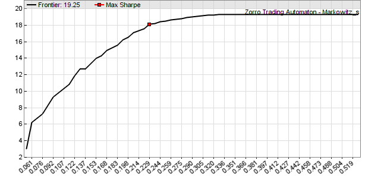

# markowitz

# Mean/Variance Optimization

## markowitz (var\* Covariances, var\* Means, int N_,_ var Cap) : var

## markowitz (var\* Covariances, var\* Means, int N_,_ var\* Caps) : var

Performs a mean / variance optimization **(MVO)** using the algorithm from the 1959 publication **Portfolio Selection: Efficient Diversification of Investments** by **Harry M. Markowitz**; also referred to as modern portfolio theory **(MPT)**. The fucntion calculates the optimal distribution of capital among a portfolio of assets or algorithms for achieving a given total return or variance. The algorithm starts with assigning all capital to the component with the highest return. It then adds or removes more components step by step, calculating the optimal return/variance combination on any step.  
   
The efficient frontier is a line consisting of corner points in a return over variance plot. At any corner point the portfolio composition changes by adding or removing one or several components. Between the corner points the included components don’t change, only their capital allocation changes linearly. Connecting all corner points with lines establishes the **efficient frontier** with the maximum return for any given variance (see image).  
 

   
Efficient frontier of an ETF portfolio, x axis = variance, y axis = annual return in %

### Parameters:

<table border="0"><tbody><tr><td><strong>Covariances</strong></td><td>A <strong>var[N*N]</strong> array containing the covariance matrix of the component returns.</td></tr><tr><td><strong>Means</strong></td><td>A <strong>var[N]</strong> array containing the mean of the component returns.</td></tr><tr><td><strong>N</strong></td><td>Number of components, at least 3.</td></tr><tr><td><strong>Cap</strong></td><td>Weight cap in <strong>0..1</strong> range; soft weight limit of a single asset at the minimum variance point, or <strong>0</strong> for no weight cap.</td></tr><tr><td><strong>Caps</strong></td><td>A <strong>var[N]</strong> array containing individual weight limits in <strong>0..1</strong> range, or <strong>0</strong> for no weight cap.</td></tr></tbody></table>

### Returns

Variance at the efficient frontier point with the best Sharpe Ratio (i.e. return divided by standard deviation), or **0** if the efficient frontier could not be calculated. The efficient frontier line segments are internally stored for subsequent **markowitzReturn** or **markowitzVariance** calls.

## markowitzReturn (var\* Weights, var Variance) : var

Calculates the return and the optimal capital allocation weights for a given variance at a previously calculated efficient frontier. The **markowitz()** function must be called before for calculating the frontier.

## markowitzVariance (var\* Weights, var Return) : var

Calculates the variance and the optimal capital allocation for a given return at a previously calculated efficient frontier. The **markowitz()** function must be called before for calculating the frontier.

### Parameters:

<table border="0"><tbody><tr><td><strong>Weights</strong></td><td>A <strong>var[N]</strong> array to be filled with the capital allocation weights of the <strong>N</strong> portfolio components. The sum of the weights is <strong>1</strong>. Pass <strong>0</strong> when no weights are needed.</td></tr><tr><td><strong>Variance</strong></td><td>The desired variance. When below the lowest variance, the return and weights at the left end of the efficient frontier are returned.</td></tr><tr><td><strong>Return</strong></td><td>The desired return. When below the lowest return of the efficient frontier, the variance and weights at the left end of the efficient frontier are returned.</td></tr></tbody></table>

### Returns

The optimal portfolio return at the given variance, or vice versa..  

### Modifies

**Weights** - set to the capital allocation weights.  
   

### Remarks:

*   For getting the minimum variance point, call **markowitzReturn** with **Variance** at **0**. For maximum Sharpe ratio, call **markowitzReturn** with the **Variance** returned by **markowitz()**. For the maximum return point at the right side of the diagram, call **markowitzReturn** with **Variance** at **1**. For the maximum and minimum variances, call **markowitzVariance** with a return value above or below the maximum and minimum portfolio return.
*   Markowitz weights can be used alternatively to [OptimalF](016_OptimalF_money_management.md) factors for allocating capital to a portfolio system. Unlike **OptimalF**, they require only a relatively short time horizon and thus can be adapted during live trading. For a long-term ETF rotation strategy, use the last year price returns of the ETFs (see example) and recalculate their markowitz weights every 4 weeks.
*   For converting weights to asset amounts, multiply the weights with your budget and divide by asset prices.
*   For calculating the returns of portfolio components with currently zero weight in real time, use [phantom trades](lots.htm#phantom).
*   It is often recommended to limit the asset weights with the **Cap** or **Caps** parameter (f.i. **0.33** for 33% maximum weight) for getting a higher portfolio diversification. This makes the portfolio more stable and usually produces better out-of-sample results. The weight cap can be exceeded when it is too small and the resulting weights don't sum up to 1. For useful results, the weight cap should be at least two or three times the **1/N** minimum.
*   MVO fails when there is no point on the efficient frontier that represents the portfolio, for instance when all means are negative. This can lead to weights of zero or to a total weight less than 1.
*   Applications of the **markowitz** function are described in the Financial Hacker article [Get Rich Slowly](http://www.financial-hacker.com/get-rich-slowly/).
*   The [Z8 and Z10 trading systems](zsystems.md) use this function for calculating optimal portfolio compositions. For other ways of allocating capital, see the [OptimalF](016_OptimalF_money_management.md), [distribute](129_filter_renorm.md), and [knapsack](129_filter_renorm.md) algorithms.

### Example:

```c
#define N    10  _// 10 assets_
#define DAYS 252 _// 1 year_
 
vars Returns\[N\];
var  Means\[N\];
var  Covariances\[N\]\[N\];
 
function run()
{
  BarPeriod = 1440;
  StartDate = 20150101;
  LookBack = DAYS;
  
  string Name;
  int n = 0;
  while(Name = loop(..._/\*list of some assets\*/_ ... )) 
  {
    asset(Name);    
    Returns\[n\] = series((price(0)-price(1))/price(1));
    Means\[n\] = SMA(Returns\[n\],DAYS);
    n++;
  }
  
  int i,j;
  if(!is(LOOKBACK))
  {
_// generate covariance matrix_
    for(i=0; i<N; i++)
      for(j=0; j<N; j++)
        Covariances\[i\]\[j\] = Covariance(Returns\[i\],Returns\[j\],DAYS);

_// calculate efficient frontier_
    var OptimalV = markowitz(Covariances,Means,N);
    printf("\\nBest daily return %.3f %% at variance %.4f",
      100\*markowitzReturn(0,OptimalV),OptimalV);

_// plot the frontier_
    for(i=1; i<70; i++) {
      var VStep = i\*OptimalV\*0.03;
      var Return = markowitzReturn(0,VStep);
      plotBar("Frontier",i,VStep,Return,LINE|LBL2,BLACK);
    }
    plotGraph("Max Sharpe",1./0.03,markowitzReturn(0,OptimalV),SQUARE,RED);
    PlotScale = 6;
    PlotHeight1 = 300;    
    quit("");
  }
}
```

### See also:

[OptimalF](016_OptimalF_money_management.md), [Covariance](033_W4a_Indicator_implementation.md), [distribute](129_filter_renorm.md), [knapsack](129_filter_renorm.md)

[► latest version online](javascript:window.location.href = 'https://zorro-project.com/manual/en' + window.location.href.slice\(window.location.href.lastIndexOf\('/'\)\))