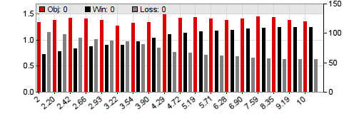

# optimize

## optimize (var Default, var Min, var Max, var Step_, var Bias_) : var

## optimize (string Name,var Default, var Min, var Max, var Step_, var Bias_) : var

Optimizes a trading strategy parameter for the current [asset](013_Asset_Account_Lists.md) and [algo](095_algo.md) combination. In \[Test\] and \[Trade\] mode the function returns the previously optimized parameter value. In \[Train\] mode the function performs an optimization process to find the most robust parameter value between **Min** and **Max**. An optional **Name** can be given, which will appear for the parameter in the logs and charts. 

Several optimization methods (Ascent, Genetic, Brute Force, Extern) are available through [TrainMode](016_OptimalF_money_management.md). The optimization target can be individually defined with a user-supplied **objective** function. The optimization process consists of many cycles. For every cycle the **optimize** function generates a different value between **min** and **max** and tests its effect on the strategy. At the end of the optimization, a parameter chart is plotted that reveals the effect of a certain parameter on the strategy (see below). The best or most robust parameter values are then selected and stored in a **.par** file.



The chart above is a result of a parameter optimization with the [Ascent](016_OptimalF_money_management.md) algorithm. The parameter is a stop distance. It varies from **2** to **10** in 10% steps. At any step the number of winning trades (black bars), losing trades (grey) and performance (red) of the parameter are displayed. We can see that high stop distances increase the number of winning trades, but have only a small effect on the overall performance. The Ascent optimizer would here likely select **8** as the most robust parameter value, rather than the single peak at **4.29**. This behavior can be changed with [TrainMode](016_OptimalF_money_management.md).  
  


The contour chart above is generated by optimizing two parameters with the [Brute Force](016_OptimalF_money_management.md) algorithm. The first parameter, a time period, runs from **20** to **60** in steps of **5**; the second, a signal threshold, from **0.6** to **1.4**. Green areas indicate high performance, red areas low performance of the parameter combination. The optimizer would here likely select the **35 / 0.8** parameter combination. If more than two parameters are optimized, the first two are used for the contour chart.

The size of parameter or contour charts can be set up with [PlotHeight2](204_PlotBars_PlotWidth.md). By using multiple **optimize** calls in the code, any number of parameters can be optimized (up to 16 per asset/algo component). The more parameters, the more trades are needed for a meaningful optimization, and the longer will it take. As a rule of thumb, have at least 40 trades per parameter and WFO cycle, and do not optimize more than 3 or 4 parameters for a trade entry signal and 2 or 3 for exit. Too many optimized parameters generate an overfitted strategy and reduce the out-of-sample performance. Dependent on the method, the best value of a parameter can affect the optimization of the next parameters. If the script contains [loop](109_loop.md) calls, a separate parameter set for the asset/algo combination in each loop is optimized.

Training also produces a log with the results of any training step. Here's an example log of the first cycle of an Ascent parameter walk-forward optimization:

```c
Walk\[1\] Bar 400..23372

Parameter 1 step 1: 0.10 => 0.96 1729/1933
Parameter 1 step 2: 0.20 => 0.91 1290/1540
Parameter 1 step 3: 0.30 => 0.87 990/1184
Parameter 1 step 4: 0.40 => 0.83 840/1034
Parameter 1 step 5: 0.50 => 1.06 747/759
Parameter 1 step 6: 0.60 => 1.01 669/715
Parameter 1 step 7: 0.70 => 0.87 604/712
Parameter 1 step 8: 0.80 => 0.86 490/616
Selected p1\[5\] = 0.504 => 0.96

Parameter 2 step 1: 1.00 => 1.06 471/1035
Parameter 2 step 2: 1.50 => 1.08 553/953
Parameter 2 step 3: 2.00 => 1.08 599/907
Parameter 2 step 4: 2.50 => 1.07 646/860
Parameter 2 step 5: 3.00 => 1.06 676/830
Parameter 2 step 6: 3.50 => 1.07 725/781
Selected p2\[3\] = 2.000 => 1.07

Parameter 3 step 1: 1.00 => 0.97 883/623
Parameter 3 step 2: 1.50 => 0.99 806/700
Parameter 3 step 3: 2.00 => 1.02 755/751
Parameter 3 step 4: 2.50 => 1.06 711/795
Parameter 3 step 5: 3.00 => 1.04 657/849
Parameter 3 step 6: 3.50 => 1.06 622/884
Selected p3\[5\] = 3.01 => 1.05

EUR/USD: 0.504 2.000 3.01=> 1.112

Parameters stored in OptTest\_1.par
```
The log displays the first walk-forward cycle (Walk\[1\]) with 3 parameters. The numbers after '**\=>**' are the [objective](108_objective_parameters.md) return value and the numbers of won and lost trades. The selected parameter value and its objective are interpolated between steps. The second-last line, beginning with "**EUR/USD:**", is the content added to the parameter file.   

### Parameters:

<table border="0"><tbody><tr><td width="80"><strong>Name</strong></td><td>Parameter name to appear in the parameter chart.</td></tr><tr><td width="80"><strong>Default</strong></td><td>Default value of the parameter, returned when the <a href="mode.htm">PARAMETERS</a> flag is not set in [<span class="tast">Test</span>] or [<span class="tast">Trade</span>] mode. This should be the estimated best value of the parameter, normally in the middle of its range. Must be <strong>&gt;= 0</strong>.</td></tr><tr><td><strong>Min, Max</strong></td><td>Parameter range, minimum and maximum values (<strong>&gt;= 0</strong>). For optimizing negative parameter ranges, subtract an offset or add a minus sign to the <strong>optimize</strong> call. If both <strong>min</strong> and <strong>max</strong> are <strong>0</strong>, the <strong>default</strong> value is stored in the parameter file.</td></tr><tr><td><strong>Step</strong></td><td>Step width. A positive <strong>step</strong> value is added at every step. A negative <strong>step</strong> value is interpreted as a percentage to be added, for instance <strong>-20</strong> adds <strong>20%</strong> per step (<a href="opt.htm">Ascent</a> optimization only). Using a percentage gives a higher step resolution to smaller values at the begin of the range. For best results, select the <strong>step</strong> value so that the number of steps is between <strong>5</strong> and <strong>15</strong>.</td></tr><tr><td><strong>Bias</strong></td><td>Optional preference of low or high parameter values (<a href="opt.htm">Ascent</a> optimization only). When <strong>0</strong> or omitted, select the optimal parameter. When <strong>&gt; 0</strong>, prefer higher parameter values even when their rank is lower by the given <strong>bias</strong> in percent. When <strong>&lt; 0</strong>, prefer lower parmeter values even when their rank is lower by <strong>abs(bias)</strong> in percent. Preferring values from the low or high range can make sense f.i. for setting a <strong>Stop</strong> as tight as possible even when its value is not optimal.</td></tr></tbody></table>

### Returns

Current, default, or optimized parameter value, depending on training or test/trade mode.  
   

### Remarks:

*   A bit of optimization theory is described under [Training](007_Training.md); for examples see [Workshop 5](tutorial_fisher.md) and [Workshop 6](tutorial_kelly.md). More about optimization tricks and traps can be found in the [Black Book](247_Links_Books.md).
*   All **optimize** calls must be placed either in the [run](088_run.md) function or in functions that are called from the **run** function. Since parameters are identified by the order of their **optimize** calls, the order must not change between test and training or from one [run](088_run.md) to the next.
*    All flags and variables that affect optimization, such as [PARAMETERS](018_TradeMode.md), [NumTrainCycles](016_OptimalF_money_management.md), [TrainMode](016_OptimalF_money_management.md), etc. must be set and an asset must be selected before the first **optimize** call. 
*   In portfolio strategies, parameters should be normally optimized separately for any component. Use one or two [loop()](109_loop.md) calls to cycle through all used assets and algos. For optimizing asset/algo specific parameters, place the **optimize** calls inside the inner **loop**, and make sure to select [asset](013_Asset_Account_Lists.md) and [algo](095_algo.md) before. For optimizing additional global parameters that do not depend on asset and algo, place their **optimize** call in the very first loop run only, and store the parameter in a static or global variable outside the loop. The global parameters are then assigned to the first asset and/or algo. If asset/algo specific optimization is not desired at all, don't use [loop](109_loop.md), but enumerate the assets in a simple [for](012_Performance_Report.md) loop, f.i. **for(used\_assets) ...**, and optimize the parameters outside the **for** loop. Make sure in that case to select all assets before the first **optimize** call; otherwise the optimizer will assume a single-asset strategy.
*   The optimization objective is calculated from trade statistics by the **[objective](108_objective_parameters.md)** function in **include\\default.c**. This function can be replaced by any user provided function named **objective** in the script. This way, arbitrary performance figures can be used for optimizing parameters, for instance the profit/drawdown ratio, or the gross profit, or the Sharpe ratio. The **objective** function can access all [trade statistics](winloss.md) for determining the performance value. By default, the function calculates the pessimistic return ratio (**PRR**) with reduced influence of the biggest win and the biggest loss, a penalty for few trades, and a 5 trades minimum.
*   Optimized parameters are stored in **.par** files in the **Data** folder. They are plain text files that contain the parameter values in the order of their **optimize** calls. If [WFO](numwfocycles.md) was used, the WFO cycle is appended to the file name. If **optimize** was called without selecting an [asset](013_Asset_Account_Lists.md) before, the file names contain the current asset from the \[Asset\] scrollbox. This way different sets of **.par** files can be generated with the same script by training different assets from the **AssetsFix** list. The script must then not modify the scrollbox by [assetSelect](013_Asset_Account_Lists.md) or [assetList](013_Asset_Account_Lists.md), otherwise inconsistent **.par** file names will cause  error messages. In that case make sure to select a valid asset by script before the first **optimize** call.
*    In multi-asset or multi-algo strategies the **.par** files contain the parameters for all asset/algo combinations, and the **.par** file name does not contain the asset name. Each line in a portfolio **.par** file begins with the asset name and optional [algo identifier](095_algo.md) of the parameter set. The values are listed in the order of the **optimize** calls in the script. A **'+'** before a parameter value indicates that the best value is at the end of its parameter range. In that case it could make sense to extend the range for better results.
*   If the [PARAMETERS](018_TradeMode.md) flag is not set, the **optimize** call will return the **default** value in \[Test\] or \[Trade\] mode, and a previously optimized parameter from the **.par** file in \[Train\] mode. This allows to temporarily switch off the **PARAMETERS** flag for special purposes, such as a training run with **FACTORS** only.
*   For eliminating distortions by money management, optimization uses normally a fixed 1 lot trade size and includes any phantom trades. [Margin](190_Margin_Risk_Lots.md) or [Lots](190_Margin_Risk_Lots.md) have no effect, except when they are zero; in that case no trade is opened. Training with individual lot sizes for special purposes can be set up with the [TrainMode](016_OptimalF_money_management.md) variable.
*   For best precision and proper display on charts, parameters should be in the positive integer range, i.e. between 1 and 10000. Thus, 0.012345 or 1.23e45 would be no good parameter values. Multiply them with a factor when smaller or higher numbers are needed. If a parameter has to be negative, multiply it with **\-1** or subtract a constant for getting a positive range. For optimizing in pre-defined individual steps, use an array and optimize its index. Example: **int Periods\[5\] = { 10, 20, 50, 100, 200 }; int Period = Periods\[round(optimize(1,0,4,1),1)\];**
.*   For using no optimization for a certain parameter, but calculating it by script in the training run instead, set **min** and **max** at 0 and **default** at the calculated value (f.i. **MyParameter = optimize(MyCalculatedValue,0,0);**). The **default** is then stored in the **.par** file, This way parameters can be generated in the training run that would be difficult to get in live trading, for instance the average volatility of the last 10 years.
*   Returned parameter values in **Ascent** mode are not a multiple of the step width. They can lie anywhere in the optimization range. Use the [round](082_round_roundto.md) or [floor](076_floor_ceil.md) functions when optimizing an integer value.
*   The **bias** value can be used when a high or a low value of the parameter is preferred even though another value gives a slightly better **objective** result (Ascent mode only). For instance, you might prefer low stop distances to reduce the risk even when higher stop distances give slightly better results.
*   Parameters that affect the bar composition, such as [BarMode](200_BarMode.md), **[BarPeriod](177_BarPeriod_TimeFrame.md)**, or [bar ranges](005_Bars_and_Candles.md), cannot be directly optimized because bars are generated at the begin of the simulation. If needed, optimize them by script in several [cycles](numtotalcycles.md), then enter their optimal value directly in the script.
*   When optimizing several parameters in [Ascent](016_OptimalF_money_management.md) mode, put the most important parameters first. Parameters are optimized in the order they appear in the code. For optimizing trade entry and exit parameters, optimize entry parameters first and exit parameters afterwards. Use a distant exit as default value for optimizing the entry. When your exit system is very complex, optimize entry parameters with a simplified exit such as a distant stop. For using a different exit system while the entry parameters are optimized, evaluate the current parameter number (**[ParCycle](opt.md)**), f.i. **if(Train && ParCycle <= NumParameters-3) setExitSimple();**.
*   When parameters affect each other - for instance, two time periods for a crossover of two moving averages - optimize only one time period, and optimize a multiplication factor for the other (see the example below). This way the other time period also changes when the first one is optimized.
*   Special cases when [RULES](018_TradeMode.md) and [PARAMETERS](018_TradeMode.md) have to be optimized at the same time are described under [Training](007_Training.md). For optimizing parameters several times, use [NumTrainCycles](016_OptimalF_money_management.md). The current optimization cycle can be evaluated with the **[ParCycle](016_OptimalF_money_management.md)** and **[StepCycle](016_OptimalF_money_management.md)** variables. Optimization can be aborted by setting [StepNext](016_OptimalF_money_management.md) to **0**. This will end optimization of the current parameter after the current cycle.
*   When optimizing a time period of an indicator, make sure that **[LookBack](181_LookBack_UnstablePeriod.md)** is set at least to the maximum period plus the **UnstablePeriod** (f.i. **LookBack = max(LookBack,300);**). Otherwise **LookBack** will automatically adapt to the period of the current parameter value. This would affect the result in an unexpected way because the backtest period would then get shorter when the time period gets longer.
*   For avoiding randomness, [slippage](191_Spread_Commission.md) is not simulated during optimization. [Rollover](191_Spread_Commission.md) is simulated; it can have a large effect on the result and produce long/short asymmetry in parameters and profit factors. For eliminating rollover asymmetry, you can set [RollLong/Short](191_Spread_Commission.md) to **0** after calling [asset](013_Asset_Account_Lists.md) in training mode. For eliminating trend asymmetry, [detrend](197_Detrend_shuffling.md) the price curve in training mode. Even without rollover and trend, some commodities and stocks still require different parameter sets for long and short trades due to inherent asymmetries in their price curves (long trades are often dominant).
*   When the strategy opens no trades at all in \[Train\] mode - f.i. when no trade signal is generated or when [Margin](190_Margin_Risk_Lots.md) or [Lots](190_Margin_Risk_Lots.md) is zero - the **default** values are stored in the parameter file.
*   The [profit/loss curves](export.htm#pnl) of every **optimize** step can be exported in a file for further evaluation when a [Curves](020_Included_Scripts.md) file name is given. A curve is only exported when the **objective** function returns a nonzero value. A CSV file with all parameter combinations and their objectives are exported in brute force, genetic, or extern optimization mode when [LOGFILE](018_TradeMode.md) is set. Parameter charts are generated when [LOGFILE](018_TradeMode.md) is set and multiple [cores](185_Multiple_cores.md) or multiple [cycles](numtotalcycles) are not used. The height of the parameter charts can be controlled with [PlotHeight2](204_PlotBars_PlotWidth.md).
*   While training, trades are normally not logged. For logging the trades of a particular training cycle, use the [LogTrainRun](016_OptimalF_money_management.md) variable.

### Examples:

```c
_// trend trading with Moving Averages and optimized parameters_
function run()
{
  set(PARAMETERS);
_// for optimizing time periods, set the LookBack variable to the
// maximum possible value (here, TimeCycle 100 \* TimeFactor 5)_
  LookBack = 100\*5;  
  var TimeCycle = optimize(30,10,100,5);  
  var TimeFactor = optimize(3,1,5);  
_// allow 3% tolerance for preferring low stop distances_ 
  Stop = ATR(10) \* optimize(3,1,10,0.5,-3); 
  
  vars Price = series(price(0));
  vars MA1 = series(SMA(Price,TimeCycle));
  vars MA2 = series(SMA(Price,TimeCycle\*TimeFactor));
  plot("MA1",\*MA1,0,BLUE);
  plot("MA2",\*MA2,0,BLUE);
  
  if(crossOver(MA1,MA2))
    enterLong();
  else if(crossUnder(MA1,MA2))
    enterShort();
}
```

### See also:

[Training](007_Training.md), [TrainMode](016_OptimalF_money_management.md), [loop](109_loop.md), [NumParameters](016_OptimalF_money_management.md), [NumTrainCycles](016_OptimalF_money_management.md), [Workshop 5](tutorial_fisher.md), [Statistics](116_Statistics_Transformations.md)

[► latest version online](javascript:window.location.href = 'https://zorro-project.com/manual/en' + window.location.href.slice\(window.location.href.lastIndexOf\('/'\)\))