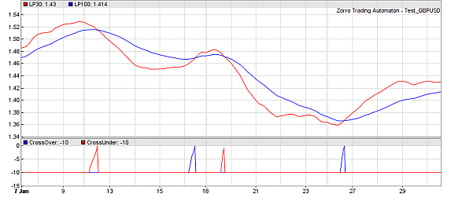

# predict

## predict (int Type, vars Data, int TimePeriod, var Threshold): int

Predicts an event, such as a crossover of two curves or a peak of a curve, several bars before it happens. A [polynomial regression](136_polyfit_polynom.md) function is used for the prediction. This function can be used to generate early trade signals.



Most trade systems analyze the recent price curve with functions or indicators that introduce more or less lag. This means that trade signals are always late, which reduces the profit of a system. One way to minimize lag is using low-lag functions (for instance, higher-order [lowpass filters](filter.md) instead of moving averages). Another way is predicting the signals before they actually occur. This is the purpose of the **predict** function that works by extrapolating signal curves into the future.

### Parameters:

<table border="0"><tbody><tr><td><strong>Type</strong></td><td>Event to be predicted:<br><strong>CROSSOVER</strong> - crossing of <strong>Data</strong> over the zero line<br><strong>PEAK</strong> - Data peak<br><strong>VALLEY</strong> - Data valley<br><strong>+PARABOLIC</strong> - use parabolic instead of linear regression.</td></tr><tr><td><strong>Data</strong></td><td>Data series to be predicted, with a minimum length of <strong>TimePeriod</strong>.</td></tr><tr><td><strong>TimePeriod</strong></td><td>Number of <strong>Data</strong> points used for the prediction. Do not use more date than a typical 'swing' of the curve.</td></tr><tr><td><strong>Threshold</strong></td><td>Prediction threshold, or <strong>0</strong> for no threshold.</td></tr></tbody></table>

### Returns

Bar offset (negative) of the predicted event, in the **\-TimePeriod..0** range. **0** predicts that the event will happen in the next bar. **\-TimePeriod** is returned when no event is predicted.

### Modifies

**rMomentum** - Predicted **Data** movement per bar at the time of the event.  

### Remarks:

*   The **predict** function does not peek into the future, but uses past data for predicting events on the future curve.
*   It does not detect real crossovers or peaks/valleys, but predicts them only on future bars. For adding real detection of an event at a previous bar, use [crossOver](121_crossOver_crossUnder.md) or [peak](122_peak_valley.md)/[valley](122_peak_valley.md).
*   For predicting a crossover of two data series, or a series crossing over a fixed value, call **predict** with a series of the differences, f.i. **vars Difference = series(Data1\[0\] - Data2\[0\]);**. For a crossunder, reverse the differences (see example).
*   Crossovers are detected with better precision and less false signals than peaks or valleys.
*   **Threshold** can be used to filter out 'weak' signals, f.i. from a crossing of two almost parallel lines. It is the minimum momentum of the **Data** line divided by the correlation coefficient.
*   For parabolic regression, add **+PARABOLIC** to the **type**. It detects events earlier than linear regression, but tends to produce more false signals.

### Examples:

```c
function run()
{
  vars Prices = series(price());
  var LP50 = LowPass(Prices,50);
  var LP150 = LowPass(Prices,150);
  
  var CO = predict(CROSSOVER,series(LP50-LP150),10,0.5\*PIP); _// predict crossover_
  var CU = predict(CROSSOVER,series(LP150-LP50),10,0.5\*PIP); _// predict crossunder_
    
  plot("LP50",LP50,0,RED);
  plot("LP150",LP150,0,BLUE);
  plot("CrossOver",CO,NEW,BLUE);
  plot("CrossUnder",CU,0,RED);
}
```
```c
_// Trading with crossover vs. trading with prediction_
#define USE\_PREDICT
function run() 
{
  BarPeriod = 1440;
  asset("SPX500");
  vars Osc = series(StochEhlers(series(price()),10,20,10));
#ifndef USE\_PREDICT  _// use normal crossover_
  if(crossOver(Osc,0.8)) 
    enterShort();
  if(crossUnder(Osc,0.2))
    enterLong();
#else                _// use predicted crossover_
  if(predict(CROSSOVER,series(Osc\[0\]-0.8),10,0.01) > -5) 
    enterShort();
  if(predict(CROSSOVER,series(0.2-Osc\[0\]),10,0.01) > -5) 
    enterLong();
#endif
}
```
Examples of signal prediction can also be found in the [Predict](020_Included_Scripts.md) and [Ehlers](020_Included_Scripts.md) scripts.

### See also:

[frechet](detect.md), [advise](advisor.md), [polyfit](136_polyfit_polynom.md), [crossOver](121_crossOver_crossUnder.md), [peak](122_peak_valley.md)/[valley](122_peak_valley.md), [predictMove](138_Seasonal_Strength.md), [predictSeason](138_Seasonal_Strength.md) 

[► latest version online](javascript:window.location.href = 'https://zorro-project.com/manual/en' + window.location.href.slice\(window.location.href.lastIndexOf\('/'\)\))