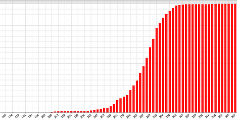

# contractCPD

# Market Sentiment: What's the price next month?

Suppose a stock trades at $250. You want to know its price in 30 days. Or rather, which price is expected in 30 days by most market participants. For this purpose, Zorro analyzes the chain of 30-day options contracts and calculates a price probability distribution. The result is the probability of any future price between $200 and $300 at the option expiration day, based on the expectations of option buyers and sellers. The most likely price is at the top of the distribution. The underlying algorithm and usage examples are described on [financial-hacker.com/the-mechanical-turk](https://www.financial-hacker.com/the-mechanical-turk).  
   
The following functions estimate a future price from the current ask, bid, and strike prices of all option contracts at a determined expiration date. They generate a distribution of the cumulative price probability at their expiration. The height of a bar in the image below is the probability that the underlying price will end up at or below the given price level on the x axis, in the implied opinion of option traders.  
  
  
SPY January 2018, cumulative price probability distribution 

## contractCPD (int Days): int

Generates a cumulative probabililty distribution of the current asset price at the given number of days in the future, and stores it internally. Returns the number of option contracts used for the distribution. The [contractUpdate](096_contract.md) function must be called before.  

## cpd(var Price): var

Returns the cumulative probability of the given price in **0..100** range. The future price will be at or below the given value with the returned probability in percent. The **contractCPD** function must be called before.

## cpdv(var Percentile): var

Returns the price at the given percentile of the distribution. F.i. **cpdv(50)** returns the median of the price distribution, with equal probability of a higher or lower price. The **contractCPD** function must be called before.  
  

### Parameters:

<table border="0"><tbody><tr><td><strong>Days</strong></td><td>Minimum number of calendar days for which the price distribution is estimated. Determines the expiration date of the used options.</td></tr><tr><td><strong>Price</strong></td><td>Underlying asset price to be estimated.</td></tr><tr><td><strong>Percentile</strong></td><td>Probability that the future price is at or below the returned value.</td></tr></tbody></table>

### Remarks:

*   For comparing price predictions with the current price in the backtest, make sure to use the unadjusted price. If in doubt, use underlying prices from the historical options chain by setting **History = ".t8";** before selecting the asset.
*   **contractCPD** loads the prices of all contract with the given expiration and can be very slow with some brokers (up to 30 minutes with IB). For speeding up price requests, call **brokerCommand(SET\_PRICETYPE,8);** when supported by the broker.  
    

### Example:

```c
void main() 
{
  StartDate = 20170101;
  BarPeriod = 1440;
  PlotScale = 10;

  assetList("AssetsIB");
  assetHistory("SPY",FROM\_STOOQ|UNADJUSTED);
  asset("SPY");
  Multiplier = 100;

_// load today's contract chain_
  contractUpdate(Stock,0,CALL|PUT);
  var PriceCurrent = Contracts->fUnl;
  printf("\\nCurrent price %.2f",PriceCurrent);

_// what's the SPY price in 45 days?_
  contractCPD(45);
  var Price = 0.;
  int i;
  for(i = 0; i < 150; i++) {
    Price += 0.01\*PriceCurrent;
    plotBar("CPD",i,Price,cpd(Price),BARS|LBL2,RED);
  }
  printf(", projected price %.2f",cpdv(50));
}
```

### See also:

[contract](096_contract.md), [cdf](071_cdf_erf_dnorm_qnorm.md) [► latest version online](javascript:window.location.href = 'https://zorro-project.com/manual/en' + window.location.href.slice\(window.location.href.lastIndexOf\('/'\)\))