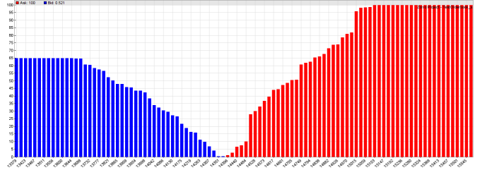

# orderCVD

# Market Depth / Order Flow Analysis

The order book is a list of currently open buy or sell orders, sorted by their quoted price and volume. Every broker and exchange maintains the order book. It can often be read by API functions and evaluated for getting an overview of the current market situation, as well as of the expected price trend when buy and sell orders are heavily imbalanced.

The following functions can be used for retrieving order book data - also referred to as "market depth", "DOM", or "level 2" data - from the broker or from historical **.t2** data files. The data can be directly used for analyzing the order flow from the distribution of quotes and their volumes in the order book ([Zorro S](restrictions.md) required).  
  
  
BTC/USD June 2018, cumulative order volume distribution

The above histogram is generated from a order flow distribution analysis. The height of a bar is the cumulative volume of a price in the order book, blue for bid and red for ask prices. The volume is expressed as a 0..1 percentage of the total ask or bid volume, whichever is higher. You can see that the situation in the diagram is dominated by offers (100% vs. 65%), which might indicate a further falling bitcoin price.  
 

## orderUpdate (string Name, int Handle): int

Retreives the current order book, and puts the list of open quotes in a [dataset](125_sortData_sortIdx.md) with the given **Handle** for further evaluation. In \[Test\] or \[Train\] mode the quotes are read from a historical data file **Name.t2** or **Name\_YYYY.t2** that is supposed to contain historical order book data. In \[Trade\] mode the order book is directly downloaded from the broker API with the [GET\_BOOK](113_brokerCommand.md) command.  
  Every **T2** record of the resulting dataset contains 3 fields: the timestamp that must match the time of the current bar, the quoted price (negative for bid), and the quoted volume. The **T2** struct is defined in **trading.h**. The function sets the **OrderRow** variable to the row of the first quote in the dataset, and returns the number of quotes.  
 

## orderCVD (T2\* Quotes, int N, var Distance): int

Generates a cumulative volume distribution of the price/volume pairs from the given **Quotes** list of **T2** records. The list is normally generated by a previous **orderUpdate** call. The **Quotes** pointer can be obtained from a dataset with **dataStr(Handle,OrderRow,0)**. **Distance** is the maximum deviation of the highest ask or lowest bid from the center price; quotes further away are not considered. The function returns the number of quotes within **Distance**.

## cpd(var Price): var

Returns the cumulative relative volume of the given **Price**, in percent (0..100). 100 is equivalent to the total ask or bid volume, whichever is higher. Negative prices return the bid volume, positive prices the ask volume.  
  

### Parameters:

<table border="0"><tbody><tr><td><strong>Name</strong></td><td>Name of the order book file, without the trailing <strong>".t2"</strong> and without a year number, or <strong>0</strong> for using the current asset name.</td></tr><tr><td><strong>Handle</strong></td><td>Handle of the dataset to receive the order book data.</td></tr><tr><td><strong>Quotes</strong></td><td>List of quotes in T2 format.</td></tr><tr><td><strong>N</strong></td><td>Number of quotes.</td></tr><tr><td><strong>Distance</strong></td><td>Maximum order book range.</td></tr><tr><td><strong>Price</strong></td><td>Quote price.</td></tr><tr><td>&nbsp;</td><td>&nbsp;</td></tr></tbody></table>

### Remarks:

*   The broker plugin must support the [GET\_BOOK](113_brokerCommand.md) command for order flow analysis. [IB](062_DefineApi_LoadLibrary.md), [IQFeed](227_DTN_IQFeed.md), and many cryptocurrency exchanges support order book data. Other brokers or data sources can be implemented on request.
*   For speed reasons **.t2** files are only read into the dataset when the end of the previous file is reached. Otherwise **orderUpdate** only updates **OrderRow**. When evaluating order book data for multiple assets, make sure to use a separate dataset with a different handle for any asset.  
    

### Example:

```c
_// plot an order flow profile_
void main() 
{
  StartDate = 20180110;
  LookBack = 0;
  BarPeriod = 10;
  PlotScale = 10;
  set(PLOTNOW);

  assetList("AssetsCrypto");
  asset("BTC/USD");

_// load today's order book_
  int N = orderUpdate("BTCUSD",1);
  T2\* Quotes = dataStr(1,OrderRow,0);
  printf("\\nOrderbook: %i quotes",N);

  var Distance = 0.05\*price(); _// +/- 5%_
  int N2 = orderCVD(Quotes,N,Distance);
  printf(", %i in range",N2);
  Distance \*= 1.5;
  var Price = priceClose() - Distance;
  int i;
  for(i=0; i<100; i++) {
    Price += Distance/50;
    plotBar("Ask",i,Price,cpd(Price),BARS|LBL2,RED);
  }
  Price = priceClose() - Distance;
  for(i=0; i<100; i++) {
    Price += Distance/50;
    plotBar("Bid",i,Price,cpd(-Price),BARS|LBL2,BLUE);
  }
}
```

### See also:

[contractCPD](132_contractCPD.md), [cdf](071_cdf_erf_dnorm_qnorm.md)

[► latest version online](javascript:window.location.href = 'https://zorro-project.com/manual/en' + window.location.href.slice\(window.location.href.lastIndexOf\('/'\)\))