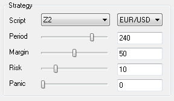

# slider

## slider(int number, int pos, int min, int max, string name_, string tooltip_): var

Sets up an initial position, range, name, and tooltip for one of the three customizable sliders. Returns the current position of the slider. Depending on the selected asset or other conditions, different slider positions can be preset at the beginning.

## slider(int number): var

Returns the position of the slider with the given **number**. The slider must have been set up before.

## slider(int number, int pos)

Sets the slider with the given **number** to a new position. This way the script can display numerical values to the user while running. The slider must have been set up before.



### Parameters:

<table border="0"><tbody><tr><td style="width: 70px"><strong>number</strong></td><td>Slider number: <strong>0</strong> for the <strong>Period</strong> slider, <strong>1..3</strong> for the 3 user-specific sliders.</td></tr><tr><td style="width: 70px"><strong>pos</strong></td><td>Slider position. The initial position is set when the script is run the first time.</td></tr><tr><td style="width: 70px"><strong>min, max</strong></td><td>Minimum (left) and maximum (right) position of the slider, positive integers,<strong> min</strong> &lt; <strong>max</strong>.</td></tr><tr><td style="width: 70px"><strong>name</strong></td><td>Text displayed next to the slider (like "Margin"). If the name begins with a dot (like ".Panic"), a decimal point is displayed in front of the last 3 digits in the edit window.</td></tr><tr><td style="width: 70px"><strong>tooltip</strong></td><td>Tool tip text to describe the slider function, or <strong>0</strong> for no tool tip.</td></tr></tbody></table>

### Returns

Current value of the slider.  
 

### Remarks:

*   For setting up a slider name and range, the **slider** function must be called in the initial run of the script. The **Period** slider has fixed parameters and is hard-wired to the **[BarPeriod](177_BarPeriod_TimeFrame.md)** variable. The other sliders can be freely set and defined.
*   For displaying fractional values, put a dot at the begin of the slider name, and multiply the **pos**, **min**, **max** parameters with 1000. The value in the edit window is then displayed with 3 decimals. The returned value must be divided by 1000. 
*   The sliders are initialized to their default positions (**pos** parameter) when the script is started the first time, or when the script was edited or a new \[Script\] was selected. On subsequent starts of the same script the sliders keep their previous position. For testing a script with a manually set slider position, click \[Test\], wait until the slider names appear on the GUI, then click \[Stop\], put the sliders to the desired position and click \[Test\] again.
*   In \[Trade\] mode the slider positions are stored in the **.trd** file and thus 'remember' their last position. The **.trd** file is automatically updated at any trade entry or exit, or in [TickTime](ticktime.htm#) intervals when the sliders were moved.
*   The [SLIDERS](013_Asset_Account_Lists.md) fllag is set whenever a slider is moved or the number in the field is edited. It can be reset by script.
*   Aside from the sliders, a [panel](142_panel.md) with entry fields can also be used for user input.

### Example:

```c
_// Investment calculator_
void main()
{
  slider(1,10000,1,20000,"Capital","Initial capital");
  slider(2,10000,0,20000,"Profit","Profit so far");
  slider(3,2000,1000,2000,".Root","Root"); _// 1.000 = linear, 2.000 = square root_
  while(wait(100))
    print(TO\_INFO,"\\rInvestment: $%.0f",
      slider(1)\*pow(1+slider(2)/slider(1),1./(slider(3)/1000.)));
}
```

### See also:

[optimize](107_optimize.md), [panel](142_panel.md)

[► latest version online](javascript:window.location.href = 'https://zorro-project.com/manual/en' + window.location.href.slice\(window.location.href.lastIndexOf\('/'\)\))