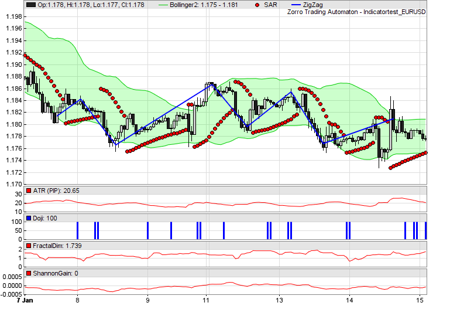
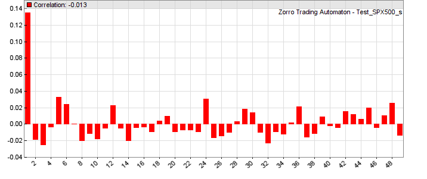
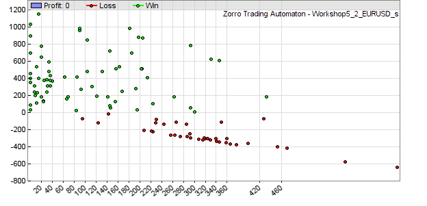

# plot, plotBar, ...

# Plot functions

Zorro can generate charts, histograms, or scatter plots, and export the data in CSV or image format for further evaluation. The [profile library](147_plotProfile.md) contains often-used functions for diagrams. The following plot commands are available:

## plot(string Name, var Value, int Type, int Color)

## plot(string Name, vars Data, int Type, int Color)

Plots a variable, or the first element of the **Data** series, on the current bar position on the [chart](011_Chart_Viewer_Debugger.md). The value can be plotted as a dot, line, bar, or band, dependent on **Type**. The plot is linked to the current asset. 

## plotBar(string Name, int Pos, var Label, var Value, int Type, int Color)

Adds a value to a given x axis position in a histogram. A histogram consists of vertical bars that display the sum, average, standard deviation, maximum, or minimum of the values added to any x position. It can be exported to a CSV file for further evaluation.

## plotHistogram(string Name, var Value, var Step, var Weight, int Color): int

Variant of **plotBar** for plotting a histogram bar. The **Value** range is dividied in equidistant **Step**s. Bars belonging to the same **Step** are accumulated by adding their **Weight**s. Returns the x axis position of the bar.

## plotGraph(string Name, var X, var Y, int Type, int Color)

Plots a dot, symbol, line, spline, or polygon at a given **X,Y** position with the given **Color** either to the current chart, to the current histogram created by **plotBar**, or to a scatter plot when **Type** was combined with **GRAPH**. Call this function to mark certain events in the price chart.

## plotText (string Name, var X, var Y, string Text, int Style, int Color)

Displays the **Text** with the given **Color** at a given **X,Y** relative or absolute position (dependent on **Style**, see below)  on the current chart, scatter plot, or histogram. Text on relative positions scrolls with the other chart elements and is only visible when the chart is above a zoom factor determined by [PlotText](204_PlotBars_PlotWidth.md).

## plotData (string Name): DATA\*

Returns a pointer to the **DATA** struct with the data stored by a chart plot or histogram with the given **Name**. The **DATA** struct is defined in **include\\trading.h**. **DATA->Data\[DATA->start\]** is the first valid data point, and **DATA->Data\[DATA->end\]** is the last. The data points are in chronological order. **DATA->Data\[n\]** is the data point at bar number **n**, and its timestamp is therefore **wdateBar(n)**. The function can be used for retrieving the plot curve, for analyzing it, for modifying data before plotting, or for exporting it to other charting tools.

## plotChart (string FileName)

Generates a chart or histogram from the previous **plot** calls, and displays it with the [chart viewer](011_Chart_Viewer_Debugger.md) or stores it in a **.png** file with the given **FileName** when [PL\_FILE](203_PlotMode.md) is set. Exports it to a CSV file when [PL\_EXPORT](203_PlotMode.md) is set. Deletes all plot elements so that new plots can be built afterwards. Use this function to update charts or histograms in real time (see [PayOff.c](scripts.md)). If this function is not used, the chart is generated at the end of a backtest or when clicking \[Result\].  
 

  
Chart with candles and indicators, created with **plot** commands

  
Autocorrelation histogram created with **plotBar** commands

  
MAE scatter plot, created with **plotGraph** commands.

 

### Parameters:

<table border="0"><tbody><tr><td><strong>Name</strong></td><td>The name for the chart legend; a string constant with up to 15 characters. Different curves - including the upper and lower curve of a band - must have different names. If the name begins with '<strong>#</strong>', it does not appear in the chart legend.</td></tr><tr><td><strong>Pos</strong></td><td>The bar number in a histogram in the -4000..4000 range. Determines the bar's position on the horizontal axis. All <strong>plotBar</strong> commands with the same bar number affect the height of the bar in various ways, dependent on the <strong>Type</strong> parameter.</td></tr><tr><td><strong>X,Y</strong></td><td>In a histogram, <strong>X</strong> is the bar number in <strong>-4000..4000</strong> range, and <strong>Y</strong> is the position on the vertical axis.<br>In a scatter plot, <strong>X</strong> and <strong>Y</strong> are horizontal and vertical coordinates in arbitrary units.<br>In a price chart, <strong>X</strong> is the bar offset (<strong>0</strong> = current bar), and <strong>Y</strong> is the position on the left or right vertical axis.</td></tr><tr><td><strong>Label</strong></td><td>A number printed on the horizontal axis at the given <strong>Pos</strong> position, or <strong>NIL</strong> for no label. For better readability, label numbers should be in the ±0.1 .. ±1000 range and should be not too tight together.</td></tr><tr><td><strong>Value</strong></td><td>The data value to be plotted or added to the bar. Use <strong>1</strong> in combination with <strong>SUM</strong> for counting events. For plotting an <strong>int</strong>, cast it to <strong>var</strong>.</td></tr><tr><td><strong>Text</strong></td><td>Short text to be plotted on the chart; up to 15 characters. For longer texts put several <strong>plotText</strong> calls together.</td></tr><tr><td><strong>Data</strong></td><td>The data <a href="series.htm">series</a> whose most recent value is plotted.</td></tr><tr><td><strong>Type</strong></td><td><p>The type of the data curve or element in the chart or histogram. All elements with the same <strong>Name</strong> must be of same <strong>Type</strong>. Use <strong>0</strong> for a simple line on the chart, or a combination of:<br><strong><br>BARS</strong> - plot a bar or vertical mark. For <strong>plot</strong> and <strong>plotBar</strong>.<br><strong>DOT</strong> - plot a colored dot. For <strong>plot</strong>, <strong>plotBar</strong>, and <strong>plotGraph</strong>.<br><strong>BAND1</strong> - for <strong>plot</strong>, plot the upper line of a band, use the color for the upper and lower lines. Main chart only.<br><strong>BAND2</strong> - for <strong>plot</strong>, plot the lower line of a band, use the color for filling the band. Main chart only.<br><strong>LINE</strong> - for <strong>plot</strong>, use a thick line. Otherwise it's a thin line.<br><strong>AVG</strong> - for <strong>plot</strong>, use the average of all <a href="numsamplecycles.htm">sample cycles</a>.<br><br><strong>MAIN</strong> - for <strong>plot</strong>, plot this and all following curves in the main price chart.<br><strong>NEW</strong> - for <strong>plot</strong>, plot this and all following curves in a new extra chart (see remark below about plot order).<br><strong>AXIS2</strong> - use a second y axis on the right side of the chart.<br><strong>LOG</strong> - use a logarithmic y scale.<br><br><strong>AVG</strong> - for <strong>plotBar</strong>, plot the average of all bar values at the current x position.<strong><br>DEV</strong> - for <strong>plotBar</strong>, plot the standard deviation of all values at the current x position.<br><strong>SUM</strong> - for <strong>plotBar</strong>, plot the sum of all values at the current x position.<br><strong>MINV</strong> - for <strong>plotBar</strong>, plot the minimum of all values at the current x position.<br><strong>MAXV</strong> - for <strong>plotBar</strong>, plot the maximum of all values at the current x position.<br><strong>NRM</strong> - for <strong>plotBar</strong>, normalize the values of all bars to <strong>1</strong>.<br><br><strong>LINE</strong> - for <strong>plotGraph</strong>, draw a straight line from the last position to the current position.<br><strong>SPLINE</strong> - for <strong>plotGraph</strong>, draw a curved line from the last position to the current position.<br><strong>END</strong> - for <strong>plotGraph</strong>, end point of a line or polygon started with <strong>LINE</strong>.<br><strong>GRAPH</strong> - for <strong>plotGraph</strong>, plot the element to a scatter plot.&nbsp;<br><strong>DEL</strong> - for <strong>plotGraph</strong>, delete the previous plot and start over.<br><strong>DOT</strong> - draw a colored dot. The size can be determined with <a href="plotbars.htm">PlotScale</a>.<br><strong>SQUARE</strong> - draw a colored square.<br><strong>TRIANGLE</strong> - draw a upwards pointing colored triangle.<br><strong>TRIANGLE2</strong>,<strong>3</strong>,<strong>4</strong> - draw a colored triangle pointing to the left, right, or down.<br><strong>CROSS</strong> - draw a colored cross.<br><strong>CROSS2</strong> - draw a colored diagonal cross.<br></p></td></tr><tr><td><strong>Style</strong></td><td>Text style; all texts with the same <strong>Name</strong> must have the same <strong>Style</strong>. Text centered = <strong>0</strong> (default), aligned to Bottom Left = <strong>1</strong>, Bottom Center = <strong>2</strong>, Bottom Right = <strong>3</strong>, Left = <strong>4</strong>, Right = <strong>6</strong>, Top Left = <strong>7</strong>, Top Center = <strong>8</strong>, Top Right = <strong>9</strong>. Add <strong>32</strong> for text at absolute <strong>X,Y</strong> pixel position (0,0 = upper left corner of the chart). Add <strong>64</strong> for text on a white background. Add <strong>128 </strong>for large bold text.</td></tr><tr><td><strong>Color</strong></td><td>Color and transparency of the data curve, bar, symbol, or text, in the format as described under <a href="colors.htm">Colors</a>.. Elements on a histogram or scatter plot can have different colors; on a chart all elements with the same <strong>Name</strong> must have the same <strong>Color</strong>. If at <strong>0</strong>, nothing is plotted, but the data is stored for later analyzing it by <strong>plotData</strong>. Use the <a href="color.htm">color</a> function for generating color ranges, and the <a href="profile.htm">plot2</a> function for plotting curves in two colors.</td></tr></tbody></table>

  

### Remarks:

*   In \[Test\] mode the [chart viewer](011_Chart_Viewer_Debugger.md) either appears automatically after the test, or at pressing \[Result\], dependent on [PLOTNOW](018_TradeMode.md). In \[Trade\] mode the live chart is updated in intervals given by on [PlotPeriod](204_PlotBars_PlotWidth.md). In \[Train\] mode no charts are plotted; instead parameter histograms or countour charts are displayed in a browser. Histograms show the objective value and the number of winning and losing trades for each parameter.
*   Histograms, scatter plots, and charts can not be plotted at the same time; **plotBar** overrides **plot**.
*   The vertical axis of charts and histograms is automatically scaled so that all elements are visible. This can cause 'compressed lines' when elements are too far apart or at wrong positions, for instance a plot at position 0 on a chart with a 1.1 - 1.2 price range. Elements by **plotGraph** can affect the scale even when they are outside the visible chart section. If a plot curve appears compressed or vertically shifted, it has likely initial values outside their normal range. For avoiding this, start the plots after the lookback period ( **if(!is(LOOBACK)) { plot(...); }** ).
*   When extra charts are opened with **NEW**, the order of **plot** calls determines in which chart the curves are plotted. The order is determined by the first **plot** call in or after the [FIRSTRUN](018_TradeMode.md). Subsequent calls can then be in arbitrary order. When plot order matters and plots depend on **if(...)** conditions, enforce the right order in the first run f.i. with **if(is(FIRSTRUN))**. Candles and bands are only plotted in the main chart.
*   If **plot** is called several times with the same **Name** at the same bar, only the last data value is plotted.
*   If a **plot** command is not called during a bar, the plotted curve will have gaps at the skipped bars. This can be used for plotting dotted lines. Example for plotting only at every second bar in a chart: **if(Bar%1) plot(...);.**
*   Every plot on a chart must have the same **Type** and **Color**. For plotting a curve in different colors, use alternating curves with the same value and different **Name**. In a histogram, any graph or symbol can have an individual color.
*   **plotGraph** and **plotText** limit to the number of elements (lines, symbols, texts) per plot to the number of bars on the chart. Exceeding the limit causes an [Error 038](errors.md) message. For adding more elements to the chart, use another **plotGraph** with a different **Name**.
*   Any **plot** command is normally linked to the current asset. When [multiple assets](013_Asset_Account_Lists.md) are traded, only prices, trades, and curves linked to the asset selected with the \[Asset\] scrollbox are plotted; curves linked to other assets are only plotted when [PlotMode](203_PlotMode.md) got set to **PL\_ALL**. For plotting parameters of different assets together, store them in different variables and then plot all together without calling **asset()** inbetween. For instance, inside an [asset loop](109_loop.md) you can store them in a **var** array with one element per asset, then plot all elements of the array after the asset loop. The curves are then visible on the chart when you select the last asset of the loop and click \[Result\].
*   For removing chart elements such as price candles or equity curves, set their [Color](206_Colors.md) to 0.
*   Use the [color](148_color.md) function for setting color ranges in multicolor histograms. An example can be found in **profile.c** for the heatmap plotting.
*   Use **plotData** for evaluating or modifying plots.
*   Set the [EXPORTED](018_TradeMode.md) flag for exporting charts and histograms to a **\*\_plot.csv** file in the **Log** folder. They can then be displayed with other charting software.
*   For adjusting scale, colors, symbol sizes, x axis labels etc, set up the corresponding [plot variable](204_PlotBars_PlotWidth.md).
*   Special histograms, such as trade profiles, MAE graphs, seasonal profiles, correlograms or heatmaps can be plotted with the functions from the [profile](147_plotProfile.md) library.
*   Price curves can be plotted even without a [run](088_run.md) function - f.i. for [HFT](019_Hedge_modes.md) simulation - when the bars are increased by [priceQuote](price,htm). Make sure that the **plot** function is then called at every bar for avoiding gaps in the curve.
*   Use [dataChart](125_sortData_sortIdx.md) for plotting a contour chart of a complete dataset.

### Examples (see also profile.c, indicators.c):

```c
_// Compare price distribution (red) with random distribution (blue)_
function run()
{
  vars Price = series(price(0));
  int num = NumRiseFall(Price,20);
  plotBar("Price",2\*num,num,1,SUM|BARS,RED);	

  vars Random = series(0);
  Random\[0\] = Random\[1\] + random();
  num = NumRiseFall(Random,20);
  plotBar("Random",2\*num+1,0,1,SUM|BARS,BLUE);	
}
```
```c
_// plotGraph test_
function run()
{
  set(PLOTNOW);
_// plot green dots above the price at every 20th bar_
  if(Bar%20 == 0)  
    plot("Dotted",1.01\*price(),DOT,GREEN);  
 
  if(Bar == 500) {
_// plot a single blue rectangle in the price chart_ 
    plotGraph("Rectangle",0,0.99\*price(),LINE,BLUE);     _// start point_
    plotGraph("Rectangle",-500,0.99\*price(),LINE,BLUE);  _// 1st corner_
    plotGraph("Rectangle",-500,1.01\*price(),LINE,BLUE);  _// 2nd corner_
    plotGraph("Rectangle",0,1.01\*price(),LINE,BLUE);     _// 3rd corner_
    plotGraph("Rectangle",0,0.99\*price(),LINE|END,BLUE); _// 4th corner and end point_
 
_// plot a single red dot_
    plotGraph("Single Dot",-250,price(),DOT,RED);
  } 
}
```
```c
_// plot tiny triangles above / below price for buy and sell signals_
PlotScale = 8; _// size of triangle_
if(SignalBuy) plot("Buy",0.9\*priceLow(),MAIN|TRIANGLE,GREEN);
if(SignalSell) plot("Sell",1.1\*priceHigh(),MAIN|TRIANGLE4,RED);
```
```c
_// plot a chart title_
if(Init) plotText("Title",60,25,"My Chart",32+64+128+7,BLACK);
```
Examples of plotting symbols can be found in the [Predict](020_Included_Scripts.md) script and in the [profile](147_plotProfile.md) library.

### See also:

[printf](143_printf_print_msg.md), [PlotMode](203_PlotMode.md), [PlotScale](204_PlotBars_PlotWidth.md), [plotProfile](147_plotProfile.md), [dataChart](125_sortData_sortIdx.md), [Colors](206_Colors.md), [color](148_color.md)

[► latest version online](javascript:window.location.href = 'https://zorro-project.com/manual/en' + window.location.href.slice\(window.location.href.lastIndexOf\('/'\)\))