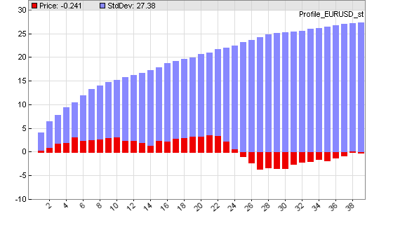
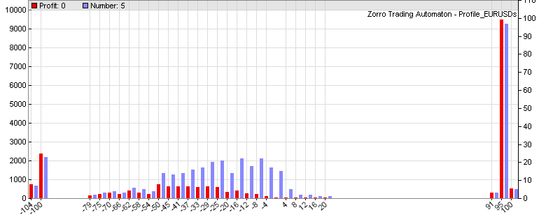
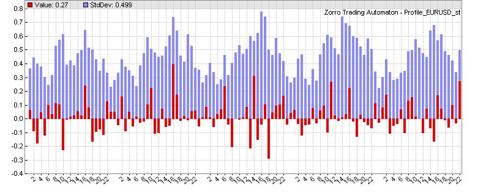
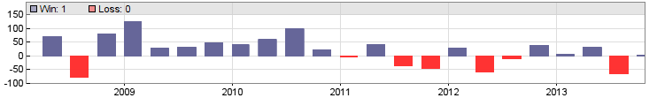

# plotProfile, ...

# profile.c - price, trade, correlation, and seasonal analysis

The **profile.c** library contains functions for generating price or trade profiles, MAE charts, or seasonal analysis charts in \[Test\] mode. The functions are normally used during strategy development for analyzing trade profits or for finding seasonal effects. They can also be used as templates for building user-specific profile charts.  

## plotPriceProfile (int bars, int type)

Generates a price difference profile starting at the current bar. This function is normally called by a trade signal for checking its predictive power. It produces a histogram of the mean price movement following the signal. The red bars in the histogram are the averaged mean price difference to the entry point in pips, the blue/grey bars are their standard deviations, divided by 4 for better scaling.

  
Price difference profile at entering a trade with the workshop 4 system. Note the small adverse excursion after 24 hours.

### Parameters:

<table border="0"><tbody><tr><td><strong>bars</strong></td><td>Number of bars to plot in the price profile..</td></tr><tr><td><strong>type</strong></td><td><p>Type of the plot.<br><strong>0</strong> = plot price difference in pips to the first bar.<br><strong></strong><strong>1</strong> = plot price change in pips from the previous bar.<br><strong>2</strong> = plot negative price difference to the first bar (for short trades).<br><strong>3</strong> = plot negative price change from the previous bar.</p></td></tr></tbody></table>

  
   

## plotTradeProfile (int bars)

Generates a profit distribution chart after the test run. The distribution shows the frequency of trades dependent on their profit or loss. The blue bars in the chart are the number of trades (right y axis), the red bars are the sum of their returns in pips (left y axis). The x axis is the trade profit or loss in pips. The example chart below shows a system with about 100 trades that hit their profit target at 100 pips, and about 30 trades that hit their stop at 100 pips loss. Inbetween there's a distibution of trades with mostly small losses. Note that the shown profit/loss is not exactly 100 pips due to spread and slippage.

  
Profit distribution of a system with [Stop](188_Stop_Profit_Trail_Entry.md) and [TakeProfit](188_Stop_Profit_Trail_Entry.md) distances both at 100 pips.

### Parameters:

<table border="0"><tbody><tr><td><strong>bars &gt; 0</strong></td><td>Number of bars to plot in the profit distribution. The more bars, the finer the resolution.</td></tr><tr><td><strong>bars &lt; 0</strong></td><td>Step width of the profit distribution in pips per bar. The smaller the step width, the finer the resolution.</td></tr></tbody></table>

  
 

## plotMAEGraph (int Type)

## plotMAEPercentGraph (int Type)

## plotMFEGraph (int Type)

## plotMFEPercentGraph (int Type)

Generates a Maximum Adverse Excursion / Maximum Favorable Excursion graph after the test run. The Maximum Adverse Excursion (MAE) is the worst drawdown of an individual trade, the difference of its highest interim profit to its worst interim loss. The Maximum Favorable Excursion (MFE) is the opposite. The graph displays any trade as a dot in a chart showing its MAE or MFE on the x axis and its profit on the y axis in pip units or in percent of the price. Winning trades are green, losing trades are red. This graph can be used for analyzing the exit behavior of the trades and finding the optimal stop or take profit distances.

  
MAE graph of the Workshop 5 system.

### Parameters:

<table border="0"><tbody><tr><td><strong>Type</strong></td><td>Not used yet - always <strong>0</strong>.</td></tr></tbody></table>

  
   

## plotDay (var value, int type)

## plotWeek (var value, int type)

## plotMonth (var value, int type)

## plotYear (var value, int type)

Seasonal analysis; generates a day, week, month or year distribution of a given value in a histogram (see also [seasonal strength](season.md)). This way seasonal effects of a trading system, a variable, or a price curve can be found. The red bars in the chart are the average value at a certain hour or day, the blue bars are their standard deviations divided by 4 for better scaling.

  
Week statistics with hourly returns of the workshop 4 EUR/USD system. Note the seasonal oscillation of the standard deviation - a price curve effect known as **heteroskedasticity**.

 

## plotWFOCycle (var value, int type)

Analyzes the development of the value over a WFO cycle (x axis = trading days since cycle start). Can be used to determine if the profit deteriorates towards the end of the cycle, thus suggesting shorter cycles.

### Parameters:

<table border="0"><tbody><tr><td><strong>value</strong></td><td>Value to be evaluated, for instance <a href="price.htm">price(0)</a>, <strong>Spread</strong>, <a href="balance.htm">Equity</a>, etc..</td></tr><tr><td><strong>type</strong></td><td><p><strong>0 </strong>= evaluate value difference to the season begin.<strong><br>1</strong> = evaluate value difference to the previous bar.<br><strong>4</strong> = evaluate absolute value.<br></p></td></tr></tbody></table>

  
   

## plotDayProfit ()

## plotWeekProfit ()

## plotMonthProfit ()

## plotQuarterProfit ()

## plotWFOProfit ()

Plots bars equivalent to the gain or loss of the previous day, week, month, quarter, or WFO cycle in a new window in the price chart (thus, clicking \[Result\] is required). The blue bars are the profit in units of the account currency, the red bars are the loss. Since the bars represent the previous period, they are shifted by one period.

  
Quarterly profit/loss of the Workshop 4 EUR/USD system.   
 

## plotCorrelogram(var Value, int Lag)

## plotCorrelogram(var Value1, var Value2, int Lag)

Generates in the **EXITRUN** a histogram of the correlation of a variable with itself, or with another variable, for sequential values of lag. On random data, such autocorrelations should be near zero for all time lags. But if the data is non-random, one or more of the autocorrelations will be significantly non-zero.


The above correlogram displays a significant correlation (0.14) of the variable with its value from the previous bar. The correllations with earlier bars (2...49) are not as significant.

### Parameters:

<table border="0"><tbody><tr><td><strong>Value1</strong></td><td>First variable to be evaluated, for instance <a href="price.htm">price(0)-price(1)</a>.</td></tr><tr><td><strong>Value2</strong></td><td>Second variable to be evaluated.</td></tr><tr><td><strong>Lag</strong></td><td><p>Maximum autocorrelation lag.<br></p></td></tr></tbody></table>

## plotHeatmap(string name, var\* Data, int Rows, int Cols)

## plotHeatmap(string name, mat Matrix)

Plots a heatmap in the **EXITRUN** from the given **Matrix** or the **Data** array of size **Rows\*Cols**, usually a correlation matrix. The matrix elements must be in the **0..1** range, and are displayed as squares with a color range from blue (**0**) to red (**1**). Since the heatmap is simulated with colored dots, you might need to scale the chart before exporting so that it looks nice. Examples of heatmap usage can be found on [Financial Hacker](https://financial-hacker.com/get-rich-slowly/). A different type of heatmap - a contour chart - can be plotted with the [dataChart](125_sortData_sortIdx.md) function.


### Parameters:

<table border="0"><tbody><tr><td><strong>Data</strong></td><td>Pointer of a <strong>var</strong> array with <strong>Rows</strong> * <strong>Cols</strong> elements.</td></tr><tr><td><strong>Rows, Cols</strong></td><td>Array size.<br>&nbsp;</td></tr></tbody></table>

## plotBuyHold(string Benchmark, int Color)

Compares the equity curve with a benchmark. Call this function at any [run](088_run.md) for plotting the buy-and-hold profit curve of the given **Benchmark** asset - for instance, **"SPY"** - in the given **Color**. The position size is detemined by [Leverage](192_PIP_PIPCost_Leverage.md) and [Capital](190_Margin_Risk_Lots.md). If **Capital** is zero, the position size is given by [Lots](190_Margin_Risk_Lots.md). The equity curve is displayed with a blue line for better comparison.  
 

## plot2(string Name,var Value,int Type,int Select,int Color1,int Color2)

Like [plot](146_plot_plotBar.md), but plots a two-color curve. **Select** can be a boolean expression; at **true** (nonzero) the curve is plotted in **Color1**, otherwise in **Color2**.  
 

### Remarks:

*   All profile functions are contained in source code in **include\\profile.c**, and can be used as templates for writing other chart plotting or analysis functions of any kind.
*   For adding the profile functions, the line **#include <profile.c>** must be added at the begin of the script.
*   Price profile or distribution histograms should normally only be plotted for a single asset and algorithm, since every market and every system will generate a different profile. In a portfolio strategy, temporarily disable the other assets and algos for plotting a profile of a component.
*   Only one histogram can be plotted, not several at the same time; unused plot commands must be commented out for not interfering with the active chart. Histograms are only plotted in \[Test\] mode, not in \[Train\] and \[Trade\] mode. 
*   The size and resolution of the histogram can be set up with the [plot parameters](204_PlotBars_PlotWidth.md). Label spacing at the x axis can be set up with **PlotLabels**.
*   Week, month, and year analysis is based on trading days, not calendar days. Therefore the week has 5 days, the month 22 days, and the year 252 days. Due to the different number of trading days (20..23) in a month, they are normalized to 22, so day 22 is always the last trading day of the month.
*   The standard deviations (blue bars in the chart) show how much the values differ from their average, and thus indicate the significance of a nonzero average. The smaller the blue bar and the bigger the red bar, the more significant is the seasonal effect. In the case of prices or returns, the standard deviation is a measure of volatility.
*   When developing a strategy, it is helpful to examine the price difference profile at every trade entry bar for verifying the trade entry rules and for determining the exit rules.

### Examples:

```c
#include <profile.c>
_// Price difference profile_
function run()
{
  vars Trend = series(LowPass(series(price()),500));
  if(valley(Trend)) {
    plotPriceProfile(40,0);
    enterLong();
  } else if(peak(Trend)) {
    plotPriceProfile(40,2);
    enterShort();
  }
}
```
```c
#include <profile.c> 
_// Trade distribution or quarterly profit/loss_
function run()
{
  vars Trend = series(LowPass(series(price()),500));
  Stop = 100\*PIP;
  TakeProfit = 100\*PIP;
  if(valley(Trend))
    enterLong();
  else if(peak(Trend))
    enterShort();

  PlotHeight1 = 320;
  PlotScale = 4;
  plotTradeProfile(50);
}
```
```c
#include <profile.c>
_// Weekly return analysis_ _or quarterly profit/loss_
function run()
{
  vars Trend = series(LowPass(series(price()),500));

  if(valley(Trend))
    enterLong();
  else if(peak(Trend))
    enterShort();

  PlotHeight1 = 320;
  PlotScale = 3;
  set(PLOTNOW);
  plotWeek(Equity,1);  
  //plotQuarterProfit();
}
```
```c
#include <profile.c>
_// Correlogram of High-to-High differences of selected asset_
function run()
{
  PlotHeight1 = 320;
  PlotScale = 10;
  plotCorrelogram(priceHigh(0)-priceHigh(1),50);
}
```
```c
#define DAYS  252 _// 1 year_
#define NN    30  _// max number of assets_
#include <profile.c>
_// plot a heatmap of asset correlations_
function run()
{
  BarPeriod = 1440;
  StartDate = NOW;
  LookBack = DAYS;

  vars Returns\[NN\];
  var Correlations\[NN\]\[NN\]; _// NN\*NN matrix
_  int N=0;
  while(asset(loop("USD/CAD","EUR/USD","GBP/USD","USD/JPY"))) 
    Returns\[N++\] = series(RET(1));

  int i,j;
  if(is(EXITRUN)) {
    for(i=0; i<N; i++)
      for(j=0; j<N; j++)
        Correlations\[N\*i+j\] = Correlation(Returns\[i\],Returns\[j\],DAYS);
    plotHeatmap("Correlation",Correlations,N,N);
  }
}
```
```c
_// Plot a 2-color RSI_
var RSI2(vars Data,int TimePeriod)
{
  var RSIVal = RSI(Data,RSIPeriod);
  plot2("RSI2",RSIVal,BARS,RSIVal > 50.,GREEN,RED);
  return RSIVal;
}
```

### See also:

[plot](146_plot_plotBar.md), [plot parameters](204_PlotBars_PlotWidth.md), [colors](206_Colors.md), [season](138_Seasonal_Strength.md)

[► latest version online](javascript:window.location.href = 'https://zorro-project.com/manual/en' + window.location.href.slice\(window.location.href.lastIndexOf\('/'\)\))