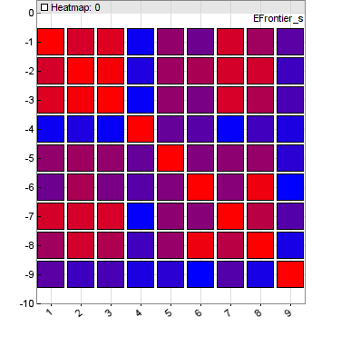
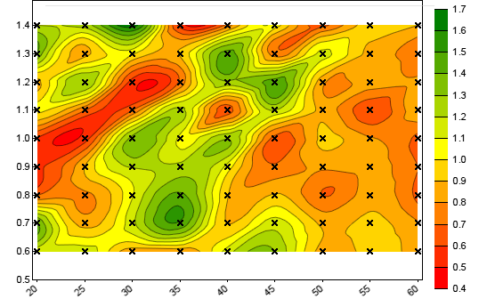

# Dataset handling

# Dataset handling

A dataset is an ordered list of records, normally in time descending order. Each record consist of multiple binary data fields. The first field is normally an 8-byte timestamp in DATE format. It can also hold other 8-byte data when timestamps are not needed. The subsequent fields have a size of 4 bytes and can contain floats, ints, or strings. The size of a record in bytes is therefore **4+fields\*4**. The total number of records in a dataset must not exceed **2147483647**, which is the positive **[int](aarray.md)** range.  
  Datasets can store option chains, order books, asset names, reports, earnings, interest rates, or any other data organized in rows and columns. Text strings can have any size and can occupy several adjacent fields. A dataset can be saved, loaded, imported or exported, searched, sorted, merged, split, resized, or used as indicator in backtests. The **.t1**, **.t2**, **.t6**, and **.t8** historical data files are in fact datasets with 1, 2, 6, or 8 data fields plus 1 timestamp field.  
  Any dataset is identified by its handle, which is a number from 1..1000. Thus, you cannot use more than 1000 datasets in your script. 

The following functions are used to create or load a dataset:

## dataNew (int Handle, int Records, int Fields): void\*

Deletes the dataset with the given **Handle**, frees the memory, and creates a new dataset with the given number of **Records** and **Fields**. If both are **0**, the dataset is deleted, but no new dataset is created. Returns a pointer to the begin of the first record, or **0** when no new dataset was created.

## dataLoad (int Handle, string Filename, int Fields): int

Reads a dataset from a binary file. **Fields** is the number of fields per record, including the timestamp field at the begin of any record. Thus, a **.t1** historical data file has 2 fields and a **.t8** file has 9 fields. The function returns the number of records read, or **0** when the file can not be read or has a wrong size.

## dataCompress (int Handle, string Filename, int Fields, _var Resolution_): int

Like **dataLoad**, but reads only records that differ in at least one value other than the timestamp from the previous record, and are at least **Resolution** milliseconds apart. On files with 2 fields, positive and negative column 1 values are compared separately for dealing with ask and bid quotes of **.t1** files. Can be used to compress price history files by changing the resolution and eliminating records with no price change.

## dataDownload (string Code, int Mode, int Period): int

Downloads the dataset with the given **Code** from Quandl™ or other price sources, and stores it in CSV format in the **History** folder. Returns the number of data records. Data is only downloaded when it is more recent than the last downloaded data plus the given **Period** in minutes (at **0** the data is always downloaded). [Zorro S](restrictions.md) is required for loading Quandl datasets.

## dataParse (int Handle, string Format, string Filename, _int Start, int Num_): int

Parses a part or all data records from the CSV file **Filename** and appends them at the start of the dataset with the given **Handle** number. For beginning a new dataset, call **dataNew(Handle,0,0)** before. **Num** records are parsed, beginning with the record **Start**. If both parameters are omitted or zero, the whole CSV file is parsed.  
  Records can have time/date, floating point, integer, and text fields. CSV headers are skipped. Several CSV files can be appended to the same dataset when their record format is identical. The CSV file can be in ascending or descending chronological order, but the resulting dataset should normally be in descending order, i.e. the newest records are at the begin. Any record in the dataset begins with a time stamp field in [DATE](116_Statistics_Transformations.md) format; the other fields can be in arbitrary order determined by the **Format** string (see Parameters). If the CSV file does not contain time stamps, the first field in the record is filled with zero.  
  The function returns the number of records read, or **0** when the file can not be read or has a wrong format. Please see below under **Remarks** how to build a correct format string and how to debug the parsing.

## dataParse (int Handle, string Format, string Filename, string Filter): int

As before, but parses only lines that contain the string **Filter**. The string is case sensitive and can include delimiters, so it can cover several adjacent fields. Use delimiters at begin and end for matching a whole field. Use **'\\n'** as first filter character for matching the first field. This way only lines with a certain asset name, year number, or other content are parsed.

## dataParseJSON (int Handle, string Format, string Filename): int

## dataParseString (int Handle, string Format, string Content): int

As before, but parses timestamp, prices, and volumes from the JSON file **Filename** (with **".json"** extension) or from the given JSON string to the dataset with the given **Handle** number. The file or string is supposed to contain OHLC candles or BBO quotes as JSON objects in winged brackets {..}. Depending on **Format** (see Parameters), the dataset is created either in **T6** record format with 7 fields, or in **T2** format with 3 fields. The field names are given with the **Format** string in a fixed order. Data fields in the JSON file must contain valid numbers; they must not be empty or contain text like "NaN" or "null". **Content** is modified by the parsing process.The function returns the number of records read, or **0** when the file can not be read or has a wrong format.  
   

# Storing datasets

## dataSave (int Handle, string Filename, _int Start, int Num_)

Stores the dataset with the given **Handle** as a binary file. **Num** records are stored, beginning with the record **Start**. If both parameters are omitted or zero, the whole dataset is stored. Make sure that the number of records does not exceed the **2,147,483,647** limit and the resulting file size does not exceed 5 GB, which is the Windows limit for file operations.

## dataSaveCSV (int Handle, string Format, string Filename, _int Start, int Num_)

The opposite to **dataParse**; stores a part or all of the dataset with the given **Handle** number in a CSV file with the given **FileName**. The type and order of the CSV fields can be defined by the **Format** string in the same way as for **dataParse**, except that no header line is stored. Usage example in **CSVfromHistory.c**.  
   

# Manipulating datasets

## dataMerge (int Handle1, int Handle2): int

Merges both datasets and stores the result in the first dataset with **Handle1**. Both datasets must be sorted in descending time stamp order and must contain the same number of fields per record. When timestamps overlap, the content from the second dataset replaces content from the first. This function can be used to stitch datasets together. Returns the total number of records, or **0** when the datasets could not be merged

## dataAppend (int Handle1, int Handle2, _int Start, int Num_): int

Appends dataset **Handle2** partially or completely at the end of the dataset **Handle1**. The **Handle1** dataset must be either empty or have the same number of columns as **Handle2**. The number of rows may be different. **Num** records from **Handle2** are stored, beginning with the record **Start**. If both parameters are omitted or zero, the whole dataset is appended. Returns the total number of records, or **0** when the datasets could not be appended.

## dataAppendRow (int Handle, int Fields): void\*

Appends a new record at the end of the given dataset, and returns a temporary pointer to the begin of the new record. If the dataset didn't exist, it is created with the given number of fields. The returned pointer remains valid until the next **dataAppendRow** call. Use **dataRow** (see below) for converting the pointer to a record number. 

## dataDelete (int Handle, int Record1, int Record2): int

Deletes all records from **Record1** up to **Record2** from the dataset. Returns its new number of records.

## dataClip (int Handle, int Records): int

Truncates the dataset to the given number of records.

## dataSort (int Handle)

Sorts the dataset with the given **Handle** in descending order of the first column (usually the time stamp). If Handle is negative, sorts in ascending order. Returns the number of records.  

## dataCompressSelf (int Handle, var MinTime)

Like **dataCompress**, but compresses the dataset with the given **Handle**.  
   

# Plotting datasets

Datasets can be plotted to a histogram or statistics chart with the [plot](146_plot_plotBar.md) commands. For plotting them in special ways, the following commands have been added:

## dataChart (int Handle, string Filename, CONTOUR, NULL)

Generates a [contour chart](107_optimize.md) of a 3-field dataset. The resulting image is stored under **Filename** when [PL\_FILE](203_PlotMode.md) is set, otherwise displayed on the interactive chart. The value in the first field of a record is displayed as a contour color ranging from red to green. The second field is the x coordinate and the third field the y coordinate (see example). **CONTOUR|DOT** plots a cross at every xy coordinate. This function can be used to display parameter contour charts from CSV files exported by genetic or brute force training.

## dataChart (int Handle, string Name, HEATMAP, var\* Scale)

Generates a [heatmap](profile.htm#heatmap) from a 2D dataset. The resulting image is stored under **Name** when [PL\_FILE](203_PlotMode.md) is set, otherwise displayed on the interactive chart with the titel **Name**. The dataset contains heat values in a column x row matrix that are displayed in colors ranging from blue to red. This function can be used to display correlation or weight heatmaps.  
  
    
Heatmaps can be displayed with data values in the fields by giving **HEATMAP|LABELS**. The x and y axes can can scaled by giving a **Scale** array consisting of x offset, x scale factor, y offset, and y scale factor. 

# Accessing data

## dataFind (int Handle, var Date): int

Returns the number of the first record at or before the given **Date** in [wdate](month.htm#wdate) format. Returns **\-1** when no matching record was found or when no dataset with the given **Handle** exists. Returns the number of records when **Date** is **0**. The dataset must be in descending time stamp order. Decrease the returned record number to retreive records with later dates; increase it to get records with earlier dates or with the same date. Subtract an offset from **Date** for avoiding future peeking; f.i. for EOD datasets with timestamps from the begin and data from the end of the day, subtract 16 hours (**16./24**) to adjust the timestamps to 16:00 market close time.

## dataRow (int Handle, void \*Record): int

Returns the row number of the record with the given pointer. Reverse function of **dataStr(Handle,Row,0)**.

## dataSize (int Handle, int \*Rows, int \*Columns): int

Returns the number of elements in the given dataset, and set the **Rows** and **Columns** pointers, when nonzero, to the number of records and fields. 

## dataSet (int Handle, int Row, int Column, var Value)

## dataSet (int Handle, int Row, int Column, int Value)

Stores the **Value** in the floating point or integer field **Column** of the record **Row**. Can be used for modifying datasets f.i. for removing outliers or adding parameters. Since the target field format depends on whether **Value** is **int** or **var**, make sure to use the correct type, especially when entering constants, and typecast it with **(int)** or **(var)** if in doubt. When modifying the time stamp field of the record (**Column** = 0), make also sure to keep descending order of dates in the array.

## dataVar (int Handle, int Row, int Column): var

Returns the value of the floating point field **Column** from the record **Row**. If **Column** is 0, the time stamp of the record is returned in [wdate](month.md) format. If **Row** is negative, the record is taken from the end of the dataset, i.e. **Row = -1** accesses the oldest record. If the dataset is empty or if **Row** or **Column** exceed the number of records and fields, **0** is returned.

## dataInt (int Handle, int Row, int Column): int

As before, but returns the value of the integer field **Column** from the record **Row**.

## dataStr (int Handle, int Row, int Column): string

As before, but returns a pointer to the field **Column** from the record **Row**. It it's a text field, the text string of up to 3, 7, or 11 characters is returned. If **Column** is **0**, it returns a pointer to the timestamp field, i.e. the start of the record. For getting a pointer to the first record of the dataset, call **dataStr(Handle,0,0)**. For modifying a text field in a dataset, return its **string** pointer and then modify the string.

## dataCol (int Handle, var\* Data, int Column): int

Sets the predefined **rMin,** **rMax, rMinIdx** and **rMaxIdx** variables to the minimum and maximum values of the given **Column**. If **Data** is nonzero, fills it with all **float** or **double** elements from the column. The **Data** array must have at least the same number of elements than the number of records in the dataset. Returns the number of records.

## dataCopy (int Handle, var\* Data): int

Fills the **Data** array with the content of the dataset in column-row order, while all **float** elements are converted to **double**. Sets the **rMin** and **rMax** variables to the minimum and maximum values. Returns the number of elements. The **Data** array must have at least the same number of elements as the dataset.   
   

# Helper functions

## dataFromQuandl (int Handle, string Format, string Code, int Column): var

Helper function for generating an indicator based on a Quandl™ EOD time series. Works in live trading as well as in backtest mode, and returns the content of the field **Column** from the dataset **Code** in the given **Format**. This function is often used for getting extra market data, such as the yield rate or the Commitment of Traders (COT) report of particular assets. Timestamps are automatically adjusted by 16 hours so that the indicator changes when the US market opens. If this is not desired, remove the term **\-16./24** from the function source code in **contract.c** (which must be included for using this function). [Zorro S](restrictions.md) is required for accessing Quandl data. 

## dataFromCSV (int Handle, string Format, string Filename, int Column,int Offset): var

Helper function for generating an indicator based on a downloaded CSV file; for backtesting only. Returns the content of the field **Column** from the file **Filename.csv** in the given **Format**. **Offset** is the time stamp adjustment in minutes, f.i. to 16:00 for avoiding future peeking with EOD data. Source code in **contract.c**, which must be included for using this function.   
   
 

### Parameters:

<table border="0"><tbody><tr><td><strong>Code</strong></td><td>The Google or Quandl code, f.i. <strong>"NYSE:AMZN"</strong> or <strong>"WIKI/AAPL"</strong>. For selecting a ticker from a Quandl data table, add a colon and the ticker symbol, f.i. <strong>"ZACKS/ES:AAPL"</strong>. The file is stored in the <strong>History</strong> folder under the <strong>Code</strong> name with <strong>": /'</strong> characters replaced with <strong>"- _"</strong>, plus <strong>"1"</strong> when only the most recent record was downloaded, plus <strong>".csv"</strong>.</td></tr><tr><td><strong>Mode</strong></td><td><strong>FROM_GOOGLE</strong> for downloading a time series from Google™<br><strong>FROM_GOOGLE|1</strong> for downloading only the last records, for live trading<br><strong>FROM_QUANDL</strong> for downloading a time series from Quandl™ (Zorro S and <a href="ini.htm">Quandl key</a> required).<br><strong>FROM_QUANDL|1</strong> for downloading only the most recent record, for live trading<br><strong>FROM_QTABLE</strong> for downloading a Quandl™ data table</td></tr><tr><td><strong>Period</strong></td><td>Minimum time in minutes to keep the last downloaded file until a newer file is downloaded, or <strong>0</strong> for always downloading the file.</td></tr><tr><td><strong>Handle</strong></td><td>A number from <strong>1...1000</strong> that identifies the dataset. Handles above <strong>1000</strong> are reserved for Zorro functions.</td></tr><tr><td><strong>FileName</strong></td><td>Name of the file, with relative or absolute path.</td></tr><tr><td><strong>Records</strong></td><td>Number of records in the dataset.</td></tr><tr><td><strong>Fields</strong></td><td>Number of fields per record, including the date field.</td></tr><tr><td><strong>Date</strong></td><td>Timestamp in Windows <a href="month.htm#wdate">DATE</a><a href="month.htm"></a> format. Days are represented by whole number increments starting with 30 December 1899, midnight UTC. The time of the day is represented in the fractional part of the number.</td></tr><tr><td><strong>Start, Num</strong></td><td>The first record and the number of records to be stored.</td></tr><tr><td><strong>Row, Column</strong></td><td>The record and field number, starting with <strong>0</strong>. The date is always the first field of the record. If <strong>Row</strong> is negative, the record is taken from the end of the file, i.e. <strong>Row = -1</strong> accesses the oldest record.</td></tr><tr><td><strong>Value</strong></td><td>New value of the addressed field.<br>&nbsp;</td></tr><tr><td><strong>Filter</strong></td><td>Filter string to select lines to be parsed. The line must contain the string. Use delimiters for matching a complete field. Use <strong>'\n'</strong> as first character when the line must begin with the filter string.</td></tr><tr><td style="height: 416px"><strong>Format</strong></td><td style="height: 416px"><p>CSV format string for parsing records with mixed content from a CSV file to a dataset, or for storing a dataset to a file in the CSV format. Fields in the format string are separated with the same delimiter as in the CSV file, either a comma, a semicolon, or '|' for a tab. A field can be either empty, or contain a placeholder that determines the field content. Fields with no placeholder are skipped and don't appear in the dataset. A record of a CSV time series should contain at least one date/time field; if there are more, f.i. separate fields for date and time, they are summed up.</p><p>Codes at the begin of the format string:</p><p><strong>+</strong> - ascending date order; reverse the records and append parsed data to the end of the dataset. Otherwise descending date order is assumed and data is appended to the begin.<br><strong>0,1,2</strong> - number of header lines in the <strong>.csv</strong> file to be skipped (default: <strong>1</strong>).<br><strong>u01..u99</strong> - skip all lines that are up to the <strong>n</strong>th character (<strong>n = 00..99</strong>) identical to the previous line. Used for storing only records with unique date/time fields.<br><strong>n</strong> - skip all lines that contain the string <strong>"NaN"</strong> or <strong>"null"</strong> or have an invalid date/time field.</p><p>The following placeholders can be used to parse field content. If the format string is empty or contains no placeholders, the CSV file is parsed as if all fields contained floating point numbers.</p><p><strong>f</strong> - for a floating point field, f.i. <strong>123.456</strong>. If the delimiter is a semicolon, the decimal point can be a comma.<br><strong>i</strong> - for an integer field. Nonnumerical characters are skipped, f.i. <strong>"07/21/16"</strong> is parsed to <strong>72116</strong>.<br><strong>s</strong> - for a 3 characters text field.<br><strong>ss... - </strong>for an extended text field of size <strong>4<em>n</em>-1</strong>, where <strong><em>n</em></strong> is the number of '<strong>s</strong>'. Occupies <strong><em>n</em></strong> adjacent fields in the dataset, while field 0 counts as 2 fields.<br><strong>%t</strong> - for a date/time field in Unix format, either seconds or milliseconds since January 1,1970.<br><strong>%w</strong> - for a date/time field in Windows <strong>DATE</strong> format, number of days since December 30,1899.<br><strong>%...</strong> - for a date/time field with <a href="format.htm">DATE</a><a href="month.htm"></a> format codes, f.i. <strong>"%Y-%m-%dT%H:%M:%S"</strong> for the ISO 8601 time format. Trailing seconds can have decimals and are parsed with 1 microsecond precision.<br><br>Example: A profit-and-loss curve generated by a backtest is a list of CSV records with a date and the associated equity, like <strong>"2016-06-01,123.45"</strong>, in ascending date order with a single header line. The format string <strong>"+%Y-%m-%d,f"</strong> parses it to a dataset in T1 format.</p><p>Date/time fields are parsed into field 0 of the dataset and can be retrieved with <strong>dataVar(..,..,0)</strong> in the Windows DATE format. The number of fields in the dataset is the date field plus the sum of all <strong>f</strong>, <strong>i</strong>, <strong>s</strong> characters in the format string. It can be different to the number of fields in the CSV record. The <strong>f</strong>, <strong>i</strong>, <strong>s</strong> placeholders are normally followed by a field number in the resulting dataset. Example: <strong>"+%Y%m%d %H%M%S,f3,f1,f2,f4,f6"</strong> parses Histdata™ CSV files into a dataset in <strong>T6</strong> format. If the field number is omitted, the fields are parsed in ascending order, starting with field 0. Use <strong>f1</strong> for starting with field 1. Skipped fields are filled with 0.<br>&nbsp;&nbsp;</p></td></tr><tr><td><strong>Format</strong></td><td>JSON format string containing the token names of a OHLC candle or&nbsp; ask/bid (BBO) quote in a JSON file. OHLC candles are stored in T6 records, ask or bid quotes are stored in T2 records.<br>T6: <strong>"Start,Time,Timeformat,High,Low,Open,Close,AdjClose,Volume"<br></strong>T2: <strong>"Start,Time,Timeformat,Ask,AskSize,Bid,BidSize"<br><br>Start</strong> - token name or start string of the whole price structure. Determines from where to parse.<br><strong>Timeformat</strong> - format of the date/time field with <a href="format.htm">DATE</a><a href="month.htm"></a> format codes, as in the CSV format string.<br><strong>Time</strong> - token name of the date/time field.<br><strong>High,Low,Open,Close</strong> - token names of the price fields.<br><strong>AdjClose</strong> - token name of the adjusted close field, or empty if the file contains no such field.<br><strong>Volume</strong> - toke name of the volume field, or empty if the file contains no volume data.<br><strong>Ask</strong> - token name of the best ask quote field.<br><strong>AskSize</strong> - token name of the ask size field.<br><strong>Bid</strong> - token name of the best bid quote field, or empty if the file contains no bid quotes.<br><strong>BidSize</strong> - token name of the bid size field, or empty.<br><br>If the file already begins with the <strong>'['</strong> character, use it for the start token.<br>Example: <strong>"[,date,%t,high,low,open,close,,".</strong></td></tr></tbody></table>

### Remarks:

*   An easy way to generate the **Format** string is copying a line from the CSV file to the script as a format template, then editing its fields. Replace the year number with **%Y**, the month with **%m**, the day with **%d**, the hour with **%H**, the minute with **%M**, the second with **%S**. Replace prices with **f**, integer numbers or expiration dates with **i**, and text with **s**, **ss**, or **sss**,, dependent on the maximum string length. Delete the content of unused fields, but leave the delimiters. Add numbers to the placeholders when their fields in the target dataset are in a different order than in the CSV file (the header file **trading.h** contains the field numbers for often used structs). For instance, in a dataset in **T6** format, the Open is the third price (**f3**), High is first (**f1**), Low is second (**f2**), Close is 4th (**f4**), and Volume is sixth (**f6**). Finally, append **+**, **0**, or **2** to the begin of the resulting string dependent on date order and number of header lines. Now you have the correct **Format** string for parsing the file.
*    For checking the correct parsing, set **Verbose** to **7**. The first two lines of the first CSV file are then printed to the log and message window, and their parsed versions below them. If your format string is so wrong that nothing is parsed at all, you'll get [Error 058](errors.md) instead. For checking the correct parsing further, the resulting dataset can be saved to a CSV file with **dataSaveCSV**.
*   For parsing extremely large CSV files, set **Verbose** to **2** or above. Zorro will then print a dot for every 1,000,000 parsed lines. If the resulting dataset does not fit in 32-bit memory, use the 64-bit Zorro version and a **.cpp** file for parsing.
*   If you cannot determine the correct format string for parsing a complex file, Zorro support can help. For a fistful of EUR you can also order a conversion script (check out the [support page](https://zorro-project.com/docs.php) under "Services"). Many example scripts for data parsing and conversion can also be found under [Import](023_Import.md).
*   Numbers in CSV files must not exceed the [float range](aarray.md). Only straight decimal numbers can be imported. Hex, binary, octal, or scientific notation with appended exponent is not supported.
*   If **dataDownload** failed due to a wrong code or for other reasons, the target file usually contains the error message from the service.
*   The [historical data files](022_Price_History.md) are simply datasets with 2, 3, 7, or 9 fields in descending timestamp order. They all can be loaded with **dataLoad**. The record format is defined in **include\\trading.h**.
*   Converting exotic CSV files to a specific dataset format, such as **.t6** or **.t8**, requires often a 2-step process. In the first step, the CSV file is parsed into a temporary dataset. In the second step, the dataset is converted with a script that loops through all records and modifies fields to their final format. Examples of this can be found in the conversion [scripts](020_Included_Scripts.md).
*   When loading indicators from EOD data, be aware that the time stamp is usually from the begin of the day (00:00), while the data is from the end of the day (16:00). For avoiding future peeking, shift the **dataFind** time back by 16 hours, or use a 16\*60 minutes offset with **dataFromCSV**.
*   For loading data from Quandl (Zorro S required), register on **www.quandl.com** and enter your received Quandl API key in the [Zorro.ini](007_Training.md) file.
*   For speed reasons, full historical data arrays should be only loaded in the initial run of the system. While live trading, use **FROM\_QUANDL|1** or **FROM\_GOOGLE|1** for downloading the most recent data record only (see example).
*   The size of a record in bytes is **(Fields+1)\*4.** The size of the whole data area is therefore **Records\*(Fields+1)\*4**. Field 0 with the timestamp has a size of 8 bytes, the other fields have a size of 4 bytes. The number of records can be determined with **dataFind(Handle,0)**.
*   For storing complex data such as structs, use a sufficient record size plus 8 bytes for the timestamp, and copy the struct to **dataStr(Handle,Record,1)**. If a separate timestamp is not needed, or if it is part of the struct as for the **T1**..**T8** structs, the struct can be stored to **dataStr(Handle,Record,0)**.
*   For selecting a dataset not with its handle number, but with a string - for instance an asset name - use the [stridx / strxid](str_.md) functions.
*   For splitting extremely large CSV files into smaller parts, use free tools such as **CSVSplitter for Windows**.

### Examples (see also [import,](import.md) [scripts](020_Included_Scripts.md), and [contract](096_contract.md)):

```c
_// COT report for S&P500_
var CFTC\_SP(int Column) { 
  return dataFromQuandl(802,"%Y-%m-%d,f,f,f,f,f,f,f,f,f,f,f,f,f,f,f,f,f","CFTC/TIFF\_CME\_SP\_ALL",Column); 
}

_// convert some .csv formats to .t6_
string Format = "%Y-%m-%d,f3,f1,f2,f4,,,f6,f5"; _// Quandl futures format to .t6, f.i. "CHRIS/CME\_CL1"_
dataParse(1,Format,"History\\\\CL1.csv");
dataSave(1,"History\\\\CL1.t6");

string Format = "%Y-%m-%d,f3,f1,f2,f4,f6,f5"; _// Yahoo data format to unadjusted .t6, with adjusted close stored in fVal_
dataParse(1,Format,"History\\\\history.csv");
dataSave(1,"History[\\\\AAPL.t6](file://AAPL.t6)");

_// read a time series out of field 1 of dataset H_
vars MyData = series(dataVar(H,dataFind(H,wdate(0)),1));

_// convert Coinbase Bitcoin/EUR price data to .t1_
void main()
{
  string Format = "+0,,,%t,f,f,s";
  int Records = dataParse(1,Format,"History\\\\BTCEUR.csv");
  printf("\\n%d records read",Records);
_// now convert it to t1 and change sign for sell quotes_
  for(i=0; i<Records; i++) {
    T1\* t1 = dataAppendRow(2,2);
    t1->time = dataVar(1,i,0);
    t1->fVal = dataVar(1,i,1);
    string sell = dataStr(1,i,3);
    if(sell\[0\] == 't') t1->fVal = -t1->fVal;
_// display progress bar and check \[Stop\] button_
    if(!progress(100\*i/Records,0)) break;
  }
  if(Records) dataSave(2,"History[\\\\BTCEUR.t1](file://BTCEUR.t1)");
}

_// load all years of history in a T6 dataset_
#define HTEMP 999 _// temporary handle_
int dataLoadHistory(int Handle,string Symbol,int StartYear,int EndYear)
{
  dataNew(Handle,0,0);
  int Year,Records = 0;
  for(Year = StartYear; Year <= EndYear; Year++)
    if(dataLoad(HTEMP,strf("History[\\\\%s\_%4i.t6",Symbol,Year),7](file://%25s_%254i.t6%22,Symbol,Year\),7)))
      Records = dataMerge(Handle,HTEMP);
  return Records;
}

_// save a T6 dataset split into separate years_
void dataSaveHistory(int Handle,string Symbol)
{
  int i,Records,LastYear=0,End=0;
  dataSize(Handle,&Records,0);
  for(i=0; i<Records; i++)
  {
    int Year = ymd(dataVar(Handle,i,0))/10000;
    if(!LastYear) LastYear = Year;
    if(Year < LastYear) { // reverse order
      dataSave(Handle,strf("History[\\\\%s\_%4i.t6",Symbol,LastYear),End,i-End](file://%25s_%254i.t6%22,Symbol,LastYear\),End,i-End));
      LastYear = Year;
      End = i;
    }
  }
}

_// evaluate an extra parameter stored with time stamps in a dataset_
...
if(Init) dataLoad(1,"History\\\\MyParameters.dta",2);
int Row = dataFind(1,wdate(0));
MyExtraParameter = dataVar(1,Row,1);
...

_// Download earnings data from AlphaVantage 
// and store earnings surprises in a dataset_
int loadEarnings()
{
  string URL = strf("[https://www.alphavantage.co/query?function=EARNINGS&symbol=%s&apikey=%s](https://www.alphavantage.co/query?function=EARNINGS&symbol=%s&apikey=%s)",
    Asset,report(33));  _// 33 = AlphaVantage API key_
  string Content = http\_transfer(URL,0); _// JSON format
_  if(!Content) return 0; 
  string Pos = strstr(Content,"reportedDate");  
  if(!Pos) return 0;
  dataNew(1,0,0);
  while(Pos) {
    var Date = wdatef("%Y-%m-%d",Pos+12+4);
    if(Date == 0) break;
    Pos = strstr(Pos,"surprisePercentage");
    if(!Pos) break;
    int Row = dataRow(1,dataAppendRow(1,2));
    dataSet(1,Row,0,Date); _// earnings date in field 0_
    dataSet(1,Row,1,atof(Pos+18+4)); _// surprise in field 1_
    printf("\\n%.4f %.4f",dataVar(1,Row,0),dataVar(1,Row,1));
    Pos = strstr(Pos,"reportedDate"); _// next JSON record
_  }
  return 1;
}

_// plot a heatmap_
void main()
{
  dataNew(1,8,10);
  int i,j;
  for(i=0; i<8; i++) 
    for(j=0; j<10; j++)
      dataSet(1,i,j,(var)(i+j));
  dataChart(1,"Test",HEATMAP,NULL);
}

_// plot a contour map_
void main()
{
  dataNew(1,100,3);
  int i,j;
  for(i=0; i<10; i++) 
    for(j=0; j<10; j++) {
      dataSet(1,i\*10+j,2,(var)i);
      dataSet(1,i\*10+j,1,(var)j);
      dataSet(1,i\*10+j,0,(var)(i+j));
   }
   dataChart(1,"Test",CONTOUR|DOT,NULL);
}

_// plot the 2nd field of a dataset as a red line_
int Records = dataLoad(1,"MyDataset.dta");
int N;
for(N=0; N<Records; N++)
  plotBar("2nd\_Field",N,N,dataVar(1,N,1),LINE,RED);
```

### See also:

[file](158_File_access.md), [strvar](str_.md), [sortData](125_sortData_sortIdx.md), [price history](022_Price_History.md), [contract](096_contract.md)

[► latest version online](javascript:window.location.href = 'https://zorro-project.com/manual/en' + window.location.href.slice\(window.location.href.lastIndexOf\('/'\)\))