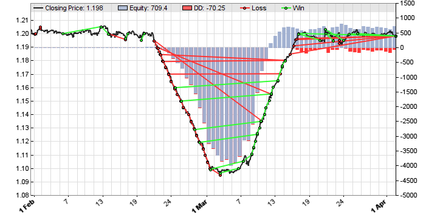
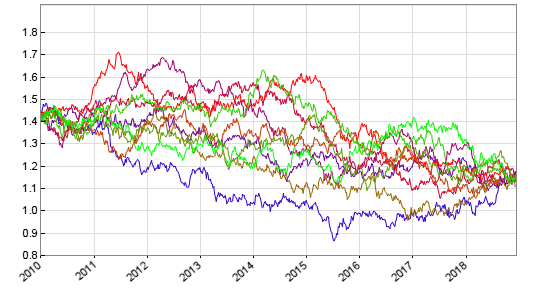

# Detrend, shuffling

# Price Curve Detrending, Randomizing, Shaping

When developing, testing, or training systems, it is often very useful to modify price curves, randomize price data, or remove trend from trades, indicators, or trained parameters. This allows training or testing strategies under defined conditions, such as with no trend, with artificial trend, or with artificial price peaks or drops. Randomized price curves can be used for Monte Carlo evaluations or reality checks. Backtesting with detrended or inverted price curves is a quick check to verify the validity and robustness of a strategy. 

  
          Artificial price drop for testing the behavior of a grid trading system

  
          Shuffled price curves for a reality check algorithm

One variable does it all:  

## Detrend

Accepts the flags below for detrending or other manipulations of the price curves or of trades, indicators, or trained parameters. The flags can be set with **Detrend = Flag;** or **setf(Detrend,Flag);**. Flags can be combined with '+' or '|':

### Range:

  

<table width="98%" border="0" cellspacing="1" cellpadding="0"><tbody><tr><td style="width: 209px"><strong>TRADES</strong></td><td>Detrend trade results. The trade return is corrected by a factor derived from the average price slope of the current WFO cycle. This removes trend bias from a WFO test while keeping the properties of the price curve.</td></tr><tr><td style="width: 209px"><strong>PRICES</strong></td><td>Detrend trade results and <a href="price.htm">price</a> functions, as well as indicators derived from them. A corrrection factor as above is added to the returned prices. This ensures that any WFO cycle starts and ends at the same price, and detrends indicators and signals based on series generated with <strong>price()</strong> calls.</td></tr><tr><td style="width: 209px"><strong>CURVE</strong></td><td>Detrend historical price data on loading. The curve is tilted so that the end and the start of the historical data are at the same level. This also affects the displayed price curve in the chart.</td></tr><tr><td style="width: 209px"><strong>RECIPROCAL</strong></td><td>Replace historical prices with their reciprocal values. This it can be used for creating an artifical asset as the reciprocal of an existing forex or crypto pair (f.i. convert BTC/USD to USD/BTC).</td></tr><tr><td style="width: 209px"><strong>INVERT</strong></td><td>Similar to <strong>RECIPROCAL</strong>, but keep the price range while inverting the price curve. This reverses all trends in the curve, and can be used for a reality check of a system that is symmetric in long and short positions.</td></tr><tr><td style="width: 209px"><strong>SHAPE</strong></td><td>Bend the price curve to a predefined shape for testing strategy behavior under certain conditions such as sudden price drops or trend reverals, even when they don't appear in the original curve.The desired shape can be set up with the <strong>Shape</strong> array (see below).</td></tr><tr><td style="width: 209px"><strong>NOPRICE</strong></td><td>Do not process the historical data by detecting gaps or fixing invalid prices or outliers on loading. For data files that contain no prices, but other types of data.</td></tr><tr><td style="width: 209px"><strong>SHUFFLE</strong></td><td>Randomize the price curve by shuffling the price ticks without replacement. Keeps its overall trend from start to end, but removes any short-term trends and correlations between the prices. Used for reality checks. Requires historical data in <strong>.t6</strong> format.</td></tr><tr><td style="width: 209px"><strong>SHUFFLE+PEAK<br>SHUFFLE+VALLEY</strong></td><td>Randomize the price curve as above, but generate a curve that does not exceed the highest peak or/and the lowest valley of the original price curve. Use this for keeping the original price range. Can be slow on curves with large price ranges.</td></tr><tr><td style="width: 209px"><strong>BOOTSTRAP</strong></td><td>Randomize the price curve by shuffling the price ticks with replacement. Keeps its overall trend from start to end, but removes any short-term trends and correlations between the prices. Used for reality checks.</td></tr><tr><td style="width: 209px"><strong>BOOTSTRAP+PEAK<br>BOOTSTRAP+VALLEY</strong></td><td>Randomize the price curve as above, but generate a curve that does not exceed twice the maximum of the orginal price curve, or/and does not fall below zero. Can be slow on curves with large price ranges.</td></tr><tr><td style="width: 209px"><strong>RANDOMWALK</strong></td><td>Generate a random walk price curve by moving the price in random steps that depend on original volatility. Removes any market inefficiency out of the price curve.</td></tr><tr><td style="width: 209px"><strong>RANDOMWALK+PEAK<br>RANDOMWALK+VALLEY</strong></td><td>Generate a random walk price curve that does not exceed twice the maximum of the orginal price curve, or/and does not fall below zero. Can be slow on curves with large volatility.</td></tr></tbody></table>

### Type:

**int** 

## Shape

Pointer to a 0-terminated array of price values for applying a shape to the price curve when **Detrend = SHAPE** is set. All prices of the array are placed in equal distances, and the price curve is bent so that it touches any of them. The more prices in the array, the closer is the curve adapted to the given shape. The last array element must be **0** for indicating the end (see example).

### Type:

**var\***  
   

### Remarks:

*   All price curve manipulating flags must be set before calling [asset()](013_Asset_Account_Lists.md) the first time. Use [setf](168_setf_resf_isf.md) or [resf](168_setf_resf_isf.md) for setting or resetting single flags, while keeping the other flags unchanged.
*   Price curve randomizing is not supported for data with volume, such as **T2** history. For **T6** history, only the prices are shuffled, the volume is unchanged.
*   All price curve manipulations are normally applied to the whole price curve on the ticks level, including lookback, in sample, out of sample, and skipped periods. If a particular [StartDate](100_tradeUpdate.md) is set, the **SHAPE** begins at that date and ends at a given **EndDate** (if any). **TRADES** or **PRICES** detrends the prices from the end of the current lookback period until the end of the current WFO test or training cycle. This has the effect that all WFO cycles are separately detrended in \[Train\] mode. **Detrend** = **CURVE** however detrends the whole price curve, but does not affect the local trends within the WFO cycles.
*   **SHUFFLE** generates curves with similar start and end points as the original curves. **BOOTSTRAP** and **RANDOMWALK** generate curves with a similar start point, but modified end points. **CURVE** generates curves with a similar end point, but modified start point.
*   **SHUFFLE** and **BOOTSTRAP** randomize the the bar ranges (high-low difference) and changes (center price difference to the previous bar) independently, using the Lehmer random number algorithm. The resulting curves have similar magnitude, volatility, and long term trend as the original curve, but all bar correlations are removed.
*   **SHUFFLE**, **BOOTSTRAP**, **RANDOMWALK**, **SHAPE**, and **CURVE** can produce negative prices on curves with large price volatility. In that case **CURVE** clips negative prices and produces a flat price line close to zero at those curve parts. **SHUFFLE** automatically generates a new curve when prices are negative. The **PEAK** and **VALLEY** flags keep shuffled curves inside the maximum and minimum of the original curve, and bootstrapped curves between zero and twice the original maximum. This can delay the bar generation when the curve randomizing process must be often repeated.
*   If a trade strategy has [trend bias](testing.htm#bias) - f.i. when it buys more long than short positions, or vice versa - it is normally recommended to remove the trend from the price curve for training the strategy parameters. Otherwise the simulation will be too optimistic when the price curve has an overall upwards trend, or too pessimistic when it has a downwards trend. For symmetric strategies that buy long and short positions under similar conditions and with the same parameters, detrending is normally not necessary.
*   For detrending only strategy parameters or machine learning models, but not the test results, set **Detrend** only in \[Train\] mode: **if(Train) Detrend = CURVE;**. For detrending only the prices of certain assets, set **Detrend** before calling that **[asset](013_Asset_Account_Lists.md)()** in the initial run, and reset it to **0** afterwards. For detrending particular trades only, set **Detrend = TRADES** before entering the trade, and set **Detrend = 0** afterwards. This can be useful for testing portfolio systems that use both trend following and non-trend algorithms.
*   For determining if a system's profit is caused by artifacts, temporarily set **Detrend = SHUFFLE+CURVE** and test. If the profit is caused by a real edge, it should then disappear. For determining if a system's profit is caused by randomness, temporarily set **Detrend = INVERT** and test. On symmetric assets such as currencies, the system should then still achieve profits.
*   Modified price curves can be exported to a CSV file for further tests with Excel, R, or similar statistical software.
*   Reality checks using inverted or randomized price curves are mentioned on [Financial Hacker | Development Process | Step 7: Reality Check](http://www.financial-hacker.com/build-better-strategies-part-3-the-development-process/).

### Example (see also Detrend.c):

```c
_// detrend the price curve for training only_
if(is(TRAINMODE)) Detrend = CURVE; _

// apply a rectangular shape to the curve_
var SuddenDrop\[50\] = { 1.5, 1.5, 1.0, 1.0, 1.0, 1.0, 1.0, 1.5, 1.5, 0 };
Shape = SuddenDrop;
Detrend = SHAPE;
```

### See also:

[mode](018_TradeMode.md), [WFO](numwfocycles.md), [DataSlope](dataslope.md), [randomize](130_randomize.md), [setf](168_setf_resf_isf.md)

[► latest version online](javascript:window.location.href = 'https://zorro-project.com/manual/en' + window.location.href.slice\(window.location.href.lastIndexOf\('/'\)\))