# The Z Strategies

# The 'Z' Algo Trading Systems: Trading for Regular Income

Before starting automated trading with one of the included Z systems on a real money account, please read this page from top to bottom. Make sure that you understood how the system principially works, how it is set up, and how it is adjusted to your capital, broker, and account. At first, some general rules for achieving a regular trading income.

*   Trade only what you understand. Know your algo trading method, the market inefficiency on which it is based, and what risk and performance you can expect. Test it under different spread and margin settings to avoid nasty surprises. Stay away from systems with 'secret algorithms'  - it's easy to set up a 'secret system' and fake an impressive 'live equity curve' that's even verified on MyFxBook™. You can read up about that in the **[Black Book](247_Links_Books.md)** .  
      
*   Have enough capital. The minimum capital for a modest regular income is in the $30,000 range. The free Zorro version limits your account size to $15,000 (see [restrictions](restrictions.md)), but you need not all capital in the broker account - you can keep it in a bank account and quickly remargin when necessary. Have at least twice the [required capital](012_Performance_Report.md) from the performance report at your disposal. Most brokers allow depositing funds by credit card in a few minutes.  
     
*   Expect a long time under water. Most successful strategies have strong equity fluctuations with short profit bursts and long sidewards periods. Check out the **Z5** [live profit curve](#z5) to learn what you can expect. The [down time](performance.htm#totaldown) of strategies can be in the 90% range. After starting, you'll be often temporarily below your initial capital at some point. If you panic and pull out, the money is gone - a well known phenomenon in financial investment that people can lose money this way even with highly profitable funds. Grit your teeth and sit it out.  
     
*   Do not get greedy. When your profits accumulate, you'll be tempted to likewise increase the investment. Don't. Follow the square root rule: For every doubling of your account, increase the invested margin by factor **1.4**, not by factor **2**. Increasing the investment too fast is a beginner's mistake and can wipe out any account. In the Black Book you can find the formulas for the optimal amount to withdraw for a regular passive income.  
      
*   Pull out in time. Examine the trading results regularly - at strategy start, daily - and compare them with the [test performance](012_Performance_Report.md). If your strategy strongly deviates from the expected performance, don't hesitate and stop it. It might be expired due to a permanent change of the market. This happened in fact already with several Z systems, like Z3 and Z5.  
      What is a "strong deviation"? The simplest way is comparing the current drawdown with the **Required Capital** from the backtest - when you lost noticeably more, you should stop. A better way is checking the [Cold Blood Index](ddscale.md) of your system that's daily updated by the Z systems and printed on the status page and the log.  
     
*   Do not tamper with the strategy. It's hard to see profits dwindle in a drawdown. But don't forget that the strategy is already optimized, tested, and verified (or at least, it should). Any manual intervention will make it worse. Only exception is when you know of some upcoming event - such as Brexit - with great impact on open positions. In that case it makes sense to get out of the market or use the Z system's **Panic** slider for locking current profits.  
     

# The Z Systems: Overview

The Z systems are prefabricated, ready-to-run algo trading strategies for a wide range of markets. They are not based on 'technical analysis' or 'technical indicators'. Their algorithms are mostly described in the [Black Book](links.htm#black), some on the [Financial Hacker](https://financial-hacker.com/) website. To avoid misunderstandings: they should not be the only reason of using Zorro! We encourage you to learn developing your own systems. Strategy development is not trivial: If a market inefficiency were very easy to spot and exploit, many trading systems would do that, and the inefficiency would be leveled soon. This effect keeps the number of successful strategies in check and gives skilled coders a large advantage over code-illiterate traders.

The Z systems are relatively simple. None of the basic algorithms exceeds 25 lines of code. Still, all systems underwent a solid development and test process with the methods described in the Black Book. Early versions of some systems had been in live trading since 2012; all results so far have been consistent with the simulation. We're constantly observing the systems and modify or replace expired algorithms with any Zorro update.

When using a Z system, do not do it blindly, but learn system development, understand how it works, and eventually replace it with your own system. There are **five good reasons** why you should prefer a self-programmed system. Firstly, you have the opportunity to program better strategies than the relatively simple Z systems. Secondly, systems traded by a lot of people don't work very well - price curves, especially of stocks, can be noticeably affected even by a small number of traders. Third, you can face the inevitable drawdowns in a more relaxed manner when you know precisely what the systems do and why. Fourth, you'll gain experience with programming and statistics - valuable skills not only for trading, but in general life. And finally, you cannot blame us for losses.

If you're now discouraged of the Z systems, but not ready yet to develop your own systems, enter a course such as the [Algo Bootcamp](https://zorro-project.com/docs.php). There you can not only learn strategy development in depth, but also get some more proven ready-to-trade systems including their theory, algorithms, and source code.

The Z systems cover a large range of trade methods, win rates, and budgets. Performance metrics as of July 2024:

<table border="0" class="ms-contemp-main" style="width: 95%"><tbody><tr align="center"><td class="ms-contemp-tl" width="10%"><div align="left">System</div></td><td class="ms-contemp-top" width="10%"><div align="left">Z1</div></td><td class="ms-contemp-top" width="10%"><div align="left">Z2</div></td><td class="ms-contemp-top" width="10%"><div align="left">Z12</div></td><td class="ms-contemp-top" width="10%"><div align="left">Z6+</div></td><td class="ms-contemp-top" width="10%"><div align="left">Z7</div></td><td class="ms-contemp-top" width="10%"><div align="left">Z8</div></td><td class="ms-contemp-top" width="10%"><div align="left">Z9</div></td><td class="ms-contemp-top" width="10%"><div align="left">Z10</div></td><td class="ms-contemp-top" width="10%"><div align="left">Z13</div></td></tr><tr><td class="ms-contemp-left">License</td><td class="ms-contemp-even">free</td><td class="ms-contemp-even">free</td><td class="ms-contemp-even"><a href="restrictions.htm">Zorro S</a></td><td class="ms-contemp-even"><a href="restrictions.htm">Zorro S</a></td><td class="ms-contemp-even"><a href="restrictions.htm">Zorro S</a></td><td class="ms-contemp-even">free</td><td class="ms-contemp-even"><a href="restrictions.htm">Zorro S</a></td><td class="ms-contemp-even"><a href="restrictions.htm">Zorro S</a></td><td class="ms-contemp-even"><a href="restrictions.htm">Zorro S</a></td></tr><tr><td class="ms-contemp-left"><div align="left">Traded assets</div></td><td class="ms-contemp-odd"><div align="left">Forex, CFDs</div></td><td class="ms-contemp-odd"><div align="left">Forex, CFDs</div></td><td class="ms-contemp-odd"><div align="left">Forex, CFDs</div></td><td class="ms-contemp-odd"><p align="left">Forex</p></td><td class="ms-contemp-odd"><p align="left">Forex</p></td><td class="ms-contemp-odd"><p align="left">Stocks, ETFs</p></td><td class="ms-contemp-odd"><p align="left">ETFs, Treasure</p></td><td class="ms-contemp-odd"><p align="left">Crypto-currencies</p></td><td class="ms-contemp-odd"><p align="left">Options</p></td></tr><tr><td class="ms-contemp-left"><div align="left">Method</div></td><td class="ms-contemp-even"><div align="left">Trend<br>following</div></td><td class="ms-contemp-even"><div align="left">Mean<br>reversion</div></td><td class="ms-contemp-even"><div align="left">Anti-<br>correlation</div></td><td class="ms-contemp-even"><div align="left">Excess<br>volatility</div></td><td class="ms-contemp-even"><div align="left">Price<br>patterns</div></td><td class="ms-contemp-even"><div align="left">Portfolio<br>rotation</div></td><td class="ms-contemp-even"><div align="left">Portfolio<br>rotation</div></td><td class="ms-contemp-even"><div align="left">Coin<br>rotation</div></td><td class="ms-contemp-even"><div align="left">Combo<br>selling</div></td></tr><tr><td class="ms-contemp-left"><div align="left">Algorithm</div></td><td class="ms-contemp-odd"><div align="left">Spectral<br>analysis</div></td><td class="ms-contemp-odd"><div align="left">Spectral<br>analysis</div></td><td class="ms-contemp-odd"><div align="left">Spectral<br>analysis</div></td><td class="ms-contemp-odd"><div align="left">Adaptive<br>grid</div></td><td class="ms-contemp-odd"><div align="left">Machine<br>learning</div></td><td class="ms-contemp-odd"><div align="left">Markowitz<br>MVO</div></td><td class="ms-contemp-odd"><div align="left">Dual<br>momentum</div></td><td class="ms-contemp-odd"><div align="left">Markowitz<br>MVO</div></td><td class="ms-contemp-odd"><div align="left">Volatility<br>filter</div></td></tr><tr><td class="ms-contemp-left">Risk estimate</td><td class="ms-contemp-even">High</td><td class="ms-contemp-even">High</td><td class="ms-contemp-even">High</td><td class="ms-contemp-even">Moderate</td><td class="ms-contemp-even">High</td><td class="ms-contemp-even">Moderate</td><td class="ms-contemp-even">Moderate</td><td class="ms-contemp-even">Extreme</td><td class="ms-contemp-even">High</td></tr><tr><td class="ms-contemp-left"><div align="left">Bar period</div></td><td class="ms-contemp-odd"><div align="left">4 hours</div></td><td class="ms-contemp-odd"><div align="left">4 hours</div></td><td class="ms-contemp-odd"><div align="left">4 hours</div></td><td class="ms-contemp-odd"><div align="left">tick based</div></td><td class="ms-contemp-odd"><div align="left">1 hour</div></td><td class="ms-contemp-odd"><div align="left">1 day</div></td><td class="ms-contemp-odd"><div align="left">1 day</div></td><td class="ms-contemp-odd"><div align="left">1 day</div></td><td class="ms-contemp-odd"><div align="left">1 day</div></td></tr><tr><td class="ms-contemp-left"><div align="left">Avg trade duration</div></td><td class="ms-contemp-even"><div align="left">10 days</div></td><td class="ms-contemp-even"><div align="left">10 days</div></td><td class="ms-contemp-even"><div align="left">10 days</div></td><td class="ms-contemp-even"><div align="left">40 hours</div></td><td class="ms-contemp-even"><div align="left">20 hours</div></td><td class="ms-contemp-even"><div align="left">6 months</div></td><td class="ms-contemp-even"><div align="left">6 months</div></td><td class="ms-contemp-even"><div align="left">8 weeks</div></td><td class="ms-contemp-even"><div align="left">6 weeks</div></td></tr><tr><td class="ms-contemp-left"><div align="left">Retrain or rebalance</div></td><td class="ms-contemp-odd"><div align="left">6 months</div></td><td class="ms-contemp-odd"><div align="left">6 months</div></td><td class="ms-contemp-odd"><div align="left">6 months</div></td><td class="ms-contemp-odd"><div align="left">6 months</div></td><td class="ms-contemp-odd"><div align="left">6 months</div></td><td class="ms-contemp-odd"><div align="left">7 weeks</div></td><td class="ms-contemp-odd"><div align="left">7 weeks</div></td><td class="ms-contemp-odd"><div align="left">3 weeks</div></td><td class="ms-contemp-odd"><div align="left">6 weeks</div></td></tr><tr><td class="ms-contemp-left"><div align="left">Max DD</div></td><td class="ms-contemp-even"><div align="left">15 months</div></td><td class="ms-contemp-even"><div align="left">14 months</div></td><td class="ms-contemp-even"><div align="left">7 months</div></td><td class="ms-contemp-even"><div align="left">10 months</div></td><td class="ms-contemp-even"><div align="left">14 months</div></td><td class="ms-contemp-even"><div align="left">12 months</div></td><td class="ms-contemp-even"><div align="left">8 months</div></td><td class="ms-contemp-even"><div align="left">24 months</div></td><td class="ms-contemp-even"><div align="left">12 months</div></td></tr><tr><td class="ms-contemp-left"><div align="left">Annual return</div></td><td class="ms-contemp-odd"><div align="left">~110%</div></td><td class="ms-contemp-odd"><div align="left">~65%</div></td><td class="ms-contemp-odd"><div align="left">~170%</div></td><td class="ms-contemp-odd"><div align="left">~75%</div></td><td class="ms-contemp-odd"><div align="left">~100%</div></td><td class="ms-contemp-odd"><div align="left">CAGR 15%</div></td><td class="ms-contemp-odd"><div align="left">CAGR 23%</div></td><td class="ms-contemp-odd"><div align="left">CAGR 54%</div></td><td class="ms-contemp-odd"><div align="left">CAGR 40%</div></td></tr><tr><td class="ms-contemp-left"><div align="left">Profit factor</div></td><td class="ms-contemp-even"><div align="left">~1.5</div></td><td class="ms-contemp-even"><div align="left">~1.4</div></td><td class="ms-contemp-even"><div align="left">~1.5</div></td><td class="ms-contemp-even"><div align="left">~1.5</div></td><td class="ms-contemp-even"><div align="left">~1.1</div></td><td class="ms-contemp-even"><div align="left">~2.7</div></td><td class="ms-contemp-even"><div align="left">~3.4</div></td><td class="ms-contemp-even"><div align="left">~1.7</div></td><td class="ms-contemp-even"><div align="left">~4.0</div></td></tr><tr><td class="ms-contemp-left"><div align="left">Win rate</div></td><td class="ms-contemp-odd"><div align="left">~47%</div></td><td class="ms-contemp-odd"><div align="left">~60%</div></td><td class="ms-contemp-odd"><div align="left">~57%</div></td><td class="ms-contemp-odd"><div align="left">~67%</div></td><td class="ms-contemp-odd"><div align="left">~51%</div></td><td class="ms-contemp-odd"><div align="left">~69%</div></td><td class="ms-contemp-odd"><div align="left">~72%</div></td><td class="ms-contemp-odd"><div align="left">~52%</div></td><td class="ms-contemp-odd"><div align="left">~74%</div></td></tr><tr><td class="ms-contemp-left"><div align="left">Test capital</div></td><td class="ms-contemp-even"><div align="left">~2000 $</div></td><td class="ms-contemp-even"><div align="left">~2000 $</div></td><td class="ms-contemp-even"><div align="left">~4000 $</div></td><td class="ms-contemp-even"><div align="left">~1000 $</div></td><td class="ms-contemp-even"><div align="left">~1000 $</div></td><td class="ms-contemp-even"><div align="left">~5000 $</div></td><td class="ms-contemp-even"><div align="left">~5000 $</div></td><td class="ms-contemp-even"><div align="left">~0.5 BTC</div></td><td class="ms-contemp-even"><div align="left">~9000 $</div></td></tr><tr><td class="ms-contemp-left"><div align="left">Avg monthly income</div></td><td class="ms-contemp-odd"><div align="left">~170 $</div></td><td class="ms-contemp-odd"><div align="left">~100 $</div></td><td class="ms-contemp-odd"><div align="left">~500 $</div></td><td class="ms-contemp-odd"><div align="left">~50 $</div></td><td class="ms-contemp-odd"><div align="left">~70 $</div></td><td class="ms-contemp-odd"><div align="left">~220 $</div></td><td class="ms-contemp-odd"><div align="left">~450 $</div></td><td class="ms-contemp-odd"><div align="left">~0.08 BTC</div></td><td class="ms-contemp-odd"><div align="left">~4000 $</div></td></tr></tbody></table>

The metrics are from walk-forward (WFO) tests with the default capital, default asset lists, and [virtual hedging](019_Hedge_modes.md) enabled. The free Zorro version without virtual hedging produces slightly lower returns. A lower capital setting or a different asset list with higher margins, spreads, and commissions can reduce returns further. Forex and CFD swaps are taken from the rollover values in the asset list; for stock or ETF portfolios, 1.5% margin interest is assumed. 'Fluctuations' refer to the equity curve; the more it fluctuates, the more risky is the system. 'Test capital' is the initial capital used for the backtest. You can set it up with the **Capital** slider, up to the limit of the free Zorro version. The smaller the capital, the more trades will be skipped, the less effective is the strategy, and the smaller the profit. Any strategy has therefore a lower limit to the capital that depends on the broker and can be determined with backtesting. There is also an upper limit. If you want to invest millions, you'll need special order types and entry/exit mechanisms. Contact us in that case.

Montly income in the above table is the average monthly return from a backtest with the **Test capital**. For strategies with rotation or reinvesting, such as Z8, Z9, Z10, Z13, the average monthly income has not much meaning since it is much lower at the begin of the test period and much higher at the end. For **long-term investment**, the **Z8** or **Z9** systems are probably the best suited since they have the lowest risk. The other Z systems have higher annual returns, but accordingly higher risk, and can theoretically cause a **total loss of the invested capital**. Many systems have long drawdown periods that you can see in the equity curves below. You're more likely to start in a drawdown than not. Be prepared for that and do not invest what you can't afford to lose.

**The Z systems will not start right away**, because you need **historical data** for testing them. So if you complain on the user forum about "Z1 displays 'history missing' errors", we know that you have not read the manual! Stock trading systems load their data automatically, for the other systems the historical data files must be downloaded from the [Zorro download page](https://zorro-project.com/download.php) and unpacked into the **History** folder. After that, click \[Test\]. The system then runs either a walk-forward analysis or an out-of-sample backtest for determining its historical performance with the current **Capital** and [asset list](013_Asset_Account_Lists.md). This can take several minutes especially with systems such as Z1, Z2, or Z12 that run through several [oversampling](numsamplecycles.md) cycles. The walk-forward analysis ends at a fixed date, the plain backtests end at the end of the history. The meaning of the performance figures can be found under [performance report](012_Performance_Report.md).

For **live trading** the Z systems, you normally first have to create an individual [asset list](013_Asset_Account_Lists.md) with the parameters and symbol names used by your broker (see below). The Z systems do not automatically reinvest profits in live trading. The traded volume depends only on the **Capital** slider and is unrelated to the account balance. For reinvesting, increase the **Capital** slider once per month according to accumulated profit (if any), and follow the square root rule for reinvesting in high leverage forex and CFD systems. The **InvestCalculator** script can be used for determining the optimal investment size. The Z systems use the [ACCUMULATE](018_TradeMode.md) mechanism that allows trading with very small capital exposure.

**Training** the Z systems is neither necessary nor recommended. We provide strategy updates with new trained rules and parameters with any Zorro update; for this reason use always the latest Zorro release when you trade a Z system. All non-daily Z systems have been trained with [oversampling](numsamplecycles.md) and are thus robust against price curve noise. If you still want to train them on your own risk, you'll need Zorro S; see 'Tips & Tricks' below.

The Z systems can be adapted to your need as described below, but they are not available in **source code**. They are compiled executables (**\*.x**) only. This is not due to some secret trading system: All basic algorithms are published in the Black Book or elsewhere, so anyone can check them out and write similar strategies. But if we provided the code, one could see precisely when the strategies buy and when they sell. It would then be easy to prey on Z system traders with fore-running methods. For similar reasons, some of the strategies contain a random element in live trading that makes it difficult to predict the trading. This random element has only a small effect on the live performance, but it ensures that many people can trade the strategies without hampering each other.  
  If you need a Z system with source code, we can put you in contact with a freelancing programmer for the development of a very similar system.

The same Z system can produce **different returns** on different accounts, even with the same broker. This is partially caused by the above mentioned random element, but to a larger extent by different start dates and different capital. Because the number of open trades is limited, a different start date leads to a different trade history. Dependent on available capital, trades are skipped. In the long term the returns will equalize, but in short term they can be very different.

Due to the [profit limit](restrictions.md), the free Zorro version allows to trade only one system - either one of the Z strategies or a system of your own - on a real money account. Z1, Z2, and Z8 are included in the free version. The other systems are included in [Zorro S](restrictions.md).

### Z1

The trend following system from chapter 3 of the Black Book, in several variants for currencies, commodities, and index CFDs. This system is for trading with a Forex/CFD broker. The algorithms are self-adapting to the market and can reduce the trades during unprofitable market periods (for instance, 2016-2019). **[OptimalF](016_OptimalF_money_management.md)** factors are used for distributing the capital among the components. Trade exits are handled by [TMFs](018_TradeMode.md). Some of the algorithms control the trade duration by moving the stop loss; this can cause the stop to move in both directions.

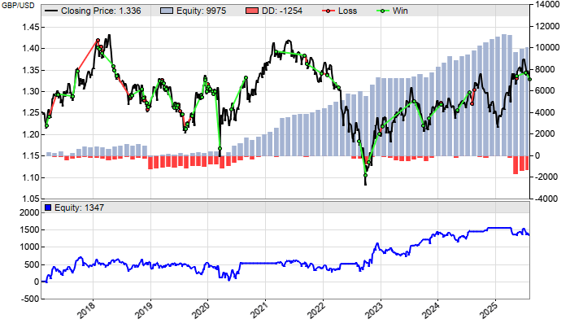  
The equity curve above is from a walk-forward analysis on an Oanda US account with 100:1 leverage. It is slightly on the optimistic side due to selection bias from generating the OptimalF factors from the whole simulation period. For reducing the expiration risk of single components, an [equity curve trading](lots.htm#phantom) mechanism is implemented. You can deactivate it with the **Phantom** flag (see below). A table with the current algorithm states is displayed on the [trade status page](trading.htm#status):

<table style="font-weight: bold"><tbody><tr><td><span class="Stil1">EUR/USD</span></td><td><span class="Stil1">VO:LS -198</span></td><td></td><td bgcolor="#00FF00"><span class="Stil1">HU:LS +68</span></td><td></td><td></td></tr><tr><td><span class="Stil1">USD/CHF</span></td><td bgcolor="#00FF00"><span class="Stil1">VO:LS +726</span></td><td bgcolor="#FF0000"><span class="Stil1">LP: +549</span></td><td bgcolor="#FF0000"><span class="Stil1">HU:S +612</span></td><td bgcolor="#00FF00"><span class="Stil1">ES:LS +190</span></td><td bgcolor="#FF0000"><span class="Stil1">LS: +611</span></td></tr><tr><td><span class="Stil1">GBP/USD</span></td><td></td><td bgcolor="#00FF00"><span class="Stil1">LP:LS +610</span></td><td></td><td></td><td></td></tr><tr><td><span class="Stil1">USD/CAD</span></td><td></td><td></td><td><span class="Stil1">HU:LS -108</span></td><td><span class="Stil1">ES:L -73</span></td><td bgcolor="#00FF00"><span class="Stil1">LS:L +821</span></td></tr><tr><td><span class="Stil1">USD/JPY</span></td><td bgcolor="#FF0000"><span class="Stil1">VO: +2400</span></td><td></td><td bgcolor="#FF0000"><span class="Stil1">HU: +1178</span></td><td></td><td></td></tr><tr><td><span class="Stil1">AUD/USD</span></td><td><span class="Stil1">VO:S -82</span></td><td><span class="Stil1">LP:LS -0</span></td><td></td><td></td><td bgcolor="#00FF00"><span class="Stil1">LS:S +582</span></td></tr><tr><td><span class="Stil1">NAS100</span></td><td></td><td></td><td></td><td bgcolor="#FF0000"><span class="Stil1">ES: +886</span></td><td></td></tr><tr><td><span class="Stil1">SPX500</span></td><td></td><td></td><td></td><td bgcolor="#00FF00"><span class="Stil1">ES:L +318</span></td><td bgcolor="#00FF00"><span class="Stil1">LS:L +629</span></td></tr><tr><td><span class="Stil1">US30</span></td><td></td><td bgcolor="#FF0000"><span class="Stil1">LP: +256</span></td><td></td><td bgcolor="#00FF00"><span class="Stil1">ES:L +761</span></td><td></td></tr><tr><td><span class="Stil1">GER30</span></td><td></td><td bgcolor="#00FF00"><span class="Stil1">LP:LS +746</span></td><td bgcolor="#00FF00"><span class="Stil1">HU:LS +1186</span></td><td></td><td></td></tr><tr><td><span class="Stil1">XAU/USD</span></td><td></td><td bgcolor="#FF0000"><span class="Stil1">LP:L +420</span></td><td></td><td bgcolor="#00FF00"><span class="Stil1">ES:S +3457</span></td><td bgcolor="#FF0000"><span class="Stil1">LS: +2020</span></td></tr><tr><td><span class="Stil1">XAG/USD</span></td><td bgcolor="#FF0000"><span class="Stil1">VO:L +1797</span></td><td bgcolor="#FF0000"><span class="Stil1">LP:L +89</span></td><td></td><td></td><td bgcolor="#00FF00"><span class="Stil1">LS:S +156</span></td></tr><tr><td><span class="Stil1">UK100</span></td><td></td><td></td><td></td><td></td><td><span class="Stil1">LS:L -47</span></td></tr></tbody></table>

In the above matrix, active algorithms are displayed with their identifier (**VO**, **LP**, etc.) and **L** and/or **S** for the currently preferred trade direction, long, short, or both. Algorithms that are currently winning are displayed on a green rectangle. Algorithms that are currently losing and thus temporarily suspended (if equity curve trading was enabled, see below) are displayed on a red rectangle. The displayed numbers are the total win or loss per component, including phantom trades.

Z1 shares its parameter and factor files with Z12. Due to the relatively long lookback period, Z1 should only be traded with brokers that provide sufficient price history. If price data gaps are indicated in the message window at start, it is recommended to use the **Preload** flag (see below) or trade the system with a different broker. Otherwise the shortened price history can affect the performance in the first weeks.

### Z2

A modified version of the Black Book chapter 4 system with a portfolio of mean reversion algorithms. Z2 is intended for trading with a Forex/CFD broker. It is anticorrelated to Z1. The algorithms are self-adapting to the market. **[OptimalF](016_OptimalF_money_management.md)** factors are used for distributing the capital among the components. Trade exits are handled by [TMFs](018_TradeMode.md). Some of the algorithms control the trade duration by moving the stop loss; this can cause the stop to move in both directions.

  
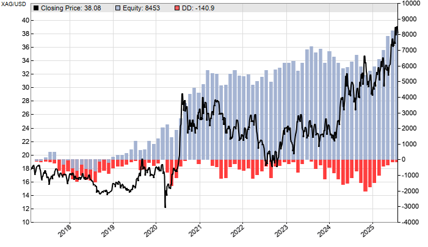  
The equity curve above was generated in the same way as the Z1 equity curve. Z2 also contains an [equity curve trading](lots.htm#phantom) mechanism that can be deactivated with the **Phantom** flag (see below). A table with the current algorithm states is displayed in the [trade status page](trading.htm#status):

<table style="font-weight: bold"><tbody><tr><td><span class="Stil1">EUR/USD</span></td><td></td><td bgcolor="#FF0000"><span class="Stil1">CT:L -62</span></td><td></td><td></td></tr><tr><td><span class="Stil1">USD/CHF</span></td><td></td><td><span class="Stil1">CT:LS -130</span></td><td></td><td bgcolor="#FF0000"><span class="Stil1">HP:S +35</span></td></tr><tr><td><span class="Stil1">GBP/USD</span></td><td bgcolor="#00FF00"><span class="Stil1">BB:LS +634</span></td><td></td><td bgcolor="#00FF00"><span class="Stil1">CY:LS +466</span></td><td></td></tr><tr><td><span class="Stil1">USD/CAD</span></td><td></td><td><span class="Stil1">CT:LS -139</span></td><td></td><td></td></tr><tr><td><span class="Stil1">USD/JPY</span></td><td></td><td bgcolor="#00FF00"><span class="Stil1">CT:L +884</span></td><td bgcolor="#00FF00"><span class="Stil1">CY:L +3464</span></td><td></td></tr><tr><td><span class="Stil1">AUD/USD</span></td><td></td><td></td><td></td><td bgcolor="#00FF00"><span class="Stil1">HP:S +1076</span></td></tr><tr><td><span class="Stil1">NAS100</span></td><td bgcolor="#00FF00"><span class="Stil1">BB:L +797</span></td><td></td><td bgcolor="#00FF00"><span class="Stil1">CY:L +1768</span></td><td bgcolor="#FF0000"><span class="Stil1">HP: +5861</span></td></tr><tr><td><span class="Stil1">SPX500</span></td><td></td><td></td><td><span class="Stil1">CY:L -120</span></td><td bgcolor="#00FF00"><span class="Stil1">HP:L +51</span></td></tr><tr><td><span class="Stil1">US30</span></td><td></td><td bgcolor="#00FF00"><span class="Stil1">CT:L +1110</span></td><td bgcolor="#00FF00"><span class="Stil1">CY:LS +688</span></td><td></td></tr><tr><td><span class="Stil1">GER30</span></td><td></td><td></td><td></td><td></td></tr><tr><td><span class="Stil1">XAU/USD</span></td><td></td><td></td><td></td><td bgcolor="#00FF00"><span class="Stil1">HP:LS +4231</span></td></tr><tr><td><span class="Stil1">XAG/USD</span></td><td></td><td></td><td></td><td bgcolor="#00FF00"><span class="Stil1">HP:LS +3347</span></td></tr><tr><td><span class="Stil1">UK100</span></td><td></td><td></td><td bgcolor="#00FF00"><span class="Stil1">CY:LS +325</span></td><td bgcolor="#00FF00"><span class="Stil1">HP:L +526</span></td></tr></tbody></table>

Z2 shares its parameter and factor files with Z12. Like Z1, Z2 should only be traded with brokers that provide sufficient price history.

### Z12

A combination of Z1 and Z2, exploiting the anticorrelation of their equity curves. By combining Z1 and Z2 to a compound system, drawdowns are reduced. The above remarks about the Z1/Z2 drawdown, equity curve trading, and lookback period also apply to Z12.

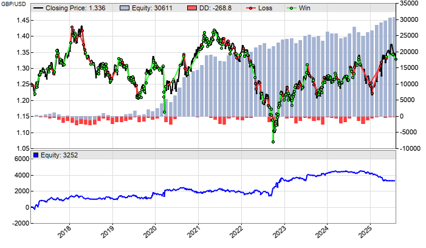

### Z6+

The new Z6+ system exploits a strong market inefficiency of some Forex markets. It is visible in the chart below, from the AUD/USD pair:

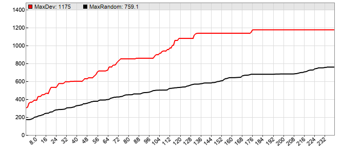

The red line is the maximum price movement in pips over the period given on the X axis in hours. The black line is the maximum movement by randomizing the price curve. The curves don't touch zero because the smallest sample period was one hour. Otherwise they approximate a square root function, as can be expected. But you can see that the real short-term volatility greatly exceeds the theoretical volatilty from a random price curve.

This 'excess volatilty' effect is stable over the years, and can be exploited with a special version of a grid trader with an **adaptive grid**. The trades are triggered by price ticks, so the bar period is mostly irrelevant. The algorithm will be described in detail in an upcoming book about Forex trading. The system can be traded with low capital, has a high win rate, and an almost ideal steadily rising equity curve at 0.95 R2 coefficient. The results are unrelated to trends and cycles, and uncorrelated to all other systems.

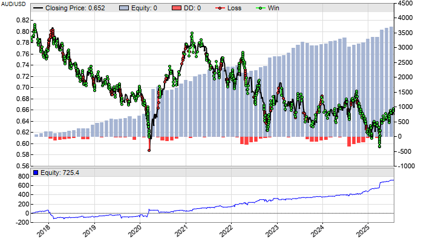

You need Forex data from minor pairs for backtesting the system. The equity curve above is from a walk-forward analysis on a FXCM account with 100:1 leverage. The blue curve in the smal chart below is the equity curve of the selected Forex pair, here AUD/USD. You can see that the overall equity is smoother since many currencies contribute to it. For eliminating the dangers of grid trading, all trades have a maximum life time of one week. Most close earlier. Since long and short positions can be open simultaneously, [virtual hedging](019_Hedge_modes.md) is recommended. The stop loss is relatively distant and is used for risk limitation only. Z6+, as indicated by the '+', was written in [C++](dlls.md).

### Z7

Z7 is a short-term, small-capital forex trading system based on the price pattern detection algorithm described in chapter 6 of the Black Book. It uses time dependent filters to catch matching patterns on the US, European, and Pacific sessions. A 'master algorithm' detects price patterns, algorithm variants with several filters enter the trades. Othere than the system described in the book, this one passed the reality check with flying colors. The results are unrelated to trends and cycles, and uncorrelated to the other systems.

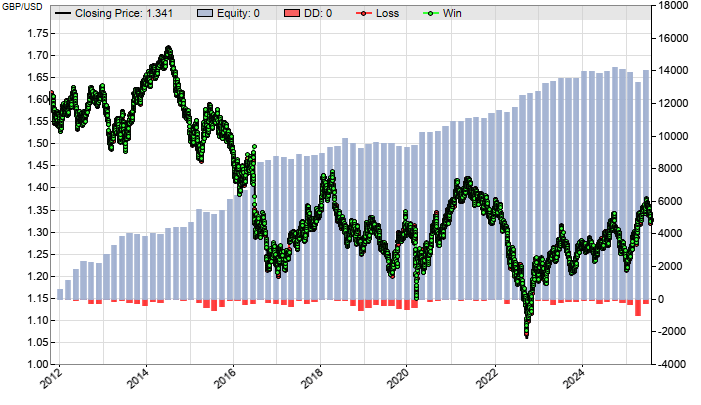

The equity curve above is from a walk-forward analysis on a Oanda US account with 100:1 leverage. All Z7 trades end after at least one market day, most after a few hours. The stop loss is relatively distant and is used for risk limitation only. A trailing mechanism locks profits when the trade goes high into profit in volatile situations. The system produces many trades with a relatively small profit per trade, so its performance depends heavily on the transaction cost, i.e. spread, commission, and slippage.

### Z8

Z8 is a long-term trading system based on a modified Markowitz mean/variance optimization (MVO) algorithm. It is a slightly improved version of the MVO system described on [Financial Hacker](http://www.financial-hacker.com/get-rich-slowly/), and should be traded with a stock/ETF broker. Z8 opens a portfolio of ETFs, stocks, or other assets determined by an external asset list, and re-allocates the invested capital among the portfolio components every 5 weeks for achieving a positive balance curve with minimum variance. Since it trades with low leverage, the profit, but also the risk is smaller compared to the other systems.

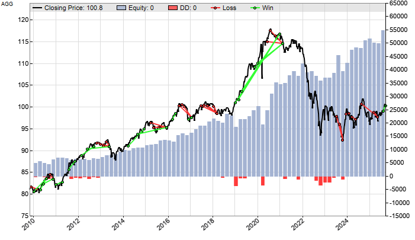

The balance curve above is from a walk-forward test with the default assets, based on a margin account with 2:1 leverage and $5000 start margin. The backtest reinvests the capital growth to the power of 0.9, and keeps the remaining profit as cash reserve on the account for buffering drawdowns. The assets, account leverage, and price data source must be set up in an [asset list](013_Asset_Account_Lists.md) named **AssetsZ8.csv**. By default it contains a set of ETFs that were selected by industry diversity and by their supposed long-term prospects. Z8 can also trade stock portfolios or any other instruments with long-term positive returns. Forex or CFDs are not suited for Z8. For adding a new asset, just duplicate a line in **AssetsZ8.csv** and edit the asset name in the first column. For temporarily out-commenting a line, add a '#' in front of the asset name. The **Symbol** column contains also the download source. Up to 300 assets can be contained in the list, but you should have no less than 5 and no more than 30. When you remove an asset from the list, make sure to also manually close any of its open positions (this won't happen automatically).

Z8 needs not be trained, since this is automatically handled by the MVO process. The \[Train\] button can instead be used for finding assets with low correlation ([Zorro S](restrictions.md) only). It displays a heatmap of the correlations between the assets in **AssetsZ8.csv** (red = high correlation, blue = low correlation). If you don't have Zorro S, you can use the script for generating heatmaps on Financial Hacker.

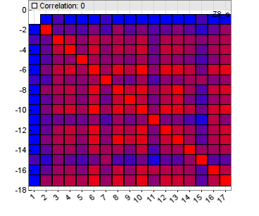

For the backtest, historical data is automatically downloaded from the data providers set up in the 'Symbol' column in the asset list, so no further price history files are necessary. If you want to download data from a different source, either edit the asset list, or load it before starting the strategy. The system will automatically detect that up-to-date data is already present, and not attempt to download it again.

For trading Z8, the broker API must support the [GET\_POSITION](113_brokerCommand.md) command, which is the case for the [IB TWS API](062_DefineApi_LoadLibrary.md). Make sure that you've subscribed market data for all traded assets (with IB, normally the US Equities "Value Bundle" and "Streaming Bundle"), that you're permitted to trade them (check all relevant boxes on the "Trade Permissions" page), and that the leverage in **AssetsZ8.csv** matches your account leverage. If your portfolio contains leveraged ETFs, check their margin requirement: IB accepts **Leverage** **2** for unleveraged or 2x leveraged ETFs; **Leverage** **1.333** for 3x ETFs; and **Leverage 1** for 4x ETFs.

Since Z8 trades only every 5th week, it needs not run permanently, and requires no VPS and no permanent broker connection. Just start it in \[Trade\] mode once every 5 weeks after the opening time of the New York market (9:30 ET). Z8 will first download historical prices of all assets, then calculate the optimal portfolio. Set the **Capital** slider to the total margin you want to invest. That's normally the cash value on your account. After about a minute a message box will pop up, like this:

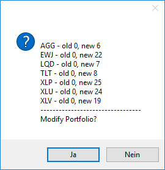

"Old" is the current position in the asset, and "new" is the new position. Clicking \[Yes\] will automatically sell or buy the difference of any position, and this way optimize the portfolio. If the broker API does not support position requests, the 'old' positions will all be 0, even when positions are open. In that case open or close the position differences manually in the broker's trading platform, then click \[No\] on the message box. Afterwards the trading session is closed, and the suggested date for the next start is printed in the message window.

Since you can only buy integer numbers of shares, the real invested margin will normally be smaller than **Capital**, dependent on portfolio component weights and prices. The maximum capital can be set up in **Z.ini** (see below). For avoiding margin calls, we recommend to set **Capital** not higher than about 80% of the account equity. For accounts with no leverage, edit the asset list and set all leverages to 1; you can then set **Capital** at 100%. If the system does not open all trades - for instance due to a temporary connection problem or to being outside market hours - just run it again. Since it is detects actual positions, running it several times does no harm. If you missed the suggested start date, maybe because you're on vacation with all the money you made so far, run it at the next occasion. Missing a single date does not do much harm, but don't miss many dates in a row.

### Z9

The portfolio rotation system from Black Book chapter 8, but with sector ETFs, as proposed by Gary Antonacci in his "Dual Momentum" strategy. It uses the assets in **AssetsZ9.csv**, which should contain a mix of US sectors, non-US indices, and bonds or treasury. The portfolio is rotated so that it always contains the top third of the assets, selected by their highest relative momentum and positive absolute momentum. If no sector or index has any positive momentum, the system invests in gold or treasury. If gold or treasuries tank too, the system stays out of the market.

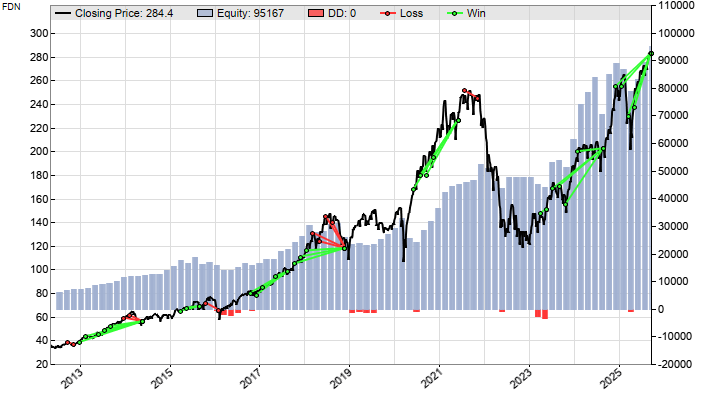

The balance curve above is from a walk-forward test with the default assets, based on a margin account with 2:1 leverage and $5000 initial capital. Although the Z9 system uses a simpler algorithm than the Z8 system above, is achieves better CAGR. Editing the asset list, setting up the **z.ini** parameters, reinvesting profit to the power of 0.9, and rebalancing the portfolio works just as described for **Z8** above. In the **Type** column of the **AssetsZ9** list, enter **0** for sectors, **1** for bonds, **2** for non-US indexes, and **3** for a lead index that represents the market. The lead index is not traded, but used for detecting weak market periods. It can be omitted at slightly higher risk. As with Z8, \[Train\] generates a correlation heatmap. For trading Z8 and Z9 simultaneously on the same account, **AssetsZ8** and **AssetsZ9** must be modified for making sure that they share no assets.

Since US ETFs are not available anymore to European traders due to PRIIP regulation, an alternative asset list **AssetsZ9E** has been included that contains only ETFs that can be traded in Europe. The assets are similar, but not identical to their US counterparts, so the profit is smaller than with US ETFs. The asset list can be set up in the **Z.ini** or **Z9.ini** file.

### Z10

Z10 is a cryptocurrency rotation system based on mean-variance optimization, like **Z8**, but with different settings, performance, and risk. It trades a bitcoin account on a cryptocurrency exchange. Therefore the return is in fractions of bitcoin ('$' == 1 Bitcoin) and thus independent of the bitcoin price. The system rotates a selection of major coins defined in **AssetsZ10.csv**, which have been selected by their ranking on cryptocurrency websites by trade volume, technology, and market expectancy. If a digital coin is not available for trading at your exchange, remove it from the list, or replace it with another by using the same criteria. You can add a dollar or gold backed coin - such as USDT or DGD - to the list as a 'safe haven' when the crypto market takes a dip.

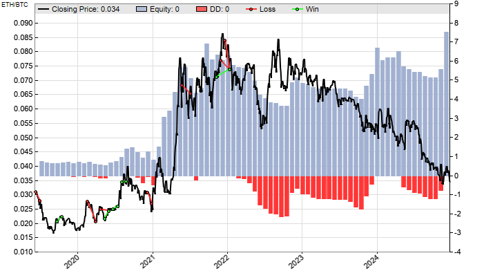

This system is for people who strongly believe in cryptocurrency surges, and have no problem with losing five-digit amounts in a single day. If you had invested $1,000 - 1 bitcoin - in January 2017 in a Z10 portfolio, you owned about 150 bitcoins at 150,000 dollars value in December same year, and 500 bitcoins worth 2.5 million in mid-2021. Still, the future is unknown, and the future of digital coins is twice unknown. We're including Z10 for completeness sake and for the crypto fans. Since failed coins have been delisted from the exchanges and thus don't appear in the portfolio, the backtest has likely selection bias.

The balance curve above is from a walk-forward test starting January 2017 with the Z10 assets, based on a standard bitcoin account with no leverage, 0.25% commission, and 0.5% spread. Not all assets were already available back then, so you'll get **Warning 055** messages at backtest start. You can safely ignore them. Editing the asset list, setting up the **z.ini** parameters, reinvesting profit, and rebalancing the portfolio works just as described for **Z8** above. The investment can be set up with the **Bitcoin** slider in steps of 0.001 bitcoin.

Z10 opens at the end of any \[Test\] a text file **Z10rot.txt** in the editor, containing today's suggested coin positions and the next rebalance date. It can look like this:

```c
USDT/BTC: 1904@0.00011236 (0.2139 BTC)
FTC/BTC: 4266@0.00002952 (0.1259 BTC)
LTC/BTC: 8@0.01899999 (0.1520 BTC)
Next Rotation: June 18 2024
```

In the above example (not from a real Z10rot text), the invested capital was set to 0.5 bitcoins. You should have a portfolio of 1904 USD Tether, 4266 FTC, and 8 LTC. If positions of other coins are open, sell them for BTC. Next rebalancing is on June 18. If coin markets tank, not all capital is assigned, or none at all. In the latter case the system prints a "Market down" message. Then better sell all coins.

You can start Z10 at any time for rebalancing the portfolio. But start it next time only at the date given at the last rebalancing. Z10 requires rebalancing every 3 weeks. With the text exported in \[Test\] mode, it can be manually traded at any cryptocurrency exchange even if not supported by a Zorro plugin. Otherwise select the exchange in the scrollbox and click \[Trade\]. Z10 will then log in to the selected exchange, rebalance the portfolio, print the next rotation date, and log out.

By default, Z10 gets the historical coin prices from CryptoCompare and trades with coin symbols from [Binance](219_Binance.md). For other exchanges, adapt the symbols in **AssetsZ10.csv**. The first steps to enter cryptocurrency trading are described under [Brokers](214_Brokers_Data_Feeds.md).

### Z13

The options selling system from chapter 7 of the [Black Book](247_Links_Books.md). Z13 trades with a stocks and options broker, like [IB](062_DefineApi_LoadLibrary.md). It sells in-the-money SPY option combos and collects the differences of premiums and assignment losses. The combo type can be set up with the \[Action\] scrollbox. It determines the risk and CAGR of the system.

<table><tbody><tr><td><strong>Naked Put</strong></td><td>Sell in-the-money puts.</td></tr><tr><td><strong>Put Spread</strong></td><td>Sell and buy puts, one in the money and one out of the money.</td></tr><tr><td><strong>Condor</strong></td><td>Sell a put, buy a put, sell a call, buy a call.</td></tr></tbody></table>

A naked put can lose a large amount, spread and condor limit the loss to the strike difference. Risky market situations are detected with a volatility filter; trading is then suspended. The backtest reinvests profits at an exponent given with the **Reinvest** slider (1.0 = reinvest all profits, 0.5 = reinvest square root of profits, 0 = no reinvestment). The figures in the table are from a backtest with naked puts and 0.9 reinvestment.

When options get exercised, close the assigned position manually, or let the broker liquidate it at market. If you want to leave the closing to the broker, take care to regularly withdraw profits for keeping the account in an insufficient funds state for enforcoing a margin call. If the broker closes the position only partially, close the rest manually. If the broker prematurely exercises options due to insufficient funds, as some brokers do, either have enough capital on the account for preventing this to happen. Or trade the system with an European-style option, such as **SPX** or **XSP**. This reduces the profit, but prevents the counter side from exercising the sold leg. You can set up the instrument in **AssetsZ13.csv**. The system trades the first asset from that list.

For backtesting Z13 you'll need historical **SPY** options data that you can get from the Zorro download page. The chart below displays the balance curve (blue) of selling naked puts at 0.9 reivestment, compared with a benchmark line (grey) from a SPY buy-and-hold strategy at leverage 2.

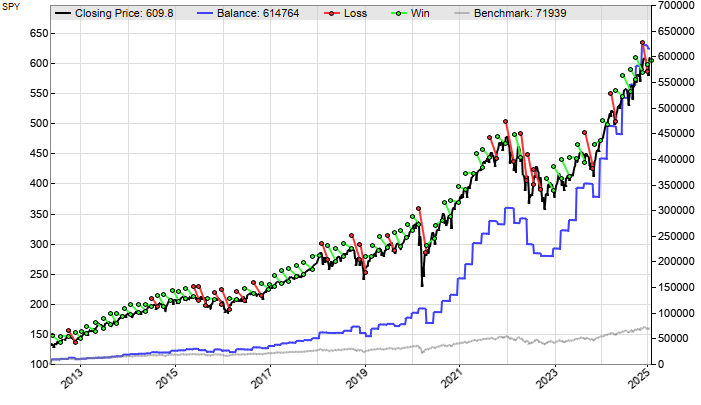

For trading Z13, the broker API should support the [SET\_COMBO\_LEG](113_brokerCommand.md) and the [GET\_POSITION](113_brokerCommand.md) commands, which is the case for [IBKR](062_DefineApi_LoadLibrary.md). Make sure that you're permitted to trade options, and check the relevant boxes on the "Trade Permissions" page. If you have no market subscription for SPY, set **Preload** in **z.ini** (see below) and download SPY from another source. Z13 trades 6-week options and thus opens new positions only every 6th week. Therefore it requires no VPS and no permanent broker connection. You only need to run it every 6 weeks. Start it in \[Trade\] mode after the opening time of the New York market (9:30 EST) when the options from the previous run are expired or have been exercised. If a single leg of a combo has been prematurely exercised, close the remaining legs and the assigned underlying manually and start Z13 afterwards for entering the next combo.

At start, set the **Capital** slider to the total margin you want to invest. For reinvesting profits in live trading, you can use the **InvestCalculator** script to determine the amount. Z13 will first download SPY historical prices and the SPY options chain, which can take up to 20-30 minutes.Then it will place the option orders. Confirm them when the message box pops up. If Z13 considers the market too volatile or the **Capital** too low, it will instead print a message (f.i. **"need XXX"**). If the market is unsuited, wait a few days. If it's too low capital, be more generous with the **Capital** slider and add funds if needed. The statistically best time for running Z13 is Tuesday 15:30 EST after option expiration and short before market close.

Z13 achieves higher returns with less effort than a mere portfolio rotation system, but at higher risk. Do not trade with money that you cannot afford to lose.

# The Z Systems: Setup and Handling

Every Z system can be configured at startup with parameters from an **.ini** file, and is controlled at runtime with the **Capital** and **Panic** sliders. First set up the strategy to your country and other requirements: open **Strategy\\z.ini** with the script editor, and edit the following parameters:

<table border="0" class="ms-contemp-main"><tbody><tr align="center"><td class="ms-contemp-top" style="width: 137px"><strong>Line</strong></td><td class="ms-contemp-top" width="89">Default</td><td class="ms-contemp-top" width="823">Description</td></tr><tr><td class="ms-contemp-even" style="width: 137px"><div align="left"><strong>NFA = 0</strong></div></td><td class="ms-contemp-even"><div align="left">No NFA compliance</div></td><td class="ms-contemp-even">Set this to <strong>1</strong> for for <a href="mode.htm#nfa">NFA mode</a> (only needed when NFA was not defined in an <a href="account.htm">account list</a>). Often required for US accounts and NFA brokers, f.i. <a href="ib.htm">IB</a>; not for MT4/MT5 accounts. A wrong NFA flag causes trades not being closed, so test your account before setting it!</td></tr><tr><td class="ms-contemp-odd" style="width: 137px"><div align="left"><strong>Phantom = 0</strong></div></td><td class="ms-contemp-odd"><div align="left">No equity curve trading.</div></td><td class="ms-contemp-odd">Set this to <strong>1</strong> for enabling <a href="trademode.htm">equity curve trading</a>. When active, trades of Z1, Z2, or Z12 components are temporarily suspended when the algorithm deteriorates, and resumed when it becomes profitable again. Equity curve trading can reduce the profit, but can also prevent losses by expiration of strategy components.</td></tr><tr><td class="ms-contemp-even" style="width: 137px; height: 46px;"><strong>NoLock = 0</strong></td><td class="ms-contemp-even" style="height: 46px">Locking enabled</td><td class="ms-contemp-even" style="height: 46px">Set this to <strong>1</strong> for setting the <a href="mode.htm">NOLOCK</a> flag. This prevents Zorro instances to wait for each other when sending commands to the broker API. Use this flag at your own risk and only when all Zorro instances trade with different brokers.</td></tr><tr><td class="ms-contemp-odd" style="width: 137px"><div align="left"><strong>Hedge = 4</strong></div></td><td class="ms-contemp-odd"><div align="left">Virtual hedging.</div></td><td class="ms-contemp-odd">Set this to <strong>2</strong> for disabling <a href="hedge.htm">virtual hedging</a>, to <strong>4</strong> when your broker does not support partially closing of trades (such as MT5 and some MT4 brokers), or to <strong>5 </strong>for full virtual hedging with partial closing. <a href="restrictions.htm">Zorro S</a> required for virtual hedging. Close open trades and restart the strategy after changing this parameter.</td></tr><tr><td class="ms-contemp-even" style="width: 137px"><div align="left"><strong>BarMode = 0</strong></div></td><td class="ms-contemp-even"><div align="left">By script</div></td><td class="ms-contemp-even">Set this to <strong>32</strong> for activating <a href="barmode.htm">BR_SLEEP</a> or to <strong>96</strong> for activating <a href="barmode.htm">BR_LOGOFF</a>.</td></tr><tr><td class="ms-contemp-odd" style="width: 137px"><div align="left"><strong>Export = 1</strong></div></td><td class="ms-contemp-odd"><div align="left">IBKR export</div></td><td class="ms-contemp-odd">Set this to <strong>1</strong> for generating a CSV file that can be directly imported in the <a href="ib.htm">IBKR</a> TWS portfolio reblance window.</td></tr><tr><td class="ms-contemp-even" style="width: 137px"><div align="left"><strong>MaxCapital = 10000</strong></div></td><td class="ms-contemp-even"><div align="left">10000</div></td><td class="ms-contemp-even">Set this to the desired maximum value of the<strong> Capital</strong> slider for trading with higher volume (see <a href="restrictions.htm">Zorro S</a> for capital limits)..</td></tr><tr><td class="ms-contemp-odd" style="width: 137px"><div align="left"><strong>ScholzBrake = 0</strong></div></td><td class="ms-contemp-odd"><div align="left">0</div></td><td class="ms-contemp-odd">Activate the <a href="lots.htm#scholz">ScholzBrake</a> (German users only).</td></tr><tr><td class="ms-contemp-even" style="width: 137px"><div align="left"><strong>Verbose = 1</strong></div></td><td class="ms-contemp-even"><div align="left">Verbosity.</div></td><td class="ms-contemp-even">Set this to <strong>2</strong> or <strong>3</strong> for more messages (see <a href="verbose.htm">Verbose</a>). Set it to <strong>15</strong> for 'black box' diagnostics.</td></tr><tr><td class="ms-contemp-odd" style="width: 137px"><strong>BrokerPatch = 0</strong></td><td class="ms-contemp-odd">Broker API ok.</td><td class="ms-contemp-odd">Set this to <strong>3</strong> for letting Zorro calculate the balance, equity, and open trade profits displayed on the Zorro panel (see <a href="brokercommand.htm">SET_PATCH</a>), rather than reading the values from the broker API. Recommended when the broker API does not return correct trade profits or equity. This was reported for some versions of the FXCM API, and some MT4 servers.&nbsp;</td></tr><tr><td class="ms-contemp-even" style="width: 137px"><strong>Preload = 0</strong></td><td class="ms-contemp-even">Load all prices.</td><td class="ms-contemp-even">Set this to <strong>1</strong> for loading the lookback period prices not from the broker's price server, but from Zorro's historical data files (see <a href="mode.htm">PRELOAD</a>). Recommended for some MT4 brokers that offer only a very short price history. Recent history files are required.</td></tr><tr><td class="ms-contemp-odd" style="width: 137px"><strong>StopFactor = 0</strong></td><td class="ms-contemp-odd">No broker stop.</td><td class="ms-contemp-odd">Set this to the <a href="stop.htm">StopFactor</a>, or to <strong>0</strong> for not sending the stop loss level to the broker (see <a href="stop.htm">StopFactor</a> and <a href="stop.htm">StopPool</a>). Check before if broker rejects trades with too distant stops, or accepts only certain stop values, or requires unique sizes for stop loss orders (f.i. <a href="oanda.htm">Oanda</a>).</td></tr><tr><td class="ms-contemp-even" style="width: 137px"><strong>MaxRequests = 0</strong></td><td class="ms-contemp-even">Default request limit.</td><td class="ms-contemp-even">Use this to limit the <a href="ticktime.htm">requests per second</a> when several Zorros trade on the same broker account that has a request limit</td></tr><tr><td class="ms-contemp-odd" style="width: 137px"><strong>BarOffset = 0</strong></td><td class="ms-contemp-odd">Default bar offset.</td><td class="ms-contemp-odd">Set this to the trading time in minutes since midnight when trading assets on daily bars in other time zones. Close open trades and re-train the strategy after changing this parameter.</td></tr><tr><td class="ms-contemp-even" style="width: 137px"><strong>AssetList = ""</strong></td><td class="ms-contemp-even">Default account.</td><td class="ms-contemp-even">Enter a different asset list for simulating different accounts or for setting up different symbols. All traded assets must be contained in the list. Close open trades and restart the strategy after changing this parameter.</td></tr><tr><td class="ms-contemp-odd" style="width: 137px"><strong>Cancel = 0</strong></td><td class="ms-contemp-odd">Cancel no trade.</td><td class="ms-contemp-odd">Set this to the trade ID when a position was closed externally and must not be managed anymore by Zorro. Zorro normally detects externally closed trades, but not when a trade is closed by opening a counter-trade on an NFA account. The cancelled trade will be removed from the trade list at the end of the current bar. In the case of virtual hedging, cancel the phantom trade only; this will also automatically cancel the pool trade.</td></tr></tbody></table>

The **.ini** file is read at start of the strategy. If you want to trade different Z strategies with different parameters, save **Z.ini** under the name of the strategy, f.i. **Strategy\\Z12.ini** for Z12. The strategy will then read the parameters from its corresponding **.ini** file. Not all parameters have effect on all strategies; f.i. for Z8/Z9 only **MaxCapital**, **Verbose**, and **AssetList** are relevant.

While running, the Z strategies are controlled with two sliders: 

<table border="0" class="ms-contemp-main"><tbody><tr align="center"><td class="ms-contemp-top"><strong>Slider</strong></td><td class="ms-contemp-top">Range</td><td class="ms-contemp-top">Default</td><td class="ms-contemp-top">Description</td></tr><tr><td class="ms-contemp-even" style="height: 65px"><strong>Capital</strong></td><td class="ms-contemp-even" style="height: 65px"><strong>0..10000</strong></td><td class="ms-contemp-even" style="height: 65px"><strong>2000 /<br>5000</strong></td><td class="ms-contemp-even" style="height: 65px">Determines the trade volume by setting the invested total amount. The amount on the broker account is irrelevant for the volume. In [<span class="tast">Test</span>] mode you can adjust this slider for adjusting the desired monthly income (<strong>MI</strong>) and the minimum required capital on the account (<strong>Capital</strong><span class="auto-style2"> </span>in the message window). Set <strong>MaxCapital</strong> (see above) for modifying the slider range.</td></tr><tr><td class="ms-contemp-odd"><strong>Percentage</strong></td><td class="ms-contemp-odd"><strong>0..200</strong></td><td class="ms-contemp-odd"><strong>150</strong></td><td class="ms-contemp-odd"><strong>Z8</strong>, <strong>Z9</strong> only: capital percentage for generating an IBKR rebalance file that can be imported in the TWS rebalance window. <strong>Export</strong> must be set in the .ini file. On margin accounts, more than 100% of the capital can be invested, but do not exceed 200%.</td></tr><tr><td class="ms-contemp-even"><strong>Panic</strong></td><td class="ms-contemp-even"><strong>0..100</strong></td><td class="ms-contemp-even"><strong>0</strong></td><td class="ms-contemp-even"><strong>Z1</strong>-<strong>Z7</strong> only: tighten the <a href="stop.htm">stop loss</a> of all open trades in percent of the current price difference to the original stop loss. At <strong>0</strong>, stop loss control is completely up to Zorro; at <strong>100</strong> the stop limits are placed just at the current asset prices. This causes trades to be sold as soon as their prices move slightly in adverse direction, and can be used for taking profits early. No new trades are opened as long as the position is above <strong>90</strong>. This slider reduces the profit, so use it only in drastic situations, for instance when an upcoming event - like Brexit - will have a large impact on the stock market. Put it back to <strong>0</strong> when the danger is over.</td></tr></tbody></table>

The sliders can be set after starting the strategy in test or trade mode (if no strategy is running, the sliders have no meaning). The last slider positions are stored, and the sliders snap to their last positions when the strategy is started again. Move them afterwards to a new posiion if desired.

The most important is the **Capital** slider. The Z systems do not autonomously reinvest profits or determine otherwise how much to invest; that is solely your decision and set up with this slider. Before trading the system, find your minimum capital requirement by running a \[Test\] with your current account parameters (see [asset list](account.md)) and the current slider position. Check the **Required Capital** (read [performance report](performance.md) about how it's calculated) - that's the absolute minimum you need either in your broker account, or at least in your bank account. For reinvesting your profits, you can slowly increase the slider when the capital on the account grows. For not risking a margin call, take care to reinvest or withdraw capital only according to the **square root rule** explained in the Black Book.

For a realistic backtest, make sure that the account settings in the [asset list](013_Asset_Account_Lists.md) are correct and up to date. For the Forex and CFD systems, an average Forex broker account with 100:1 leverage (**AssetsFix.csv**) is simulated in the backtest. For stock and ETF trading systems it's an average IB Margin account with 2:1 leverage. Capital requirement and System performance can be different on different accounts, especially with higher trading costs or lower leverage. If a certain asset is not provided by your broker, remove it from the strategy as described below. If it is available, but under a different symbol, edit the [asset list](013_Asset_Account_Lists.md) and enter its symbol name. US citizens are often not allowed to trade CFDs, and EU citzens are not allowed to trade US ETFs. Remove or replace unavailable assets as described below in the FAQ.

Check the requirements of your broker and account. Typical issues are not being able to open or to close a trade (**"Can't close..."**) due to NFA compliance, FIFO compliance, a wrong symbol, an invalid trade size, or unsupported partial closing. Make sure that **NFA** and **Hedge** are set correctly.

Before starting live, run a final \[Test\] with the **Capital** slider at the same position as in the trading session. This allows the system to permanently compare live performance with backtest performance, using the [Cold Blood Index](ddscale.md). The Capital can be increased later, but the initial position must match the last backtest. The CBI is printed once per day in the message window and on the status page. Consider pulling out when it gets down to a low value or 0.

After starting a strategy, it can take some days or even weeks before the first trades are entered. Don't grow impatient. The frequency of trades depends on the strategy and the market; in unprofitable periods with high market efficiency there can be no trades at all, especially when **Phantom** is set in the **Z.ini** file. Most trades are hold for 2-3 days, but some can stay open for weeks when they are profitable.

Don't unnecessarily stop and restart strategies. This closes open trades, initializes intermediate parameters, and sets back the lookback period. All this will reduce the profit and performance. Don't tamper with the trades: manually closing an open trade at the wrong moment can cost several hundred pips and can convert a winning strategy to a losing one. For 'soft stopping' a strategy without loss, set the **Capital** slider to zero so that no new trades are opened, then wait until the strategy itself has closed all open trades.

Your account balance will often go down in the first weeks after starting a strategy. This has 3 reasons: Drawdown periods are longer and more likely than profitable periods; unprofitable trades are closed first and thus contribute earlier to the account balance; and equity fluctuations - the up and down 'ripples' in the equity curve - almost always exceed the slowly increasing initial profit. Thus, periods of negative balance and equity are common at start of almost all strategies, as in the live profit curve below (from the **Z5** system, now expired). When the profit accumulates, negative profit periods get shorter and eventually disappear. However if you're still not in the profit zone after 6-12 months and your trade returns still deviate largely from the predicted performance, as visible from a low [CBI](ddscale.md), something is wrong. The strategy might be expired and you should stop trading it.

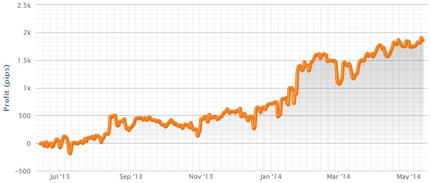  

Events - such as entering and exiting trades, or trailing the stop loss - are displayed in Zorro's message window (see [Log](log.md)). Additionally, the current trading status, open trade list, and equity curve is displayed on the [status page](004_Trading_Strategies.md). You can configure that page to be visible under a particular URL and in this way observe your system online from everwhere. If you have multiple accounts with different brokers, you can use the **[ZStatus](trading.htm#zstatus)** script for displaying the profits of all of them on a single panel.


# Z Systems and Algo Trading: Frequently Asked Questions

**What are the Z systems with the best profit-to-risk ratio?**

Z6+ and Z9.

**Can I stop and start a Z system to any time**?

Technically yes, when the broker server is online. But since most systems download recent price data at start for filling the **LookBack** period, avoid starting them at weekends when recent prices are not available and broker servers can be offline. Otherwise gaps in the price data can cause reduced performance during the following week. Once a system is trading, stop it only in case of an emergency. Most systems do not enter trades immediately after being started, so frequent stopping and starting will reduce the performance. While a system is stopped, it can not react on the market, which bears the danger of a potential loss when positions are still open.

**Must I train the Z systems?**

No. The portfolio rotation and options trading systems have no parameters to be trained. The other Z systems must be re-trained every 6..12 months, but we do that with any Zorro update. So you need not train them yourself. If you want, train them on your own risk with Zorro S by clicking the \[Train\] button. The last WFO cycle with the parameters for live trading is then retrained. The factors file (**Z12.fac**) of Z1, Z2, Z12 and the rules files of Z7 cannot be retrained by the user.

**Why does the backtest not go up to the current date?**

In [walk-forward optimized](numwfocycles.md) algo trading systems, such as Z1-Z7 and Z12, backtest and training cycles must be in sync and end at the same date. Otherwise the backtest would produce wrong results. For the other systems the backtest ends at the latest date of the available price and/or options data.

**When can I withdraw profits?**

All strategies have long drawdowns that are listed in the table above (**max drawdown**). Don't withdraw profits when you're in a drawdown, since this would get you closer to a margin call. Remargin your account when your equity runs dangerously low. If you're winning, you can and even must remove profits regularly from your account, since the free Zorro version will stop trading when your balance exceeds its capital limit (use [Zorro S](restrictions.md) for no limit). For the maximum amount to reinvest or to withdraw during a trading session, observe the [square root rule](tutorial_kelly.md).

**Can I trade with very little capital?**

For trading with low capital, such as a few hundred dollars, move the **Capital** slider mostly to the left and run repeated tests until the value displayed under **Capital** meets your needs. All margin based Z systems use the [ACCUMULATE](018_TradeMode.md) flag and thus allow trading with very low capital, although trades are then frequently skipped. Alternatively, reduce the capital requirement by removing assets from the portfolio, as described below. Note that low capital and few assets will normally reduce the live performance and increase risk and drawdowns due to the reduced number of trades. The setting of the **Capital** slider is unrelated to the displayed **"Risk"** of a trade, which does not reflect the strategy risk, but the stop loss distance.

**How can I add new assets or exclude assets from trading?**

Z8, Z9, Z10 can be used with any portfolio of stocks and ETFs. The other systems are optimized for a particular set of assets; you can not add, but you can exclude assets from trading. For excluding a certain component from trading in Z1, Z2, Z12, or Z7, edit **Data\\Z12.fac** or **Data\\Z7.fac** and place minus signs '**\-**' in front of its **OptimalF** factors. The algorithms with the **ES**, **HU**, **LP**, **LS**, **VO** identifiers belong to Z1, **A2**, **BB**, **CT**, **CY**, **HP** to Z2, and **PA**, **PD**, **PDD**, **PG** to Z7. An example for excluding the CT algorithm with the USD/CAD asset:

```c
...
USD/CAD:CT          -.041  1.32  263/420
USD/CAD:CT:L        -.029  1.25  177/227
USD/CAD:CT:S        -.058  1.38   86/93
...
```

Components with a negative or **.000** **OptimalF** factor are automatically excluded this way. Be aware that excluding the least profitable assets or algorithms will generate a too optimistic backtest result due to [selection bias](testing.htm#bias).

**My broker uses different symbols - how can I rename assets?**

Use an [asset list](013_Asset_Account_Lists.md) that contains the symbols and and account parameters of your broker. Enter the asset name used by the broker in the **Symbol** column of the list, as described [here](013_Asset_Account_Lists.md). Do not modify the asset names in the first column, since they are used by the strategies.

**Can I 'fire and forget' an automated trading system?**

Better not. Check the system's [status page](004_Trading_Strategies.md) often, like once every day. Know your broker's trading platform for being able to observe and manually close trades anytime in case of an emergency, ideally from your mobile phone. If a trade was not correctly opened or closed due to a software glitch - this happens rarely, but it can happen - know how to deal with the problem. If it was a glitch of the broker's server or software, know how to contact the broker and request a refund. If it was a [bug in your script](210_Troubleshooting.md), you'll get our compassion, but no refund.

**Can I trade several Z systems together?**

You'll need [Zorro S](restrictions.md) for trading several automated trading systems at the same time. Make sure with your broker that your account is set up to allow multiple sessions. Some brokers set up accounts for single sessions only by default. Since Zorro stores its logs, trades, slider positions and other data in files named after the script, **do not** trade the same script with several Zorro instances in parallel! For doing that, either give the scripts different names, or run them from different Zorro installation folders.

**How does algo trading affect my tax declaration?**

In most countries you have to pay tax for trading profits. Normally the broker keeps records of your trades that you can download from his website. Otherwise Zorro also records all trades in the **trades.csv** spreadsheet in the **Data** folder for your tax declaration. Interest (rollover) and profit/loss are recorded separately. Usually you have to submit this spreadsheet or the broker's records together with your tax declaration. Note that sometimes you cannot deduct trading losses from trading profits ([Scholz Tax](https://financial-hacker.com/the-scholz-brake-fixing-germanys-new-1000-trader-tax/)).

**How do I update a live trading system?**

We'll publish updates to the Z strategies in regular intervals, so it's recommended to visit the user forum or the [Zorro website](restrictions.md) from time to time. If you checked the box on the download form, you'll also be informed by email about updates. Please look [here](trading.htm#update) for how to move from an old to a new version with no interruption to trading.

**Can an algo trading system become permanently unprofitable**?

Yes. Any strategy can eventually expire. For instance, there was a **Z5** system that expired when the Swiss removed the CHF cap. If we suspect that a certain system will expire, we'll announce that on the forum and will also inform subscribers and Zorro S users by email. Normally we'll provide a successor after a system expired. As long as the markets are not perfectly effective, possibilities for profitable trade algorithms are almost infinite.

**Can I get the source code of a Z system?**

For reasons described above, the Z systems are not available in source code - not even when you license the Zorro platfrom source. However, since the basic algorithms are published, you can hire a programmer (or our [development service](https://zorro-project.com/development.php)) for programming a replica of a Z system. The replica will trade similar, but not identical to the original system.

### See also:

[Strategy](031_Strategy_Coding_1_8.md), [Testing](006_Testing.md), [Trading](004_Trading_Strategies.md), [Links](247_Links_Books.md)

[► latest version online](javascript:window.location.href = 'https://zorro-project.com/manual/en' + window.location.href.slice\(window.location.href.lastIndexOf\('/'\)\))