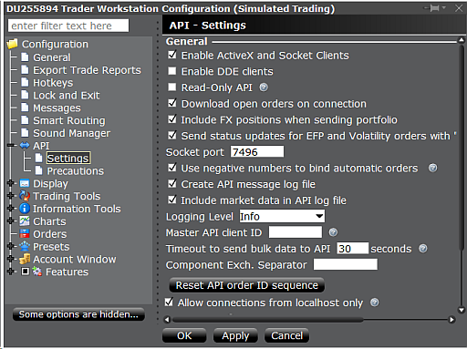
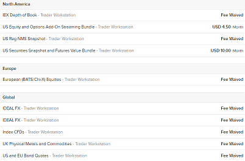
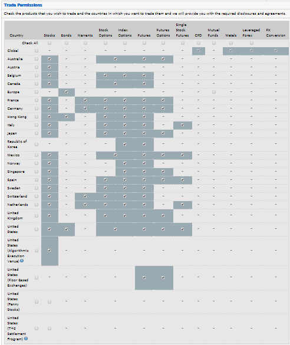

# IB / TWS Bridge

# Interactive Brokers Bridge

[Interactive Brokers™](https://www.interactivebrokers.co.uk) offers access to most major exchanges, a huge number of supported assets including options and futures, and low trading costs. The IB bridge gives Zorro algo trading strategies direct access the IB API, either through IB's Trader Workstation (**TWS**), or through the **IB Gateway**. The TWS is preferable for testing a script, the Gateway for automated trading. The TWS, a bloated java program, normally stops every 24 hours and interrupts the connection. The Gateway lasts a bit longer and usually disconnects every weekend. Thus, long-term algo trading with the IB API requires supervising the trading system and restarting the Gateway every Monday. When downloading TWS or Gateway from the IB website, get the release (stable) version, not the beta (unstable) version.

For trading with the TWS, open File/Global Configuration/API/Settings (see screenshot below) and select Enable ActiveX and Socket Clients. Make sure that the socket port is set to **7496**. Deselect Read-Only API when you want to send orders. Make sure that Allow connections from localhost only is checked. Enter an individual number from **101..108** in Zorro's **User** field for connecting to the TWS via socket port **7496**. The **Password** field can be left empty.

For trading with Gateway, select IB API (not FIX CTCI). Open Configuration/API/Settings and make sure that the socket port is set to **4002**. Enter an individual number from **1..8** in Zorro's **User** field for connecting to the Gateway via socket port **4002**. The **Password** field can be left empty.



Other socket port numbers than 7496 or 4002 can be set up in the **Server** field of the account list (see below). Up to 8 Zorros can connect to the same Gateway or to the same TWS, but each connection needs a separate **IB.dll**. Use DLL copies as described under [Broker Arbitrage](brokerarb.md). Note that only a single TWS or a single Gateway per user is supported by IB. The connection will break down when a second Gateway or TWS instance with the same user is opened, even on a different PC.

Zorro login fields for IB:

<table style="border: 1px solid #000000"><tbody><tr><td style="background-color: #CCCCCC"><strong>User:</strong></td><td><strong>1 .. 8</strong> for the Gateway, <strong>101 .. 108</strong> for the TWS</td></tr><tr><td style="background-color: #CCCCCC"><strong>Password:</strong></td><td>Empty</td></tr></tbody></table>

[Asset list](013_Asset_Account_Lists.md) example: **AssetsIB.csv**

[Accounts.csv](013_Asset_Account_Lists.md) example entries:

<table cellpadding="2" cellspacing="0" class="auto-style2"><tbody><tr><td class="auto-style1" style="height: 19px"><strong>Name</strong></td><td class="auto-style1" style="height: 19px"><strong>Server</strong></td><td class="auto-style1" style="height: 19px"><strong>Account</strong></td><td class="auto-style1" style="height: 19px"><strong>User</strong></td><td class="auto-style1" style="height: 19px"><strong>Pass</strong></td><td class="auto-style1" style="height: 19px"><strong>Assets</strong></td><td class="auto-style1" style="height: 19px"><strong>CCY</strong></td><td class="auto-style1" style="height: 19px"><strong>Real</strong></td><td class="auto-style1" style="height: 19px"><strong>NFA</strong></td><td class="auto-style1" style="height: 19px"><strong>Plugin</strong></td></tr><tr><td class="auto-style1">IB-TWS-Demo</td><td class="auto-style1">&nbsp;</td><td class="auto-style1">D4567890</td><td class="auto-style1">101</td><td class="auto-style1">0</td><td class="auto-style1">AssetsIB</td><td class="auto-style1">USD</td><td class="auto-style1">0</td><td class="auto-style1">14</td><td class="auto-style1">IB</td></tr><tr><td class="auto-style1">IB-TWS-Real</td><td class="auto-style1">&nbsp;</td><td class="auto-style1">U1234567</td><td class="auto-style1">101</td><td class="auto-style1">0</td><td class="auto-style1">AssetsIB</td><td class="auto-style1">USD</td><td class="auto-style1">1</td><td class="auto-style1">14</td><td class="auto-style1">IB</td></tr><tr><td class="auto-style1" style="height: 22px">IB-Gateway</td><td class="auto-style1" style="height: 22px">4002</td><td class="auto-style1" style="height: 22px">U1234567</td><td class="auto-style1" style="height: 22px">1</td><td class="auto-style1" style="height: 22px">0</td><td class="auto-style1" style="height: 22px">AssetsIB</td><td class="auto-style1" style="height: 22px">USD</td><td class="auto-style1" style="height: 22px">1</td><td class="auto-style1" style="height: 22px">14</td><td class="auto-style1" style="height: 22px">IB</td></tr></tbody></table>

 

### Trading with IB. Rebalancing portfolios

The IB plugin included with the free Zorro version supports paper trading accounts that begin with the letter "D". A plugin for real accounts is included in [Zorro S](restrictions.md). For opening an account with IB, the normal choice is a RegT Margin account. If you own **Zorro S** and trade high volumes, consider a Portfolio Margin account with its lower margin costs. At the time of this writing, IB paper trading accounts were only available after opening a real account.

Due to the high margin and lot size requirements, the Forex/CFD trading [Z systems](zsystems.md) are not really suited for IB. They would require a large Capital setup for not skipping too many trades, and even then achieve less annual return due to the low leverage. The main advantage of IB is support of many exchanges, so that a large range of financial assets can be traded. This allows many new trade systems that exploit specific inefficiencies, f.i. volatility, or seasonal effects of particular stocks or treasuries.

Unadjusted historical price data for backtests can be downloaded from IB, with limits to the data resolution and maximum number of years. In second resolution only a few days of data are normally available. Unadjusted and adjusted EOD data is also available from many other Internet sources, f.i. from Yahoo, Stooq, or Quandl by using the [Download](022_Price_History.md) script or the [assetHistory](loadhistory.md) or [dataDownload](125_sortData_sortIdx.md) functions. [Assets symbols](014_Asset_Symbols.md) can be defined in a way that live data is loaded from IB and historical EOD data from another source. 

For rebalancing portfolios, the script can either adjust positions directly through [enter](buylong.md)/[exit](selllong.md) commands, or generate a CSV file containing the desired asset percentages. This file can then be manually imported in the TWS window Portfolio Tools / Rebalance Portfolio and will produce orders for adjusting the positions. The required CSV format changes from time to time, so export first an example file from the TWS and use it as template for the file generated by your script. An example file that rebalances a Z9 portfolio:

```c
DES,XLU,STK,SMART/AMEX,,,,,,0.0
DES,SMH,STK,SMART/AMEX,,,,,,12.5
DES,XBI,STK,SMART/AMEX,,,,,,17.0
DES,XLI,STK,SMART/AMEX,,,,,,0.0
DES,XLV,STK,SMART/AMEX,,,,,,11.4
DES,VGK,STK,SMART/AMEX,,,,,,0.0
DES,VOO,STK,SMART/AMEX,,,,,,0.0
DES,UUP,STK,SMART/AMEX,,,,,,0.0
DES,VCSH,STK,SMART/AMEX,,,,,,0.0
DES,HYG,STK,SMART/AMEX,,,,,,0.0
DES,TLT,STK,SMART/AMEX,,,,,,20.0
DES,IAU,STK,SMART/AMEX,,,,,,19.0
DES,AGG,STK,SMART/AMEX,,,,,,0.0
DES,SPY,STK,SMART/AMEX,,,,,,0.0
```

For trading an asset, some prerequisites must be fulfilled:

*   Subscribe market data on the IB website. Otherwise you'll get a **"market data is not subscribed"** error message at session start. Forex market data is free, most other data requires a monthly fee. Delayed data is not available via API. For subscribing market data, enter your IB account management page, and select User Settings / Market Data. For usual US stocks and ETFs, subscribe both the **"U.S. Securities Snapshot and Futures Value Bundle"** and the **"US Equity and Options Add-On Streaming Bundle"**.  
       
      
       
    If you're a private trader, make sure that your account has no 'professional' status, otherwise your subscription fees will multiply. For finding out which subscription you need for which asset, enter the asset in the Favorites window of the TWS, then right click on it. If the asset is not yet subscribed, select Subscribe Market Data and you'll be led to a web page where you can subscribe it. For trading on a paper account, activate Share Market Subscription in the account settings for sharing your subscriptions with the paper trading account.  
     
*   Obtain trading permission from IB for all asset types you want to trade, under Trade Configuration / Permissions (see image below). You must fill in a form about your trading experience and your financial situation. It takes about 24 hours to get approval for trading all asset types. Penny stocks require a special approval.  
       
      
     
*   Bypass restrictions and precautions. Open File / Global Configuration / API / Precautions and enable Bypass Order Precautions for API Orders and Bypass redirect order warning.  Otherwise orders will need manual confirmation to be transmitted, or you'll get an **"over limit"** error message. Under Presets you can also change precaution limits individually per asset type.  
       
    
*   Make sure that all traded assets are listed in the TWS Monitor and their prices are visible before connecting to IB (even when using the Gateway). A system can not be started when its assets prices or history are currently not available due to missing market subscriptions or other reasons.  
     
*   Check if local regulations permit trading the assets on your account. For instance, US citzens can be prohibited from trading CFDs or limited in the number of trades per week. European citizens are normally not allowed to trade US ETFs.

Not all assets can be traded all the time, and not all price types are available for all assets. Index (**IND**) assets are read only, but you can trade indices with ETFs, Futures, or CFDs. Some assets, such as specific CFDs, are not available to US citizens, and require an UK or other account outside the US. European traders are not allowed, thanks to EU regulations, to trade US ETFs. The default minimum sizes for currency pairs are in the 20,000 contracts range, but entering a lower minimum size in the asset list is also possible. Orders are then marked as 'odd lot' and cause higher transaction costs. Some stocks (**STK**) and some other assets are not shortable, either permanently or dependent on market liquidity. Short trades for closing a long position are normally always accepted.

For setting up the IB asset list and for simulating IB trading in the backtest, margin requirements can be found on [https://www.interactivebrokers.com/en/index.php?f=24176](https://www.interactivebrokers.com/en/index.php?f=24176). The maintenance or end-of-day margin is often higher than the initial margin.

### IB symbols

Any asset you want to trade must be represented by a line in the [asset list](013_Asset_Account_Lists.md). The [asset symbols](014_Asset_Symbols.md) (**Symbol** column) are converted to IB contracts in the following way:

*   It a symbol has a **'/'** slash at the 4th position (f.i. **EUR/USD**), it is assumed a forex pair. Is is split in currency (first three characters) and counter currency (last three characters), gets the asset type **CASH** and is routed to the **IDEALPRO** exchange. Forex pairs are displayed with a dot (f.i. **EUR.USD**) in the TWS, and the purchased amount is listed separately per currency in the TWS account window. IB announced that they are gradually removing Forex pair support from the API version used by the plugin, so not all Forex pairs might be available in future versions.    
       
    
*   If the symbol contains no slash and no hyphen (f.i. **AMZN**), is it assumed a US stock or ETF. **SMART** routing with primary exchange **ISLAND** is used. These parameters work for most US stocks and ETFs, except when the asset is traded at several different exchanges or when the same symbol is also used for other assets types such as futures or CFDs. Then the full symbol name with exchange and currency must be given, see below.  
       
    
*   Symbols containing '-' hyphen characters are split in separate strings as described under [Symbols](014_Asset_Symbols.md). String 1 is the ticker name, string 2 the asset type (**STK, OPT, FUT, FUTX, IND, FOP, WAR, CASH, CFD, STKCFD, FUND, EFP, BAG, BOND, CMDTY**), string 3 the exchange and string 4 the counter currency. If the currency is omitted, **USD** is assumed. If the exchange is omitted, **SMART** is used with **ISLAND** as primary exchange. Examples: **AAPL-STK-NYSE-USD**, **XAGUSD-CMDTY**, **EUR-CFD-SMART-USD**, **GLD-STK-SMART/ARCA-USD**.  
      If an asset is traded on several exchanges in different countries or time zones, you can receive a message like **"Contract description is ambiguous"** at the time when market hours overlap. In this case you must have the exchange code and/or the currency in the asset symbol, like **"\*-STK-NYSE-USD"**.  
     
*   The following exchange codes are supported: **SMART, AMEX, ARCA, BELFOX, BOX, BRUT, BTRADE, CBOE, CBOT, CFE, CME, DTB, E-CBOT, ECBOT, EUREX US, FOREX, FTA, GLOBEX, HKFE, IBIS, ICE, IDEM, IDEALPRO, ICEEU, ISE, ISLAND, LIFFE, LSE, MATIF, ME, MEFFRV, MONEP, NYBOT, NYMEX, NYSE, ONE, OSE.JPN PHLX, PSE, SNFE, SOFFEX, SUPERMONTAGE, SWX, TSE, TSE.JPN, TSX, VIRTX, XETRA**. If a primary exchange is required, add it with a slash (f.i. **SMART/LSE**). US stocks normally require **ISLAND** as primary exchange, European stocks normally require an empty string (**SMART/**) that allows to select the primary exchange automatically. Some info about exchange codes can occasionally be found in the IB documentation; otherwise experimenting is required for finding the correct combination of exchange and primary exchange. Symbols that work for retrieving prices and positions do not always work for placing orders, and symbols for the underlying do not always work for options (see below).  
       
    
*   Options have symbols in the format Ticker-OPT-Expiry-Strike-Put/Call-Exchange, f.i. **AAPL-OPT-20191218-1350.0-C-GLOBEX**. Futures have symbol names in the format Ticker-FUT/FUTX-Expiry-TradingClass-Exchange(-Currency), f.i. **SPY-FUT-20191218-SPY1C-GLOBEX**. Alternatively to the expiry date, a contract month symbol can be used, f.i. **ESH9** for the ES 2019 March contract.  If the trading class of a future is not required, f.i. for **ES**, use the ticker name instead: **ES-FUT-20200319-ES-GLOBEX**. Options on futures have symbol names in the format Ticker-FOP-Expiry-Strike-Put/Call-TradingClass-Exchange, f.i. **ZS-FOP-20191218-900.0-C-OSD-ECBOT**. If the currency is ambiguous or is different to USD, append it at the end, like **DAX-FUTX-20171217-FDAX-DTB-EUR**. The symbols are automatically generated when calling the [contract](096_contract.md) function.  
     
*   Two special symbol types are supported by the IB bridge. The type **STKCFD** trades as a CFD, but gets the price quotes and historical prices of the underlying stock. This is useful for stock CFDs (f.i. **AAPL-STKCFD**) which can be traded, but get no price quotes from IB. The type **FUTX** can be used for downloading historical data of expired futures contracts.  
    

A example file **AssetsIB.csv** with currencies, CFDs, and stocks is included; we do however not guarantee the accuracy and correctness, so use it at your own risk.

### Additional data and commands

The IB bridge supports the following additional data streams:

*   [marketVal](022_Price_History.md): Not supported in historical data, bid-ask spread in live data.
*   [marketVol](022_Price_History.md): Trade volume per minute in historical M1 data, per day in historical D1 data; accumulated volume since market open in live data. Only for exchange-traded assets, not for currencies. Live volume is unfiltered; historical volume is filtered by delayed transactions, busted trades, or unreportable trades. Returned stock volumes by IB were reported to be off by factor 100, so the real volume at the exchange is 100 times higher than the **marketVol** return.

Multiple IB accounts are supported. The account can be set up in the [account list](013_Asset_Account_Lists.md).

The IB bridge supports the [brokerCommand](113_brokerCommand.md) function with the following commands (extra commands can be implemented on user request):

*   **SET\_PATCH**
*   **GET\_DELAY**
*   **GET\_WAIT**
*   **SET\_DELAY**
*   **SET\_WAIT**
*   **SET\_SERVER** (sets the port number)
*   **SET\_DIAGNOSTICS**
*   **GET\_POSITION**    (see remarks)
*   **GET\_AVGENTRY**
*   **GET\_FILL**
*   **GET\_ACCOUNT**
*   **SET\_SYMBOL**
*   **SET\_MULTIPLIER**
*   **SET\_CLASS**
*   **SET\_LIMIT**
*   **SET\_PRICETYPE**     (**1** = ask/bid; **2** = last trade; **5** = ask, **6** = bid; **7** = adjusted; **8** = fast)
*   **SET\_VOLTYPE**     (**3** = quote size; **4** = trade volume; **5** = ask size; **6** = bid size)
*   **SET\_ORDERTYPE**    (**2** = GTC order, **8** = stop order, **2+8** = both)
*   **SET\_ORDERTEXT**    (**"ABC/DEF"** for order type **ABC** and Time-In-Force **DEF**)
*   **SET\_ORDERGROUP** (for OCA orders; have "MID" in the group name for mid price trigger)
*   **SET\_COMBO\_LEGS**
*   **GET\_PRICE**
*   **GET\_VOLUME**
*   **GET\_TRADES**
*   **GET\_OPTIONS**
*   **GET\_FUTURES**
*   **GET\_FOP**
*   **GET\_CHAIN**
*   **GET\_UNDERLYING**
*   **GET\_BOOK**    (market depth must be subscribed and the exchange must be coded in the [asset symbol](symbol.md))
*   **GET\_GREEKS**
*   **DO\_EXERCISE**
*   **DO\_CANCEL**  
    

### Remarks

*   **Historical data** is only available for subscribed assets. Further limitations can be found under [https://interactivebrokers.github.io/tws-api/historical\_limitations.html](https://interactivebrokers.github.io/tws-api/historical_limitations.html). The [assetHistory](loadhistory.md) function can be used for downloading T1, T2, M1, and EOD history from IB. Downloading data in higher resolution than 1 minute is slow due to IB's history limits. For long lookback periods or for special asset types, historical prices might be only available in reduced resolution, such as 1 hour or 1 day. Historical options data is not available. For downloading index data, set the price type to "last trade". When downloading large amounts or high resolution data, reduce the [request rate](187_TickTime_MaxRequests.md) for avoiding API disconnections.  
       
    
*   **Price data** retrieving can take up to 10 seconds per asset under some circumstances, for instance at session start or for option and future contracts. The [SET\_PRICETYPE,8](113_brokerCommand.md) command aborts price requests early and can speed up price data remarkably. Downloading a contract chain can take up to 30 minutes for large chains with > 10,000 contracts, for instance with SPY. For this reason, it is recommended to call [contractUpdate](contract.htm
    	) not more frequently that once per day in live trading mode.  IB gives the following advice: For very large option chains, unchecking the setting in TWS Global Configuration at **API > Settings > "Expose entire trading schedule to the API"** will decrease the amount of data returned per option and help to return the contract list more quickly. Not all price types are available for all assets at all time; some price types are only available during market hours. Some derivatives - for instance, currency CFDs - have no price data, so the underlying price must be retrieved instead.  
      
*   **Trades and orders.** The IB API is NFA compliant and does not control individual trades. All trades are therefore controlled by Zorro. The account portfolio only reflects the net sum of all open positions by all connected Zorros. The [NFA](mode.htm#nfa) flag or an according NFA account list entry must be set for IB accounts. Trades are IOC by default; partial fills are possible.  
      Avoid manually closing positions or cancelling orders that were entered by Zorro. Since this is not reported back by the API, it can cause the positions of Zorro and IB to get out fo sync. If an order is not open anymore, it is normally assumed to be fully filled. The [GET\_POSITION](113_brokerCommand.md) command and the [LotsPool](winloss.md) variable can be used for comparing open positions between Zorro and IB. Use [cancelTrade](selllong.md) for removing manually closed positions. Use [enterTrade](buylong.md) for converting an open IB position to a Zorro-controlled trade.  
      Limit orders are supported with [OrderLimit](188_Stop_Profit_Trail_Entry.md), and GTC trade mode can be switched on with [TradeMode](018_TradeMode.md). Set [TR\_ENTRYSTOP](018_TradeMode.md) for adding a stop order to a trade; but be aware that the stop order is not managed by Zorro. When orders are slow to execute - especially option combos - increase the wait time ([SET\_WAIT](brokercommand.md) comand) or use [TR\_GTC](018_TradeMode.md). Since the IB API does not store trades and does not update filled trades to Zorro, the only ways for Zorro to find out if or when a GTC trade was filled is the [GET\_POSITION](113_brokerCommand.md) command or the disappearance of the GTC order. To emulate the filling of GTC trades by order disappearance, use the **TR\_FILLED** flag.  
      Use [SET\_ORDERTEXT](113_brokerCommand.md) for sending special order types when the text contains a slash **'/'**. The symbol before the slash, if any, is the order type; the symbol after the slash, if any, is the time-in-force parameter (f.i. **"MOC/"** for a market-on-close order or **"MKT/OPG"** for a market-on-open order). Make sure not to use order types that cannot work together; some order types require [GTC mode](018_TradeMode.md) and/or [OrderLimit](188_Stop_Profit_Trail_Entry.md). A list of order types can be found on [http://interactivebrokers.github.io/tws-api/basic\_orders.html](http://interactivebrokers.github.io/tws-api/basic_orders.html). Not all order types work with all asset types.  
      Orders on advisor accounts are not (yet) supported by the IB plugin. Contact us if you require an implementation.  
    
*   **Market hours.** Outside market hours - normally 9:30 .. 15:45 EST for US-traded assets - price quotes are not always available, so you might get a **"unavailable at this time"** warning. Therefore it is recommended to begin a session when the market is open. If [PRELOAD](018_TradeMode.md) is set and the API does not respond to a price request, Zorro will attempt to retrieve the last known historical price. This is indicated by a **"frozen price"** message. Orders executed outside market hours can have higher transaction costs, therefore trading outside market hours should be avoided.  
      
*   **Asset parameters.** Except for price and bid/ask spread, no asset parameters are available through the IB API. Leverage, commission, pip cost, and lot size of traded assets must be set up manually, either by script or in the [asset list](013_Asset_Account_Lists.md). Typical maintenance leverage on a RegT account is 33 for most Forex pairs, 2 for stocks and ETFs, and 20 for CFDs. The parameters need not be 100% accurate, but should not be too far off in the interest of realistic backtests. You can find examples (with no guarantee of accuracy and correctness) of major currencies, CFDs, and stocks in the included file **AssetsIB.csv**.   
     
*   **Price data.** The price type can be selected with the **[SET\_PRICETYPE](113_brokerCommand.md)** command between ask/bid and last traded price and a special 'fast' price mode. By default the price functions return the ask/bid price; if it is not available, the last traded price is returned. Some assets, such as indices, have no ask/bid prices; index CFDs have no last traded prices. An unavailable price type triggers error 053. Otherwise it is advisable to enforce the last traded price when the market is closed, because ask/bid can then be very outdated. Some index prices, such as **VIX-IND-CBOE-USD** and **VIX3M-IND-CBOE-USD**, were reported to be only available after **VIX** / **VIX3M** was entered in the TWS watchlist (under **Favorites**).  
     
*   **Positions.** IB does not store trades, only net positions are available via API. By default, positions are only available for exchange traded products, not for forex pairs. Enable File / Global Configuration / API / Include Virtual FX positions  for getting forex positions.  
     
*   **Account status.** The API provides a lots of account parameters, but none of them is 100% equivalent to balance and equity. Therefore proxies are used: [Equity](193_Balance_Equity.md) is set to the **Net Liquidation Value**, [Balance](193_Balance_Equity.md) is set to **Available Funds**, and **[MarginVal](193_Balance_Equity.md)** is set to the **Current Maintenance Margin**. Non-US accounts sometimes return account parameters in wrong currency immediately after connection. This is corrected after about a minute.  
     
*   **Limited result accuracy.** Profits displayed in the TWS by closing a trade can be very different from the real trade profit, since the API returns only the profit based on the average of all open positions. Total profit will also differ slighty because transactions costs and leverage can not be retrieved through the API, therefore approximate values are used on the Zorro side.  
     
*   **Connection issues.** The IB API will produce warnings during operation. Most are harmless. The ominous mesages in the Gateway log **"Invalid incoming request type 0"** are 'heatbeat requests' of the IB API library and can be safely ignored. The Gateway tends to log out and in by itself, regularly once per day and sometimes also in irregular intervals, displaying messages like **"Connectivity between IB and Trader Workstation has been lost"**. The connection to IB price servers is sometimes briefly interrupted with the message **"Data Farm connection lost"**. Re-login attempts by the Gateway or the TWS were reported to temporarily block socket connections on the PC, which can affect other parallel running sessions. Zorro will automatically reconnect all lost connections and continue the sessions, so user intervention is normally not required. You can reduce connection issues by setting [TickTime](187_TickTime_MaxRequests.md) to a higher value or by reducing the request rate.  
     
*   **Single session only.** You can not connect twice with the same user name to the TWS, the Gateway, or the IB website - not even for only checking your account. You'll get a message like **"No market data during competing live session"**. When you log in with the TWS, the Gateway connection might break down, or vice versa. After terminating your TWS session you must therefore manually re-login from the Gateway. Zorro will automatically resume the session after an interruption, but while not connected it can not handle entries, stops, or profit targets. For working around this problem, you can register **a second user** for your IB account, and open the TWS with this second user name. This requires that you pay separate market data subscriptions for the second user name. The workaround does not work for IB paper accounts, which are single-user only.  
     
*   **No hibernation**. The PC must not be reset, restarted, switched off, hibernate, or go in suspend mode while connected to the IB TWS API. Otherwise the API may crash and require a Zorro restart.    
     

### Typical IB API error messages

*   **Requested market data is not subscribed****:** You forgot to subscribe your assets. See above. Delayed market data is not available with the IB API.  
     
*   **Historical market data pacing violation:** You downloaded history that IB didn't want you to have. See [https://interactivebrokers.github.io/tws-api/historical\_limitations.html](https://interactivebrokers.github.io/tws-api/historical_limitations.html). Download less data in lower resolution.  
     
*   **No security definition has been found:** You entered a wrong symbol in the [asset list](013_Asset_Account_Lists.md). See above how to put together correct IB symbols. If you don't know the symbol, exchange, or currency of a particular asset, enter it under Favorites in the TWS and hit \[Return\]. You'll then normally get a list of proposals. This error message is sometimes also issued when the symbol is correct, but a trade cannot be entered due to order size limits or other reasons.  
     
*   **Contract description ... is ambiguous:**  You entered an incomplete symbol. If the same asset is traded on several exchanges or in several countries, you need to include the exchange and/or the currency as described above. If futures or options are available with different multipliers, use the [SET\_MULTIPLIER](113_brokerCommand.md) command before downloading prices.  
      
*   **Error validating request - cause ...:** A command could not be executed for a reason listed under 'cause'.  
     
*   **Order rejected - reason ...:** A trade could not be opened for the given reason.  
     
*   **Price does not conform to the minimum price variation for this contract:** The given limit or stop price has too high precision. Use the [roundto](082_round_roundto.md) function to round it to 1 pip or to the smallest allowed increment.  
     
*   **No market data due to competing live session:** You opened another TWS or Gateway session, possibly on a different device. You must be looged out on all devices for using the IB API:

### See also:

[Brokers](214_Brokers_Data_Feeds.md), [Broker plugin](brokerplugin.md), [MT4 bridge](mt4plugin.md)

[► latest version online](javascript:window.location.href = 'https://zorro-project.com/manual/en' + window.location.href.slice\(window.location.href.lastIndexOf\('/'\)\))